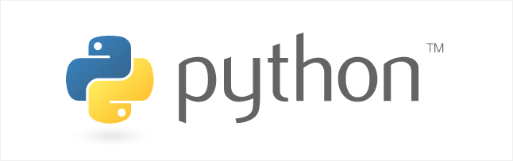
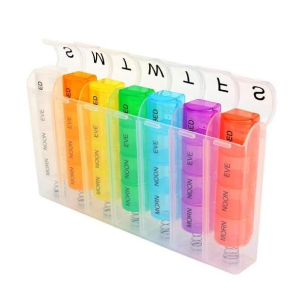

###### 7월 11일

# Python



- 컴퓨터 프로그래밍 언어 중 하나

  - 컴퓨터(Computer): Caculation + Remember
  - 프로그래밍(programming): 명령어의 모음(집합)
  - 언어: 자신의 생각을 나타내고 전달하기 위해 사용하는 체계, 문법적으로 맞는 말의 집합
  - 컴퓨터 프로그래밍 언어: 컴퓨터에게 명령하기 위한 약속

- 선언적 지식(declarative knowledge): 사실에 대한 내용

- **명령적 지식**(imperative knowledge): "How-to"

  컴퓨터가 어떻게 할 것인지를 명확하게 명령해야 한다.


## 1. 파이썬 개발 환경

### 파이썬(Python)이란?

- Easy to learn
  - 다른 프로그래밍 언어보다 문법이 간단하면서도 엄격하지 않음
    - 예시: 변수에 별도의 타입 지정이 필요 없음 (동적 타이핑 언어)
  - 문법 표현이 매우 간결하여 프로그래밍 경험이 없어도 짧은 시간 내에 마스터할 수 있음
    - 예시: 문장을 구분할 때 중괄호({,}) 대신 들여쓰기를 사용
- Expressive Language
  - 같은 작업에 대해서도 C나 자바로 작성할 때 보다 더 간결하게 작성 가능
- 크로스 플랫폼 언어
  - Windows, mac OS, Linux, Unix 등 다양한 운영체제에서 실행 가능


### 파이썬의 특징

- 인터프리터 언어(Interpreter)

  - 소스코드를 기계어로 변환하는 컴파일 과정 없이 바로 실행 가능
  - 코드를 대화하듯 한 줄 입력하고 실행한 후, 바로 확인할 수 있음

  ```python
  >>> 2 + 2 # 사용자가 입력 (input)
  4		  # 컴퓨터가 대답 (output)
  ```

- **객체 지향 프로그램**

  - 파이썬은 객체 지향 언어이며, 모든 것이 객체로 구현되어 있음
  - 객체(object): 숫자, 문자, 클래스 등 값을 가지고 있는 모든 것

  

## 2. 기초 문법

- 코드 스타일 가이드
  - 코드를 '어떻게 작성할지'에 대한 가이드라인
  - 파이썬에서 제안하는 스타일 가이드
    - [PEP8](https://peps.python.org/pep-0008/)
  - 기업, 오픈소스 등에서 사용되는 스타일 가이드
    - [Google Style guide](https://google.github.io/styleguide/pyguide.html)

> ❗ 코드 해석 순서
>
> - 위에서 아래로
> - 오른쪽에서 왼쪽으로


### 1) 들여쓰기(Identation)

- Space Sensitive
  - 문장을 구분할 때, 들여쓰기를 사용
  - 들여쓰기를 할 때는 4칸(space키 4번) 혹은 1탭(Tab키 1번)을 입력
    - 주의! 한 코드 안에서는 반드시 한 종류의 들여쓰기를 사용 → 혼용하면 안됨
      - Tab으로 들여쓰면 계속 Tab으로 들여써야 함
      - 원칙적으로는 공백(빈칸, space) 사용을 권장 *PEP8 권장사항

### 2) 변수(Variable)

- 변수란?

  - 컴퓨터 메모리 어딘가에 저장되어 있는 객체를 참조하기 위해 사용된 이름

  - 동일 변수에 다른 객체를 언제든 할당할 수 있기 때문에, 

    즉, 참조하는 객체가 바뀔 수 있기 때문에 **변수**라고 불림

- 변수는 할당 연산자(=)를 통해 값을 할당(assignment)

- `type()` : 변수에 할당된 값의 타입

- `id()` : 변수에 할당된 값(객체)의 고유한 identity 값이며, 메모리주소

 ```python
 # print('Happy Coding!')
 # print('happy Coding!')
 # print('Happy Coding!')
 # print('Happy Coding!')
 # print('Happy Coding!')
 
 # hello라는 이름의 변수에 
 # 'Happy Coding!' 값을 할당
 hello = 'Happy Coding'
 print(hello)
 print(hello)
 print(hello)
 print(hello)
 print(hello)
 
 a = 5
 b = 3
 print(a + b) # 8
 
 a = 'hello'
 print(a) # 'hello'
 ```


- 같은 값을 동시에 할당할 수 있음

```python
x = y = 1004
print(x, y)
```


- 다른 값을 동시에 할당할 수 있음(multiple assignment)

```python
x, y = 1, 2
print(x, y)
```


- x = 10, y = 20일 때, 각각 값을 바꿔서 저장하는 코드

```python
x, y = 10, 20

# 방법1 : 임시 변수 활용
tmp = x
x = y
y = tmp
print(x, y)

# 방법2 : Pythonic
y, x = x, y
print(x, y)
```


### 3) 식별자( Identifiers)

- 파이썬 객체(변수, 함수, 모듈, 클래스 등)를 식별하는 데 사용하는 이름(name)

- 규칙

  - 식별자의 이름은 영문 알파벳, 언더스코어(_), 숫자로 구성
  - 첫 글자에 숫자가 올 수 없음
  - 길이제한이 없고, 대소문자를 구별
  - 다음의 keywords는 예약어(reserved words)로 사용할 수 없음
    - False, None, True, and, as, assert, async, await, break, class, continue, def, del, elif, else, except, finally, for, from, global, if, import, in, is, lambda, nonlocal, not, or, pass, raise, return, try, while, with, yield

  - 내장함수나 모듈 등의 이름으로도 만들면 안됨
    - 기존의 이름에 다른 값을 할당하게 되므로 더이상 작동하지 않음


### 4) 사용자 입력

- input([prompt])
  - 사용자로부터 값을 즉시 입력 받을 수 있는 내장함수
  - 대괄호 부분에 문자열을 넣으면 입력 시, 해당 문자열을 출력할 수 있음
  - 반환값은 항상 문자열의 형태로 반환

```python
name = input('이름을 입력해주세요: ')
print(name)
```


### 5) 주석(Comment)

- 코드에 대한 설명
  - 중요한 점이나 다시 확인하여야 하는 부분을 표시
  - 컴퓨터는 주석을 인식하지 않음, 사용자만을 위한 것
- 가장 중요한 습관
  - 개발자에게 주석을 작성하는 습관은 매우 중요!
  - 쉬운 이해와 코드의 분석 및 수정이 용이
    - 주석은 코드 실행에 영향을 미치지 않음
    - 프로그램의 속도를 느리게 하지 않음
    - 용량을 늘리지 않음

- 한 줄 주석
  - 주석으로 처리될 내용 앞에 `#`을 입력
  - 한 줄을 온전히 사용할 수도 있고, 그 줄 코드 뒷부분에 작성할 수도 있음

```python
# 주석(comment)입니다.

# print('hello')
print('world') # 주석
```


## 3. 자료형

#### 자료형 분류

##### 1) 불린형(Boolean Type)

- True / False 값을 가진 타입은 bool

- 비교/논리 연산을 수행함에 있어서 활용됨

- 다음은 모두 False로 변환

  - `0`, `0.0`, `()`, `[]`, `{}`, `"`, `None`

- 논리 연산자(Logical Operator)

  - 논리식을 판단하여 True와 False를 반환함

    | 연산자  | 내용                           |
    | ------- | ------------------------------ |
    | A and B | A와 B 모두 True일 시, True     |
    | A or B  | A와 B 모두 False일 시, False   |
    | Not     | True를 False로, False를 True로 |

    - and : 모두 참인 경우 참, 그렇지 않으면 거짓
    - or : 둘 중 하나만 참이라도 참, 그렇지 않으면 거짓
    - not : 참 거짓 반대의 결과

##### 2) 수치형(Numeric Type)

1. **int** (정수, integer)
   - 모든 정수의 타입은 int
   - 매우 큰 수를 나타낼 때 오버플로우가 발생하지 않음
     - 오버플로우(overflow) : 데이터 타입별로 사용할 수 있는 메모리의 크기를 넘어서는 상황

2. **float** (부동소수점, 실수, floating point number)
   - 정수가 아닌 모든 실수는 float 타입
   - 부동소수점
   - Floating point rounding error : 부동소수점에서 실수 연산 과정에서 발생 가능

3. **complex** (복소수, complex number)
   - 실수부와 허수부로 구성된 복소수는 모두 complex 타입
   - 허수부를 j로 표현

- 산술 연산자(Arithmetic Operator)

  - 기본적인 사칙연산 및 수식 계산

    | 연산자 | 내용     |
    | ------ | -------- |
    | +      | 덧셈     |
    | -      | 뺄셈     |
    | *      | 곱셈     |
    | %      | 나머지   |
    | /      | 나눗셈   |
    | //     | 몫       |
    | **     | 거듭제곱 |

- 복합 연산자(In-place Operator)

  - 연산과 할당이 함께 이루어짐

    | 연산자  | 내용       |
    | ------- | ---------- |
    | a += b  | a = a + b  |
    | a -= b  | a = a - b  |
    | a *= b  | a = a * b  |
    | a /= b  | a = a / b  |
    | a //= b | a = a // b |
    | a %= b  | a = a % b  |
    | a **= b | a = a ** b |

- 비교 연산자(Comparison Operator)

  - 값을 비교하며, True / False 값을 리턴함

    | 연산자 | 내용                        |
    | ------ | --------------------------- |
    | <      | 미만                        |
    | <=     | 이하                        |
    | >      | 초과                        |
    | >=     | 이상                        |
    | ==     | 같음                        |
    | !=     | 같지 않음                   |
    | is     | 객체 아이덴티티(OOP)        |
    | is not | 객체 아이덴티티가 아닌 경우 |

##### 3) 문자열(String Type)

##### 4) None

- 파이썬에서 값이 없음을 표현하기 위한 Type
- 일반적으로 반환 값이 없는 함수에서 사용하기도 함


```python
# \ : 역슬래시 활용

# 개행, 줄 바꿈 (Enter 키)
print('안녕하세요,\n반갑습니다.')

# 따옴표
print("따옴표를 '씁니다'")
print('따옴표를 \'씁니다'\'')

# 역슬래시
print('escape sequence는 역슬래시 \\를 활용합니다.')
```


##### String Interpolation

- 변수를 활용하는 문자열 만드는 법
  - f-string
- 문
  - 

```python
# 문자열 안에 변수 넣기
score = 100

# 내 점수는 100이야.
print(f'내 점수는 {score}이야.')

pi = 3.14
r = 2
print(f'원주율은 {pi}고, 원 넓이는 {pi*2*2})
```


##### 문자열 특징

- Immutable : 변경 불가능함
- Iterable : 반복 가능함


#### 형 변환(Typecasting)

##### 자료형 변환

```python
# 숫자와 문자는 더할 수 없어서 직접 문자열으로 변환
# 내 점수는 100이야.
print('내 점수는' + str(score) + '이야.')
```


##### 명시적 형 변환(Explicit Typecasting)

- int
  - str*, float → int
- float
  - 
- str
  - 


##### 암시적 형 변환(Implicit Typecasting)

- 사용자가 의도하지 않고, 파이썬 내부적으로 자료형을 변환하는 경우
- 


## 4. 컨테이너

컨테이너 분류

- 시퀀스
  - 문자열(immutable) : 문자들의 나열
  - 리스트(mutable) : 변경 가능한 
  - 튜플
  - 레인지
- 컬렉션/비시퀀스
  - 세트
  - 딕셔너리


```python
name = '동현'
name1 = '효근'
name2 = '수경'
name3 = '나영'
name4 = '다겸'
name5 = '예지'

# 리스트
# 값들의 나열/배열/시퀀스
students = ['동현', '효근', '수경', '나영', '다겸', '예지']
# 인덱스 (순서로 접근)
print(students[0])
print(students[-1])
```


```python
students_1 = ['동현', '효근']
students_2 = ['수경', '나영']
students_3 = ['다겸', '예지']

students = [['동현', '효근'], ['수경', '나영'], ['다겸', '예지']]

# 딕셔너리
# 키-값의 쌍
students = {
    '1회차': ['동현', '효근']
    '2회차': ['수경', '나영']
    '3회차': ['다겸', '예지']
}
# 키로 접근
print(students['1회차'])
```




