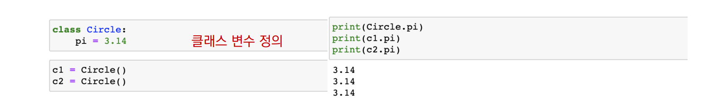
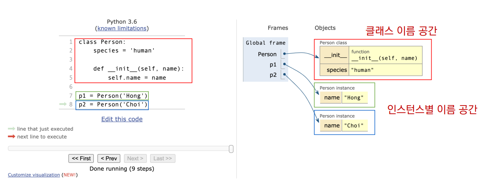
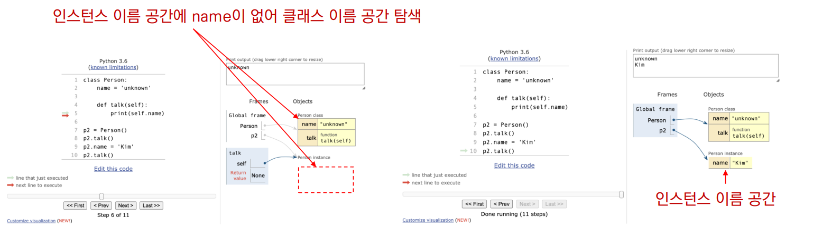

###### 7월 20일

# 객체지향 프로그래밍 Day 2


## 클래스

### 클래스 속성(attribute)

- 한 클래스의 모든 인스턴스라도 똑같은 값을 가지고 있는 속성
- 클래스 선언 내부에서 정의
- `<classname>.<name>`으로 접근 및 할당




### 인스턴스와 클래스 간의 이름 공간(namespace)

- 클래스를 정의하면, 클래스와 해당하는 이름 공간 생성
- 인스턴스를 만들면, 인스턴스 객체가 생성되고 이름 공간 생성
- 인스턴스에서 특정 속성에 접근하면, 인스턴스 → 클래스 순으로 탐색






### 클래스 메소드

- 클래스가 사용할 메소드
- `@classmethod` 데코레이터를 사용하여 정의
  - 데코레이터 : 함수를 어떤 함수로 꾸며서 새로운 기능을 부여
- 호출 시, 첫번째 인자로 클래스(cls)가 전달됨

```python
class MyClass

    @classmethod
    def class_method(cls, arg1, ...)

# MyClass.class_method(...)
```


### 스태틱 메소드

- 인스턴스 변수, 클래스 변수를 전혀 다루지 않는 메소드

- 언제 사용하는가?
  - 속성을 다루지 않고 단지 기능(행동)만을 하는 메소드를 정의할 때, 사용
  - `@staticmethod` 데코레이터를 사용하여 정의
  - 호출 시, 어떠한 인자도 전달되지 않음 (클래스 정보에 접근/수정 불가)

```python
class MyClass
    
    @staticmethod
    def class_method(arg1, ...)
    
# MyClass.static_method(...)
```


