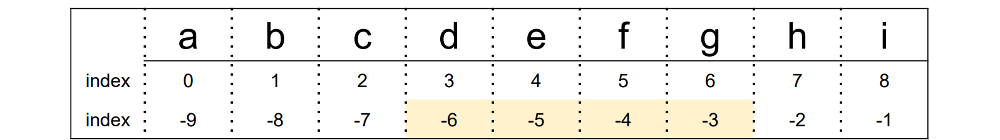
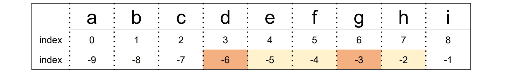
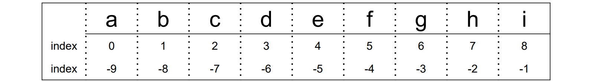
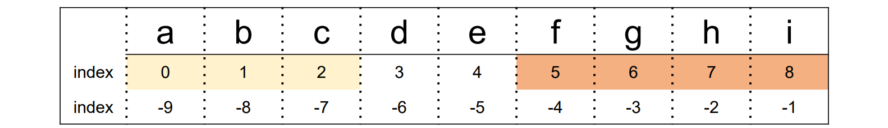

###### 7월 27일

# 문자열 (String)

문자열은 **immutable**(변경 불가능한) 자료형 !

```python
word = 'apple'
print(word)
print(id(word))
>>> apple
>>> 1352749370800

word += 'banana'
print(word)
print(id(word))
>>> apple banana
>>> 1352749417520

```


## 1. 문자열 슬라이싱

s = ‘abcdefghi’


- s[2:5] 🡪 ‘cde’


- s[-6:-2] 🡪 ‘defg’



- s[2:-4] 🡪 ‘cde’


- s[2:5:2] 🡪 ‘ce’


- s[-6: -1:3] 🡪 ‘dg’



- s[2:5:-1] 🡪 ‘ ’



- s[5:2:-1] 🡪 ‘fed’


- s[:3] 🡪 ‘abc’
- s[5:] 🡪 ‘fghi’



- s[:] 🡪 ‘abcdefghi’


- s[::-1] 🡪 ‘ihgfedcba’


- s[10:20] 🡪 ‘ ’


## 2. 문자열 메서드

### 1)  .split(*기준 문자*)

: 문자열을 일정 **기준**으로 나누어 **리스트로 반환**

  괄호 안에 아무것도 넣지 않으면 자동으로 공백을 기준으로 설정

```python
word = 'I play the piano'
print(word.split())

>>> ['I', 'play', 'the', 'piano']
```

```python
word = 'apple,banana,orange,grape'
print(word.split(','))

>>> ['apple', 'banana', 'orange', 'grape']
```

```python
word = 'This_is_snake_case'
print(word.split('_'))

>>> ['This', 'is', 'snake', 'case']
```


### 2)  .strip(*제거할 문자*)

: 문자열의 **양쪽** 끝에 있는 특정 문자를 모두 **제거**한 새로운 문자열 반환

  괄호 안에 아무것도 넣지 않으면 자동으로 공백을 제거 문자로 설정

  제거할 문자를 여러 개 넣으면 해당하는 모든 문자들을 제거

```python
word = 'Hello World'
print(word.strip())

>>> Hello World
```

```python
word = 'aHello Worlda'
print(word.strip('a'))

>>> Hello World
```

```python
word = 'Hello World'
print(word.strip('Hd'))

>>> ello Worl
```

```python
word = 'Hello Worldddddd'
print(word.strip('d'))

>>> Hello Worl
```


### 3)  .find(*찾는 문자*)

: 특정 문자가 처음으로 나타나는 **위치(인덱스)**를 반환

  찾는 문자가 없다면 **-1**을 반환

```python
word = 'apple'
print(word.find('p'))

>>> 1
```

```python
word = 'apple'
print(word.find('k'))

>>> -1
```


### 4)  .index(*찾는 문자*)

: 특정 문자가 처음으로 나타나는 **위치(인덱스)**를 반환

  찾는 문자가 없다면 **오류** 발생

```python
word = 'apple'
print(word.index('p'))

>>> 1
```

```python
word = 'apple'
print(word.index('k'))

>>> ValueError
```


### 5)  .count(*개수를 셀 문자*)

: 문자열에서 특정 문자가 **몇 개**인지 반환

  문자 뿐만 아니라, 문자열의 개수도 확인 가능

```python
word = 'banana'
print(word.count('a'))

>>> 3
```

```python
word = 'banana'
print(word.count('na'))

>>> 2
```

```python
word = 'banana'
print(word.count('ana'))

>>> 1
```


### 6)  .replace(*기존 문자, 새로운 문자*)

: 문자열에서 기존 문자를 새로운 문자로 **수정**한 새로운 문자열 반환

특정 문자를 빈 문자열("")로 수정하여 마치 해당 문자를 삭제한 것 같은 효과 가능

```python
word = 'happyhacking'
print(word.replace('happy', 'angry'))

>>> angryhacking
```

```python
word = 'happyhacking'
print(word.replace('ha', 'H'))

>>> HappyHacking
```

```python
word = 'happyhacking'
print(word.replace('happy', ''))

>>> hacking
```


### 7) *삽입할 문자*.join(*iterable*)

: *iterable*의 **각각 원소 사이에 특정 문자를 삽입**한 새로운 문자열 반환

 공백 출력, 콤마 출력 등 원하는 출력 형태를 위해 사용

```python
word = 'happyhacking'
print(' '.join(word))

>>> h a p p y h a c k i n g
```

```python
word = 'happyhacking'
print(','.join(word))

>>> h,a,p,p,y,h,a,c,k,i,n,g
```

```python
word = ['edu', 'hphk.kr']
print('@'.join(word))

>>> edu@hphk.kr
```

```python
words = ['h', 'a', 'p', 'p', 'y']
print(''.join(words))

>>> happy
```


## 3. 아스키(ASCII) 코드

컴퓨터는 숫자만 이해할 수 있다!


그렇다면 문자는 어떻게 저장될까?

- ASCII (American Standard Code for Information Interchange) : 미국 정보교환 표준부호
- 아스키(ASCII) 코드란?
  - 알파벳을 표현하는 대표 인코딩 방식
  - 각 문자를 표현하는데 1byte(8bits) 사용
    - 1bit : 통신 에러 검출용
    - 7bit : 문자 정보 저장 (총 128개)


### 1) ord(*문자*)

: **문자 🡪 아스키코드**로 변환하는 내장함수

```python
print(ord('A'))
>>> 65
```

```python
print(ord('a'))
>>> 97
```


### 2) chr(*아스키코드*)

: **아스키코드 🡪 문자**로 변환하는 내장함수

```python
print(chr(65))
>>> A
```

```python
print(chr(97))
>>> a
```

