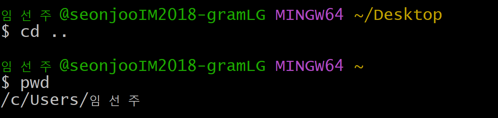
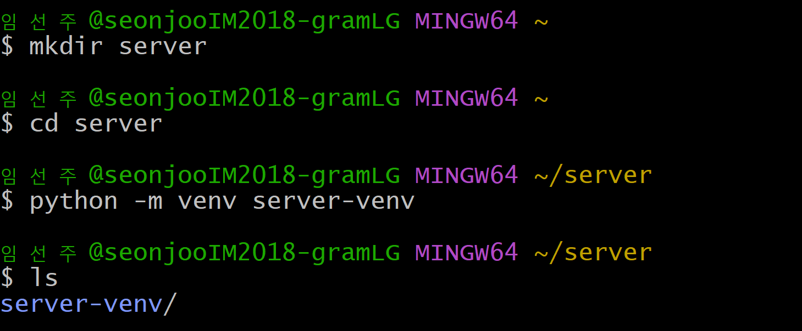
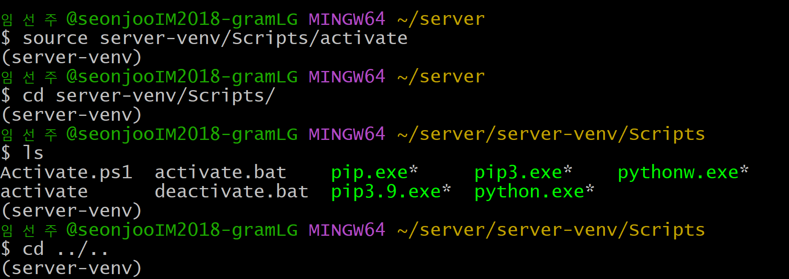
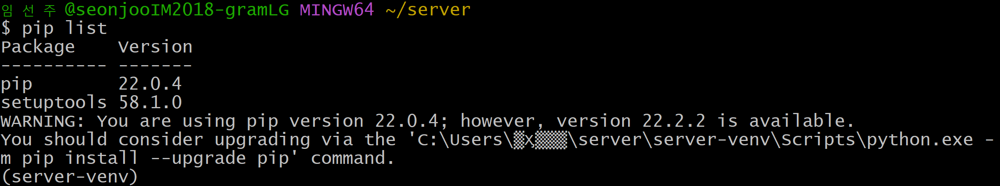
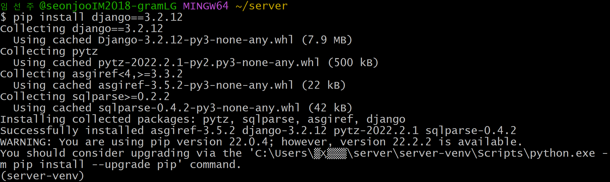
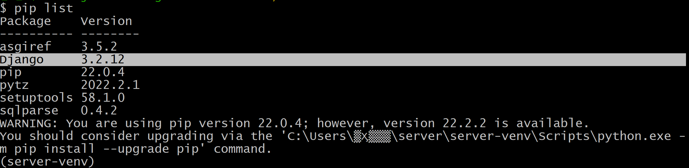
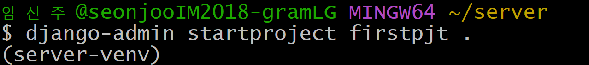
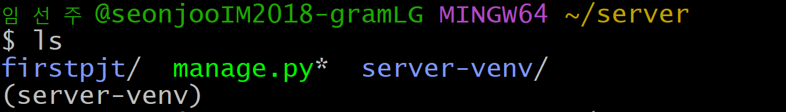
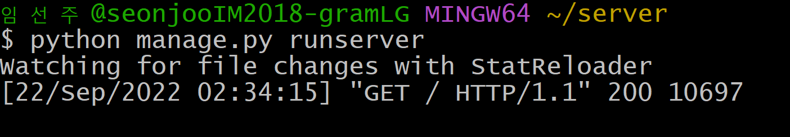
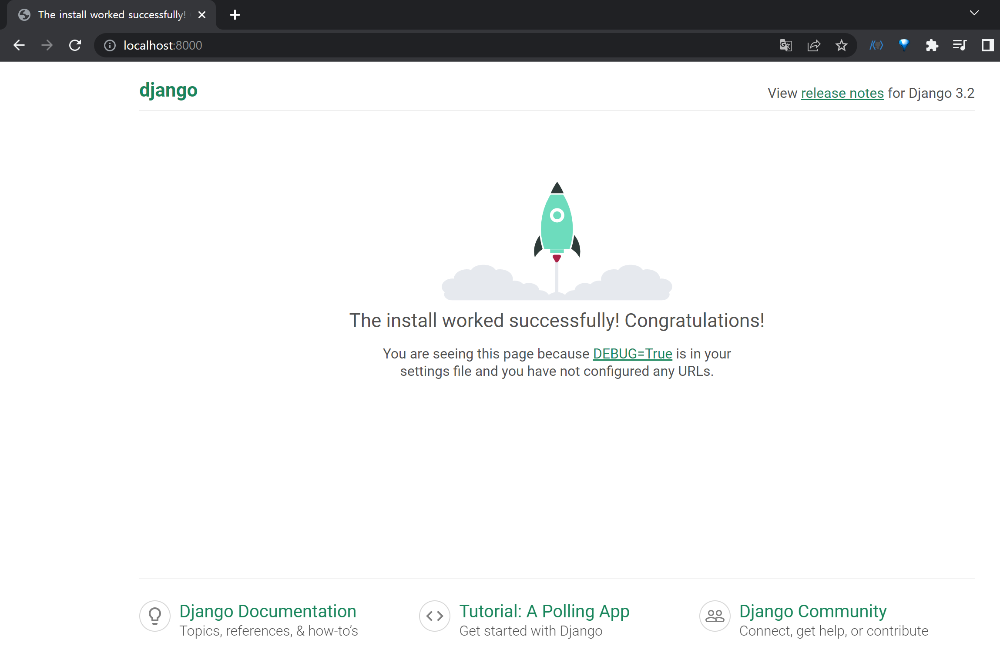

# 🦮 Django 개발 환경 설정 가이드

## ⁉ 가상환경이 필요한 이유 간단정리

Python 가상환경은 현재 설치된 Python 환경과는 다른 독립된 환경을 말한다.

Python을 사용하다보면 여러가지 패키지를 설치해야 하는데, 이 때 패키지 간에 dependency가 있는 경우 패키지 버전이 다르면 에러가 발생한다.

Python 가상환경을 사용하지 않으면 다수의 프로그램이 하나의 Python 개발환경을 이용하게 된다.

또다른 프로그램을 위해 패키지를 업그레이드하거나 설치하는 경우, 패키지간의 버전이 맞지 않게 될 수 있고, 이 경우 다른 프로그램이 동작하지 않게 된다.

Django 개발을 할 때도 가상환경을 사용하지 않으면 특정 패키지가 업데이트됨에 따라 관련 소스를 수정해야하는 문제가 발생한다.

> 가상환경은 프로젝트마다 격리된 환경(즉, 가상환경)을 생성함으로써 프로젝트별로 패키지를 관리할 수 있게 한다.

## ⚙️ 가상환경 생성 / 실행

> 바탕화면에서 git bash 실행 후 Home 디렉터리로 이동한다.
>
> - cd (Change Directory) : 디렉터리를 이동하는 명령어
>   - `cd /Desktop` : Desktop 디렉터리로 이동
>   - `cd ..` : 현재 디렉토리의 상위 디렉터리로 이동
>   - `cd ~` : 현재 사용자의 Home 디렉터리로 이동
>
> - pwd (Print Working Directory) : 현재 작업중인 디렉터리의 위치를 출력하는 명령어
>
> 🚨 항상 현재 위치 확인 잘 하기!!

> (예시로) server 폴더를 생성하고 이동한다.
>
> server 폴더 내에서 `python -m venv server-venv`를 입력하여 가상환경을 생성한다.
>
> - mkdir (make directory) : 디렉터리, 즉 폴더를 생성하는 명령어
> - ls (list) : 현재 폴더에 위치한 파일의 리스트를 출력하는 명령어

> `source server-venv/Scripts/activate`를 입력하여 가상환경을 실행한다.
>
> (Mac의 경우, `source server-venv/bin/activate`를 입력한다.)
>
> `(server-venve)`라는 표시가 생기면 가상환경이 활성화된 것!
>
> `Scripts` 폴더로 이동해 `activate` 파일이 내부에 존재함을 확인할 수 있다. 확인을 했으면 원래 위치(server)로 돌아오자.

> `pip list`로 현재 어떤 패키지들이 설치되어 있는지 확인한다. (업데이트가 필요한 패키지가 있는 지도 알려준다.)
>
> Django가 없는 경우 설치를 해야 한다.

> `deactivate`를 통해 가상환경을 비활성화 할 수 있다.

## ⚙️ Django LTS 버전 설치

### ✔ LTS란?

- Long Term Support (장기 지원 버전)
- 일반 버전과 달리 안정성에 중점을 둔 버전으로, 장기간에 걸쳐 지원하도록 고안된 소프트웨어의 버전
- 컴퓨터 소프트웨어의 제품 수명주기 관리 정책
- 배포자는 LTS 확정을 통해 장기적이고 안정적인 지원을 보장함

> 가장 최신 버전보다는 가장 안정적인 버전을 사용하자!

> 그냥 `pip install django`를 입력할 경우, 최신 버전(4.1.1)이 설치된다.
>
> 따라서 `pip install django==3.2.12`라고 설치할 버전(3.2.12)을 `==`(= 2개)를 사용하여 명시한다.

> `pip list`로 Django가 잘 설치되었음을 확인할 수 있다.

## ⚙️ Django 프로젝트 생성

> `django-admin startproject [프로젝트명] [시작경로]`를 입력하여 Django 프로젝트를 생성한다.
>
> 현재 디렉터리는 `.`로 표시한다.

> server 폴더 내부에 firstpjt 파일이 생성되었음을 확인할 수 있다.

## ⚙️ Django 실행

> `python manage.py runserver`를 입력하여 manage.py 파일을 실행시키고 나의 첫 웹 서버를 바로 시작한다!

> 주소창에 `localhost:8000` 또는 `127.0.0.1:8000`를 입력하면 나의 첫 서버가 실행되는 것을 확인할 수 있다🚀