###### 9월 21일

# 🤠 Django 시작하기

- 웹 서비스 개발’ 에는 무엇이 필요할까?

  - 로그인, 로그아웃, 회원관리, 데이터베이스, 서버, 클라이언트, 보안 등

  - 너무 많은 기술들이 필요 → 이걸 어떻게 다 만들어야 할까?

  - 모든 걸 직접 만들 필요 없음

  - 잘 만들어진 것들을 가져다가 좋은 환경에서 잘 쓰기만 하면 되는 세상

    > “거인의 어깨 위에서 프로그래밍하기”


### 🖼️ Framework 이해하기

- 누군가 만들어 놓은 코드를 재사용 하는 것은 이미 익숙한 개발 문화

- 그렇다면 ‘웹 서비스’도 누군가 개발해 놓은 코드를 재사용하면 된다!

- 전 세계의 수많은 개발자들이 이미 수없이 많이 개발해 봤고, 그 과정에서 자주 사용되는 부분들을 재사용 할 수 있게 좋은 구조의 코드로 만들어 두었음

- 그러한 코드들을 모아 놓은 것, 즉 서비스 개발에 필요한 기능들을 미리 구현해서 모아 놓은 것 == 프레임워크(Framework)

  > Frame(뼈대, 틀) + Work(일하다)
  >
  > - 일정한 뼈대, 틀을 가지고 일하다
  > - 제공받은 도구들과 뼈대, 규약을 가지고 무언가를 만드는 일
  > - 특정 프로그램을 개발하기 위한 여러 도구들과 규약을 제공하는 것

- “소프트웨어 프레임워크”는 복잡한 문제를 해결하거나 서술하는 데 사용되는 기본 개념 구조

- 따라서, Framework를 잘 사용하기만 하면 웹 서비스 개발에 있어서 모든 것들을 하나부터 열까지 직접 개발할 필요 없이, 내가 만들고자 하는 본질(로직)에 집중해 개발할 수 있음

- 소프트웨어의 생산성과 품질을 높임


### 🙌 여러가지 Web Framework

- 웹 서비스를 만들 수 있는 다양한 프레임워크

- 2020년 Github Star 수 기준 인기 프레임워크 순위

  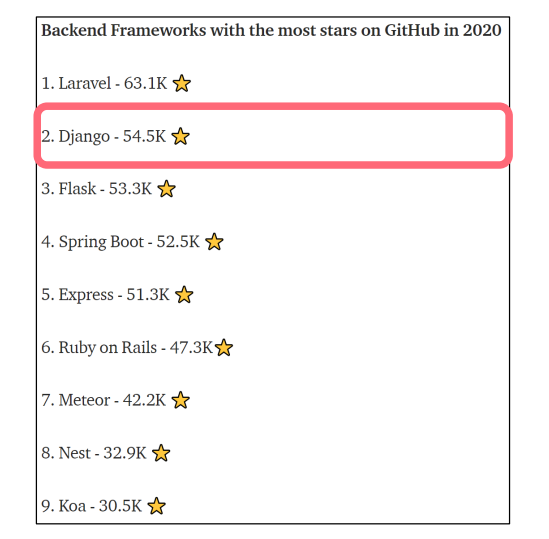


### ⁉ Django를 배워야하는 이유

- Python으로 작성된 프레임워크
  - Python이라는 언어의 강력함과 거대한 커뮤니티
- 수많은 여러 유용한 기능들
- 검증된 웹 프레임워크
  - 화해, Toss, 두나무, 당근 마켓, 요기요 등
  - 유명한 많은 서비스들이 사용한다는 것 == 안정적으로 서비스를 할 수 있다는 검증


## 🕸️ Web 이해하기

### 🌏 WWW (World Wide Web)

- 인터넷이란?
  - 우리가 구글에 접속할 때
    - 웹 브라우저를 켠다.
    - 주소창에 주소를 입력한다 (www.google.com).
  - www, 즉 World Wide Web은 ‘전 세계에 퍼져 있는 거미줄 같은 연결망’


### 🖇️ 연결 되어 있는 세계

- 우리가 구글 홈페이지에 접속할 수 있는 이유는, 구글 본사 컴퓨터와 우리의 컴퓨터 간의 통신이 연결 되어 있기 때문

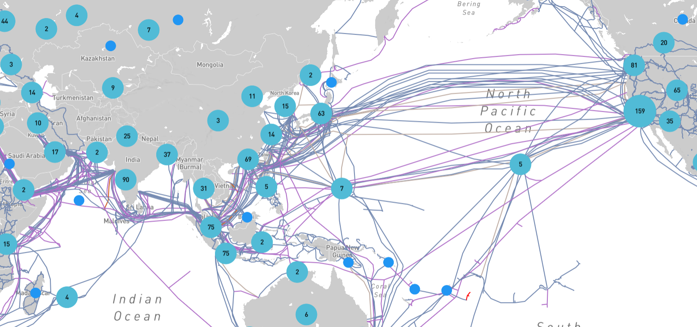

> [Infrapedia (Global Internet Infrastructure Map)](https://www.infrapedia.com/)

- 전세계는 아주 두껍고 튼튼한 해저케이블로 연결 되어있음


- 해양 생물로 인해 문제가 생긴다면 인터넷이 잠시 느려지거나, 마비가 될 수 있음


- 이렇게 전세계는 촘촘하고 거대한 유선으로 연결 되어있고, 이러한 연결로 부터 시작해 아주 많은 전봇대를 거쳐 우리집으로 인터넷이 연결됨
- 하지만 이러한 유선 연결은 한계가 존재
  - 히말라야 정상이나, 아마존 밀림까지 케이블을 까는 것은 매우 어려운 일
  - 오지가 아니어도 개발 도상국 같은 나라에서는 충분한 인프라를 기대하기 어려움
  - “정보의 빈곤”


### 🛰️ 전세계를 무선으로 연결하기

- “스타링크 프로젝트” – Space X
  - 지구를 아주 많은 소형 위성으로 감싸서, 케이블이 아닌 위성끼리 데이터를 교환

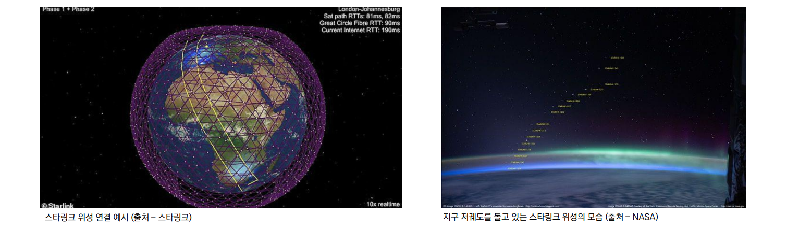

- “스타링크 프로젝트”의 문제점
  - Starlink Train
  - 우주 쓰레기

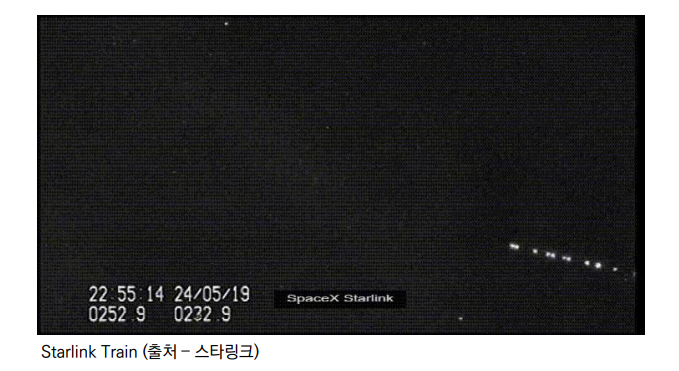

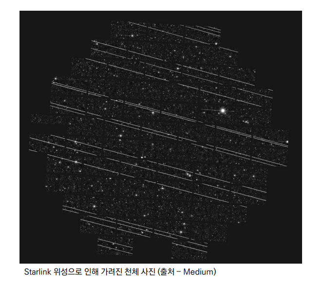

- 결국 우리가 인터넷을 이용한다는 건, 전세계의 컴퓨터가 연결되어 있는 하나의 인프라를 이용하는 것


## 🖥️ 클라이언트와 서버

### 클라이언트-서버 구조

- 오늘날 우리가 사용하는 대부분의 웹 서비스는 클라이언트-서버 구조를 기반으로 동작

- 클라이언트와 서버 역시 하나의 컴퓨터

  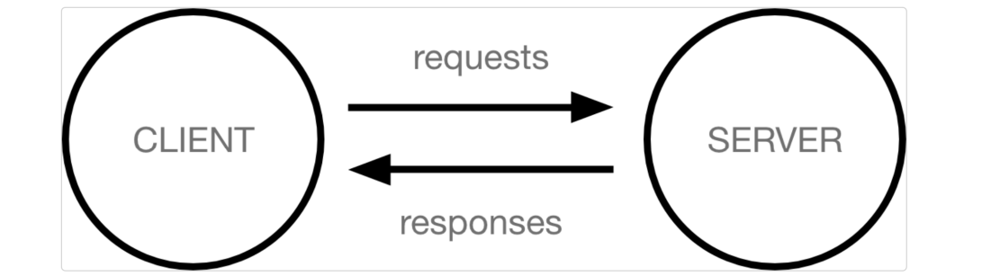

> 이들이 어떻게 상호작용하는지에 대해 간소화된 다이어그램


- **🙋‍♂️ 클라이언트**
  - 웹 사용자의 인터넷에 연결된 장치 (예를 들어 wi-fi에 연결된 컴퓨터 또는 모바일)
  - Chrome 또는 Firefox와 같은 웹 브라우저
  - 서비스를 요청하는 주체
- **💁‍♀️ 서버**
  - 웹 페이지, 사이트 또는 앱을 저장하는 컴퓨터
  - 클라이언트가 웹 페이지에 접근하려고 할 때 서버에서 클라이언트 컴퓨터로 웹 페이지 데이터를 응답해 사용자의 웹 브라우저에 표시됨
  - 요청에 대해 서비스를 응답하는 주체
- 상호작용 예시
  - 예를 들어, 우리가 Google 홈페이지에 접속한다는 것은 무엇을 뜻하는지 알아보자
  - 결론적으로 인터넷에 연결된 전세계 어딘가에 있는 구글 컴퓨터에게 `Google 홈페이지.html` 파일을 달라고 요청하는 것
  - 그러면 구글 컴퓨터는 우리의 요청을 받고 `Google 홈페이지.html` 파일을 인터넷을 통해서 우리 컴퓨터에게 응답해줌
  - 그렇게 전달받은 `Google 홈페이지.html` 파일을 웹 브라우저가 우리가 볼 수 있도록 해석해주는 것
  - 여기서 `Google 홈페이지.html`을 달라고 요청한 컴퓨터, 웹 브라우저를 클라이언트 라고 하고 `Google 홈페이지.html` 파일을 제공한 컴퓨터, 프로그램을 서버라고 함

> 어떠한 자원(resource)를 달라고 요청(request)하는 쪽을 클라이언트라고 하고 자원을 제공해주는 쪽을 서버(server)라고 함


- 정리
  - 우리가 사용하는 웹은 클라이언트-서버 구조로 이루어져 있음
  - 앞으로 우리가 배우는 것도 이 클라이언트-서버 구조를 만드는 방법을 배우는 것
  - 이 중에서 Django는 서버를 구현하는 웹 프레임워크


## 🔎 Web browser와 Web page

### 웹 브라우저란?

- 웹에서 페이지를 찾아 보여주고, 사용자가 하이퍼링크를 통해 다른 페이지로 이동할 수 있도록 하는 프로그램

- 웹 페이지 파일을 우리가 보는 화면으로 바꿔주는(렌더링, rendering) 프로그램

- 예시

  - 우리가 보고 있는 웹 페이지는 사실 HTML 문서 파일 하나
  - google 홈페이지를 예로 들면 우리는 구글 로고가 있는 예쁜 화면을 보지만, 사실 빼곡한 코드로 작성된 HTML 문서를 서버로 부터 전달받게 됨
  - 즉, 웹 페이지 코드를 받으면 우리가 보는 화면처럼 바꿔주는 것이 바로 웹 브라우저
  - HTML / CSS / JS 등의 코드를 읽어 실제 사람이 볼 수 있는 화면으로 만들어 줌

  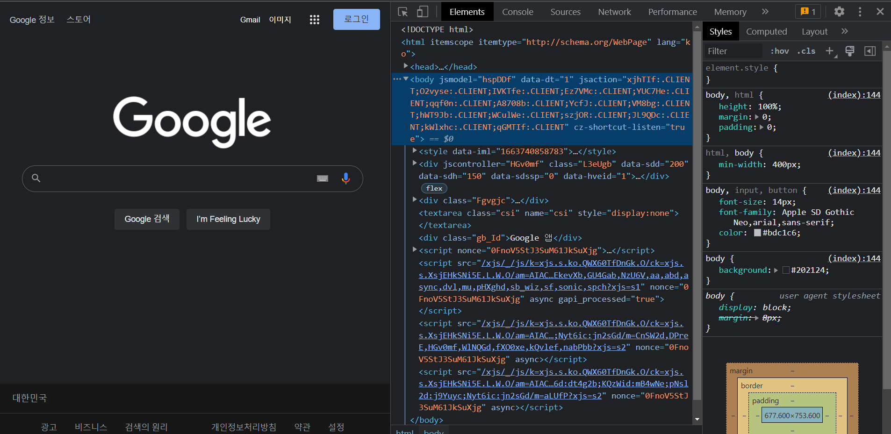


### 웹 페이지란?

- 웹에 있는 문서
  - 우리가 보는 화면 각각 한 장 한 장이 웹 페이지
- 웹 페이지 종류
  - 정적 웹 페이지
  - 동적 웹 페이지


#### 정적 웹 페이지

- Static Web page
- 있는 그대로를 제공하는 것(served as-is)을 의미
- 우리가 지금까지 작성한 웹 페이지이며 한 번 작성된 HTML 파일의 내용이 변하지 않고 모든 사용자에게 동일한 모습으로 전달되는 것
  - == 서버에 미리 저장된 HTML 파일 그대로 전달된 웹 페이지
  - == 같은 상황에서 모든 사용자에게 동일한 정보를 표시
- 예시 : 회사 소개 페이지, 로그인 기능이 없는 사이트 등


#### 동적 웹 페이지

- Dynamic Web page
- 사용자의 요청에 따라 웹 페이지에 추가적인 수정이 되어 클라이언트에게 전달되는 웹 페이지
- 웹 페이지의 내용을 바꿔주는 주체 == 서버
  - 서버에서 동작하고 있는 프로그램이 웹 페이지를 변경해줌
  - 이렇게 사용자의 요청을 받아서 적절한 응답을 만들어주는 프로그램을 쉽게 만들 수 있게 도와주는 프레임워크가 바로 'Django'

- 다양한 서버 사이드 프로그래밍 언어(python, java, c++ 등) 사용 가능 파일을 처리하고 데이터베이스와의 상호작용이 이루어짐
- 이 중에서 Python을 이용해서 개발할 수 있는 프레임워크인 Django를 학습할 예정!


## 🧬 Django 구조 이해하기 (MTV Design Pattern)

### Design Pattern 이란?

- 부산의 명물 광안대교, 이러한 다리는 어떻게 만들까?
  - 광안대교 같은 다리를 현수교(Suspension Bridge) 라고 함
  - 교량의 양쪽 끝과 가운데 솟아있는 주탑에 케이블을 두고 상판을 메다는 형식의 공법
  - 이와 똑같은 방식을 사용해서 인천대교, 이순신대교 등이 만들어졌음
  - 즉, 여러 번 짓다보니 자주 사용되는 구조가 있다는 것을 알게 되었고 이를 일반화해서 하나의 공법으로 만들어 둔 것
- 소프트웨어에서의 관점
  - 각기 다른 기능을 가진 다양한 응용 소프트웨어를 개발할 때 공통적인 설계 문제가 존재하며, 이를 처리하는 해결책 사이에도 공통점이 있다는 것을 발견
  - 이러한 유사점을 패턴이라 함


### 소프트웨어 디자인 패턴

- 소프트웨어도 수십년간 전 세계의 개발자들이 계속 만들다 보니 자주 사용되는 구조와 해결책이 있다는 것을 알게 됨
- 앞서 배웠던 클라이언트-서버 구조도 소프트웨어 디자인 패턴 중 하나
- 자주 사용되는 소프트웨어의 구조를 소수의 뛰어난 엔지니어가 마치 건축의 공법처럼 일반적인 구조화를 해둔 것


#### 소프트웨어 디자인 패턴의 목적

- 특정 문맥에서 공통적으로 발생하는 문제에 대해 재사용 가능한 해결책을 제시
- 프로그래머가 어플리케이션이나 시스템을 디자인할 때 발생하는 공통된 문제들을 해결하는데 형식화 된 가장 좋은 관행


#### 소프트웨어 디자인 패턴의 장점

- 디자인 패턴을 알고 있다면 서로 복잡한 커뮤니케이션이 매우 간단해짐
- Before
  - ”무언가 서비스를 요청을 하는 쪽을 하나 만들고.. 둘 사이에 데이터를 주고 받는 방식을 정의 한 다음.. 요청을 처리하는 쪽을 하나 따로 개발해서.. 다수의 요청을 처리하는 구조로 만들어보자..!”
- After
  - “우리 이거 클라이언트-서버 구조로 구현하자“
- 다수의 엔지니어들이 일반화된 패턴으로 소프트웨어 개발을 할 수 있도록 한 규칙, 커뮤니케이션의 효율성을 높이는 기법


#### Django에서의 디자인 패턴

- Django에도 이러한 디자인 패턴이 적용이 되어 있다 : MTV 패턴
- MTV 패턴 : MVC 디자인 패턴을 기반으로 조금 변형된 패턴
- 두 패턴은 서로 크게 다른 점은 없으며 일부 역할에 대해 부르는 이름이 다름

|    MVC     |   MTV    |
| :--------: | :------: |
|   Model    |  Model   |
|    View    | Template |
| Controller |   View   |


#### MVC 소프트웨어 디자인 패턴

- MVC는 Model - View – Controller의 준말
  - Model : 데이터와 관련된 로직을 관리
  - View : 레이아웃과 화면을 처리
  - Controller : 명령을 model과 view 부분으로 연결
- 데이터 및 논리 제어를 구현하는데 널리 사용되는 소프트웨어 디자인 패턴
- 하나의 큰 프로그램을 세가지 역할로 구분한 개발 방법론

- MVC 소프트웨어 디자인 패턴의 목적
  - “관심사 분리”
  - 더 나은 업무의 분리와 향상된 관리를 제공
  - 각 부분을 독립적으로 개발할 수 있어, 하나를 수정하고 싶을 때 모두 건드리지 않아도 됨
    - == 개발 효율성 및 유지보수가 쉬워짐
    - == 다수의 멤버로 개발하기 용이함


#### MTV 디자인 패턴

- Model
  - MVC 패턴에서 Model의 역할에 해당
  - 데이터와 관련된 로직을 관리
  - 응용프로그램의 데이터 구조를 정의하고 데이터베이스의 기록을 관리

- Template
  - 레이아웃과 화면을 처리
  - 화면상의 사용자 인터페이스 구조와 레이아웃을 정의
  - MVC 패턴에서 View의 역할에 해당

- View

  - Model & Template과 관련한 로직을 처리해서 응답을 반환

  - 클라이언트의 요청에 대해 처리를 분기하는 역할

  - 동작 예시

    - 데이터가 필요하다면 model에 접근해서 데이터를 가져오고

      가져온 데이터를 template로 보내 화면을 구성하고

      구성된 화면을 응답으로 만들어 클라이언트에게 반환

  - MVC 패턴에서 Controller의 역할에 해당

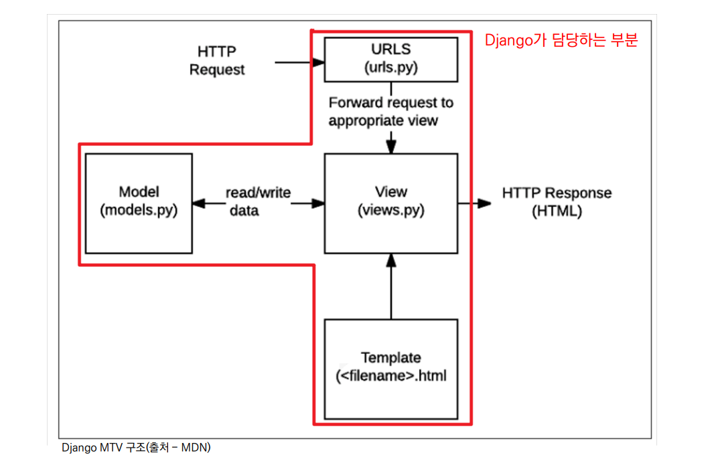


#### 정리

- Django는 MTV 디자인 패턴을 가지고 있음
  - Model : 데이터 관련
  - Template : 화면 관련
  - View : Model & Template 중간 처리 및 응답 반환


## 🚀 Django Quick start

### Django 설치

- 설치 전 가상환경 설정 및 활성화를 마치고 진행

- Django 4.0 릴리즈로 인해 3.2(LTS) 버전을 명시해서 설치

  - 2021년 12월 Django 4.0 릴리즈 이후 버전을 명시하지 않으면 4.0 버전이 설치되니 주의

  ```bash
  $ pip install django==3.2.13
  ```

- 패키지 목록 생성

  ```bash
  $ pip freeze > requirements.txt
  ```

- [참고] LTS

  - Long Term Support (장기 지원 버전)
  - 일반적인 경우보다 장기간에 걸쳐 지원하도록 고안된 소프트웨어의 버전
  - 컴퓨터 소프트웨어의 제품 수명주기 관리 정책
  - 배포자는 LTS 확정을 통해 장기적이고 안정적인 지원을 보장함

  

### Django Project

- 프로젝트 생성

  ```bash
  $ django-admin startproject firstpjt .
  ```

  - Project 이름에는 Python이나 Django에서 사용 중인 키워드 및 `-`(하이픈) 사용 불가
  - `.` (dot)을 붙이지 않을 경우 현재 디렉토리에 프로젝트 디렉토리를 새로 생성하게 됨

- 서버 실행

  ```bash
  $ python manage.py runserver
  ```

- 서버 실행 후 메인 페이지 확인

  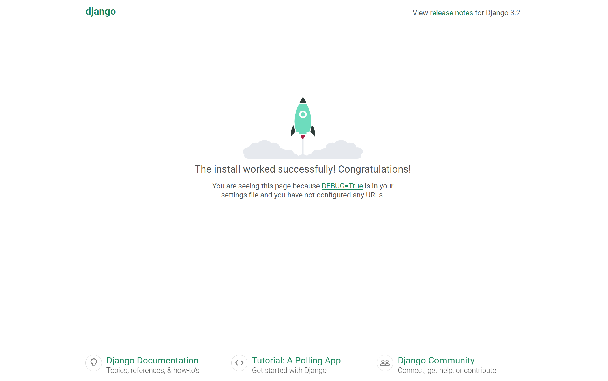


#### 프로젝트 구조

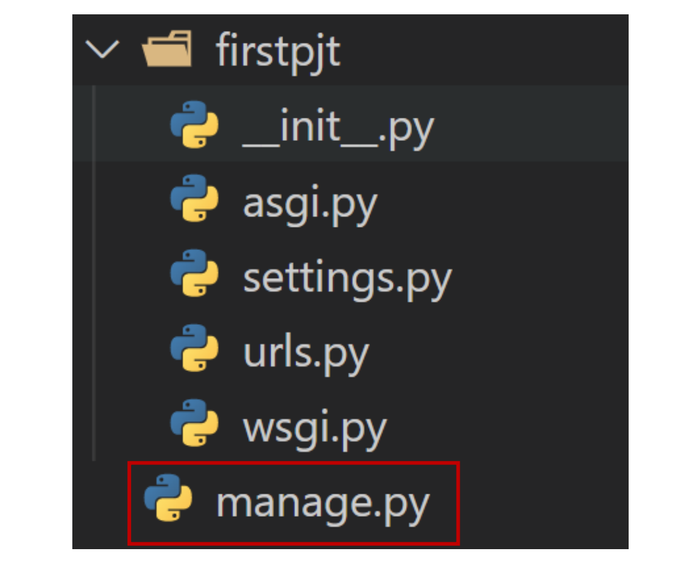

- `__init__.py`
  - Python에게 이 디렉토리를 하나의 Python 패키지로 다루도록 지시
  - 별도로 추가 코드를 작성하지 않음

- `asgi.py`
  - Asynchronous Server Gateway Interface
  - Django 애플리케이션이 비동기식 웹 서버와 연결 및 소통하는 것을 도움
  - 추후 배포 시에 사용하며 지금은 수정하지 않음
- `settings.py`
  - Django 프로젝트 설정을 관리
- `urls.py`
  - 사이트의 url과 적절한 views의 연결을 지정
- `wsgi.py`
  - Web Server Gateway Interface
  - Django 애플리케이션이 웹서버와 연결 및 소통하는 것을 도움
  - 추후 배포 시에 사용하며 지금은 수정하지 않음

- `manage.py`

  - Django 프로젝트와 다양한 방법으로 상호작용 하는 커맨드라인 유틸리티

  ```bash
  # manage.py Usage
  $ python manage.py <command> [options]
  ```


### Django Application

- 애플리케이션(앱) 생성

  ```bash
  $ python manage.py startapp articles
  ```

  - 일반적으로 애플리케이션 이름은 ‘복수형’으로 작성하는 것을 권장


#### 애플리케이션 구조

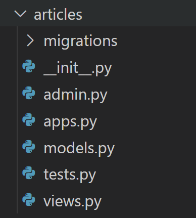

- `admin.py`
  - 관리자용 페이지를 설정 하는 곳
- `apps.py`
  - 앱의 정보가 작성된 곳
  - 별도로 추가 코드를 작성하지 않음
- `models.py`
  - 애플리케이션에서 사용하는 Model을 정의하는 곳
  - MTV 패턴의 M에 해당
- `tests.py`
  - 프로젝트의 테스트 코드를 작성하는 곳
- `views.py`
  - view 함수들이 정의 되는 곳
  - MTV 패턴의 V에 해당


- 프로젝트에서 앱을 사용하기 위해서는 반드시 INSTALLED_APPS 리스트에 추가해야 함

- **INSTALLED_APPS**

  - Django installation에 활성화 된 모든 앱을 지정하는 문자열 목록

  ```bash
  # settings.py
  
  INSTALLED_APPS = [
      'articles',
      'django.contrib.admin',
      'django.contrib.auth',
      'django.contrib.contenttypes',
      'django.contrib.sessions',
      'django.contrib.messages',
      'django.contrib.staticfiles',
  ]
  
  # 반드시 생성 후 등록
  ```

- 해당 순서를 지키지 않아도 수업 과정에서는 문제가 없지만, 추후 advanced 한 내용을 대비하기 위해 지키는 것을 권장

  ```bash
  INSTALLED_APPS = [
      # Local apps
      ‘articles',
  
      # Third party apps
      'haystack',
  
      # Django apps
      'django.contrib.admin',
      'django.contrib.auth',
      'django.contrib.contenttypes',
      'django.contrib.sessions',
      'django.contrib.sites',
  ]
  ```


### Project & Application

- Project
  - “collection of apps”
  - 프로젝트는 앱의 집합
  - 프로젝트에는 여러 앱이 포함될 수 있음
  - 앱은 여러 프로젝트에 있을 수 있음
- Application
  - 앱은 실제 요청을 처리하고 페이지를 보여주는 등의 역할을 담당
  - 일반적으로 앱은 하나의 역할 및 기능 단위로 작성하는 것을 권장함

