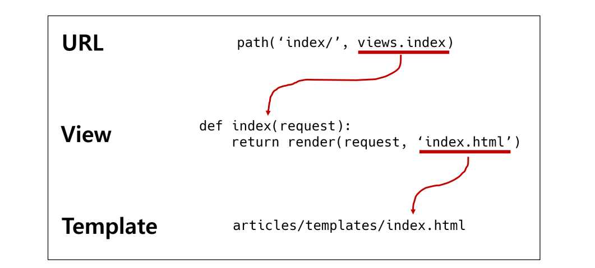
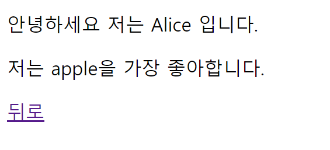
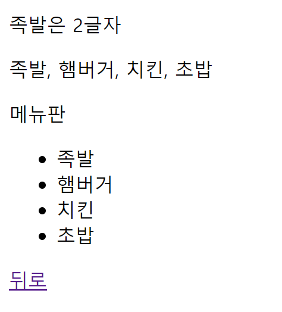

###### 9월 22일

# 🚀 Django Day 2

## ✨ 요청과 응답

> URL → VIEW → TEMPLATE 순의 작성 순서로 코드를 작성해보고 데이터의 흐름을 이해하기


### 🧩 URLs

```python
# urls.py

from django.contrib import admin
from django.urls import path
from articles import view

urlpatterns = [
    path('admin/', admin.site.urls),
    path('index/', views.index),
]
```

> URL 문자열 마지막에 작성한 “Trailing Slash”는 URL 챕터에서 자세히 다룰 예정


### 🧩 Views

- HTTP 요청을 수신하고 HTTP 응답을 반환하는 함수 작성
- Template에게 HTTP 응답 서식을 맡김

```python
# articles/views.py

def index(request):
    return render(request, 'index.html')
```


- `render()`

  - 주어진 템플릿을 주어진 컨텍스트 데이터와 결합하고 렌더링 된 텍스트와 함께 HttpResponse(응답) 객체를 반환하는 함수

    ```python
    render(request, template_name, context)
    ```

    - request
      - 응답을 생성하는 데 사용되는 요청 객체
    - template_name
      - 템플릿의 전체 이름 또는 템플릿 이름의 경로
    - context
      - 템플릿에서 사용할 데이터 (딕녀너리 타입으로 작성)


### 🧩 Templates

- 실제 내용을 보여주는데 사용되는 파일
- 파일의 구조나 레이아웃을 정의
- Template 파일의 기본 경로
  - app 폴더 안의 templates 폴더
  - app_name/templates/

```html
<!-- articles/templates/index.html -->

<!DOCTYPE html>
<html lang="en">
<head>
  <!-- 생략 -->
</head>
<body>
  <h1>만나서 반가워요!</h1>
</body>
</html>
```

🚨 템플릿 폴더 이름은 반드시 `templates`라고 지정해야 함!


### 코드 작성 순서

- 앞으로 Django에서의 코드 작성은 URL → View → Template 순으로 작성
- “데이터의 흐름 순서”




### [참고] 추가 설정

- [**LANGUAGE_CODE**](http://www.i18nguy.com/unicode/language-identifiers.html)
  - 모든 사용자에게 제공되는 번역을 결정
  - 이 설정이 적용 되려면 `USE_I18N`이 활성화(`True`)되어 있어야 함
- [**TIME_ZONE**](https://en.wikipedia.org/wiki/List_of_tz_database_time_zones)
  - 데이터베이스 연결의 시간대를 나타내는 문자열 지정
  - `USE_TZ`가 `True`이고 이 옵션이 설정된 경우, 데이터베이스에서 날짜 시간을 읽으면 UTC 대신 새로 설정한 시간대의 인식 날짜&시간이 반환됨
  - `USE_TZ`이 `False`인 상태로 이 값을 설정하는 것은 error가 발생하므로 주의

```python
# settings.py

LANGUAGE_CODE = 'ko-kr'
TIME_ZONE = 'Asia/Seoul'
```

- **USE_I18N**
  - Django의 번역 시스템을 활성화해야 하는지 여부를 지정
- **USE_L10N**
  - 데이터의 지역화 된 형식(localized formatting)을 기본적으로 활성화할지 여부를 지정
  - True일 경우, Django는 현재 [locale](https://ko.wikipedia.org/wiki/%EB%A1%9C%EC%BC%80%EC%9D%BC)의 형식을 사용하여 숫자와 날짜를 표시
- **USE_TZ**
  - datetimes가 기본적으로 시간대를 인식하는지 여부를 지정
  - True일 경우 Django는 내부적으로 시간대 인식 날짜 / 시간을 사용

> 위 설정 값들은 현 시점에서는 별도로 수정하지 않음


## ✨ Django Template

> “데이터 표현을 제어하는 도구이자 표현에 관련된 로직”

- Django Template을 이용한 HTML 정적 부분과 동적 컨텐츠 삽입
- Template System의 기본 목표를 숙지
- Django Template System
  - 데이터 표현을 제어하는 도구이자 표현에 관련된 로직을 담당


### Django Template Language (DTL)

- Django template에서 사용하는 built-in template system
- 조건, 반복, 변수 치환, 필터 등의 기능을 제공
  - Python처럼 일부 프로그래밍 구조(if, for 등)를 사용할 수 있지만, Python 코드로 실행되는 것은 아님
  - Django 템플릿 시스템은 단순히 Python이 HTML에 포함된 것이 아니니 주의
- 프로그래밍적 로직이 아니라 프레젠테이션을 표현하기 위한 것임을 명심할 것!


### DTL Syntax

#### 🧩 Variable

```django
{{ variable }}
```

- 변수명은 영어, 숫자와 밑줄(_)의 조합으로 구성될 수 있으나 밑줄로는 시작 할 수 없음
  - 공백이나 구두점 문자 또한 사용할 수 없음
- dot(`.`)를 사용하여 변수 속성에 접근할 수 있음
- render()의 세번째 인자로 `{'key': value}` 와 같이 딕셔너리 형태로 넘겨주며, 여기서 정의한 key에 해당하는 문자열이 template에서 사용 가능한 변수명이 됨


#### 🧩 Filters

```django
{{ variable|filter }}
```

- 표시할 변수를 수정할 때 사용

  - 예시

    ```django
    {{ name|lower }}
    ```

    - name 변수를 모두 소문자로 출력

- 60개의 built-in template filters를 제공

- chained가 가능하며 일부 필터는 인자를 받기도 함

  ```django
  {{ name|truncatewords:30 }}
  ```


#### 🧩 Tags

```django

```

- 출력 텍스트를 만들거나, 반복 또는 논리를 수행하여 제어 흐름을 만드는 등 변수보다 복잡한 일들을 수행

- 일부 태그는 시작과 종료 태그가 필요

  ```django
  
  ```

- 약 24개의 built-in template tags를 제공


#### 🧩 Comments

```django
{# #}
```

- Django template에서 라인의 주석을 표현하기 위해 사용

- 한 줄 주석에만 사용할 수 있음 (줄 바꿈이 허용되지 않음)

- 여러 줄 주석은 ``와 `` 사이에 입력

  ```django
  
    여러 줄
    주석
  
  ```


### ✍️ 실습

#### 1. Variable

```python
# urls.py

urlpatterns = [
    path('admin/', admin.site.urls),
    path('index/', views.index),
    path('greeting/', views.greeting),
]
```

```python
# articles/views.py

def greeting(request):
    return render(request, 'greeting.html', {'name': 'Alice'})
```

```html
<!-- articles/templates/greeting.html -->

<!DOCTYPE html>
<html lang="en">
<head>
  …
</head>
<body>
  <p>안녕하세요 저는 {{ name }} 입니다.</p>
</body>
</html>
```

> 


- context 데이터가 많아질 경우를 생각하면 다음과 같이 작성하는 것이 바람직
- context라는 이름은 다른 이름으로 사용 가능하지만 관행적으로 context를 사용

```python
# views.py

def greeting(request):
    foods = ['apple', 'banana', 'coconut',]
    info = {
        'name': 'Alice'
    }
    context = {
        'foods': foods,
    'info': info,
    }
    return render(request, 'greeting.html', context)
```

```html
<!-- articles/templates/greeting.html -->

<p>저는 {{ foods.0 }}을 가장 좋아합니다.</p>
<p>안녕하세요 저는 {{ info.name }} 입니다.</p>
<a href="/index/">뒤로</a>
```

> 


#### 2. Filters

```python
# urls.py

urlpatterns = [
        ...,
        path('dinner/', views.dinner),
]
```

```python
# articles/views.py

import random
from django.shortcuts import render
...
def dinner(request):
    foods = ['족발', '햄버거', '치킨', '초밥',]
    pick = random.choice(foods)
    context = {
        'pick': pick,
        'foods': foods,
    }
    return render(request, 'dinner.html', context)
```

```html
<!-- articles/templates/dinner.html -->

<!DOCTYPE html>
<html lang="en">
<head>
...
</head>
<body>
  <p>{{ pick }}은 {{ pick|length }}글자</p>
  <p>{{ foods|join:", "}}</p>
    
  <a href="/index/">뒤로</a>
</body>
</html>
```

> 


```html
<!-- articles/templates/dinner.html -->

<!DOCTYPE html>
<html lang="en">
<head>
...
</head>
<body>
  <p>{{ pick }}은 {{ pick|length }}글자</p>
  <p>{{ foods|join:", "}}</p>
  
  <p>메뉴판</p>
  <ul>
    
      <li>{{ food }}</li>
    
  </ul>
    
  <a href="/index/">뒤로</a>
</body>
</html>
```

> 


#### 3. Comments

```html
<!-- dinner.html -->

<!DOCTYPE html>
<html lang="en">
<head>
  ...
</head>
<body>
  ...

  {# 이것은 주석입니다. #}

  
  <p>여러 줄</p>
  <p>주석</p>
  <p>입니다.</p>
  

  <a href="/index/">뒤로</a>
</body>
</html>
```

