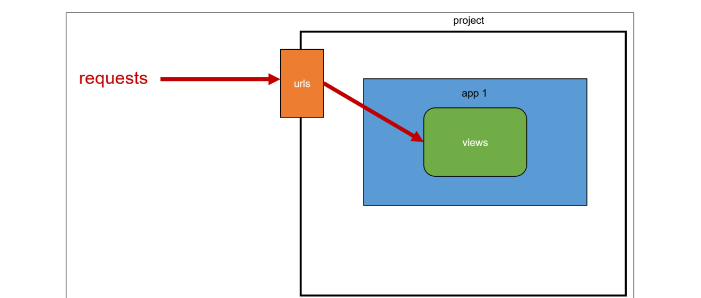
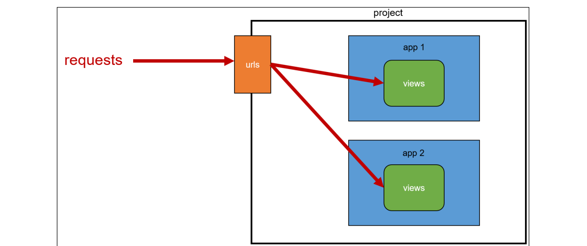
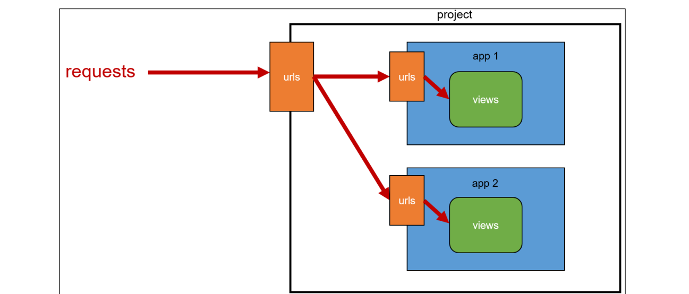
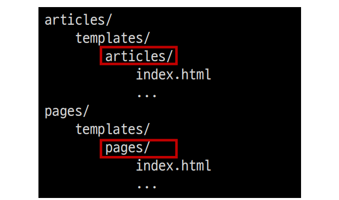
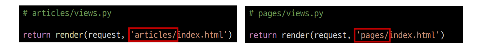

###### 9월 27일

# 🚀 Django Day 4

## ✨ App URL mapping

- 앱이 많아졌을 때 `urls.py`를 각 app에 매핑하는 방법을 이해하기
- 두번째 app인 `pages`를 생성 및 등록 하고 진행
- app의 `view` 함수가 많아지면서 사용하는 `path()` 또한 많아지고, app 또한 더 많이 작성되기 때문에 프로젝트의 `urls.py`에서 모두 관리하는 것은 프로젝트 유지보수에 좋지 않음

- 각 앱의 view 함수를 다른 이름으로 import할 수 있음

  ```python
  # firstpjt/urls.py
  
  from articles import views as articles_views
  from pages import views as pages_views
  
  urlpatterns = [
      ...,
      path('pages-index', pages_views.index),
  ]
  ```

  이렇게도 가능하지만.. 더 좋은 방법을 생각해보자


- 하나의 프로젝트에 여러 앱이 존재한다면, 각각의 앱 안에 `urls.py`을 만들고 `프로젝트 urls.py`에서 각 앱의 `urls.py` 파일로 URL 매핑을 위탁할 수 있음

  ```python
  # articles/urls.py
  
  from django.urls import path
  from . import views
  
  urlpatterns = [
      path('index/', views.index),
      path('greeting/', views.greeting),
      path('dinner/', views.dinner),
      path('throw/', views.throw),
      path('catch/', views.catch),
      path('hello/<str:name>/', views.hello),
  ]
  ```

  ```python
  # pages/urls.py
  
  from django.urls import path
  
  urlpatterns = [
  
  ]
  ```

  각각의 app 폴더 안에 `urls.py`를 작성하고 다음과 같이 수정 진행


### 🌠 Including other URLconfs

-  urlpattern은 언제든지 다른 URLconf 모듈을 포함(include)할 수 있음

> include되는 앱의 `url.py`에 `urlpatterns`가 작성되어 있지 않다면 에러가 발생
>
> 예를 들어, pages 앱의 `urlpatterns`가 빈 리스트라도 작성되어 있어야 함

```python
# firstpjt/urls.py

from django.contrib import admin
from django.urls import path, include

urlpatterns = [
    path('admin/', admin.site.urls),
    path('articles/', include('articles.urls')),
    path('pages/', include('pages.urls')),
]
```

- 이제 메인 페이지의 주소는 이렇게 바뀌었음
  - http:<hi>//127.0.0.1:8000**/index/** → http:<hi>//127.0.0.1:8000/**articles/index/**


#### 🧩 include()

- 다른 URLconf(app1/urls.py)들을 참조할 수 있도록 돕는 함수
- 함수 `include()`를 만나게 되면 URL의 그 시점까지 일치하는 부분을 잘라내고, 남은 문자열 부분을 후속 처리를 위해 include된 URLconf로 전달


### 🌠 URL 구조의 변화

- 앱의 URL을 project의 urls.py에서 관리




- 복수 개의 앱의 URL을 project의 urls.py에서 관리




- 각각의 앱에서 URL을 관리




## ✨ Template namespace

- Django는 기본적으로 `app_name/templates/` 경로에 있는 templates 파일들만 찾 을 수 있으며, `settings.py`의 `INSTALLED_APPS`에 작성한 app 순서로 template을 검색 후 렌더링 함
- 바로 이 속성 값이 해당 경로를 활성화하고 있음

```python
# settings.py

TEMPLATES = [
    {
        ...,
        'APP_DIRS': True,
        ...
    },
]
```


### 1. 디렉토리 생성을 통해 물리적인 이름공간 구분

- Django templates의 기본 경로에 app과 같은 이름의 폴더를 생성해 폴더 구조를 `app_name/templates/app_name/` 형태로 변경

  - Django templates의 기본 경로 자체를 변경할 수는 없기 때문에 물리적으로 이름 공간을 만드는 것

  


### 2. 템플릿 경로 변경

- 폴더 구조 변경 후 변경된 경로로 해당하는 모든 부분 수정하기

  


### 반드시 Template namespace를 고려해야 할까?

- 만약 단일 앱으로만 이루어진 프로젝트라면 Template namespace를 고려하지 않아도 상관없음
- 여러 앱이 되었을 때에도 템플릿 파일 이름이 겹치지 않게 하면 되지만, 앱이 많아지면 대부분은 같은 이름의 템플릿 파일이 존재하기 마련이기 때문에 Template namespace를 사용하는 것이 좋다.

