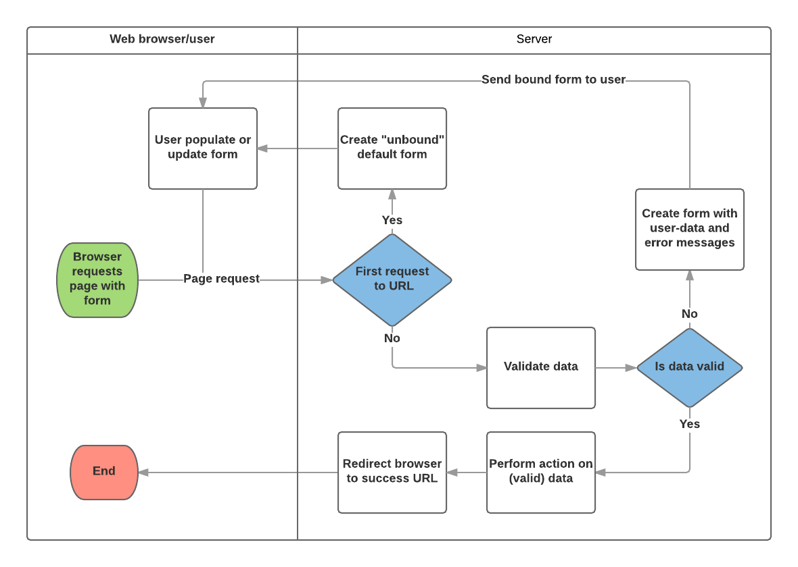
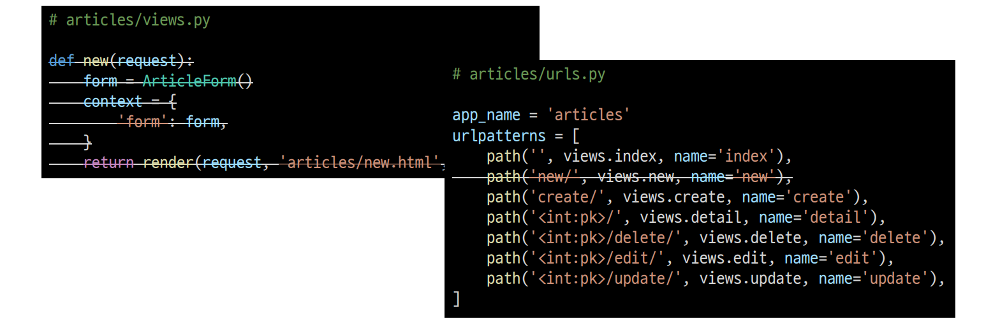
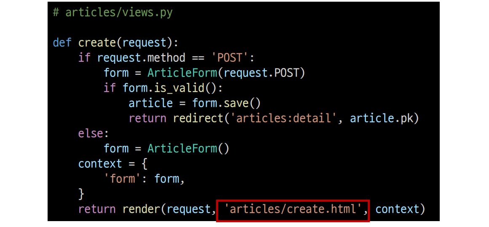
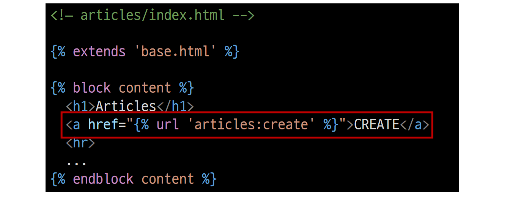
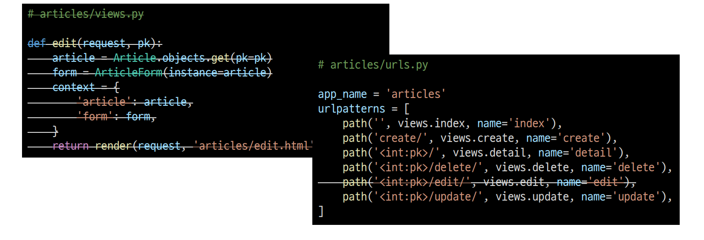

###### 10월 4일

# 🚀 Django ModelForm

> - DB 기반의 어플리케이션을 개발하다보면, HTML Form(UI)은 Django의 모델(DB)과 매우 밀접한 관계를 가지게 됨
>   - 사용자로부터 값을 받아 DB에 저장하여 활용하기 때문
>   - 즉, 모델에 정의한 필드의 구성 및 종류에 따라 HTML Form이 결정됨
> - 사용자가 입력한 값이 DB의 데이터 형식과 일치하는지를 확인하는 유효성 검증이 반드시 필요하며 이는 서버 사이드에서 반드시 처리해야 함


### 🌠 ModelForm Class

- Model을 통해 Form Class를 만들 수 있는 helper class
- ModelForm은 Form과 똑같은 방식으로 View 함수에서 사용


### 🌠 ModelForm 선언

- forms 라이브러리의 ModelForm 클래스를 상속받음
- 정의한 ModelForm 클래스 안에 Meta 클래스를 선언
- 어떤 모델을 기반으로 form을 작성할 것인지에 대한 정보를 Meta 클래스에 지정

```python
# articles/forms.py

from django import forms
from .models import Article

class ArticleForm(forms.ModelForm):

    class Meta:

        model = Article
        fields = '__all__'
```


#### 🧩 ModelForm에서의 Meta Class

- ModelForm의 정보를 작성하는 곳

- ModelForm을 사용할 경우 참조할 모델이 있어야 하는데, Meta class의 model 속성이 이를 구성함

  - 참조하는 모델에 정의된 field 정보를 Form에 적용함

  ```python
  class Meta:
      model = Article
      fields = '__all__'
  ```

- fields 속성에 `__all__`를 사용하여 모델의 모든 필드를 포함할 수 있음

- 또는 exclude 속성을 사용하여 모델에서 포함하지 않을 필드를 지정할 수 있음

  ```python
  # articles/forms.py
  
  class ArticleForm(forms.ModelForm):
      class Meta:
          model = Article
          fields = '__all__'
  ```

  ```python
  # articles/forms.py
  
  class ArticleForm(forms.ModelForm):
  
      class Meta:
          model = Article
          exclude = ('title',)
  ```


### 🌠 ModelForm의 활용

#### 1️⃣ ModelForm 객체를 context로 전달

```python
# articles/views.py

from .forms import ArticleForm

def new(request):
    form = ArticleForm()
    context = {
        'form': form,
    }
    return render(request, 'articles/new.html', context)
```


#### 2️⃣ Input Field 활용

```django
<!-- articles/new.html -->




  <h1>NEW</h1>
  <form action="" method="POST">
    
    {{ form.as_p }}
    <input type="submit">
  </form>
  <hr>
  <a href="">[back]</a>

```


#### 🧩 From rendering options

-  \<label> & \<input> 쌍에 대한 3가지 출력 옵션

  1. as_p()

     - 각 필드가 단락(\<p> 태그)으로 감싸져서 렌더링

  2. as_ul()

     - 각 필드가 목록 항목(\<li> 태그)으로 감싸져서 렌더링

     -  \<ul> 태그는 직접 작성해야 한다.

  3. as_table()

     - 각 필드가 테이블(\<tr> 태그) 행으로 감싸져서 렌더링


### 🌠 저장 및 활용

```python
>>> from django.forms import ModelForm
>>> from .models import Article

# Create the form class.
>>> class ArticleForm(ModelForm):
...     class Meta:
...         model = Article
...         fields = ‘__all__’

# Creating a form to add an article.
>>> form = ArticleForm()

# Creating a form to change an existing article.
>>> article = Article.objects.get(pk=1)
>>> form = ArticleForm(instance=article)
```

```python
>>> from .models import Article
>>> from .forms import ArticleForm

# Create a form instance from POST data.
>>> f = ArticleForm(request.POST)

# Save a new Article object from the form's data.
>>> new_article = f.save()

# Create a form to edit an existing Article, but use POST data to populate the form.
>>> a = Article.objects.get(pk=1)
>>> f = ArticleForm(request.POST, instance=a)
>>> f.save()
```


## ✨ ModelForm with view functions

### 🌠 ModelForm 활용 로직

- 요청 방식에 따른 분기
  - HTML Form 전달
  - 사용자 입력 데이터 수신
- 유효성 검사에 따른 분기
  - 유효성 검사 실패시 Form으로 전달
  - 유효성 검사 성공시 DB 저장




### 🌠 CREATE

```python
# articles/views.py

def create(request):
    form = ArticleForm(request.POST)
    if form.is_valid():
        article = form.save()
        return redirect('articles:detail', article.pk)
    return redirect('articles:new')
```

- 유효성 검사를 통과하면
  - 데이터 저장 후
  - 상세 페이지로 리다이렉트
- 통과하지 못하면
  - 작성 페이지로 리다이렉트


#### 🧩 `is_valid()` method

- 유효성 검사를 실행하고, 데이터가 유효한지 여부를 boolean으로 반환
- 데이터 유효성 검사를 보장하기 위한 많은 테스트에 대해 Django는 `is_valid()`를 제공하여 개발자의 편의를 도움


#### 🧩 The `save()` method

```python
# CREATE
form = ArticleForm(request.POST)
form.save()

# UPDATE
form = ArticleForm(request.POST, instance=article)
form.save()
```

- form 인스턴스에 바인딩된 데이터를 통해 데이터베이스 객체를 만들고 저장
- ModelForm의 하위 클래스는 키워드 인자 instance 여부를 통해 생성할지, 수정할지를 결정함
  - 제공되지 않은 경우 `save()`는 지정된 모델의 새 인스턴스를 만듦 (CREATE)
  - 제공되면 `save()`는 해당 인스턴스를 수정 (UPDATE)


#### 🧩 form 인스턴스의 errors 속성

- `is_valid()`의 반환 값이 False인 경우 form 인스턴스의 errors 속성에 값이 작성되는데, 유효성 검증을 실패한 원인이 딕셔너리 형태로 저장됨

```python
# articles/views.py

def create(request):
    form = ArticleForm(request.POST)
    if form.is_valid():
        article = form.save()
        return redirect('articles:detail', article.pk)
    print(f'에러: {form.errors}')
    return redirect('articles:new')
```

> title에 공백을 넣고 제출해보기
>
> 

- 이 같은 특징을 통해 다음과 같은 구조로 코드를 작성하면 유효성 검증을 실패 했을 때 사용자에게 실패 결과 메세지를 출력해줄 수 있음

  ```python
  # articles/views.py
  
  def create(request):
      form = ArticleForm(request.POST)
      if form.is_valid():
          article = form.save()
          return redirect('articles:detail', article.pk)
      context = {
          'form': form,
      }
      return render(request, 'articles/new.html', context)
  ```


### 🌠 UPDATE

- ModelForm의 인자 instance는 수정 대상이 되는 객체(기존 객체)를 지정
- `request.POST`
  - 사용자가 form을 통해 전송한 데이터 (새로운 데이터)
- `instance`
  - 수정이 되는 대상


- edit – view 수정

```python
# articles/views.py

def edit(request, pk):
    article = Article.objects.get(pk=pk)
    form = ArticleForm(instance=article)
    context = {
        'article': article,
        'form': form,
    }
    return render(request, 'articles/edit.html', context)
```


- edit - template 수정

```django
<!– articles/edit.html -->




  <h1>EDIT</h1>
  <form action="" method="POST">
  
  {{ form.as_p }}
  <input type="submit">
  </form>
  <hr>
  <a href="">[back]</a>

```


- update - view 수정

```python
# articles/views.py

def update(request, pk):
    article = Article.objects.get(pk=pk)
    form = ArticleForm(request.POST, instance=article)
    if form.is_valid():
        form.save()
        return redirect('articles:detail', article.pk)
    context = {
        'form': form,
        'article': article,
    }
    return render(request, 'articles/edit.html', context)
```


## ✨ Handling HTTP requests

### 🌠 CREATE

- new와 create view 함수를 합침
- 각각의 역할은 request.method 값을 기준으로 나뉨

```python
# articles/views.py

def create(request):
    if request.method == 'POST':
        form = ArticleForm(request.POST)
        if form.is_valid():
            article = form.save()
            return redirect('articles:detail', article.pk)
        else:
            form = ArticleForm()
            context = {
                'form': form,
            }
            return render(request, 'articles/new.html', context)
```

- 이제는 불필요해진 new의 view 함수와 url path를 삭제



- new.html → create.html 이름변경 및 action 속성 값 수정


- new.html → create.html 이름변경으로 인한 템플릿 경로 수정



- index 페이지에 있던 new 관련 링크 수정




#### 🧩 context의 들여쓰기 위치

```python
# articles/views.py

def create(request):
    if request.method == 'POST':
        form = ArticleForm(request.POST)
        if form.is_valid():
            article = form.save()
            return redirect('articles:detail', article.pk)
        else:
            form = ArticleForm()
            context = {
                'form': form,
            }
            return render(request, 'articles/create.html', context)
```

> 이렇게 작성하면 if form.is_valid(): 에서 false로 평가 받았을 때 이어질 코드가 없음


```python
# articles/views.py

def create(request):
    if request.method == 'POST':
        form = ArticleForm(request.POST)
        if form.is_valid():
            article = form.save()
            return redirect('articles:detail', article.pk)
        else:
            form = ArticleForm()
        context = {
            'form': form,
        }
        return render(request, 'articles/createhtml', context)
```

> 반면 다음과 같이 작성하면 if form.is_valid(): 에서 false로 평가 받았을 때 에러 정보가 담긴 form 인스턴스가 context로 넘어 갈 수 있음


### 🌠 UPDATE

- edit과 update view 함수를 합침

```python
# articles/views.py

def update(request, pk):
    article = Article.objects.get(pk=pk)
    if request.method == 'POST':
        form = ArticleForm(request.POST, instance=article)
        if form.is_valid():
            form.save()
            return redirect('articles:detail', article.pk)
        else:
            form = ArticleForm(instance=article)
        context = {
            'form': form,
            'article': article,
        }
        return render(request, 'articles/updatehtml', context)
```

- new와 마찬가지로 불필요해진 edit의 view 함수와 url path를 삭제



- edit.html → update.html 이름변경으로 인한 관련 정보 수정

```django
<!-- articles/detail.html -->

<a href="">UPDATE</a><br>
```

