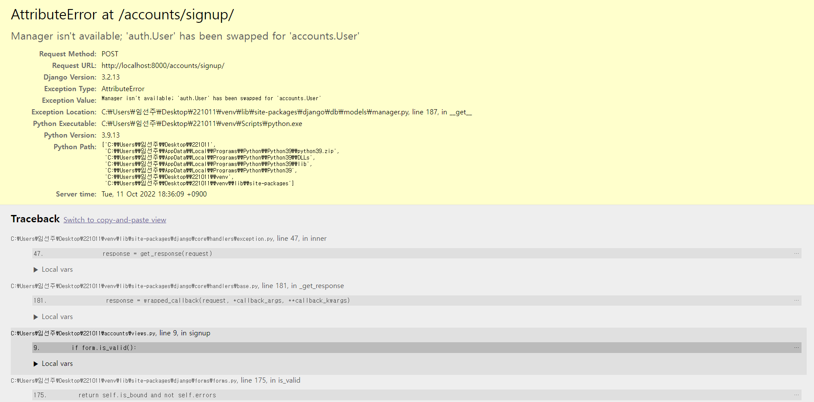

###### 10월 11일

# 🚀 Django Auth

- 참고 문서
  - [Django Auth 기본](https://docs.djangoproject.com/en/4.1/topics/auth/default/)
  - [Django User Model](https://docs.djangoproject.com/en/4.1/ref/contrib/auth/)
  - [Custominzing](https://docs.djangoproject.com/en/4.1/topics/auth/customizing/)
  - 비밀번호 암호화
    - https://docs.djangoproject.com/en/3.2/topics/auth/passwords/
    - https://d2.naver.com/helloworld/318732

### 🪐 Django Auth 개요

- Django authentication system(인증 시스템)은 인증(Authentication)과 권한(Authorization) 부여를 함께 제공(처리)하고 있음
  - User
  - 권한 및 그룹
  - 암호 해시 시스템
  - Form 및 View 도구
  - 기타 적용가능한 시스템
- 필수 구성은 settings.py의 INSTALLED_APPS에서 확인 가능
  - django.contrib.auth

- **Authentication (인증)**
  - 신원 확인
  - 사용자가 자신이 누구인지 확인하는 것
- **Authorization (권한, 허가)**
  - 권한 부여
  - 인증된 사용자가 수행할 수 있는 작업을 결정


### 🪐 사전 설정

- accounts app 생성 및 등록

```bash
$ python manage.py startapp accounts
```

```python
# settings.py

INSTALLED_APPS = [
    'articles',
    'accounts',
    ...
```

> auth와 관련한 경로나 키워드들을 Django 내부적으로 accounts라는 이름으로 사용하고 있기 때문에 되도록 accounts로 지정하는 것을 권장
>
> 다른 이름으로 설정해도 되지만 나중에 추가 설정을 해야 할 일들이 생기게 됨


- url 분리 및 매핑

```python
# accounts/urls.py

from django.urls import path
from . import views

app_name = 'accounts'
urlpatterns = [
    
]
```

```python
# crud/urls.py

urlpatterns = [
    ...,
    path('accounts/', include('accounts.urls')),
]
```


## 🌌 User model 활용하기

### 🪐 Django User Model

- “Custom User Model로 대체하기”
- Django는 기본적인 인증 시스템과 여러 가지 필드가 포함된 User Model을 제공, 대부분의 개발 환경에서 기본 User Model을 Custom User Model로 대체함

- Django는 새 프로젝트를 시작하는 경우 비록 기본 User 모델이 충분 하더라도 커스텀 User 모델을 설정하는 것을 강력하게 권장(highly recommended)
- 커스텀 User 모델은 기본 User 모델과 동일하게 작동 하면서도 필요한 경우 나중에 맞춤 설정할 수 있기 때문
  - 단, User 모델 대체 작업은 프로젝트의 모든 migrations 혹은 첫 migrate를 실행하기 전에 이 작업을 마쳐야 함

- 개발자들이 작성하는 일부 프로젝트에서는 django에서 제공하는 built-in User model의 기본 인증 요구사항이 적절하지 않을 수 있음
  - 예를 들어, 내 서비스에서 회원가입 시 username 대신 email을 식별 값으로 사용하는 것이 더 적합한 사이트인 경우, Django의 User Model은 기본적으로 username를 식별 값으로 사용하기 때문에 적합하지 않음
- Django는 현재 프로젝트에서 사용할 User Model을 결정하는 AUTH_USER_MODEL 설정 값으로 Default User Model을 재정의(override)할 수 있도록 함


### 🪐 AUTH_USER_MODEL

- 프로젝트에서 User를 나타낼 때 사용하는 모델

- 프로젝트가 진행되는 동안 (모델을 만들고 마이그레이션 한 후) 변경할 수 없음

- 프로젝트 시작 시 설정하기 위한 것이며, 참조하는 모델은 첫 번째 마이그레이션에서 사용할 수 있어야 함

  - 즉, 첫번째 마이그레이션 전에 확정 지어야 하는 값

- 다음과 같은 기본 값을 가지고 있음

  ```python
  # settings.py
  
  AUTH_USER_MODEL = 'auth.User'
  ```


#### 🌷 [참고] settings의 로드 구조

- AUTH_USER_MODEL은 settings.py에서 보이지 않는데 어디에 기본 값이 작성되어 있는 걸까?
  - 우리가 작성하는 settings.py는 사실 [global_settings.py](https://github.com/django/django/blob/main/django/conf/global_settings.py)를 상속받아 재정의하는 파일임


### 🪐 대체하기

- AbstractUser를 상속받는 커스텀 User 클래스 작성
- 기존 User 클래스도 [AbstractUser](https://github.com/django/django/blob/main/django/contrib/auth/models.py#L405)를 상속받기 때문에 커스텀 User 클래스도 완전히 같은 모습을 가지게 됨

```python
# accounts/models.py

from django.contrib.auth.models import AbstractUser


class User(AbstractUser):
    pass
```


- Django 프로젝트에서 User를 나타내는데 사용하는 모델을 방금 생성한 커스텀 User 모델로 지정

```python
# settings.py

AUTH_USER_MODEL = 'accounts.User'
```


- admin.py에 커스텀 User 모델을 등록
  - 기본 User 모델이 아니기 때문에 등록하지 않으면 admin site에 출력되지 않음

```python
# accounts/admin.py

from django.contrib import admin
from django.contrib.auth.admin import UserAdmin
from .models import User


admin.site.register(User, UserAdmin)
```


#### 🌷 [참고] User 모델 상속 관계


### 🪐 데이터베이스 초기화(실습용)

- 수업 진행을 위한 데이터베이스 초기화 후 마이그레이션 (프로젝트 중간일 경우)
- migrations 파일 삭제
  - migrations 폴더 및 \__init__.py는 삭제하지 않음
  - 번호가 붙은 파일만 삭제
- db.sqlite3 삭제
- migrations 진행
  - makemigrations
  - migrate


### 🪐 custom User로 변경된 테이블 확인

- 이제 auth_user 테이블이 아니라 accounts_user 테이블을 사용하게 됨


### 🪐 User 객체 활용

- User 객체는 인증 시스템의 가장 기본
- 기본 속성
  - username
  - password
  - email
  - first_name
  - last_name


### 🪐 암호 관리

- 회원은 가입 시 일반적으로 암호(password)를 저장하는 것이 필수적이며, 별도의 처리가 필요
- Django에서는 기본으로 PBKDF2를 (Password-Based Key Derivation Function) 사용하여 저장
  - 단방향 해시함수를 활용하여 비밀번호를 다이제스트로 암호화하며, 이는 복호화가 불가능함
    - 단방향 해시함수는 MD5, SHA-1, SHA-256 등이 존재하며, Django는 SHA256 활용
  - 단방향 해시함수의 경우 레인보우 공격 및 무차별 대입 공격 등의 문제가 발생 가능함
  - 이를 보완하기 위하여 아래의 기법을 추가적으로 활용함
    - 솔팅(Salting) : 패스워드에 임의의 문자열인 salt를 추가하여 다이제스트를 생성
    - 키 스트레칭(Key Stretching) : 해시를 여러 번 반복하여 시간을 늘림


### 🪐 User 객체 활용

- User 생성

  ```python
  user = User.objects.create_user('john‘, ‘john@google.com’, ‘1q2w3e4r!’)
  ```

- User 비밀번호 변경

  ```python
  user = User.objects.get(pk=2)
  User.set_password(‘new password’)
  User.save()
  ```

- User 인증(비밀번호 확인)

  ```python
  from django.contrib.auth import authenticate
  user = authenticate(username='john', password='secret')
  ```


## 🌌 회원 가입

### 🪐 [UserCreationForm](https://github.com/django/django/blob/stable/3.2.x/django/contrib/auth/forms.py#L75)

- 주어진 username과 password로 권한이 없는 새 user를 생성하는 ModelForm
- 3개의 필드를 가짐
  - username (from the user model)
  - password1
  - Password2
- 회원가입 페이지 작성

```python
# accounts/urls.py

app_name = 'accounts'
urlpatterns = [
    ...,
    path('signup/', views.signup, name='signup'),
]
```

```python
# accounts/views.py

from django.contrib.auth.forms import AuthenticationForm, UserCreationForm

def signup(request):
    if request.method == 'POST':
        pass
    else:
        form = UserCreationForm()
    context = {
        'form': form,
    }
    return render(request, 'accounts/signup.html', context)
```

```django
<!-- accounts/signup.html -->




<h1>회원가입</h1>
<form action="" method="POST">
  
  {{ form.as_p }}
  <input type="submit">
</form>

```


- 회원가입 링크 작성 후 페이지 확인

```django
<!-- base.html -->

<div class="container">
  <a href="">Signup</a>
  <hr>
  
  
</div>
```


- 회원가입 로직 작성

```python
# accounts/views.py

def signup(request):
    if request.method == 'POST':
        form = UserCreationForm(request.POST)
        if form.is_valid():
        form.save()
        return redirect('articles:index')
    else:
        form = UserCreationForm()
    context = {
        'form': form,
    }
    return render(request, 'accounts/signup.html', context)
```


- 회원가입 진행 후 에러 페이지를 확인
  - 회원가입에 사용하는 UserCreationForm이 우리가 대체한 커스텀 유저 모델이 아닌 기존 유저 모델로 인해 작성된 클래스이기 때문



```python
class UserCreationForm(forms.ModelForm):
    ...
    
    class Meta:
        model = User
        fields = ("username",)
        field_classes = {"username": UsernameField}
```

> [실제 UserCreationForm 코드](https://github.com/django/django/blob/main/django/contrib/auth/forms.py#L106)


### 🪐 UserCreationForm() 커스텀 하기

- 기존 UserCreationForm을 상속받아 User 모델 재정의

  ```python
  # accounts/forms.py
  
  from django.contrib.auth import get_user_model
  from django.contrib.auth.forms import UserCreationForm
  
  class CustomUserCreationForm(UserCreationForm):
      
      class Meta(UserCreationForm.Meta):
          model = get_user_model()
  ```

  > **get_user_model()**
  >
  > - 현재 프로젝트에서 활성화된 사용자 모델(active user model)을 반환
  > - Django에서는 User 클래스는 커스텀을 통해 변경 가능하여, 직접 참조하는 대신 get_user_model()을 사용할 것을 권장함


- CustomUserCreationForm() 으로 대체하기

  ```python
  # accounts/views.py
  
  from django.contrib.auth.forms import AuthenticationForm, UserCreationForm
  from .forms import CustomUserCreationForm, CustomUserChangeForm
  
  def signup(request):
      if request.method == 'POST':
          form = CustomUserCreationForm(request.POST)
          if form.is_valid():
              form.save()
              return redirect('articles:index')
      else:
          form = CustomUserCreationForm()
      context = {
          'form': form,
      }
      return render(request, 'accounts/signup.html', context)
  ```


- 회원가입 진행 후 테이블 확인

  


#### 🌷 [참고] UserCreationForm의 [save 메서드](https://github.com/django/django/blob/main/django/contrib/auth/forms.py#L139)

- user를 반환하는 것을 확인


