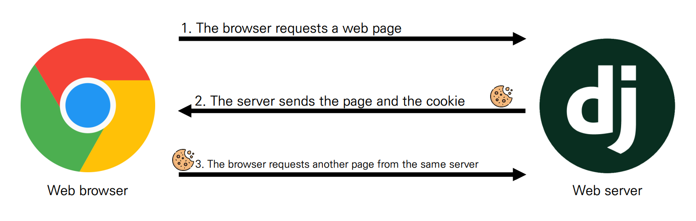
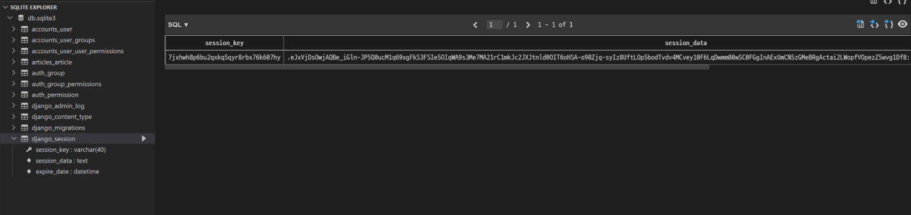
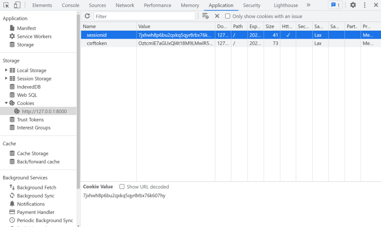
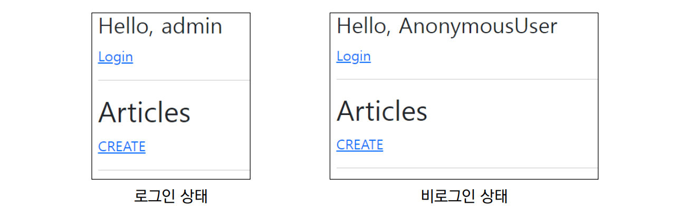
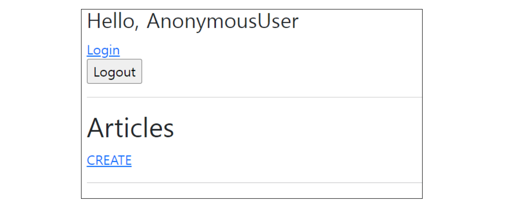

###### 10월 12일

# 🚀 로그인에 대한 이해

### 🪐 HTTP

> Hyper Text Transfer Protocol

- HTML 문서와 같은 리소스들을 가져올 수 있도록 해주는 프로토콜(규칙, 규약)
- 웹(WWW)에서 이루어지는 모든 데이터 교환의 기초
- 클라이언트 - 서버 프로토콜이라고도 부름 


🌛 요청과 응답

- 요청 (requests)
  - 클라이언트(브라우저)에 의해 전송되는 메시지
- 응답 (response)
  - 서버에서 응답으로 전송되는 메시지


🌛 HTTP 특징

- **비연결지향(connectionless)**
  - 서버는 요청에 대한 응답을 보낸 후 연결을 끊음
    - 예를 들어 우리가 네이버 메인 페이지를 보고 있을 때 우리는 네이버 서버와 연결되어 있는 것이 아님
    - 네이버 서버는 우리에게 메인 페이지를 응답하고 연결을 끊은 것
- **무상태(stateless)**
  - 연결을 끊는 순간 클라이언트와 서버 간의 통신이 끝나며 상태 정보가 유지되지 않음
  - 클라이언트와 서버가 주고받는 메시지들은 서로 완전히 독립적


> 🌷 어떻게 로그인 상태를 유지할까?
>
> - 우리가 로그인을 하고 웹 사이트를 사용할 때 페이지를 이동해도 로그인 “상태”가 유지됨
> - 서버와 클라이언트 간 지속적인 상태 유지를 위해 “**쿠키와 세션**”이 존재


### 🪐 쿠키(Cookie)

🌛 개념

- 서버가 사용자의 웹 브라우저(클라이언트)에 전송하는 작은 데이터 조각
  - 브라우저(클라이언트)는 쿠키를 로컬에 KEY-VALUE의 데이터 형식으로 저장
  - 동일한 서버에 재요청 시 저장된 쿠키를 함께 전송
- 쿠키는 서로 다른 요청이 동일한 브라우저로부터 발생한 것인지 판단할 때 주로 사용됨
  - 상태가 없는(stateless) HTTP에서 상태 정보를 관리, 사용자는 로그인 상태를 유지할 수 있음


🌛 쿠키 사용 예시




🌛 쿠키 사용 목적

- 세션 관리 (Session management)
  - 로그인, 아이디 자동완성, 공지 하루 안 보기, 팝업 체크, 장바구니 등의 정보 관리
- 개인화 (Personalization)
  - 사용자 선호, 테마 등의 설정
- 트래킹 (Tracking)
  - 사용자 행동을 기록 및 분석


🌛 세션 (Session)

- 사이트와 특정 브라우저 사이의 state(상태) 를 유지시키는 것
- 클라이언트가 서버에 접속하면 서버가 특정 `session id`를 발급하고, 클라이언트는 `session id`를 쿠키에 저장
  - 클라이언트가 다시 동일한 서버에 접속하면 요청과 함께 쿠키(`session id`가 저장된)를 서버에 전달
  - 쿠키는 요청 때마다 서버에 함께 전송 되므로 서버에서 `session id`를 확인해 알맞은 로직을 처리
- `session id`는 세션을 구별하기 위해 필요하며, 쿠키에는 `session id`만 저장


🌛 쿠키 Lifetime (수명)

- Session cookie
  - 현재 세션(current session)이 종료되면 삭제됨
  - 브라우저 종료와 함께 세션이 삭제됨
- Persistent cookies
  - Expires 속성에 지정된 날짜 혹은 Max-Age 속성에 지정된 기간이 지나면 삭제됨


🌛 Session in Django

- Django는 database-backed sessions 저장 방식을 기본 값으로 사용
  - session 정보는 Django DB의 django_session 테이블에 저장
  - [설정을 통해 다른 저장방식으로 변경 가능](https://docs.djangoproject.com/en/3.2/topics/http/sessions/)
- Django는 특정 session id를 포함하는 쿠키를 사용해서 각각의 브라우저와 사이트가 연결된 session을 확인함


## 🌌 Login

## 🪐 [AuthenticationForm](https://docs.djangoproject.com/en/4.1/topics/auth/default/#django.contrib.auth.forms.AuthenticationForm)

> 로그인을 위한 built-in form
>
> - 로그인 하고자 하는 사용자 정보를 입력 받음(username, password)
> - ModelForm이 아닌 일반 Form을 상속 받고 있으며, request를 첫번째 인자로 취함


##### accounts / urls.py

```python
# accounts/urls.py

from django.urls import path
from . import views


app_name = 'accounts'
urlpatterns = [
    path('login/', views.login, name='login'),
]
```


##### accounts / views.py

```python
# accounts/views.py

from django.contrib.auth.forms import AuthenticationForm


def login(request):
    if request.method == 'POST':
        pass
    else:
        form = AuthenticationForm()
    context = {
        'form': form
    }
    return render(request, 'accounts/login.html', context)
```


##### accounts / login.html

```django
<!-- accounts/login.html -->




  <h1>로그인</h1>
  <form action="" method="POST">
    
    {{ form.as_p }}
    <input type="submit">
  </form>

```


🌛 [login()](https://docs.djangoproject.com/en/3.2/topics/auth/default/#how-to-log-a-user-in)

- `login(request, user, backend=None)`
- 인증된 사용자를 로그인
  - 유저의 ID를 세션에 저장하여 세션을 기록
- HttpRequest 객체와 User 객체가 필요
  - 유저 정보는 반드시 인증된 유저 정보여야 함
    - authenticate()함수를 활용한 인증
    - AuthenticationForm을 활용한 is_valid


🪐 로그인 로직 작성

- 일반적인 ModelForm 기반의 Create 로직과 동일하지만,
  - ModelForm이 아닌 Form으로 필수 인자 구성이 다름
  - DB에 저장하는 것 대신 세션에 유저를 기록하는 함수 호출함
    - View 함수와 이름이 동일하여 변경하여 호출
    - 로그인 URL이 ‘/accounts/login/’에서 변경되는 경우 settings.py LOGIN_URL을 변경하여야 함

```python
from django.contrib.auth import login as auth_login

def login(request):
    if request.method == 'POST':
        form = AuthenticationForm(request, data=request.POST)
        if form.is_valid():
            auth_login(request, form.get_user())
            return redirect('articles:index')
    else:
        form = AuthenticationForm()
    context = {
        'form': form
    }
    return render(request, 'accounts/login.html', context)
```


🌛 [get_user()](https://github.com/django/django/blob/main/django/contrib/auth/forms.py#L244)

- AuthenticationForm의 인스턴스 메서드
- 유효성 검사를 통과했을 경우 로그인한 사용자 객체를 반환


🪐 세션 데이터 확인하기

- 로그인 후 개발자 도구와 DB에서 django로부터 발급받은 세션 확인 (로그인은 관리자 계정을 만든 후 진행)
- django_session 테이블에서 확인




🪐 세션 데이터 확인하기

- 브라우저에서 확인
  - 개발자도구 – Application - Cookies




🪐 로그인 링크 작성

- 실습 편의를 위해 base 템플릿에 로그인 페이지로 이동할 수 있는 하이퍼 링크 작성

```django
<!-- base.html -->

<body>
  <div class="container">
    <a href="">Login</a>
    <hr>
    
    
  </div>
  ...
</body>
</html>
```


## 🌌 Authentication with User

🪐 현재 로그인 되어있는 유저 정보 출력하기

- 템플릿에서 인증 관련 데이터를 출력하는 방법

```django
<!-- base.html -->
<body>
  <div class="container">
    <h3>Hello, {{ user }}</h3>
    <a href="">Login</a>
    <hr>
    
    
  </div>
  ...
</body>
</html>
```

> 🌷 어떻게 base 템플릿에서 context 데이터 없이 user 변수를 사용할 수 있는 걸까?
>
> - settings.py의 context processors 설정의 ‘django.contrib.auth.context_processors.auth’


🪐 [context processors](https://docs.djangoproject.com/en/3.2/ref/templates/api/#built-in-template-context-processors)

- 템플릿이 렌더링 될 때 호출 가능한 컨텍스트 데이터 목록
- 작성된 컨텍스트 데이터는 기본적으로 템플릿에서 사용 가능한 변수로 포함됨
- 즉, django에서 자주 사용하는 데이터 목록을 미리 템플릿에 로드 해 둔 것

```python
# settings.py

TEMPLATES = [
    {
        ...
        'OPTIONS': {
            'context_processors': [
                'django.template.context_processors.debug',
                'django.template.context_processors.request',
                'django.contrib.auth.context_processors.auth',
                'django.contrib.messages.context_processors.messages',
            ],
        },
    },
]
```


🌛 django.contrib.auth.context_processors.auth

- 템플릿 변수 {{ user }}
  - 클라이언트가 로그인한 경우 User 클래스의 인스턴스
  - 클라이언트가 로그인하지 않은 경우 AnonymousUser 클래스의 인스턴스




## 🌌 Logout

🌛 [logout()](https://docs.djangoproject.com/en/3.2/topics/auth/default/#how-to-log-a-user-out)

- logout(request)
- 요청 유저에 대한 세션 정보를 삭제함
  - DB에서 session data 삭제
  - 클라이언트의 쿠키에서 sessionid 삭제
- HttpRequest 객체를 인자로 받고 반환 값이 없음
- 사용자가 로그인하지 않은 경우 오류를 발생시키지 않음


##### accounts / urls.py

```python
# accounts/urls.py

from django.urls import path
from . import views


app_name = 'accounts'

urlpatterns = [
    path('login/', views.login, name='login'),
    path('logout/', views.logout, name='logout'),
]
```


##### accounts / views.py

```python
# accounts/views.py

from django.contrib.auth import logout as auth_logout


def logout(request):
    auth_logout(request)
    return redirect('articles:index')
```


##### base.html

```django
<!-- base.html -->

<body>
  <div class="container">
    <h3>Hello, {{ user }}</h3>
    <a href="">Login</a>
    <form action="" method="POST">
      
      <input type="submit" value="Logout">
    </form>
    <hr>
    
    
  </div>
</body>
```


🪐 로그아웃 출력 확인 및 테스트




## 🌌 Limiting access to logged-in users

🪐 개요

- 로그인 사용자에 대한 접근 제한하기
- 로그인 사용자에 대해 접근을 제한하는 2가지 방법
  - is_authenticated attribute를 활용한 조건문
  - The login_required decorator를 활용한 view 제한


##### 🌛 **is_authenticated**

- User model의 속성(attributes) 중 하나
- 사용자가 인증 되었는지 여부를 알 수 있는 방법
- 모든 User 인스턴스에 대해 항상 True인 읽기 전용 속성
  - AnonymousUser에 대해서는 항상 False
- 일반적으로 request.user에서 이 속성을 사용 (request.user.is_authenticated)
- 권한(permission)과는 관련이 없으며, 사용자가 활성화 상태(active)이거나 유효한 세션(valid session)을 가지고 있는지도 확인하지 않음


🌷 [참고] [is_authenticated 코드 살펴보기](https://github.com/django/django/blob/main/django/contrib/auth/base_user.py#L56)

```python
class AbstractBaseUser(models.Model):
    ...
    def is_authenticated(self):
        """
        Always return True. This is a way to tell if the user has been
        authenticated in templates.
        """
        return True
```


🪐 is_authenticated 적용하기

- 로그인과 비로그인 상태에서 출력되는 링크를 다르게 설정하기

```django
<!-- base.html -->


  <h3>Hello, {{ user }}</h3>
  <form action="" method="POST">
    
    <input type="submit" value="Logout">
  </form>
  <a href="">회원정보수정</a>
  <form action="" method="POST">
    
    <input type="submit" value="회원탈퇴">
  </form>

  <a href="">Login</a>
  <a href="">Signup</a>

```


- 인증된 사용자만 게시글 작성 링크를 볼 수 있도록 처리하기

  - URL을 직접 입력하면 게시글 작성 페이지로 갈 수 있음 ➡ View에서의 처리도 반드시 필요함


```django
<!-- articles/index.html -->




  <h1>Articles</h1>
  
    <a href="">CREATE</a>
  
    <a href="">새 글을 작성하려면 로그인하세요</a>
  
  ...

```


- 인증된 사용자라면 로그인 로직을 수행할 수 없도록 처리

```python
# accounts/views.py

def login(request):
    if request.user.is_authenticated:
        return redirect('articles:index')
    ...
```


##### 🌛 login_required

- login_required decorator
  - 사용자가 로그인 되어 있으면 정상적으로 view 함수를 실행
  - 로그인 하지 않은 사용자의 경우 settings.py의 LOGIN_URL 문자열 주소로 redirect
    - [참고] LOGIN_URL의 기본 값은 /accounts/login/


- 로그인 상태에서만 글을 작성/수정/삭제 할 수 있도록 변경

```python
# accounts/views.py

from django.contrib.auth.decorators import login_required

@login_required
def create(request):
    pass

@login_required
def delete(request, pk):
    pass

@login_required
def update(request, pk):
    pass
```


🪐 login_required 적용 확인하기

- /articles/create/로 브라우저에 직접 요청
- 로그인 페이지로 리다이렉트 및 URL 확인
  - 인증 성공 시 사용자가 redirect 되어야하는 경로는 "next"라는 쿼리 문자열 매개 변수에 저장됨
    - 예시) /accounts/login/?next=/articles/create/


🌛 "next" query string parameter 대응

```python
# accounts/views.py

def login(request):
    if request.user.is_authenticated:
        return redirect('articles:index')

    if request.method == 'POST':
        form = AuthenticationForm(request, request.POST)
        if form.is_valid():
            auth_login(request, form.get_user())
            return redirect(request.GET.get('next') or 'articles:index')
...
```


🌛 "next" query string parameter 주의사항

- 만약 login 템플릿에서 form action이 작성되어 있다면 동작하지 않음
- 해당 action 주소 next 파라미터가 작성 되어있는 현재 url이 아닌 /accounts/login/ 으로 요청을 보내기 때문

```django
<!-- accounts/login.html -->


<h1>로그인</h1>
<form action="" method="POST">
  
  {{ form.as_p }}
  <input type="submit">
</form>

```

> \<form action="" method="POST">
>
> - action이 비어 있어야 한다!

