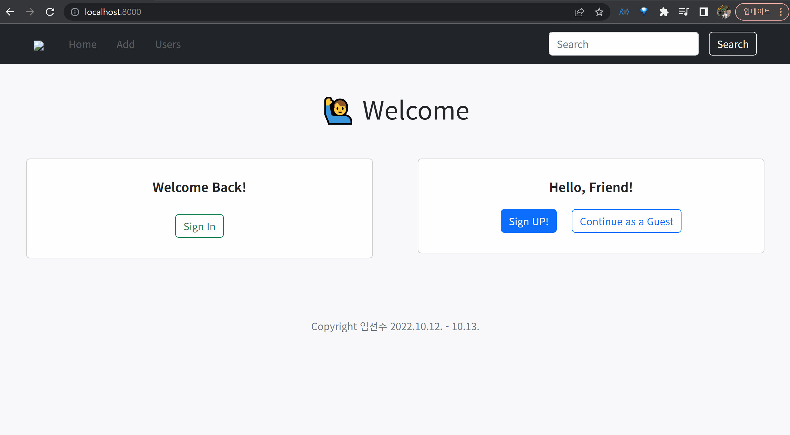

# 🚀 회원 관리가 가능한 게시글 커뮤니티 CRUD

## 프로젝트 기간

2022.10.12 - 10.13.

## 프로젝트 목적

Django Auth를 활용한 회원 관리가 가능한 게시판 서비스 개발

## 프로젝트 설명

### 모델 Model

------

- 모델 이름 : Review

  - 모델 필드

  | 이름       | 역할           | 필드     | 속성              |
  | ---------- | -------------- | -------- | ----------------- |
  | title      | 리뷰 제목      | Char     | max_length=80     |
  | content    | 리뷰 내용      | Text     |                   |
  | created_at | 할 일 생성시간 | DateTime | auto_now_add=True |
  | updated_at | 할 일 수정시간 | DateTime | auto_now = True   |

- 모델 이름 : User
  - Django **AbstractUser** 모델 상속

### **폼 Form**

---

- 회원가입
  - Django 내장 회원가입 폼 UserCreationForm을 상속 받아서 **CustomUserCreationForm** 작성&활용
  - 해당 폼은 아래 필드만 출력
    - username
    - password1
    - password2

- 로그인
  - Django 내장 로그인 폼 **AuthenticationForm 활용 @**

- 회원 정보 수정
  - Django 내장 폼 UserChangeForm을 상속 받아서 **CustomUserChangeForm** 작성&활용
  - 해당 폼은 아래 필드만 출력
    - first_name
    - last_name
    - email

### 기능 View

------

- 게시글 목록 보기
- 게시글 내용 보기
- 게시글 작성하기
- 게시글 수정하기
- 게시글 삭제하기
- 회원가입
  - CustomUserCreationForm 활용
- 회원 목록 조회
- 회원 정보 조회
- 로그인
  - **AuthenticationForm** 활용
- 로그아웃
- 회원 정보 수정
  - **CustomUserChangeForm** 활용

### 화면 Template

------

- 네비게이션바, Bootstrap \<nav>

  - 로그인 상태에 따라 다른 화면 출력
    1. 로그인 상태
       - 로그인 한 사용자의 username 출력
         - username을 클릭하면 회원 조회 페이지로 이동
       - 로그아웃 버튼
    2. 비 로그인 상태
       - guest로 표시
    3. 메인 페이지에서
       - 로그인 전 또는 guest로 계속하기 전에는 메뉴 disabled

- 메인 페이지

  - 로그인 버튼
  - 회원가입 버튼
  - guest로 계속하기 버튼

- 로그인 페이지

  - 로그인 폼

- 회원가입 페이지

  - 회원가입 폼

- 게시글 목록 페이지 index

  - 게시글 ID / 게시글 제목 / 게시글 작성 일자
    - 게시글 제목 클릭 시 해당 게시글의 detail 페이지로 이동
  - 작성 버튼
    - 버튼 클릭 시 new 페이지로 이동

- 게시글 보기 페이지 detail

  - 게시글 제목 / 게시글 내용 / 게시글 작성 시간
  - 수정 버튼
    - 버튼 클릭 시 edit 페이지로 이동
  - 뒤로가기 버튼
  - 삭제 버튼
    - 버튼 클릭 시 게시글 삭제 delete

- 게시글 작성 페이지 new

  - 게시글 제목 / 게시글 내용
  - 생성 버튼
    - 버튼 클릭 시 새로운 게시글 생성 create
  - 뒤로가기 버튼

- 게시글 수정 페이지 edit

  - 작성 폼에 원본 게시글의 제목과 내용이 작성된 상태
  - 수정 버튼
    - 버튼 클릭 시 해당 게시글 데이터 수정 update
  - 뒤로가기 버튼

- 회원 목록 페이지

  - 회원 목록 출력
  - 회원 아이디를 클릭하면 해당 회원 조회 페이지로 이동

- 회원 조회 페이지 (프로필 페이지)

  1. 로그인 후 본인 페이지에서
     - 회원 정보 출력
     - 회원 정보 수정 페이지 이동 버튼
     - 뒤로가기 버튼
  2. 로그인 후 다른 회원 페이지에서, 또는 guest로
     - 회원 정보 출력
     - 뒤로가기 버튼

- 회원 정보 수정 페이지

  - 회원 정보 수정 폼에 원래 정보가 작성된 상태
  - 수정 버튼
    - 버튼 클릭 시 해당 회원 데이터 수정 update
  - 비밀번호 변경 버튼
  - 계정 삭제 버튼
    - 버튼 클릭 시 계정 삭제 delete

- 비밀번호 변경 페이지

  - 비밀번호 변경 폼
  - 저장 버튼

  

## 사용 기술

- 언어: `HTML`, `CSS`,`Python`
- 라이브러리: X
- 프레임워크: Django

## 느낀점

> Django가 재미있다!

며칠간 늦은 시간까지 원하는 기능들을 만들어보며 Django의 재미를 느낄 수 있었다.

아직은 잘 못해도 꾸준함을 통해 매일 성장하고 있음을 느낀다.

처음엔 이해가 되지 않았던 것들도 반복해서 연습하다보니 자연스레 습득되고 있다.

## 개선사항

- Navbar에 로고를 Static 이미지로 넣으려 했으나 왜인지 작동하지 않음

- Guest 모드로 Profile 페이지에 들어가면 로그인 했을 때만 나타나야 할 `Hello, <User>`와 `Sign Out`이 Navbar에 나타남
  - 회원 목록 페이지와 동일하게 `base.html`을 extends하여 사용하는데 왜 다른 결과가 나타날까?
- `accounts/detail.html`에 문제
  - Navbar의 username을 클릭하면 My Profile로 이동해야 하는데 detail 페이지에서만 작동하지 않음

