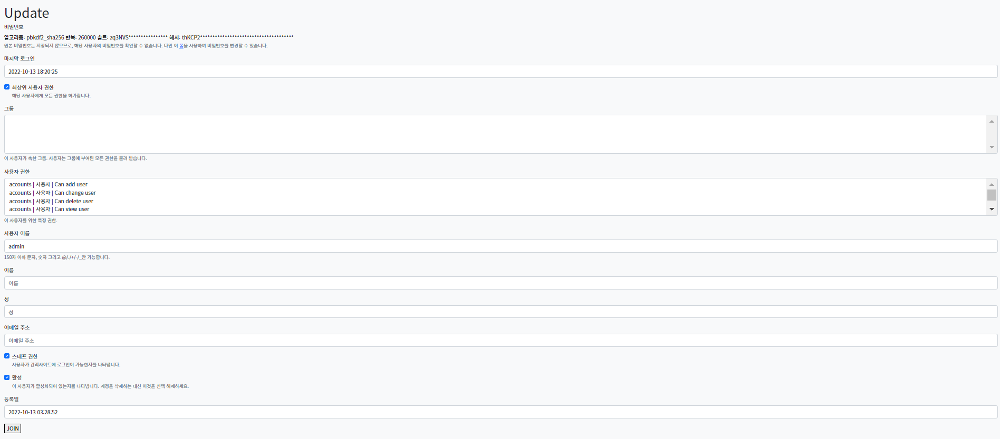
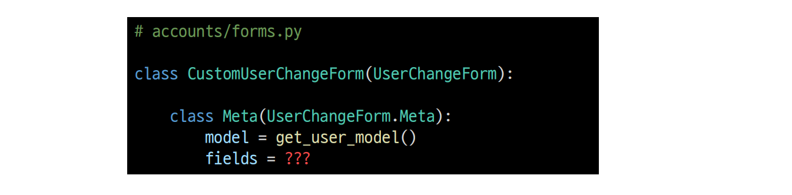
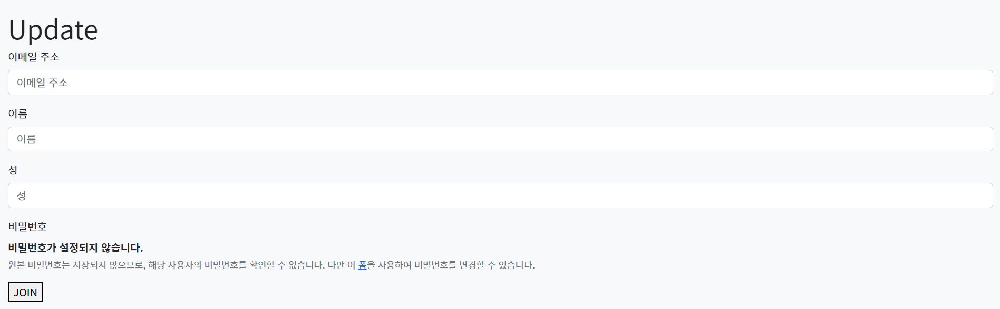
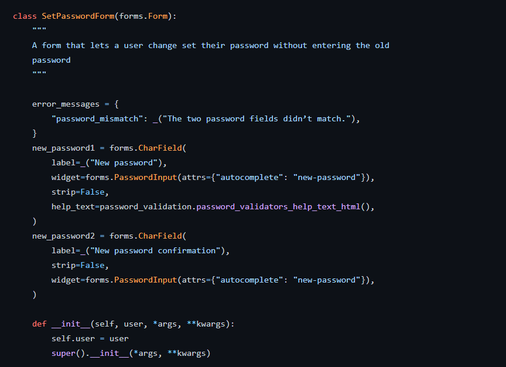

###### 10월 13일

## 🌌 회원정보 수정

### 🪐 UserChangeForm

- 사용자의 정보 및 권한을 변경하기 위해 admin 인터페이스에서 사용되는 ModelForm
- UserChangeForm 또한 ModelForm이기 때문에 instance 인자로 기존 user 데이터 정보를 받는 구조 또한 동일함
- 이미 이전에 CustomUserChangeForm으로 확장했기 때문에 CustomUserChangeForm을 사용하기


- UserChangeForm 역시 ModelForm으로 구성되어 있어, User 모델 정보를 변경하여 활용해야 함

```python
# accounts/forms.py

from django.contrib.auth import get_user_model
from django.contrib.auth.forms import UserChangeForm

class CustomUserChangeForm(UserChangeForm):
    
    class Meta(UserChangeForm.Meta):
        model = get_user_model()
```


##### accounts / urls.py

```python
# accounts/urls.py

app_name = 'accounts'
urlpatterns = [
    ...,
    path('update/', views.update, name='update'),
]
```


##### accounts / views.py

```python
# accounts/views.py

def update(request):
    if request.method == 'POST':
        pass
    else:
        form = CustomUserChangeForm(instance=request.user)
    context = {
        'form': form,
    }
    return render(request, 'accounts/update.html', context)
```


##### accounts / update.html

```django
<!-- accounts/update.html -->




<h1>회원정보수정</h1>
<form action="" method="POST">
  
  {{ form.as_p }}
  <input type="submit">
</form>

```


- 회원정보 수정 페이지 링크 작성

```django
<!-- base.html -->

<div class="container">
  <a href="">Signup</a>
  <a href="">회원정보 수정</a>
  <hr>
  
  
</div>
```





### 🪐 CustomUserChangeForm fields 재정의

- UserChangeForm은 실제 관리자 화면에서 활용 중인 form으로 세부 필드들이 모두 노출되는 것을 확인할 수 있음
- 직접 fields를 정의하여 원하는 형식으로 활용 가능함


- User 모델의 fields명은 어떻게 알 수 있을까?

  


🌛 User model 상속 구조 살펴보기

- UserChangeForm 클래스 구조 확인
  - Meta 클래스를 보면 User라는 model을 참조하는 ModelForm이라는 것을 확인할 수 있음
  - https://github.com/django/django/blob/main/django/contrib/auth/forms.py#L147
- User 클래스 구조 확인
  - 실제로 User 클래스는 Meta 클래스를 제외한 코드가 없고 AbstractUser 클래스를 상속 받고있음
  - https://github.com/django/django/blob/main/django/contrib/auth/models.py#L405
- AbstractUser 클래스 구조 확인
  - 클래스 변수명들을 확인해보면 회원수정 페이지에서 봤던 필드들과 일치한다는 것을 확인할 수 있음
  - https://github.com/django/django/blob/main/django/contrib/auth/models.py#L334
- 마지막으로 공식문서의 User 모델 Fields 확인
  - https://docs.djangoproject.com/en/3.2/ref/contrib/auth/#user-model


- 수정하고자 하는 필드 작성 후 출력 변화 확인

```python
# accounts/forms.py
class CustomUserChangeForm(UserChangeForm):
    
    class Meta(UserChangeForm.Meta):
        model = get_user_model()
        fields = ('email', 'first_name', 'last_name',)
```





##### 회원정보 수정 로직 작성 (accounts / views.py)

- 작성 후 실제 회원정보가 수정되었는지 확인

```python
# accounts/views.py

def update(request):
    if request.method == 'POST':
        form = CustomUserChangeForm(request.POST, instance=request.user)
        # form = CustomUserChangeForm(data=request.POST, instance=request.user)
        if form.is_valid():
            form.save()
            return redirect('articles:index')
        else:
            form = CustomUserChangeForm(instance=request.user)
        context = {
            'form': form,
        }
        return render(request, 'accounts/update.html', context)
```


## 🌌 비밀번호 변경

### 🪐 PasswordChangeForm

- 사용자가 비밀번호를 변경할 수 있도록 하는 Form
- 이전 비밀번호를 입력하여 비밀번호를 변경할 수 있도록 함
- 이전 비밀번호를 입력하지 않고 비밀번호를 설정할 수 있는 SetPasswordForm을 상속받는 서브 클래스


- 회원정보 수정 페이지에서 비밀번호 변경 form 주소를 확인해보기

  - /accounts/password/

  


- 비밀번호 변경 페이지 작성

##### accounts / urls.py

```python
# accounts/urls.py

app_name = 'accounts'
urlpatterns = [
    ...,
    path('password/', views.change_password, name='change_password'),
]
```


##### accounts / views.py

```python
# accounts/views.py

from django.contrib.auth.forms import AuthenticationForm, PasswordChangeForm

def change_password(request):
    if request.method == 'POST':
        pass
    else:
        form = PasswordChangeForm(request.user)
    context = {
        'form': form,
    }
    return render(request, 'accounts/change_password.html', context)
```


##### accounts / change_password.html

```django
<!-- accounts/change_password.html -->




<h1>비밀번호 변경</h1>
<form action="" method="POST">
  
  {{ form.as_p }}
  <input type="submit">
</form>

```


🌛 [참고] [SetPasswordForm](https://github.com/django/django/blob/main/django/contrib/auth/forms.py#L353) 살펴보기

- PasswordChangeForm은 SetPasswordForm의 하위 클래스이기 때문에 SetPasswordForm을 확인




##### 비밀번호 변경 로직 작성 (accounts / views.py)

- 작성 후 비밀번호 변경 확인
  - 변경 후 로그인 상태가 지속되지 못하는 문제 발생

```python
# accounts/views.py

def change_password(request):
    if request.method == 'POST':
        form = PasswordChangeForm(request.user, request.POST)
        # form = PasswordChangeForm(user=request.user, data=request.POST)
        if form.is_valid():
            form.save()
            return redirect('articles:index')
        else:
            form = PasswordChangeForm(request.user)
        context = {
            'form': form,
        }
        return render(request, 'accounts/change_password.html', context)
```


## 🌌 추가 자료

### 🪐 AbstractBaseUser의 모든 subclass와 호환되는 forms

- forms.ModelForm 상속
  - UserCreationForm
  - UserChangeForm
- forms.Form 상속
  - AuthenticationForm
  - SetPasswordForm
  - PasswordChangeForm
  - AdminPasswordChangeForm


### 🪐 [참고1] 회원가입 이후 로그인

- 회원가입 후 곧바로 로그인 진행

```python
# accounts/views.py

def signup(request):
    if request.method == 'POST':
        form = CustomUserCreationForm(request.POST)
        if form.is_valid():
            # 회원가입 후 곧바로 로그인 진행
            user = form.save()
            auth_login(request, user)
            return redirect('articles:index')
        else:
            form = CustomUserCreationForm()
        context = {'form': form,}
        return render(request, 'accounts/signup.html', context)
```


### 🪐 [참고2] 암호 변경 시 세션 무효화 방지하기

- 비밀번호가 변경되면 기존 세션과의 회원 인증 정보가 일치하지 않게 되어 버려 로그인 상태가 유지되지 못함
- 비밀번호는 잘 변경되었으나 비밀번호가 변경되면서 기존 세션과의 회원 인증 정보가 일치하지 않기 때문
- **update_session_auth_hash(request, user)**
  - 현재 요청(current request)과 새 session data가 파생될 업데이트 된 사용자 객체를 가져오고, session data를 적절하게 업데이트해줌
  - 암호가 변경되어도 로그아웃 되지 않도록 새로운 password의 session data로 session을 업데이트


```python
from django.contrib.auth import update_session_auth_hash

def change_password(request):
    if request.method == 'POST':
        form = PasswordChangeForm(request.user, request.POST)
        # form = PasswordChangeForm(user=request.user, data=request.POST)
        if form.is_valid():
            form.save()
            # 암호 변경 시 세션 무효화 방지
            update_session_auth_hash(request, form.user)
            return redirect('articles:index')
        else:
            form = PasswordChangeForm(request.user)
        context = {
            'form': form,
        }
        return render(request, 'accounts/change_password.html', context)
```


### 🪐 [참고3] 탈퇴하면서 해당 유저의 세션 정보도 함께 지우고 싶을 경우

- "탈퇴(1) 후 로그아웃(2)"의 순서가 바뀌면 안됨
  - 먼저 로그아웃해 버리면 해당 요청 객체 정보가 없어지기 때문에 탈퇴에 필요한 정보 또한 없어지기 때문

```python
# accounts/views.py

def delete(request):
    # 선 탈퇴
    request.user.delete()
    # 후 로그아웃
    auth_logout(request)
```

