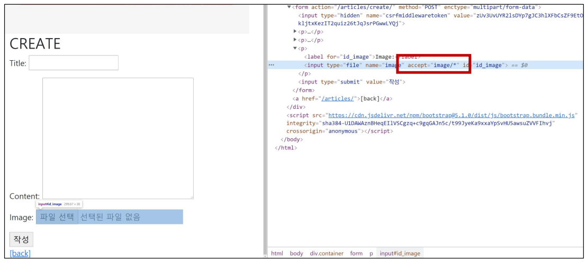
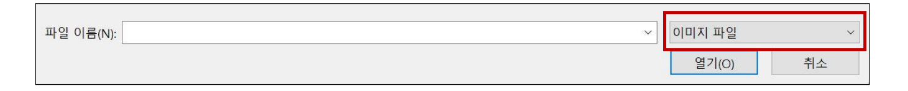
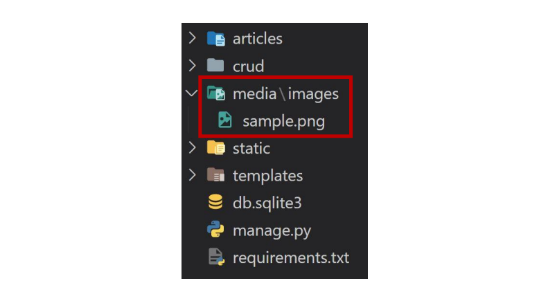
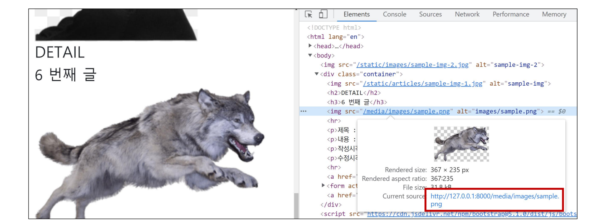

###### 10월 17일

# 🚀 이미지 업로드

## 🌌 기본 설정

### 🪐 미디어 파일

- 사용자가 웹에서 업로드하는 정적 파일 (user-uploaded)
- 유저가 업로드 한 모든 정적 파일


### 🪐 Media 관련 필드

🌏 [ImageField](https://docs.djangoproject.com/en/3.1/ref/models/fields/#django.db.models.ImageField)

- 이미지 업로드에 사용하는 모델 필드
- FileField를 상속받는 서브 클래스이기 때문에 FileField의 모든 속성 및 메서드를 사용 가능하며 더해서 사용자에 의해 업로드 된 객체가 유효한 이미지인지 검사함
- ImageField 인스턴스는 최대 길이가 100자인 문자열로 DB에 생성되며, max_length 인자를 사용하여 최대 길이를 변경 할 수 있음
- [주의] 사용하려면 반드시 [Pillow](https://pillow.readthedocs.io/en/latest/) 라이브러리가 필요


🌏 [FileField](https://docs.djangoproject.com/en/3.1/ref/models/fields/#filefield)

- 파일 업로드에 사용하는 모델 필드
- 2개의 선택 인자를 가지고 있음
- upload_to
- storage


### 🪐 모델 설정

- **`upload_to`** argument

  - 문자열 경로 지정 방식

  ```python
  # models.py
  
  class MyModel(models.Model):
      # MEDIA_ROOT/uploads/ 경로로 파일 업로드
      upload = models.FileField(upload_to='uploads/')
      # or
      # MEDIA_ROOT/uploads/2022/10/17 경로로 파일 업로드
      upload = models.FileField(upload_to='uploads/%Y/%m/%d/')
  ```

  - 함수 호출

  ```python
  # models.py
  
  def articles_image_path(instance, filename):
      # MEDIA_ROOT/user_<pk>/ 경로로 <filename> 이름으로 업로드
      return f'user_{instance.user.pk}/{filename}'
  
  class Article(models.Model):
      image = models.ImageField(upload_to=articles_image_path)
  ```


### 🪐 [URL 설정](https://docs.djangoproject.com/en/3.1/ref/models/fields/#django.db.models.FileField.storage)

- settings.py에 MEDIA_ROOT, MEDIA_URL 설정

- upload_to 속성을 정의하여 업로드 된 파일에 사용 할 MEDIA_ROOT의 하위 경로를 지정

- 업로드 된 파일의 경로는 django가 제공하는 ‘url’ 속성을 통해 얻을 수 있음

  ```django
  
  ```


🌏 [MEDIA_ROOT](https://docs.djangoproject.com/en/3.2/ref/settings/#media-root)

- 사용자가 업로드한 파일(미디어 파일)들을 보관할 디렉토리의 절대 경로
- django는 성능을 위해 업로드 파일은 데이터베이스에 저장하지 않음
  - 실제 데이터베이스에 저장되는 것은 파일의 경로

```python
# settings.py

MEDIA_ROOT = BASE_DIR / 'media'
```


🌏 MEDIA_URL

- MEDIA_ROOT에서 제공되는 미디어를 처리하는 URL
- 업로드 된 파일의 주소(URL)를 만들어 주는 역할
  - 웹 서버 사용자가 사용하는 public URL
- 비어 있지 않은 값으로 설정 한다면 반드시 slash(/)로 끝나야 함

```python
# settings.py

MEDIA_URL = '/media/'
```


- 개발 단계에서 사용자가 업로드 한 파일 제공하기

```python
# crud/urls.py

from django.contrib import admin
from django.urls import pahth, include
from django.conf import settings
from django.conf.urls.static import static

urlpatterns = [
    path('admin/', admin.site.urls),
    path('articles/', include('articles.urls')),
] + static(settings.MEDIA_URL, document_root=settings.MEDIA_ROOT)

# 업로드 된 파일의 URL == settings.MEDIA_URL
# 위 URL을 통해 참조하는 파일의 실제 위치 == settings.MEDIA_ROOT
```

> 사용자가 업로드 한 파일이 우리 프로젝트에 업로드 되지만, 실제로 사용자에게 제공하기 위해서는 업로드 된 파일의 URL이 필요함


## 🌌 CREATE

### 🪐 모델 설정

🌏 ImageField 

- upload_to=‘images/’
  - 실제 이미지가 저장되는 경로를 지정
- blank=True
  - 이미지 필드에 빈 값(빈 문자열)이 허용되도록 설정 (이미지를 선택적으로 업로드 할 수 있도록) 

```python
# articles/models.py

class Article(models.Model):
    title = models.CharField(max_length=20)
    content = models.TextField()
    # saved to 'MEDIA_ROOT/images'
    image = models.ImageField(upload_to='images/', blank=True)
    created_at = models.DateTimeField(auto_now_add=True)
    updated_at = models.DateTimeField(auto_now=True)
```


🌏 Model field option – “[blank](https://docs.djangoproject.com/en/3.1/ref/models/fields/#blank)”

- 기본 값 : False
- True인 경우 필드를 비워 둘 수 있음
  - DB에는 ‘’(빈 문자열)이 저장됨
- 유효성 검사에서 사용 됨 (is_valid)
  - 필드에 blank=True가 있으면 form 유효성 검사에서 빈 값을 입력할 수 있음


🌏 Model field option – “[null](https://docs.djangoproject.com/en/3.1/ref/models/fields/#null)”

- 기본 값 : False
- True면 django는 빈 값을 DB에 NULL로 저장
- 주의 사항
  - CharField, TextField와 같은 문자열 기반 필드에는 사용하는 것을 피해야 함
  - 문자열 기반 필드에 True로 설정 시 ‘데이터 없음(no data)’에 “빈 문자열(1)”과 “NULL(2)”의 2가지 가능한 값이 있음을 의미하게 됨 
  - 대부분의 경우 "데이터 없음"에 대해 두 개의 가능한 값을 갖는 것은 중복되며, Django는 NULL이 아닌 빈 문자열을 사용하는 것이 규칙


🌛 blank & null 비교

- blank
  - Validation-related
- null
  - Database-related

> 문자열 기반 및 비문자열 기반 필드 모두에 대해 null option은 DB에만 영향을 미치므로, form에서 빈 값을 허용하려면 blank=True를 설정해야 함


🌏 마이그레이션 실행

> ImageField를 사용하기 위해서는 Pillow 라이브러리 설치 필요

```bash
$ pip install Pillow

$ python manage.py makemigrations
$ python manage.py migrate

$ pip freeze > requirements.txt
```


### 🪐 HTML 설정

- 게시글 작성 form enctype 속성 지정

```django
<!-- articles/create.html -->

<form action="" method="POST" enctype="multipart/form-data">
  
  {{ article_form.as_p }}
  <input type="submit" value="작성">
</form>
```


🌏 form 요소 - [enctype](https://developer.mozilla.org/ko/docs/Web/HTML/Element/form#attr-enctype)(인코딩) 속성

- multipart/form-data
  - 파일/이미지 업로드 시에 반드시 사용해야 함 (전송되는 데이터의 형식을 지정)
  - \<input type="file">을 사용할 경우에 사용
- application/x-www-form-urlencoded
  - (기본값) 모든 문자 인코딩
- text/plain
  - 인코딩을 하지 않은 문자 상태로 전송
  - 공백은 `+` 기호로 변환하지만, 특수 문자는 인코딩 하지 않음


- input 요소의 accept 속성 확인



> input 요소 - accept 속성
>
> 


### 🪐 View 설정

- 업로드 한 파일은 request.FILES 객체로 전달됨

```python
# views.py

@require_http_methods(['GET', 'POST'])
def create(request):
    if request.method == 'POST':
        form = ArticleForm(request.POST, request.FILES)
        # form = ArticleForm(data=request.POST, files=request.FILES)
        if form.is_valid():
            form.save()
            return redirect('articles:detail', article.pk)
    else:
        form = ArticleForm()
    context = {
        'form': form
    }
    return render(request, 'articles/create.html', context)
```


- DB 및 파일 트리 확인



- 실제 파일 위치

  - MEDIA_ROOT/images/

  


## 🌌 READ

### 🪐 img 태그 활용

- article.image.url == 업로드 파일의 경로
- article.image == 업로드 파일의 파일 이름

```django
<!-- articles/detail.html -->




  <h2 class="text-center">DETAIL</h2>
  <h3>{{ article.pk }}번째 글</h3>
  
  <hr>
  ...

```




## 🌌 UPDATE

### 🪐 이미지 수정하기

- 이미지는 바이너리 데이터(하나의 덩어리)이기 때문에 텍스트처럼 일부만 수정 하는 것 은 불가능하고, 새로운 사진으로 덮어 씌우는 방식을 사용

```django
<!-- articles/update.html -->




  <h1>UPDATE</h1>
  <form action="" method="POST" enctype="multipart/form-data">
    
    {{ form.as_p }} -->
    <button>수정</button>
  </form>
  <hr>
  <a href="">[back]</a>

```


```python
# view.py

@require_http_methods(['GET', 'POST'])
def update(request, pk):
    article = get_object_or_404(Article, pk=pk)
    if request.method == 'POST':
        form = ArticleForm(request.POST, request.FILES, instance=article)
        if form.is_valid():
            form.save()
            return redirect('articles:detail', article.pk)
    else:
        form = ArticleForm(instance=article)
    context = {
        'article': article, 
        'form': form,
    }
    return render(request, 'articles/update.html', context)
```


## 🌌 이미지 Resizing

### 🪐 Django-imagekit

- 실제 원본 이미지를 서버에 그대로 업로드 하는 것은 서버의 부담이 큰 작업
- \ 태그에서 직접 사이즈를 조정할 수도 있지만 (width 와 height), 업로드 될 때 이미지 자체를 resizing 하는 것을 사용해 볼 것
- [django-imagekit](https://github.com/matthewwithanm/django-imagekit/) 라이브러리 활용


1. django-imagekit 설치

```bash
$ pip install django-imagekit

$ pip freeze > requirements.txt
```


2. INSTALLED_APPS에 추가

```python
# settings.py

INSTALLED_APPS = [
    ...
    'imagekit',
    ...
]
```


- 이미지 크기 변경하기

ResizeToFill

```python
from django.db import models
from imagekit.models import ProcessedImageField
from imagekit.processors import ResizeToFill

class Article(models.Model):
    title = models.CharField(max_length=20)
    content = models.TextField()
    image = ProcessedImageField(
        upload_to='images/',
        blank=True,
        processors=[ResizeToFill(400, 300)],
        format='JPEG',
        options={'quality': 100})
    created_at = models.DateTimeField(auto_now_add=True)
    updated_at = models.DateTimeField(auto_now=True)
```


Thumbnail

```python
from django.db import models
from imagekit.models import ProcessedImageField
from imagekit.processors import Thumbnail

class Article(models.Model):
    title = models.CharField(max_length=20)
    content = models.TextField()
    image = ProcessedImageField(
        upload_to='images/',
        blank=True,
        processors=[Thumbnail(200, 300)],
        format='JPEG',
        options={'quality': 100})
    created_at = models.DateTimeField(auto_now_add=True)
    updated_at = models.DateTimeField(auto_now=True)
    
    def __str__(self):
        return self.title
```

> ProcessedImageField()의 parameter로 작성된 값들은 변경이 되더라도 다시 makemigrations를 해줄 필요없이 즉시 반영 됨


```bash
$ python manage.py makemigrations
$ python manage.py migrate
```

