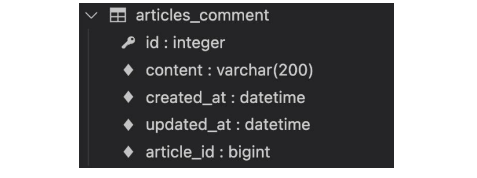
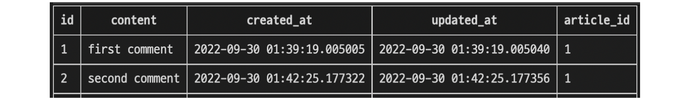
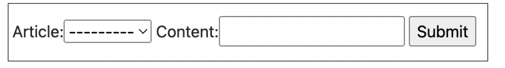
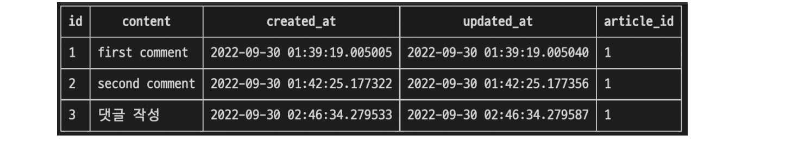

###### 10월 18일

# 🚀 A one-to-many relationship

## 🌌 RDB(관계형 데이터베이스) 복습

- 데이터를 테이블, 행, 열 등으로 나누어 구조화하는 방식
- RDB의 모든 테이블에는 행에서 고유하게 식별 가능한 기본 키라는 속성이 있으며, 외래 키를 사용하여 각 행에서 서로 다른 테이블 간의 관계를 만드는 데 사용할 수 있음


🌏 테이블 간 관계 예시

- 주문서비스 데이터베이스 : 고객 테이블, 주문 테이블
  - 고객 테이블 : 고객 정보(이름, 주소 정보)
  - 주문 테이블 : 주문 정보(제품, 주문/배송 정보)


- 고객이 제품을 주문하는 경우 주문 테이블에 레코드가 생성됨
- 주문 정보가 아래의 테이블처럼 기록이 되어 있을 때 고객 정보는 어떻게 표현할까?


- 고객 정보(이름) 기록
  - 하지만 이렇게 이름으로 저장할 경우 이름이 같은 다른 사용자를 구분할 수 없음
  - 그렇다면 고객 정보의 어떤 데이터를 사용하는 것이 적합할까?


- 고객 정보(id)를 기록
  - 외래 키(Foreign Key, FK) : 관계형 데이터베이스에서 다른 테이블의 행을 식별할 수 있는 필드(키)


🌏 RDB에서의 관계

- **1:1**
  - One-to-one relationships
  - 한 테이블의 레코드 하나가 다른 테이블의 레코드 단 한 개와 관련된 경우
  - 예시 : User - Profile
- **1:N**
  - one-to-many relationships
  - 한 테이블의 0개 이상의 레코드가 다른 테이블의 레코드 한 개와 관련된 경우
  - 기준 테이블에 따라(1:N, One-to-many relationships)이라고도 함
  - 예시 : 사용자의 글 - 댓글
- **M:N**
  - Many-to-many relationships
  - 한 테이블의 0개 이상의 레코드가 다른 테이블의 0개 이상의 레코드와 관련된 경우
  - 양쪽 모두에서 1:N 관계를 가짐


## 🌌 Foreign Key

### 🪐 개념

- 외래 키(외부 키)
- 관계형 데이터베이스에서 다른 테이블의 행을 식별할 수 있는 키
- 참조되는 테이블의 기본 키(Primary Key)를 가리킴
- 참조하는 테이블의 행 1개의 값은, 참조되는 측 테이블의 행 값에 대응됨
  - 이 때문에 참조하는 테이블의 행에는, 참조되는 테이블에 나타나지 않는 값을 포함할 수 없음
- 참조하는 테이블 행 여러 개가, 참조되는 테이블의 동일한 행을 참조할 수 있음


### 🪐 특징

- 키를 사용하여 부모 테이블의 유일한 값을 참조 (참조 무결성)
  - 참조 무결성 : 데이터베이스 관계 모델에서 관련된 2개의 테이블 간의 일관성
    - 외래 키가 선언된 테이블의 외래 키 속성(열)의 값은 해당 테이블의 기본 키 값으로 존재
- 외래 키의 값이 반드시 부모 테이블의 기본 키일 필요는 없지만 유일한 값이어야 함


# 💬 Comment

1:N (Article - Comment)


## 🌌 Model 관계 설정

- 게시판의 게시글와 1:N 관계를 나타낼 수 있는 댓글 구현
- 1:N 관계에서 댓글을 담당할 Article 모델은 1, Comment 모델은 N이 될 것
  - 게시글은 댓글을 0개 이상 가진다.
    - 게시글(1)은 여러 개의 댓글(N)을 가진다.
    - 게시글(1)은 댓글을 가지지 않을 수도 있다.
  - 댓글은 반드시 하나의 게시글에 속한다.


> ​           Comment                                                                            Article

- 만약 comment 테이블에 데이터가 다음과 같이 작성되었다면 1번 게시글에는 1개의 댓글이, 3번 게시글에는 2개의 댓글이 작성된 것

| id   | content     | created_at | updated_at | Article의 id |
| ---- | ----------- | ---------- | ---------- | ------------ |
| 1    | 댓글 내용 1 | ...        | ...        | 1            |
| 2    | 댓글 내용 2 | ...        | ...        | 3            |
| 3    | 댓글 내용 3 | ...        | ...        | 3            |


### 🪐 Django Relationship fields

- 종류
  - OneToOneField()
    - A one-to-one relationship
  - ForeignKey()
    - A one-to-many relationship
  - ManyToManyField()
    - A many-to-many relationship


#### 🌏 [ForeignKey(to, on_delete, **options)](https://docs.djangoproject.com/en/3.2/ref/models/fields/#foreignkey)

- A one-to-many relationship을 담당하는 Django의 모델 필드 클래스
- Django 모델에서 관계형 데이터베이스의 외래 키 속성을 담당
- 2개의 필수 위치 인자가 필요
  - 참조하는 model class
  - on_delete 옵션


🌛 ForeignKey arguments - **on_delete**

- 외래 키가 참조하는 객체가 사라졌을 때, 외래 키를 가진 객체를 어떻게 처리할 지를 정의
- 데이터 무결성을 위해서 매우 중요한 설정
- on_delete 옵션 값
  - CASCADE : 부모 객체(참조 된 객체)가 삭제 됐을 때 이를 참조하는 객체도 삭제
  - PROTECT, SET_NULL, SET_DEFAULT … 등 여러 옵션 값들이 존재


### 🪐 Comment Model

#### 🌏 모델 정의

- 외래 키 필드는 ForeignKey 클래스를 작성하는 위치와 관계없이 필드의 마지막에 작성됨
- ForeignKey() 클래스의 인스턴스 이름은 참조하는 모델 클래스 이름의 단수형(소문자) 으로 작성하는 것을 권장 (이유는 이어지는 모델 참조에서 확인 예정)

```python
# articles/models.py

class Comment(models.Model):
    article = models.ForeignKey(Article, on_delete=models.CASCADE)
    content = models.CharField(max_length=200)
    created_at = models.DateTimeField(auto_now_add=True)
    updated_at = models.DateTimeField(auto_now=True)
    
    def __str__(self):
        return self.content
```


#### 🌏 Migration 과정 진행

- models.py에서 모델에 대한 수정사항이 발생했기 때문에 migration 과정을 진행

  ```bash
  $ python manage.py makemigrations
  ```

- 마이그레이션 파일 0002_comment.py 생성 확인

- migrate 진행

  ```bash
  $ python manage.py migrate
  ```


- migrate 후 Comment 모델 클래스로 인해 생성된 테이블 확인

  

- ForeignKey 모델 필드로 인해 작성된 컬럼의 이름이 article_id인 것을 확인

- 만약 ForeignKey 인스턴스를 article이 아닌 abcd로 생성 했다면 abcd_id로 만들어짐

- 이처럼 명시적인 모델 관계 파악을 위해 참조하는 클래스 이름의 소문자(단수형)로 작성하는 것이 권장 되었던 이유


#### 🌏 댓글 생성 연습하기

- shell_plus 실행

  ```bash
  $ python manage.py shell_plus
  ```


- 댓글 생성

  ```shell
  # Comment 클래스의 인스턴스 comment 생성
  comment = Comment()
  
  # 인스턴스 변수 저장
  comment.content = 'first comment'
  
  # DB에 댓글 저장
  comment.save()
  
  # 에러 발생
  django.db.utils.IntegrityError: NOT NULL constraint failed: articles_comment.article_id
  # articles_comment 테이블의 ForeignKeyField, article_id 값이 저장 시 누락되었기 때문
  ```

  ```shell
  # 게시글 생성 및 확인
  article = Article.objects.create(title='title', content='content')
  article
  => <Article: title>
  
  # 외래 키 데이터 입력
  # 다음과 같이 article 객체 자체를 넣을 수 있음
  comment.article = article
  # 또는 comment.article_id = article.pk 처럼 pk 값을 직접 외래 키 컬럼에
  # 넣어 줄 수도 있지만 권장하지 않음
  
  # DB에 댓글 저장 및 확인
  comment.save()
  comment
  => <Comment: first comment>
  ```


- 댓글 속성 값 확인

  ```shell
  comment.pk
  => 1
  
  comment.content
  => 'first comment'
  
  # 클래스 변수명인 article로 조회 시 해당 참조하는 게시물 객체를 조회할 수 있음
  comment.article
  => <Article: title>
  
  # article_pk는 존재하지 않는 필드이기 때문에 사용 불가
  comment.article_id
  => 1
  ```


- comment 인스턴스를 통한 article 값 접근하기

  ```shell
  # 1번 댓글이 작성된 게시물의 pk 조회
  comment.article.pk
  => 1
  
  # 1번 댓글이 작성된 게시물의 content 조회
  comment.article.content
  => 'content'
  ```


- 두번째 댓글 작성해보기

  ```shell
  comment = Comment(content='second comment', article=article)
  comment.save()
  
  comment.pk
  => 2
  
  comment
  => <Comment: second comment>
  
  comment.article_id
  => 1
  ```


- 작성된 댓글 확인 해보기

  


## 🌌 관계 모델 참조

### 🪐 [Related manager](https://docs.djangoproject.com/en/3.2/ref/models/relations/)

- Related manager는 1:N 혹은 M:N 관계에서 사용 가능한 문맥(context)
- Django는 모델 간 1:N 혹은 M:N 관계가 설정되면 역참조할 때에 사용할 수 있는 manager를 생성
  - 우리가 이전에 모델 생성 시 objects라는 매니저를 통해 queryset api를 사용했던 것처럼 related manager를 통해 queryset api를 사용할 수 있게 됨
- (지금은 1:N 관계에서의 related manager 만을 학습할 것)


#### 🌏 역참조

- 나를 참조하는 테이블(나를 외래 키로 지정한)을 참조하는 것
- 즉, 본인을 외래 키로 참조 중인 다른 테이블에 접근하는 것
- 1:N 관계에서는 1이 N을 참조하는 상황
  - 외래 키를 가지지 않은 1이 외래 키를 가진 N을 참조


```shell
article.comment_set.method()
```

- Article 모델이 Comment 모델을 참조(역참조)할 때 사용하는 매니저

- article.comment 형식으로는 댓글 객체를 참조 할 수 없음

  - 실제로 Article 클래스에는 Comment와의 어떠한 관계도 작성되어 있지 않음

- 대신 Django가 역참조 할 수 있는 **comment_set manager**를 자동으로 생성해 article.comment_set 형태로 댓글 객체를 참조할 수 있음

  > 1:N 관계에서 생성되는 Related manger의 이름은 참조하는 “모델명_set” 이름 규칙으로 만들어짐

- 반면 참조 상황(Comment → Article)에서는 실제 ForeignKey 클래스로 작성한 인스턴스가 Comment 클래스의 클래스 변수이기 때문에 comment.article 형태로 작성 가 능


#### 🌏 Related manager 연습하기

- shell_plus 실행

  ```shell
  $ python manage.py shell_plus
  ```


- 1번 게시글 조회하기

  ```shell
  article = Article.objects.get(pk=1)
  ```


- dir() 함수를 사용해 클래스 객체가 사용할 수 있는 메서드를 확인하기

  ```shell
  dir(article)
  
  [
    ...중략...,
    'comment_set',
    'content',
    'created_at',
    'date_error_message',
    'delete',
    'from_db',
    'full_clean',
    ...중략...
  ]
  ```


- 1번 게시글에 작성된 모든 댓글 조회하기 (역참조)

  ```shell
  article.comment_set.all()
  => <QuerySet [<Comment: first comment>, <Comment: second comment>]>
  ```


- 1번 게시글에 작성된 모든 댓글 출력하기

  ```python
  comments = article.comment_set.all()
  
  for comment in comments:
      print(comment.content)
  ```


🌛 ForeignKey arguments – **related_name**

- ForeignKey 클래스의 선택 옵션

- 역참조 시 사용하는 매니저 이름(model_set manager)을 변경할 수 있음

- 작성 후, migration 과정이 필요

- 선택 옵션이지만 상황에 따라 반드시 작성해야 하는 경우가 생기기도 함

  (이는 추후 자연스럽게 만나볼 예정!)

- 작성 후 다시 원래 코드로 복구

```python
# articles/models.py

class Comment(models.Model):
    article = models.ForeignKey(Article, on_delete=models.CASCADE, related_name='comments')
    ...
```

> 위와 같이 변경 하면 기존 article.comment_set은 더 이상 사용할 수 없고, article.comments로 대체됨


#### 🌏 admin site 등록

- 새로 작성한 Comment 모델을 admin site에 등록하기

```python
# articles/admin.py

from .models import Article, Comment


admin.site.register(Article)
admin.site.register(Comment)
```


## 🌌 Comment 구현

### 🪐 CREATE

- 사용자로부터 댓글 데이터를 입력 받기 위한 CommentForm 작성

  ##### articles / forms.py

  ```python
  from .models import Article, Comment
  
  
  class CommentForm(forms.ModelForm):
      
      class Meta:
          model = Comment
          fields = '__all__'
  ```


- detail 페이지에서 CommentForm 출력 (view 함수)

  ##### articles / views.py

  ```python
  from .forms import ArticleForm, CommentForm
  
  def detail(request, pk):
      article = Article.objects.get(pk=pk)
      comment_form = CommentForm()
      context = {
          'article': article,
          'comment_form': comment_form,
      }
      return render(request, 'articles/detail.html', context)
  ```

  > 기존에 ArticleForm 클래스의 인스턴스명을 form으로 작성했기 때문에 헷갈리지 않도록 comment_form으로 작성


- detail 페이지에서 CommentForm 출력 (템플릿)

  ##### articles / detail.html

  ```django
  
  
  
    ...
    <a href="">back</a>
    <hr>
    <form action="#" method="POST">
      
      {{ comment_form }}
      <input type="submit">
    </form>
  
  ```


> detail 페이지에 출력된 CommentForm을 살펴보면 아래 이미지와 같이 ì¶œë ¥ë¨실제 서비스에서는 댓글을 작성할 때 댓글을 어떤 게시글에 작성하는지 직접 게시글 번호를 선택 하지 않음
>
> 실제로는 해당 게시글에 댓글을 작성하면 자연스럽게 그 게시글에 댓글이 작성되어야 함
>
> 위와 같이 출력되는 이유는 Comment 클래스의 외래 키 필드 article 또한 데이터 입력이 필요하기 때문에 출력 되고 있는 것
>
> 하지만, 외래 키 필드는 사용자의 입력으로 받는 것이 아니라 view 함수 내에서 받아 별도로 처리되어 저장되어야 함


- 외래 키 필드를 출력에서 제외 후 확인

  ##### articles / forms.py

  ```python
  class CommentForm(forms.ModelForm):
      
      class Meta:
          model = Comment
          exclude = ('article',)
  ```

  


> 출력에서 제외된 외래 키 데이터는 어디서 받아와야 할까?
>
> detail 페이지의 url을 살펴보면 path(‘\<int:pk>/', views.detail, name='detail’) url에 해당 게시글의 pk 값이 사용 되고 있음
>
> 댓글의 외래 키 데이터에 필요한 정보가 바로 게시글의 pk 값
>
> 이전에 학습했던 url을 통해 변수를 넘기는 variable routing을 사용


##### articles / urls.py

```python
urlpatterns = [
    ...,
    path('<int:pk>/comments/', views.comments_create, name='comments_create'),
]
```


##### articles / views.py

```python
def comments_create(request, pk):
    article = Article.objects.get(pk=pk)
    comment_form = CommentForm(request.POST)
    if comment_form.is_valid():
        # article 객체는 언제 저장할 수 있을까?
        comment_form.save()
    return redirect('articles:detail', article.pk)
```


##### articles / detail.html

```django
<form action="" method="POST">
  
  {{ comment_form }}
  <input type="submit">
</form>
```


> 작성을 마치고 보면 article 객체를 저장하지 못함
>
> 그래서 save() 메서드는 데이터베이스에 저장하기 전에 객체에 대한 추가적인 작업을 진행할 수 있도록 인스턴스 만을 반환해주는 옵션 값을 제공


#### 🌏 [The save() method](https://docs.djangoproject.com/en/3.2/topics/forms/modelforms/#the-save-method)

- save(commit=False)
  - “Create, but don't save the new instance.”
  - 아직 데이터베이스에 저장되지 않은 인스턴스를 반환
  - 저장하기 전에 객체에 대한 사용자 지정 처리를 수행할 때 유용하게 사용


- save 메서드의 commit 옵션을 사용해 DB에 저장되기 전 article 객체 저장하기

  ##### articles / views.py

  ```python
  def comments_create(request, pk):
      article = Article.objects.get(pk=pk)
      comment_form = CommentForm(request.POST)
      if comment_form.is_valid():
          comment = comment_form.save(commit=False)
          comment.article = article
          comment.save()
      return redirect('articles:detail', article.pk)
  ```


- 댓글 작성 후 테이블 확인

  


### 🪐 READ

- 작성한 댓글 목록 출력하기

- 특정 article에 있는 모든 댓글을 가져온 후 context에 추가

  ##### articles / views.py

  ````python
  # 추가 사항
  # from .models import Article, Comment
  # comments = article.comment_set.all()
  # context = {'comments': comments,}
  
  from .models import Article, Comment
  
  def detail(request, pk):
      article = Article.objects.get(pk=pk)
      comment_form = CommentForm()
      comments = article.comment_set.all()
      context = {
          'article': article,
          'comment_form': comment_form,
          'comments': comments,
      }
      return render(request, 'articles/detail.html', context)
  ````


- detail 템플릿에서 댓글 목록 출력하기

  ##### articles / detail.html

  ```django
  
  
  
    ...
    <a href="">back</a>
    <hr>
    <h4>댓글 목록</h4>
    <ul>
      
        <li>{{ comment.content }}</li>
      
    </ul>
    <hr>
    ...
  
  ```


- detail 템플릿에서 댓글 목록 출력 확인하기

  


### 🪐 DELETE

- 댓글 삭제 구현하기 (url, view)

  ##### articles / urls.py

  ````python
  urlpatterns = [
      ...,
      path('<int:article_pk>/comments/<int:comment_pk>/delete/', views.comments_delete, name='comments_delete'),
  ]
  ````

  

  #####  articles/views.py

  ````python
  def comments_delete(request, article_pk, comment_pk):
      comment = Comment.objects.get(pk=comment_pk)
      comment.delete()
      return redirect('articles:detail', article_pk)
  ````


- 댓글을 삭제할 수 있는 버튼을 각각의 댓글 옆에 출력 될 수 있도록 함

  ##### articles / detail.html

  ```django
  
    ...
    <h4>댓글 목록</h4>
    <ul>
      
        <li>
          {{ comment.content }}
          <form action="" method="POST">
            
            <input type="submit" value="DELETE">
          </form>
        </li>
      
    </ul>
    <hr>
    ...
  
  ```


- 댓글 삭제 버튼 출력 확인 및 삭제 시도해보기

  


## 🌌 Comment 추가 사항

### 🪐 개요

- 댓글 개수 출력하기
  - DTL filter - length 사용
  - Queryset API - count() 사용
- 댓글이 없는 경우 대체 컨텐츠 출력하기


#### 🌏 댓글 개수 출력하기

- DTL filter - length 사용

  ```django
  {{ comments|length }}
  
  {{ article.comment_set.all|length }}
  ```

- Queryset API - count() 사용

  ```django
  {{ comments.count }}
  
  {{ article.comment_set.count }}
  ```


- detail 템플릿에 작성하기

  ##### articles / detail.html

  ```django
  <h4>댓글 목록</h4>
  
    <p><b>{{ comments|length }}개의 댓글이 있습니다.</b></p>
  
  ```


- 작성 후 출력 확인

  


#### 🌏 댓글이 없는 경우 대체 컨텐츠 출력하기

- DTL for empty 활용하기

  ##### articles / detail.html 

  ```django
  
    <li>
      {{ comment.content }}
      <form action="" method="POST">
        
        <input type="submit" value="DELETE">
      </form>
    </li>
  
      <p>댓글이 없어요..</p>
  
  ```


- 새로운 게시글을 작성하거나 모든 댓글을 삭제 후 확인

  


