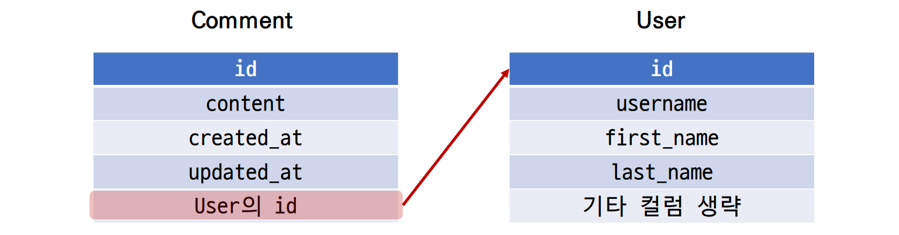
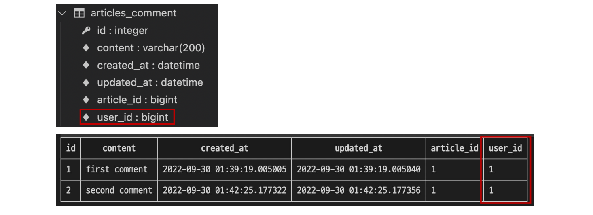
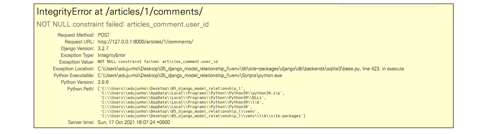
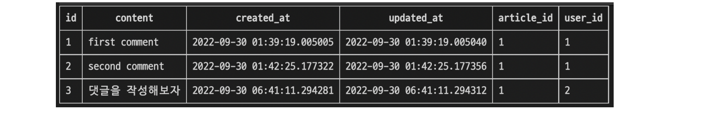
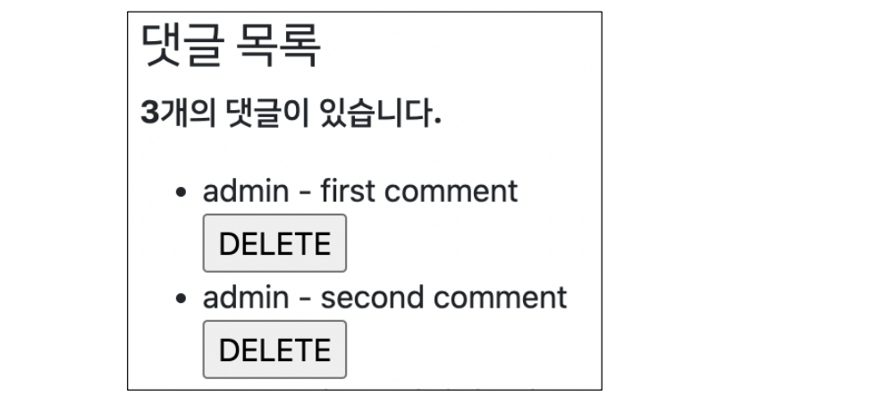
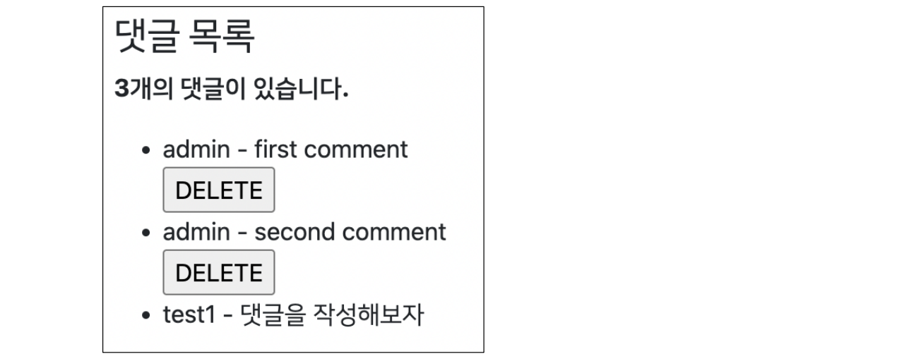

###### 10월 19일

# 💬 1:N (User - Comment)

### 🪐 개요

- User(1) - Comment(N)
- User 모델과 Comment 모델 간 관계 설정
- “0개 이상의 댓글은 1개의 회원에 의해 작성될 수 있음”


## 🌌 모델 관계 설정

### 🪐 Comment와 User간 모델 관계 설정 




- Comment 모델에 User 모델을 참조하는 외래 키 작성

  ##### articles / models.py

  ```py
  class Comment(models.Model):
      article = models.ForeignKey(Article, on_delete=models.CASCADE)
      user = models.ForeignKey(settings.AUTH_USER_MODEL, on_delete=models.CASCADE)
      ...
  ```


### 🪐 Migration 진행

- 이전에 User와 Article 모델 관계 설정 때와 마찬가지로 기존에 존재하던 테이블에 새로운 컬럼이 추가되어야 하는 상황이기 때문에 migrations 파일이 곧바로 만들어지지 않고 일련의 과정이 필요

  ```bash
  $ python manage.py makemigrations
  ```

  

- 첫번째 화면

  - 기본적으로 모든 컬럼은 NOT NULL 제약조건이 있기 때문에 데이터가 없이는 새로 추가되는 외래 키 필드 user_id가 생성되지 않음
  - 그래서 기본값을 어떻게 작성할 것인지 선택해야 함
  - 1을 입력하고 Enter 진행 (다음 화면에서 직접 기본 값 입력)

  ```bash
  You are trying to add a non-nullable field 'user' to article without a default; we can't do that (the database needs something to populate existing rows).
  Please select a fix:
  1) Provide a one-off default now (will be set on all existing rows with a null value for this column)
  2) Quit, and let me add a default in models.py
  Select an option: 
  ```


- 두번째 화면
  - comment의 user_id에 어떤 데이터를 넣을 것인지 직접 입력해야 함
  - 마찬가지로 1 입력하고 Enter 진행
  - 그러면 기존에 작성된 댓글이 있다면 모두 1번 회원이 작성한 것으로 처리됨


- migrations 파일 생성 후 migrate 진행

  ```bash
  $ python manage.py migrate
  ```


- comment 테이블 스키마 변경 및 확인




## 🌌 CREATE

### 🪐 개요

- 인증된 회원의 댓글 작성 구현하기
- 작성하기 전 로그인을 먼저 진행한 상태로 진행


### 🪐 CommentForm 

- CommentForm 출력을 확인해보면 create 템플릿에서 불필요한 필드(user)가 출력 됨
- user 필드에 작성해야 하는 user 객체는 view 함수의 request 객체를 활용해야 함


- CommentForm의 출력 필드 수정

  ##### articles / forms.py

  ```py
  class CommentForm(forms.ModelForm):
      
      class Meta:
          model = Comment
          exclude = ('article', 'user',)
  ```


- 수정 확인 후 댓글 작성하기


### 🪐 외래 키 데이터 누락

- 댓글 작성 시 NOT NULL constraint failed: articles_comment.user_id 에러 발생

  

  > “NOT NULL 제약 조건이 실패했다. articles_comment 테이블의 user_id 컬럼에서”
  >
  > => 댓글 작성 시 외래 키에 저장되어야 할 작성자 정보가 누락 되었기 때문


- 댓글 작성 시 작성자 정보가 함께 저장될 수 있도록 `save`의 `commit` 옵션을 활용

  ##### articles / views.py

  ```py
  def comments_create(request, pk):
      article = Article.objects.get(pk=pk)
      comment_form = CommentForm(request.POST)
      if comment_form.is_valid():
          comment = comment_form.save(commit=False)
          comment.article = article
          comment.user = request.user
          comment.save()
      return redirect('articles:detail', article.pk)
  ```


- 수정 후 댓글이 잘 작성 되는지 확인

  


## 🌌 READ

### 🪐 댓글 작성자 출력

- detail 템플릿에서 각 게시글의 작성자 출력

  ##### articles / detail.html

  ```django
  
  
  
    ...
    <h4>댓글 목록</h4>
    ...
    <ul>
      
        <li>
          {{ comment.user }} - {{ comment.content }}
          <form action="" method="POST">
            
            <input type="submit" value="DELETE">
          </form>
    ...
  ```


- 출력 확인하기

  


## 🌌 DELETE

### 🪐 댓글 삭제 시 작성자 확인

- 이제 댓글에는 작성자 정보가 함께 들어있기 때문에, 현재 삭제를 요청하려는 사람과 댓글을 작성한 사람을 비교하여 본인의 댓글만 삭제 할 수 있도록 함

  ##### articles / views.py

  ```python
  def comments_delete(request, article_pk, comment_pk):
      comment = Comment.objects.get(pk=comment_pk)
      if request.user == comment.user:
          comment.delete()
      return redirect('articles:detail', article_pk)
  ```


- 추가로 해당 댓글의 작성자가 아니라면, 삭제 버튼을 출력하지 않도록 함

  ##### articles / detail.html

  ```django
  
  
  
    ...
    <ul>
        
          <li>
            {{ comment.user }} - {{ comment.content }}
            
              <form action="" method="POST">
                
                <input type="submit" value="DELETE">
              </form>
            
            ...
  ```


- 다른 계정으로 접속하여 detail 템플릿에서 다른 회원이 작성한 댓글을 확인

  

