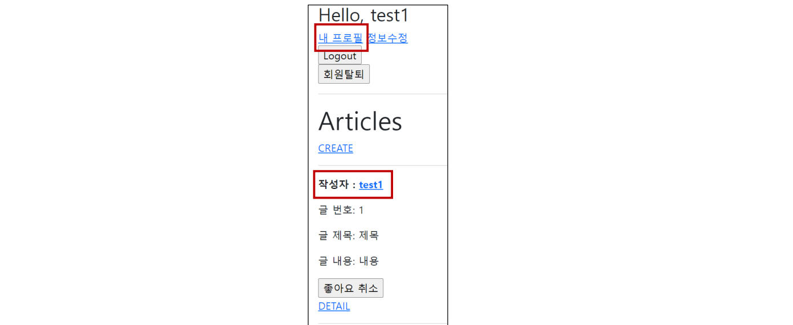
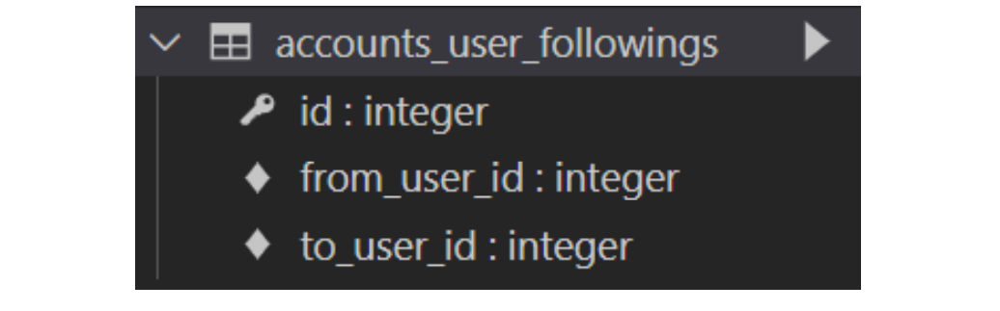
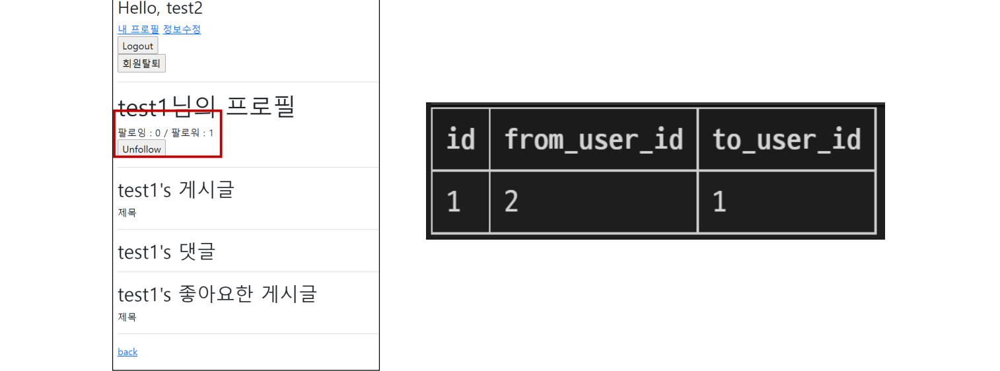

###### 10월 25일

# 🚀 M:N (User-User)

## 🌌 Profile

### 🪐 Profile 구현

- url 및 view 함수 작성

##### accounts / urls.py

```py
urlpatterns = [
    …
    path('profile/<username>/', views.profile, name='profile'),
]
```


##### accounts / views.py

`````py
from django.contrib.auth import get_user_model

def profile(request, username):
    User = get_user_model()
    person = User.objects.get(username=username)
    context = {
        'person': person,
    }
    return render(request, 'accounts/profile.html', context)
`````


- profile 템플릿 작성

##### accounts / profile.html

````django



  <h1>{{ person.username }}님의 프로필</h1>

  <hr>

  <h2>{{ person.username }}'s 게시글</h2>
  
    <div>{{ article.title }}</div>
  
  
  <hr>

…
<h2>{{ person.username }}'s 댓글</h2>
  
    <div>{{ comment.content }}</div>
  

  <hr>

  <h2>{{ person.username }}'s 좋아요한 게시글</h2>
  
    <div>{{ article.title }}</div>
  

  <hr>

  <a href="">back</a>

````


- Profile 템플릿으로 이동할 수 있는 하이퍼 링크 작성

##### base.html

````django
<body>
  <div class="container">
    
      <h3>Hello, {{ user }}</h3>
      <a href="">내 프로필</a>
…
````


##### articles / index.html

```django
<p>
  <b>작성자 : <a href="">{{ article.user }}</a></b>
</p>
```


- Profile 템플릿으로 이동할 수 있는 하이퍼 링크 출력 확인




## 🌌 Follow

### 🪐 모델 관계 설정

- ManyToManyField 작성 및 Migration 진행

##### accounts / models.py

```py
class User(AbstractUser):
    followings = models.ManyToManyField('self', symmetrical=False,
                                        related_name='followers')
```


```bash
$ python manage.py makemigrations
$ python manage.py migrate
```


- 생성된 중개 테이블 확인




### 🪐 Follow 구현

- url 및 view 함수 작성

##### accounts / urls.py

```py
urlpatterns = [
    ...,
    path('<int:user_pk>/follow/', views.follow, name='follow'),
]
```


##### accounts / views.py

```py
def follow(request, user_pk):
    User = get_user_model()
    person = User.objects.get(pk=user_pk)
    if person != request.user:
        if person.followers.filter(pk=request.user.pk).exists():
            # if request.user in person.followers.all():
            person.followers.remove(request.user)
        else:
            person.followers.add(request.user)
    return redirect('accounts:profile', person.username)
```


- 프로필 유저의 팔로잉, 팔로워 수 & 팔로우, 언팔로우 버튼 작성

##### accounts / profile.html

```django



  <h1>{{ person.username }}님의 프로필</h1>
  <div>
    <div>
    팔로잉 : {{ person.followings.all|length }} / 팔로워 : {{ person.followers.all|length }}
    </div>
    
      <div>
          <form action="" method="POST">
            
            
              <input type="submit" value="Unfollow">
            
              <input type="submit" value="Follow">
            
          </form>
      </div>
    
  </div>
…
```


- 팔로우 버튼 클릭 후 팔로우 버튼 변화 및 테이블 확인




- 데코레이터 및 is_authenticated 추가

##### accounts / views.py

```py
@require_POST
def follow(request, user_pk):
    if request.user.is_authenticated:
        User = get_user_model()
        person = User.objects.get(pk=user_pk)
        if person != request.user:
            if person.followers.filter(pk=request.user.pk).exists():
                # if request.user in person.followers.all():
                person.followers.remove(request.user)
            else:
                person.followers.add(request.user)
            return redirect('accounts:profile', person.username)
    return redirect('accounts:login')
```


## 🌌  View decorators & functions

### 🪐 405 Method Not Allowed

#### 🌏 데코레이터 (Decorator)

- 기존 함수를 수정하지 않고 기능을 추가해주는 wrapper 함수
- Django는 HTTP 처리를 위해 view 함수에 적용 할 수 있는 데코레이터를 제공

```py
def hello(func):
    def wrapper():
        print('HIHI')
        func()
        print('HIHI')
    return wrapper

@hello
def bye():
    print('byebye')
    
bye()
```

```py
# 출력

HIHI
byebye
HIHI
```


#### 🌏 개요

- django.views.decorators.http의 데코레이터를 사용하여 요청 메서드를 기반으로 접근을 제한할 수 있음
- 일치하지 않는 메서드 요청이라면 405 Method Not Allowed를 반환
- 메서드 목록
  1. require_http_methods()
  2. require_POST()
  3. require_safe()


##### 🌛 require_http_methods()

- View 함수가 특정한 요청 method만 허용하도록 하는 데코레이터

```py
# views.py

from django.views.decorators.http import require_http_methods

@require_http_methods(['GET', 'POST'])
def create(request):
    pass

@require_http_methods(['GET', 'POST'])
def update(request, pk):
    pass
```


##### 🌛 require_POST()

- View 함수가 POST 요청 method만 허용하도록 하는 데코레이터

```py
# views.py

from django.views.decorators.http import require_http_methods, require_POST

@require_POST
def delete(request, pk):
    article = Article.objects.get(pk=pk)
    article.delete()
    return redirect('articles:index')
```


- url로 delete 시도 후 서버 로그에서 405 http status code 확인 해보기

```bash
Method Not Allowed (GET): /articles/3/delete/
[04/Jan/2022 04:52:10] "GET /articles/3/delete/ HTTP/1.1" 405 0
```


##### 🌛 require_safe()

- require_GET이 있지만 Django에서는 require_safe를 사용하는 것을 권장

```py
# views.py
from django.views.decorators.http import require_http_methods, require_POST, require_safe

@require_safe
def index(request):
    ...

@require_safe
def detail(request, pk):
    ...
```


##### 🌛 [참고] @login_require와 require_POST

- 상황
  - 비로그인 상태로 detail 페이지에서 게시글 삭제 시도
  - delete view 함수의 @login_required로 인해 로그인 페이지로 리다이렉트
    - http:<hi>//127.0.0.1:8000/accounts/login/?next=/articles/1/delete/
  - redirect로 이동한 로그인 페이지에서 로그인 진행
    - redirect는 반드시 GET요청으로만 가능
  - delete view 함수의 @require_POST로 인해 405 상태 코드를 받게 됨
    - 405(Method Not Allowed) status code 확인

> **📌 @login_required는 GET 요청을 처리하는 View 함수 에서만 사용해야 함**


- 로그인 성공 이후 GET method로 next 파라미터 주소에 리다이렉트


- POST method만 허용하는 delete 같은 함수는 내부에서는 is_authenticated 속성 값을 사용해서 처리

```py
# articles/views.py

@require_POST
def delete(request, pk):
    if request.user.is_authenticated:
        article = Article.objects.get(pk=pk)
        article.delete()
    return redirect('articles:index')
```


### 🪐 404 Not Found

#### 🌏 Django Shortcut functions

- 아래의 함수를 활용하면, 해당하는 객체가 존재하지 없는 경우 404 상태코드를 반환
  - `get_object_or_404(klass, *args, **kwargs)`
    - Calls get() on a given model manager, but it raises Http404 instead of the model’s DoesNotExist exception.
  - `get_list_or_404(klass, *args, **kwargs)`
    - Returns the result of filter() on a given model manager cast to a list, raising Http404 if the resulting list is empty