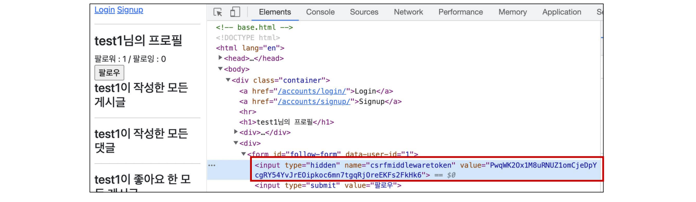
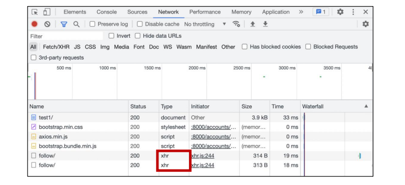
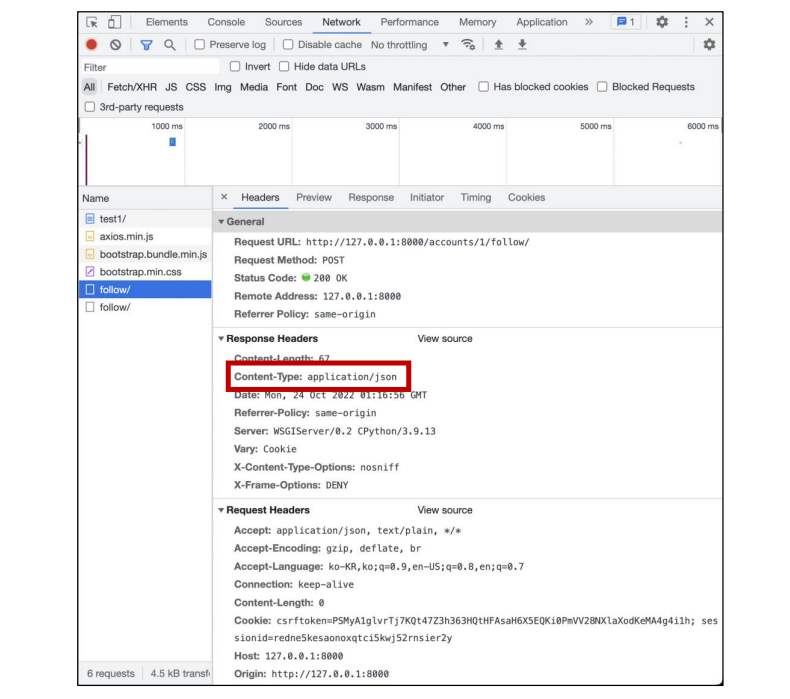

###### 10월 26일

# 🚀 Axios

## 🌌 [Axios](https://axios-http.com/)

> “Promise based HTTP client for the browser and Node.js”

- 브라우저를 위한 Promise 기반의 클라이언트
- 원래는 “XHR”이라는 브라우저 내장 객체를 활용해 AJAX 요청을 처리하는데, 이보다 편리한 AJAX 요청이 가능하도록 도움을 줌
  - 확장 가능한 인터페이스와 함께 패키지로 사용이 간편한 라이브러리를 제공

```js
axios.get('https://jsonplaceholder.typicode.com/todos/1/') // Promise return
  .then(..)
  .catch(..)
```


XMLHttpRequest

```html
<script>
  const xhr = new XMLHttpRequest()
  const URL = 'https://jsonplaceholder.typicode.com/todos/1'

  xhr.open('GET', URL)
  xhr.send()

  xhr.onreadystatechange = function (event) {
    if (xhr.readyState === XMLHttpRequest.DONE) {
      const status = event.target.status
      if (status === 0 || (status >= 200 && status < 400)) {
        const res = event.target.response
        const data = JSON.parse(res)
        console.log(data.title)
      } else {
        console.error('Error!')
      }
    }
  }
</script>
```


Axios

```html
<script src="https://unpkg.com/axios/dist/axios.min.js"></script>
<script>
    
  const URL = 'https://jsonplaceholder.typicode.com/todos/1'

  axios.get(URL)
    .then(res => console.log(res.data.title))
    .catch(err => console.log('Error!’))
</script>
```


```javascript
const URL = 'http://jsonplaceholder.typicode.com/todos/1'

axios.get(URL)
  .then(function (response) {
    console.log(response)
    return response.data
  })
  .then(function (data) {
    return data.title
  })
  .then(function (title) {
    console.log(title)
  })
  .catch(function (error) {
    console.log(error)
  })
  .finally(function () {
    console.log('이건 무조건 실행됩니다.')
  })
```


## 🌌 Promise

- 비동기 작업을 관리하는 객체
  - 미래의 완료 또는 실패와 그 결과 값을 나타냄
  - 미래의 어떤 상황에 대한 약속
- 성공(이행)에 대한 약속
  - .then()
- 실패(거절)에 대한 약속
  - .catch()

```javascript
const myPromise = axios.get(URL)
// console.log(myPromise) // Promise Object

myPromise
  .then(response => {
    return response.data
  })

// chaining
axios.get(URL)
  .then(response => {
    return response.data
  })
  .then(response => {
    return response.title
  })
  .catch(error => {
    console.log(error)
  })
  .finally(function () {
    console.log('나는 마지막에 무조건 시행!!!')
  })
```

- 문서
  - [MDN Promise](https://developer.mozilla.org/ko/docs/Web/JavaScript/Reference/Global_Objects/Promise)
  - [Introducing asynchronous JavaScript](https://developer.mozilla.org/ko/docs/Learn/JavaScript/Asynchronous/Introducing#promises)
  - [Using promises](https://developer.mozilla.org/ko/docs/Web/JavaScript/Guide/Using_promises)


##### 🌛 [.then(callback)](https://developer.mozilla.org/ko/docs/Web/JavaScript/Reference/Global_Objects/Promise/then)

- 이전 작업(promise)이 성공했을 때(이행했을 때) 수행할 작업을 나타내는 callback 함수
- 그리고 각 callback 함수는 이전 작업의 성공 결과를 인자로 전달받음
- 따라서 성공했을 때의 코드를 callback 함수 안에 작성


##### 🌛 [.catch(callback)](https://developer.mozilla.org/en-US/docs/Web/JavaScript/Reference/Global_Objects/Promise/catch)

- .then이 하나라도 실패하면(거부 되면) 동작 (동기식의 ‘try - except’ 구문과 유사)
- 이전 작업의 실패로 인해 생성된 error 객체는 catch 블록 안에서 사용할 수 있음

---

- 각각의 .then() 블록은 서로 다른 promise를 반환
  - 즉, .then()을 여러 개 사용(chaining)하여 연쇄적인 작업을 수행할 수 있음
  - 결국 여러 비동기 작업을 차례대로 수행할 수 있다는 뜻
- .then()과 .catch() 메서드는 모두 promise를 반환하기 때문에 chaining 가능
- 주의
  - 반환 값이 반드시 있어야 함
  - 없다면 callback 함수가 이전의 promise 결과를 받을 수 없음

---

##### 🌛 [.finally(callback)](https://developer.mozilla.org/ko/docs/Web/JavaScript/Reference/Global_Objects/Promise/finally)

- Promise 객체를 반환
- 결과와 상관없이 무조건 지정된 callback 함수가 실행
- 어떠한 인자도 전달받지 않음
  - Promise가 성공되었는지 거절되었는지 판단할 수 없기 때문
- 무조건 실행되어야 하는 절에서 활용
  - .then()과 .catch() 블록에서의 코드 중복을 방지


- callback Hell → Promise

```javascript
work1(function(result1) {
    work2(result1, function(result2) {
        work3(result2, function(result3) {
            console.log('최종 결과: ' + result3)
        })
    })
})
```

⬇

```javascript
work1().then(function(result1) {
  return work2(result1)
})
.then(function(result2) {
  return work3(result2)
})
.then(function(result3) {
    console.log('최종결과: ' + result3)
})
.catch(failureCallback)
```


- .then()을 여러 번 사용하여 여러 개의 callback 함수를 추가할 수 있음 ([Chaining](https://developer.mozilla.org/ko/docs/Web/JavaScript/Guide/Using_promises#guarantees))
- callback 함수는 JavaScript의 Event Loop가 현재 실행 중인 Call Stack을 완료하기 이전에는 절대 호출되지 않음
  - Promise callback 함수는 Event Queue에 배치되는 엄격한 순서로 호출됨
  - 비동기 작업이 성공하거나 실패한 뒤에 .then() 메서드를 이용한 경우도 마찬가지


## 🌌 비동기 적용하기

### 🪐 팔로우 (follow)

- 각각의 템플릿에서 script 코드를 작성하기 위한 block tag 영역 작성

```django
<!-- base.html -->

<body>
  ...
  
  
</body>
</html>
```


- axios CDN 작성

```django
<!-- accounts/profile.html -->


  <script src="https://cdn.jsdelivr.net/npm/axios/dist/axios.min.js"></script>
  <script>
  </script>

```


- form 요소 선택을 위해 id 속성 지정 및 선택
- 불필요해진 action과 method 속성은 삭제 (요청은 axios로 대체되기 때문)

```django
<!-- accounts/profile.html -->

<form id="follow-form">
  ...
</form>
```

```django
<!-- accounts/profile.html -->

<script>
  const form = document.querySelector('#follow-form')
</script>
```


- form 요소에 이벤트 핸들러 작성 및 submit 이벤트 취소

```django
<!-- accounts/profile.html -->

<script>
  const form = document.querySelector('#follow-form’)
  form.addEventListener('submit', function (event) {
    event.preventDefault()
  })
</script>
```


- axios 요청 준비

```html
<!-- accounts/profile.html -->

<script>
  const form = document.querySelector('#follow-form’)
  form.addEventListener('submit', function (event) {
    event.preventDefault()
    axios({
      method: 'post＇,
      url: `/accounts/${???}/follow/`,
    })
  })
</script>
```


> 현재 axios로 POST 요청을 보내기 위해 필요한 것
>
> 1. **url에 작성할 user pk는 어떻게 작성해야 할까?**
> 2. csrftoken은 어떻게 보내야 할까?


- url에 작성할 user pk 가져오기 (HTML -> JavaScript)

```django
<!-- accounts/profile.html -->

<form id="follow-form" data-user-id="{{ person.pk }}">
  ...
</form>
```

```django
<!-- accounts/profile.html -->

<script>
  const form = document.querySelector('#follow-form’)
  form.addEventListener('submit', function (event) {
    event.preventDefault()
      
    const userId = event.target.dataset.userId
    ...
  })
</script>
```


##### 🌛 [data-*](https://developer.mozilla.org/ko/docs/Web/HTML/Global_attributes/data-*) attributes 

- 사용자 지정 데이터 특성을 만들어 임의의 데이터를 HTML과 DOM사이에서 교환 할 수 있는 방법

- 사용 예시

  ```django
  <div data-my-id="my-data"></div>
  <script>
    const myId = event.target.dataset.myId
  </script>
  ```

- 모든 사용자 지정 데이터는 dataset 속성을 통해 사용할 수 있음

  - 예를 들어 `data-test-value` 라는 이름의 특성을 지정했다면 JavaScript에서는 `element.dataset.testValue`로 접근할 수 있음

- 속성명 작성 시 주의사항

  - 대소문자 여부에 상관없이 xml로 시작하면 안 됨
  - 세미콜론을 포함해서는 안됨
  - 대문자를 포함해서는 안됨


- url 작성 마치기

```django
<!-- accounts/profile.html -->

<script>
  const form = document.querySelector('#follow-form’)
  form.addEventListener('submit', function (event) {
    event.preventDefault()
    const userId = event.target.dataset.userId
    axios({
      method: 'post＇,
      url: `/accounts/${userId}/follow/`,
    })
  })
</script>
```


> 현재 axios로 POST 요청을 보내기 위해 필요한 것
>
> 1. url에 작성할 user pk는 어떻게 작성해야 할까?
> 2. **csrftoken은 어떻게 보내야 할까?**


- 먼저 [hidden 타입으로 숨겨져있는 csrf](https://docs.djangoproject.com/en/3.2/ref/csrf/) 값을 가진 input 태그를 선택해야 함



```django
<!-- accounts/profile.html -->

<script>
  const form = document.querySelector('#follow-form＇)
  const csrftoken = document.querySelector('[name=csrfmiddlewaretoken]').value
</script>
```


- [AJAX로 csrftoken을 보내는 방법](https://docs.djangoproject.com/en/3.2/ref/csrf/#setting-the-token-on-the-ajax-request)

```django
<!-- accounts/profile.html -->

<script>
  const form = document.querySelector('#follow-form＇)
  const csrftoken = document.querySelector('[name=csrfmiddlewaretoken]').value
  form.addEventListener('submit', function (event) {
    event.preventDefault()
    const userId = event.target.dataset.userId
    axios({
      method: 'post＇,
      url: `/accounts/${userId}/follow/`,
      headers: {'X-CSRFToken': csrftoken,}
    })
</script>
```


> 팔로우 버튼을 토글하기 위해서는 현재 팔로우가 된 상태인지 여부 확인이 필요
>
> axios 요청을 통해 받는 response 객체를 활용해 view 함수를 통해서 팔로우 여부를 파악 할 수 있는 변수를 담아 JSON 타입으로 응답하기


- 팔로우 여부를 확인하기 위한 is_followed 변수 작성 및 JSON 응답

```py
# accounts/views.py

from django.http import JsonResponse

@require_POST
def follow(request, user_pk):
    if request.user.is_authenticated:
        User = get_user_model()
        me = request.user
        you = User.objects.get(pk=user_pk)
        if me != you:
            if you.followers.filter(pk=me.pk).exists():
                you.followers.remove(me)
                is_followed = False
            else:
                you.followers.add(me)
                is_followed = True
            context = {
                'is_followed': is_followed,
            }
            return JsonResponse(context)
        return redirect('accounts:profile', you.username)
    return redirect('accounts:login')
```

```django
<script>
  ...
    axios({
      method: 'post＇,
      url: `/accounts/${userId}/follow/`,
      headers: {'X-CSRFToken': csrftoken,}
    })
      .then((response) => {
        const isFollowed = response.data.is_followed
        const followBtn = document.querySelector('#follow-form > input[type=submit]’)
        if (isFollowed === true) {
          followBtn.value = '언팔로우’
        } else {
          followBtn.value = '팔로우’
        }
    })
</script>
```


- 결과 확인 (개발자 도구 – Network)






### 🪐 팔로워 & 팔로잉 수 비동기 적용

- 해당 요소를 선택할 수 있도록 span 태그와 id 속성 작성

```django
<!-- accounts/profile.html -->





  <h1>{{ person.username }}님의 프로필</h1>
  <div>
    팔로워 : <span id="followers-count">{{ person.followers.all|length }}</span> /
    팔로잉 : <span id="followings-count">{{ person.followings.all|length }}</span>
  </div>
```


- 직전에 작성한 span 태그를 각각 선택

```django
<!-- accounts/profile.html -->

<script>
  ...
    axios({
      method: 'post＇,
      url: `/accounts/${userId}/follow/`,
      headers: {'X-CSRFToken': csrftoken,}
    })
      .then((response) => {
        ...
        const followersCountTag = document.querySelector('#followers-count＇)
        const followingsCountTag = document.querySelector('#followings-count')
      })
</script>
```


- 팔로워, 팔로잉 인원 수 연산은 view 함수에서 진행하여 결과를 응답으로 전달

```py
# accounts/views.py

@require_POST
def follow(request, user_pk):
    ...
        context = {
            'is_followed': is_followed,
            'followers_count': you.followers.count(),
            'followings_count': you.followings.count(),
        }
        return JsonResponse(context)
    return redirect('accounts:profile', you.username)
return redirect('accounts:login')
```


- view 함수에서 응답한 연산 결과를 사용해 각 태그의 인원 수 값 변경하기

```django
<!-- accounts/profile.html -->

<script>
  ...
    axios({
      method: 'post＇,
      url: `/accounts/${userId}/follow/`,
      headers: {'X-CSRFToken': csrftoken,}
    })
      .then((response) => {
        ...
        const followersCountTag = document.querySelector('#followers-count＇)
        const followingsCountTag = document.querySelector('#followings-count’)
        followersCountTag.innerText = followersCount
        followingsCountTag.innerText = followingsCount
      })
</script>
```


- HTML 코드

```django
<!-- accounts/profile.html -->





  <h1>{{ person.username }}님의 프로필</h1>
  <div>
    팔로워 : <span id="followers-count">{{ person.followers.all|length }}</span> /
    팔로잉 : <span id="followings-count">{{ person.followings.all|length }}</span>
  </div>

  
  <div>
    <form id="follow-form" data-user-id="{{ person.pk }}">
      
      
        <input type="submit" value="언팔로우">
      
        <input type="submit" value="팔로우">
      
    </form>
  <div>
  
...
```


- Python 코드

```py
# accounts/views.py

@require_POST
def follow(request, user_pk):
    if request.user.is_authenticated:
        User = get_user_model()
        me = request.user
        you = User.objects.get(pk=user_pk)
        if me != you:
            if you.followers.filter(pk=me.pk).exists():
               you.followers.remove(me)
               is_followed = False
            else:
               you.followers.add(me)
               is_followed = True
            context = {
                'is_followed': is_followed,
                'followers_count': you.followers.count(),
                'followings_count': you.followings.count(),
            }
            return JsonResponse(context)
        return redirect('accounts:profile', you.username)
    return redirect('accounts:login')
```


- JavaScript 코드

```javascript
<!-- accounts/profile.html -->

const form = document.querySelector('#follow-form')
const csrftoken = document.querySelector('[name=csrfmiddlewaretoken]').value

form.addEventListener('submit', function (event) {
  event.preventDefault()
  const userId = event.target.dataset.userId

  axios({
    method: 'post＇,
    url: `/accounts/${userId}/follow/`,
    headers: {'X-CSRFToken': csrftoken,}
  })
    .then((response) => {
      const isFollowed = response.data.is_followed
      const followBtn = document.querySelector('#follow-form > input[type=submit]＇)
      if (isFollowed === true) {
        followBtn.value = '언팔로우＇
      } else {
        followBtn.value = '팔로우＇
      }
      const followersCountTag = document.querySelector('#followers-count＇)
      const followingsCountTag = document.querySelector('#followings-count＇)
      const followersCount = response.data.followers_count
      const followingsCount = response.data.followings_count
      followersCountTag.innerText = followersCount
      followingsCountTag.innerText = followingsCount
    })
    .catch((error) => {
      console.log(error.response)
    })
})
```


### 🪐 좋아요 (like)

- HTML 코드

```django
<!-- articles/index.html -->




  <h1>Articles</h1>
  
    <a href="">CREATE</a>
  
  <hr>
  
  <p>
    <b>작성자 : <a href="">{{ article.user }}</a>  </b>
  </p>
  <p>글 번호 : {{ article.pk }}</p>
  <p>제목 : {{ article.title }}</p>
  <p>내용 : {{ article.content }}</p>
  <div>
    <form class="like-forms" data-article-id="{{ article.pk }}">
      
      
        <input type="submit" value="좋아요 취소" id="like-{{ article.pk }}">
      
        <input type="submit" value="좋아요" id="like-{{ article.pk }}">
      
    </form>
  </div>
  <a href="">상세 페이지</a>
  <hr>
  

```


- Python 코드

```py
# articles/views.py

from django.http import JsonResponse

@require_POST
def likes(request, article_pk):
    if request.user.is_authenticated:
        article = Article.objects.get(pk=article_pk)
        
        if article.like_users.filter(pk=request.user.pk).exists():
            article.like_users.remove(request.user)
            is_liked = False
        else:
            article.like_users.add(request.user)
            is_liked = True
        context = {
            'is_liked': is_liked,
        }
        return JsonResponse(context)
    return redirect('accounts:login')
```


- JavaScript 코드

```javascript
<!-- articles/index.html -->

const forms = document.querySelectorAll('.like-forms')
const csrftoken = document.querySelector('[name=csrfmiddlewaretoken]').value

forms.forEach((form) => {
  form.addEventListener('submit', function (event) {
    event.preventDefault()
    const articleId = event.target.dataset.articleId
    
    axios({
      method: 'post’,
      url: `http://127.0.0.1:8000/articles/${articleId}/likes/`,
      headers: {'X-CSRFToken': csrftoken},
    })
      .then((response) => {
        const isLiked = response.data.is_liked
        const likeBtn = document.querySelector(`#like-${articleId}`)
        if (isLiked === true) {
          likeBtn.value = '좋아요 취소’
        } else {
          likeBtn.value = '좋아요’
        }
      })
      .catch((error) => {
        console.log(error.response)
      })
  })
})
```

