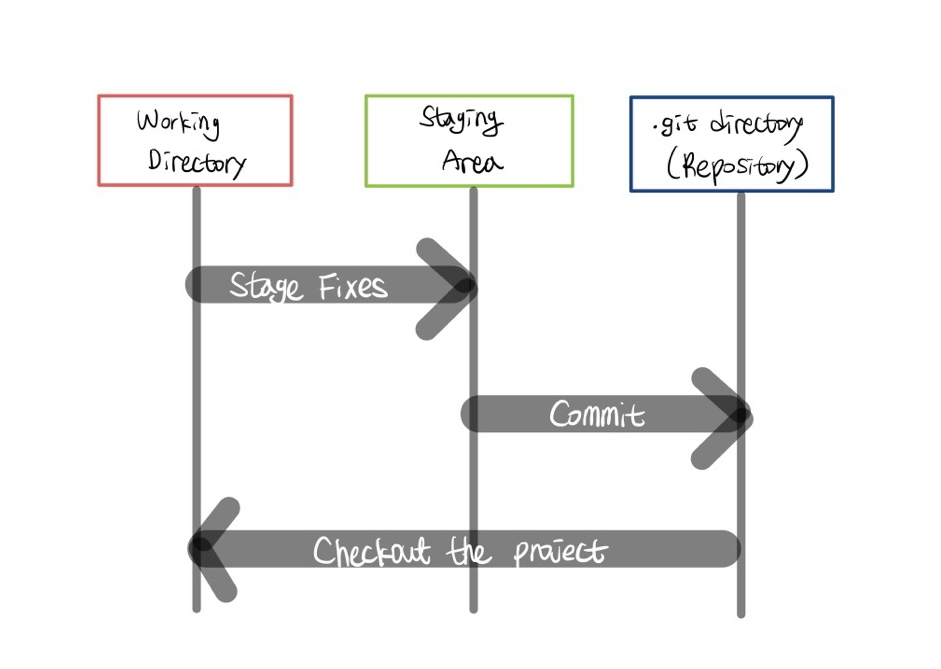

###### 7월 5일

# Git


- 분산 버전 관리시스템 : 코드의 버전을 관리하는 도구
  - Google Docs에서 수정 사항마다 버전을 기록할 수 있듯이
- 리누스 토르발스가 개발
- 컴퓨터 파일의 변경사항을 추적하고 여러 명의 사용자들 간에 해당 파일들의 작업을 조율
- Git은 데이터를 파일 시스템의 스냅샷으로 관리하여 크기가 매우 작음


1. **작업을 하고**
2. **변경된 파일을 모아 (add)**
3. **버전으로 남긴다. (commit)**


## 기본 흐름

Git은 파일을 modified, staged, committed로 관리한다.

> 파일에 라벨을 붙이는 것

- modified: 파일이 수정된 상태 (add 명령어를 통해 staging area로)
- staged: 수정한 파일을 곧 커밋할 것이라고 표시한 상태 (commit 명령어로 저장소)
- committed: 커밋(버전 업로드)이 된 상태



1. **Working Directory** : 1통
   - 파일의 변경사항
2. **Staging Area (임시 공간)** : 2통
   - 버전으로 기록하기 위한 파일 변경사항의 기록
3. **Repository** : 3통


## 기본 명령어

| 명령어                 | 내용                 |
| :--------------------- | -------------------- |
| pwd                    | 현재 디렉토리 출력   |
| cd <디렉토리이름>      | 디렉토리 이동        |
| cd .                   | 현재 디렉토리        |
| cd ..                  | 상위 디렉토리로 이동 |
| ls (list)              | 목록                 |
| mkdir (make directory) | 디렉토리 생성        |
| touch                  | 파일 생성            |
| rm <파일명>            | 파일 삭제하기        |
| rm -r <폴더명>         | 폴더 삭제하기        |


### 1. git init

​	:	로컬 저장소 생성

​		`(master)`라고 표시됨


### 2. git add <파일명>.

​	:	특정 파일/폴더의 변경사항 추가

- working directory상의 변경 내용을 staging area에 추가하기 위해 사용

  - untracked 상태의 파일을 staged로 변경

  - modified 상태의 파일을 staged로 변경

​	물리적 위치 변경은 아님


### 3. git commit -m "<커밋메시지>"

​	:	커밋 (버전 기록)

- staged 상태의 파일들을 커밋을 통해 버전으로 기록


### 4. git status

​	:	상태 확인 (1통, 2통 확인)

```bash
# 커밋할 것이 없다, 즉 stating area가 비어있다.
nothing to commit,

# 지금 새로 작업한 것도 없다, 즉 1통도 비어있다!
					working tree clean
```


### 5. git log

​	:	버전 확인 (3통 확인)

- 현재 저장소에 기록된 커밋을 조회
- 다양한 옵션을 통해 로그를 조회할 수 있음
  - `$ git log -1` 가장 최근 커밋 조회
  - `$ git log --oneline` 한 줄로 조회
  - `$ git log -2 --oneline` 최근 2 개를 한 줄로 보여줘!


### 6. git config

​	:	커밋을 하기 위해 반드시 필요한 사용자 정보 (commit author)

```bash
# Github에서 설정한 username으로 설정
$ git config --global user.name "username"

# Github에서 설정한 email로 설정
$ git config --global user.email "my@email.com"
```

- 설정 확인
  - git config -l
  - git config --global -l
  - git config user.name


### 📑 요약

| 명령어                   | 내용                           |
| ------------------------ | ------------------------------ |
| git init                 | 로컬 저장소 생성               |
| git add <파일명>.        | 특정 파일/폴더의 변경사항 추가 |
| git commit -m "<파일명>" | 커밋 (버전 기록)               |
| git status               | 상태 확인 (1통, 2통 확인)      |
| git log                  | 버전 확인 (3통 확인)           |


