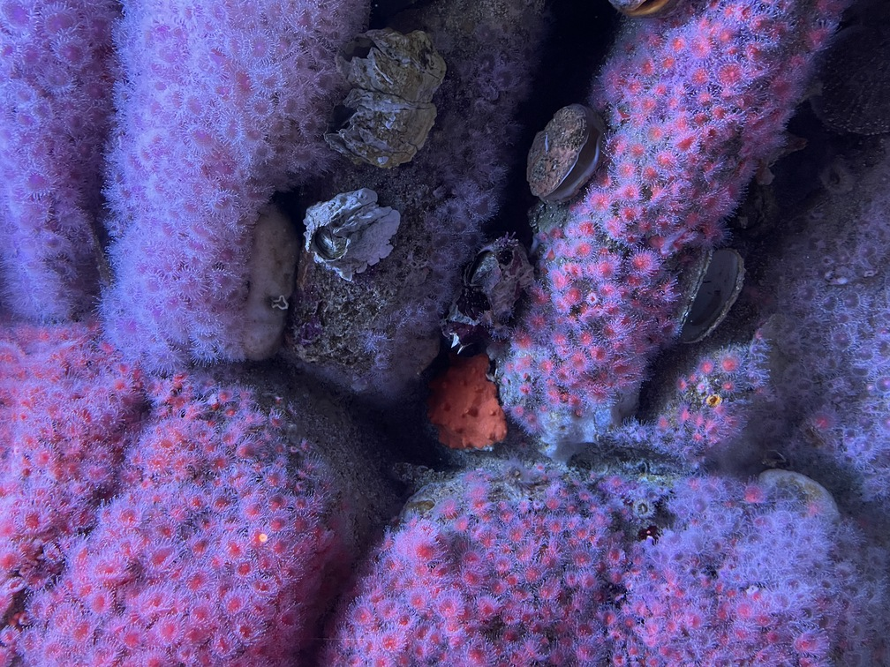
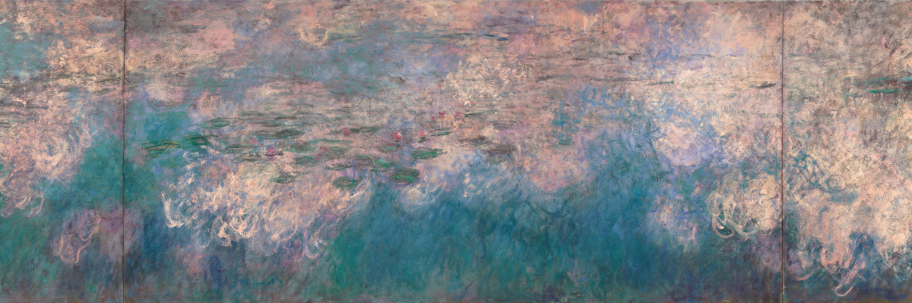

# Markdown


## 장점

1. 문법이 쉽다.
2. 관리가 쉽다.
3. plain하게 개발 내용을 정리 가능하다.
4. 지원 가능한 플랫폼과 프로그램이 다양하다.


## 단점

1. 표준이 없다.
2. 모든 HTML 마크업을 대신하지 못한다.


## 문법

### Headers

```bash
# H1
## H2
### H3
#### H4
##### H5
###### H6
```


### List

#### 	1. Ordered List

​	:	`숫자. + space bar`를 사용한다.

```bash
1. 첫 번째
2. 두 번째
3. 세 번째
```

```bash
1. 일
	1. 하나
	2. 둘
	3. 셋
2. 이
3. 삼
```


- `Tab` 들여쓰기


#### 	2. Unordered List

​	:	`- space`, `* space`, 또는 `+ space`를 사용한다. (혼합해서도 사용 가능)

```bash
- 복숭아
	- 딱복
	- 물복

+ Red
	+ Green
		+ Yellow

* Earth
	* Mars
		* Venus
```

- 복숭아
  - 딱복
  - 물복
- Red
  - Green
    - Yellow

* Earth
  * Mars
    * Venus


### Fenced Code block

​	:	` ``` 문법, 특정 언어``` ` `를 3번 이상 입력하고 코드 종류를 적는다.

```python
print('Hello')
```

```html
print('hello')

# 주석?

<h1>
    제목 1
</h1>

<!-- 주석 -->
```


### Inline Code block

​	:	``(backtick)기호`를 양 끝에 입력한다.

​	형광펜의 기능은 아님


### Link

- `[이름](주소)`
  - [구글](http://www.google.com)
  - [네이버](http://www.naver.com)

- `[폴더](./폴더이름)`


### Images

- 2가지 경로

  - 절대경로

  - 상대경로




> picture I took at Monterey Bay Aquarium




> Claude Monet’s Water Lilies


### BlockQuotes

​	:	`>`를 사용한다.

```bash
> 잠온다.
배고프다.

> 1st
>	> 2nd
>	>	> 3rd
```

> 잠온다.
>
> 배고프다.

> 1st
>
> > 2nd
> >
> > > 3rd

​		다른 마크다운 요소를 포함할 수도 있다.

> #### H4
>
> - ul
>
>   ```bash
>   code
>   ```


### Table

​	:	`메뉴 > 본문 > 표 > 표 삽입`을 하거나 `ctrl + t`를 사용한다.

| Name   | Menu              |
| ------ | ----------------- |
| 임선주 | 아이스 아메리카노 |
| 김민지 | 카페라테          |


### Text 강조

#### 	1. Bold

- `**text**`
- `__text__`
- `ctrl + b`

​		You write **bold** text with **two** asterisks at __both__ ends. 


#### 	2. Italic

- `*text*`

- `_text_`
- `ctrl + i`

​		You write *italic* text with *one* asterisk at _both_ ends.


#### 	3. Strikethrough

​		`~~text~~`

​		~~strikethrough~~

- Bold + Italic

  `***text***`

​	***	bold + italic***

- Bold + Italic + Strikethrough

​		`~~***text***~~` (vice versa도 가능)

​		~~***다 써보자***~~


#### 4. 😀 Emoji

​		`window + .`


### 수평선

​	3개 이상의 `***`, `---`, 또는 `___`

```bash
***
---
___
```


***

---

___


***📌 저장을 습관화!!***

