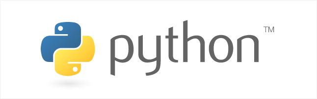
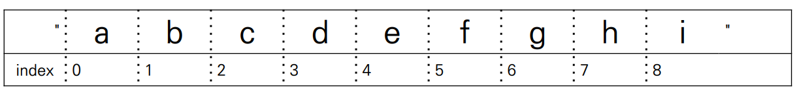
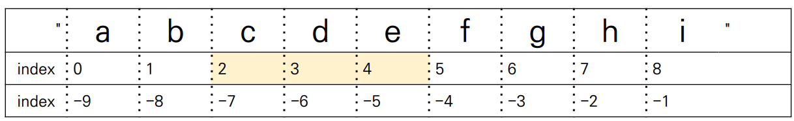
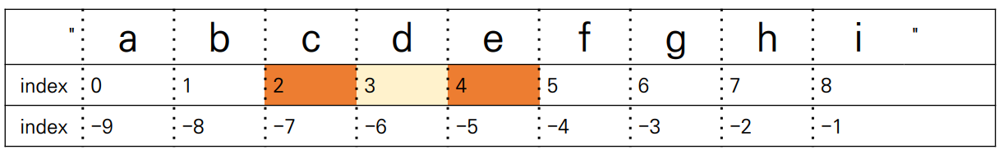
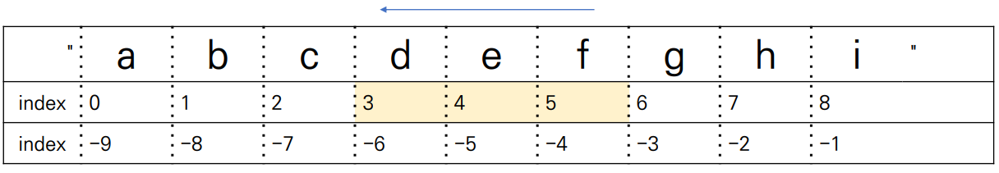
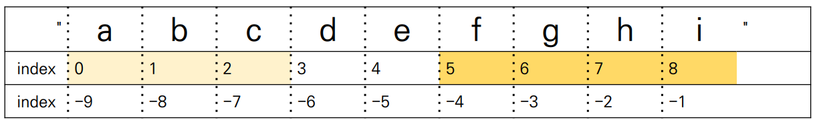
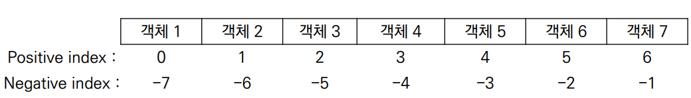
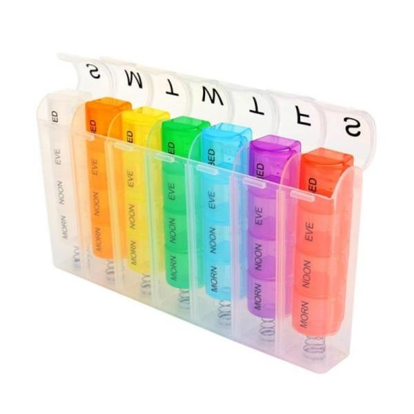

###### 7월 11일

# Python



- 컴퓨터 프로그래밍 언어 중 하나

  - 컴퓨터(Computer): Caculation + Remember
  - 프로그래밍(programming): 명령어의 모음(집합)
  - 언어: 자신의 생각을 나타내고 전달하기 위해 사용하는 체계, 문법적으로 맞는 말의 집합
  - 컴퓨터 프로그래밍 언어: 컴퓨터에게 명령하기 위한 약속

- 선언적 지식(declarative knowledge): 사실에 대한 내용

- **명령적 지식**(imperative knowledge): "How-to"

  컴퓨터가 어떻게 할 것인지를 명확하게 명령해야 한다.


## 1. 파이썬 개발 환경

### 파이썬(Python)이란?

- Easy to learn
  - 다른 프로그래밍 언어보다 문법이 간단하면서도 엄격하지 않음
    - 예시: 변수에 별도의 타입 지정이 필요 없음 (동적 타이핑 언어)
  - 문법 표현이 매우 간결하여 프로그래밍 경험이 없어도 짧은 시간 내에 마스터할 수 있음
    - 예시: 문장을 구분할 때 중괄호({,}) 대신 들여쓰기를 사용
- Expressive Language
  - 같은 작업에 대해서도 C나 자바로 작성할 때 보다 더 간결하게 작성 가능
- 크로스 플랫폼 언어
  - Windows, mac OS, Linux, Unix 등 다양한 운영체제에서 실행 가능


### 파이썬의 특징

- 인터프리터 언어(Interpreter)

  - 소스코드를 기계어로 변환하는 컴파일 과정 없이 바로 실행 가능
  - 코드를 대화하듯 한 줄 입력하고 실행한 후, 바로 확인할 수 있음

  ```python
  >>> 2 + 2 # 사용자가 입력 (input)
  4		  # 컴퓨터가 대답 (output)
  ```

- **객체 지향 프로그램**

  - 파이썬은 객체 지향 언어이며, 모든 것이 객체로 구현되어 있음
  - 객체(object): 숫자, 문자, 클래스 등 값을 가지고 있는 모든 것

  

## 2. 기초 문법

- 코드 스타일 가이드
  - 코드를 '어떻게 작성할지'에 대한 가이드라인
  - 파이썬에서 제안하는 스타일 가이드
    - [PEP8](https://peps.python.org/pep-0008/)
  - 기업, 오픈소스 등에서 사용되는 스타일 가이드
    - [Google Style guide](https://google.github.io/styleguide/pyguide.html)

> ❗ 코드 해석 순서
>
> - 위에서 아래로
> - 오른쪽에서 왼쪽으로


### 1) 들여쓰기(Identation)

- Space Sensitive
  - 문장을 구분할 때, 들여쓰기를 사용
  - 들여쓰기를 할 때는 4칸(space키 4번) 혹은 1탭(Tab키 1번)을 입력
    - 주의! 한 코드 안에서는 반드시 한 종류의 들여쓰기를 사용 → 혼용하면 안됨
      - Tab으로 들여쓰면 계속 Tab으로 들여써야 함
      - 원칙적으로는 공백(빈칸, space) 사용을 권장 *PEP8 권장사항

### 2) 변수(Variable)

- 변수란?

  - 컴퓨터 메모리 어딘가에 저장되어 있는 객체를 참조하기 위해 사용된 이름

  - 동일 변수에 다른 객체를 언제든 할당할 수 있기 때문에, 

    즉, 참조하는 객체가 바뀔 수 있기 때문에 **변수**라고 불림

- 변수는 할당 연산자(=)를 통해 값을 할당(assignment)

- `type()` : 변수에 할당된 값의 타입

- `id()` : 변수에 할당된 값(객체)의 고유한 identity 값이며, 메모리주소

 ```python
 # print('Happy Coding!')
 # print('happy Coding!')
 # print('Happy Coding!')
 # print('Happy Coding!')
 # print('Happy Coding!')
 
 # hello라는 이름의 변수에 
 # 'Happy Coding!' 값을 할당
 hello = 'Happy Coding'
 print(hello)
 print(hello)
 print(hello)
 print(hello)
 print(hello)
 
 a = 5
 b = 3
 print(a + b) # 8
 
 a = 'hello'
 print(a) # 'hello'
 ```


- 같은 값을 동시에 할당할 수 있음

```python
x = y = 1004
print(x, y)
```


- 다른 값을 동시에 할당할 수 있음(multiple assignment)

```python
x, y = 1, 2
print(x, y)
```


- x = 10, y = 20일 때, 각각 값을 바꿔서 저장하는 코드

```python
x, y = 10, 20

# 방법1 : 임시 변수 활용
tmp = x
x = y
y = tmp
print(x, y)

# 방법2 : Pythonic
y, x = x, y
print(x, y)
```


### 3) 식별자( Identifiers)

- 파이썬 객체(변수, 함수, 모듈, 클래스 등)를 식별하는 데 사용하는 이름(name)

- 규칙

  - 식별자의 이름은 영문 알파벳, 언더스코어(_), 숫자로 구성
  - 첫 글자에 숫자가 올 수 없음
  - 길이제한이 없고, 대소문자를 구별
  - 다음의 keywords는 예약어(reserved words)로 사용할 수 없음
    - False, None, True, and, as, assert, async, await, break, class, continue, def, del, elif, else, except, finally, for, from, global, if, import, in, is, lambda, nonlocal, not, or, pass, raise, return, try, while, with, yield

  - 내장함수나 모듈 등의 이름으로도 만들면 안됨
    - 기존의 이름에 다른 값을 할당하게 되므로 더이상 작동하지 않음


### 4) 사용자 입력

- input([prompt])
  - 사용자로부터 값을 즉시 입력 받을 수 있는 내장함수
  - 대괄호 부분에 문자열을 넣으면 입력 시, 해당 문자열을 출력할 수 있음
  - 반환값은 항상 문자열의 형태로 반환

```python
name = input('이름을 입력해주세요: ')
print(name)
```


### 5) 주석(Comment)

- 코드에 대한 설명
  - 중요한 점이나 다시 확인하여야 하는 부분을 표시
  - 컴퓨터는 주석을 인식하지 않음, 사용자만을 위한 것
- 가장 중요한 습관
  - 개발자에게 주석을 작성하는 습관은 매우 중요!
  - 쉬운 이해와 코드의 분석 및 수정이 용이
    - 주석은 코드 실행에 영향을 미치지 않음
    - 프로그램의 속도를 느리게 하지 않음
    - 용량을 늘리지 않음

- 한 줄 주석
  - 주석으로 처리될 내용 앞에 `#`을 입력
  - 한 줄을 온전히 사용할 수도 있고, 그 줄 코드 뒷부분에 작성할 수도 있음

```python
# 주석(comment)입니다.

# print('hello')
print('world') # 주석
```


## 3. 자료형

### 1) 불린형(Boolean Type)

- True / False 값을 가진 타입은 bool

- 비교/논리 연산을 수행함에 있어서 활용됨

- 다음은 모두 False로 변환

  - `0`, `0.0`, `()`, `[]`, `{}`, `"`, `None`

- 논리 연산자(Logical Operator)

  - 논리식을 판단하여 True와 False를 반환함

    | 연산자  | 내용                           |
    | ------- | ------------------------------ |
    | A and B | A와 B 모두 True일 시, True     |
    | A or B  | A와 B 모두 False일 시, False   |
    | Not     | True를 False로, False를 True로 |

    - and : 모두 참인 경우 참, 그렇지 않으면 거짓
    - or : 둘 중 하나만 참이라도 참, 그렇지 않으면 거짓
    - not : 참 거짓 반대의 결과


### 2) 수치형(Numeric Type)

#### (1) int (정수, integer)

- 모든 정수의 타입은 int
- 매우 큰 수를 나타낼 때 오버플로우가 발생하지 않음
  - 오버플로우(overflow) : 데이터 타입별로 사용할 수 있는 메모리의 크기를 넘어서는 상황

#### (2) float (부동소수점, 실수, floating point number)

- 정수가 아닌 모든 실수는 float 타입

- 부동소수점
- Floating point rounding error : 부동소수점에서 실수 연산 과정에서 발생 가능

#### (3) complex (복소수, complex number)

- 실수부와 허수부로 구성된 복소수는 모두 complex 타입
- 허수부를 j로 표현


#### 산술 연산자(Arithmetic Operator)

- 기본적인 사칙연산 및 수식 계산

  | 연산자 | 내용     |
  | ------ | -------- |
  | +      | 덧셈     |
  | -      | 뺄셈     |
  | *      | 곱셈     |
  | %      | 나머지   |
  | /      | 나눗셈   |
  | //     | 몫       |
  | **     | 거듭제곱 |


#### 복합 연산자(In-place Operator)

- 연산과 할당이 함께 이루어짐

  | 연산자  | 내용       |
  | ------- | ---------- |
  | a += b  | a = a + b  |
  | a -= b  | a = a - b  |
  | a *= b  | a = a * b  |
  | a /= b  | a = a / b  |
  | a //= b | a = a // b |
  | a %= b  | a = a % b  |
  | a **= b | a = a ** b |


#### 비교 연산자(Comparison Operator)

- 값을 비교하며, True / False 값을 리턴함

  | 연산자 | 내용                        |
  | ------ | --------------------------- |
  | <      | 미만                        |
  | <=     | 이하                        |
  | >      | 초과                        |
  | >=     | 이상                        |
  | ==     | 같음                        |
  | !=     | 같지 않음                   |
  | is     | 객체 아이덴티티(OOP)        |
  | is not | 객체 아이덴티티가 아닌 경우 |


### 3) 문자열(String Type)

- 모든 문자는 str 타입

- 문자열은 작은 따옴표(')나 큰 따옴표(")를 활용하여 표기

  - 문자열을 묶을 때 동일한 문장부호를 활용

  - PEP8에서는 소스코드 내에서 하나의 문장부호를 선택하여 유지하도록 함

    ```python
    print('hello')
    # hello
    print(type('hello'))
    # <class 'str'>
    ```

- **중첩따옴표**(Nested Quotes)

  - 따옴표 안에 따옴표를 표현할 경우

    - 작은 따옴표가 들어 있는 경우는 큰 따옴표로 문자열 생성
    - 큰 따옴표가 들어 있는 경우는 작은 따옴표로 문자열 생성

    ```python
    print("문자열 안에 '작은 따옴표'를 사용하려면 큰 따옴표로 묶는다.")
    print('문자열 안에 "큰 따옴표"를 사용하려면 작은 따옴표로 묶는다.')
    ```

- **삼중따옴표**(Triple Quotes)

  - 작은 따옴표나 큰 따옴표를 삼중으로 사용

    - 따옴표 안에 따옴표를 넣을 때,
    - 여러줄을 나눠 입력할 때 편리

    ```python
    print('''문자열 안에 '작은 따옴표'나
    "큰 따옴표"를 사용할 수 있고
    여러 줄을 사용할 때도 편리하다.''')
    ```


#### 인덱싱

- 인덱스를 통해 특정 값에 접근할 수 있음
  - s[1] ⇒ ‘b’




- 문자열 슬라이싱(Slicing) 예제

  - s[2:5] ⇒ 'cde'   # 인덱스 2 이상, 5 미만

  

  - s[2:5:2] ⇒ 'ce'    # 인덱스 2부터 5까지 중에, 2 step씩

  

  - s[5:2:-1] ⇒ 'fed'

  

  - s[:3] ⇒ 'abc'    # 기본 0에서 시작    # 처음부터 3까지
  - s[5:] ⇒ 'fghi'    # 기본 마지막까지    # 5부터 끝까지

  

  - s[::] ⇒ 'abcdefghi’    # 처음부터 끝까지 1씩    # s[0:len(s):1]과 동일 
  - s[::-1] ⇒ 'ihgfedcba’    # 처음부터 끝까지 -1씩    # s[-1:-(len(s)+1):-1]과 동일


#### 기타

- 결합(Concatenation)

  ```python
  'hello, ' + 'python!'
  # 'hello, python!'
  ```

- 반복(Repetition)

  ```python
  'hi!' * 3
  # 'hi!hi!hi!'
  ```

- 포함(Membership)

  ```python
  'a' in 'apple'
  # True 
  'app' in 'apple'
  # True
  'b' in 'apple'
  ```


#### Escape sequence

- 문자열 내에서 특정 문자나 조작을 위해서 역슬래시(\\)를 활용하여 구분

| 예약문자 | 내용(의미) |
| -------- | ---------- |
| \n       | 줄 바꿈    |
| \t       | 탭         |
| \r       | 캐리지리턴 |
| \0       | Null       |
| \\\      | \          |
| \\'      | '          |
| \\"      | "          |

```python
print('철수 \'안녕\'')
# 철수 '안녕'
print('이 다음은 엔터.\n그리고 탭\t탭')
# 이 다음은 엔터.
# 그리고 탭 탭
```


#### String Interpolation

- 문자열을 변수를 활용하여 만드는 법

1. **%-formatting**

   ```python
   name = 'Kim'
   score = 4.5
   print('Hello, %s' % name)
   print('내 성적은 %d' % score)
   print('내 성적은 %f' % score)
   # Hello, Kim
   # 내 성적은 4
   # 내 성적은 4.500000
   ```

2. **f-string**

   ```python
   name = 'Kim'
   score = 4.5
   print(f'Hello, {name}! 성적은 {score}')
   # Hello, Kim! 성적은 4.5
   
   pi = 3.141592
   print(f'원주율은 {pi:.3}. 반지름이 2일때 원의 넓이는 {pi*2*2}')
   # '원주율은 3.14. 반지름이 2일때 원의 넓이는 12.566368'
   ```


#### 문자열 특징

- Immutable : 변경 불가능함

  ```python
  a = 'my string?'
  a[-1] = ‘!’
  
  TypeError Traceback (most recent call last)
  ----> 1 a[-1] = '!’
  TypeError: 'str' object does not support item assignment
  ```

- Iterable : 반복 가능함

  ```python
  a = '123'
  for char in a:
  	print(char)
  ```

  

### 4) None

- 파이썬에서 값이 없음을 표현하기 위한 Type
- 일반적으로 반환 값이 없는 함수에서 사용하기도 함

#### 

## 4. 형 변환(Typecasting)

자료형 변환(Typecasting)

- 파이썬에서 데이터 형태는 서로 변환할 수 있음

### 1. 암시적 형 변환(Implicit Typecasting)

- 사용자가 의도하지 않고, 파이썬 내부적으로 자료형을 변환 하는 경우

  - bool

  - Numeric type (int, float, complex)

  ```python
  True + 3
  # 4
  3 + 5.0
  # 8.0
  3 + 4j + 5
  # (8+4j)
  ```


### 2. 명시적 형 변환(Explicit Typecasting)

- 사용자가 특정 함수를 활용하여 의도적으로 자료형을 변환 하는 경우
- int
  - str*, float ⇒ int
- float
  - str*, int ⇒ float
- str
  - int, float, list, tuple, dict ⇒ str

> *형식에 맞는 문자열만 가능

```python
# 문자열은 암시적 타입 변환이 되지 않음
'3' + 4
# TypeError: can only concatenate str (not "int") to str

# 명시적 타입 변환이 필요함
int('3') + 4
# 7

# 정수 형식이 아닌 경우 타입 변환할 수 없음
int('3.5') + 5
# ValueError: invalid literal for int() with base 10: '3.5'

float('3.5') + 5
# 8.5
```


## 5. 컨테이너

- 컨테이너란?
  - 여러 개의 값을 담을 수 있는 것(객체)으로, 서로 다른 자료형을 저장할 수 있음
  - 예시 : List, tuple

- 컨테이너의 분류

  - 순서가 있는 데이터 (Ordered) vs. 순서가 없는 데이터 (Unordered)

  - 순서가 있다 != 정렬되어 있다.


### 1. 시퀀스형 컨테이너(Sequence Container)

- 문자열(immutable) : 문자들의 나열
- 리스트(mutable) : 변경 가능한 값들의 나열
- 튜플(immutable) : 변경 불가능한 값들의 나열
- 레인지(immutable) : 숫자의 나열


- 시퀀스형 주요 공통 연산자

| 연산             | 결과                                                       |
| ---------------- | ---------------------------------------------------------- |
| s[i]             | s 의 i 번째 항목, 0에서 시작합니다                         |
| s[i:j]           | s 의 i 에서 j 까지의 슬라이스                              |
| s[i:j:K]         | s 의 i 에서 j 까지 스텝 k 의 슬라이스                      |
| s + t            | s 와 t 의 이어 붙이기                                      |
| s * n 또는 n * s | s 를 그 자신에 n 번 더하는 것                              |
| x in s           | s 의 항목 중 하나가 x 와 같으면 True, 그 렇지 않으면 False |
| x not in s       | s 의 항목 중 하나가 x 와 같으면 False, 그 렇지 않으면 True |
| len(s)           | s 의 길이                                                  |
| min(s)           | s의 가장 작은 항목                                         |
| max(s)           | s의 가장 큰 항목                                           |


#### 1) 리스트(List)

- 변경 가능한 값들의 나열된 자료형
- 순서를 가지며, 서로 다른 타입의 요소를 가질 수 있음
- 변경 가능하며(mutable), 반복 가능함(iterable)
- 항상 대괄호 형태로 정의하며, 요소는 콤마로 구분

> [ 0, 1, 2, 3, 4, 5 ]


- 리스트는 대괄호([]) 혹은 list() 를 통해 생성
- 순서가 있는 시퀀스로 인덱스를 통해 접근 가능
  - 값에 대한 접근은 list[i]



```python
# 생성
my_list = []
another_list = list()
type(my_list)
# <class 'list'>
type(another_list)
# <class 'list'>
```

```python
# 값 접근
a = [1, 2, 3]
print(a[0])
# 1

# 값 변경
a[0] = '1'
print(a)
# ['1', 2, 3]
```


- 값 추가는 .append()를 활용하여 추가하고자 하는 값을 전달

  ```python
  even_numbers = [2, 4, 6, 8]
  even_numbers.append(10)
  even_numbers
  # => [2, 4, 6, 8, 10]
  ```

- 값 삭제는 .pop()을 활용하여 삭제하고자 하는 인덱스를 전달

  ```python
  even_numbers = [2, 4, 6, 8]
  even_numbers.pop(0)
  even_numbers
  # => [4, 6, 8]
  ```


- 예제

```python
boxes = ['apple', 'banana']
len(boxes)
# 2
boxes[1]
# 'banana'
boxes[1][0]
# 'b'
```


#### 2) 튜플(Tuple)

- 불변한 값들의 나열
- 순서를 가지며, 서로 다른 타입의 요소를 가질 수 있음
- 변경 불가능하며(immutable), 반복 가능함(iterable)
- 항상 소괄호 형태로 정의하며, 요소는 콤마로 구분

> (0, 1, 3)


- 소괄호(()) 혹은 tuple()을 통해 생성

- 값에 대한 접근은 리스트와 동일하게 인덱스로 접근

  - 값 변경은 불가능하여 추가/삭제도 불가능함

  ```python
  # 값 접근
  a = (1, 2, 3, 1)
  a[1]
  
  # 값 변경 => 불가능
  a[1] = ‘3’
  
  TypeError Traceback (most recent call last)
  1 # 값 변경 => 불가능 ---->
  2 a[1] = '3’
  TypeError: 'tuple' object does not support item assignment
  ```


#### 3) 레인지 (Range)

- range(n=0, m, s=1)
- 숫자의 시퀀스를 나타내기 위해 사용
- 기본형 : range(n)
  - 0부터 n-1까지의 숫자의 시퀀스
- 범위 지정 : range(n, m)
  - n부터 m-1까지의 숫자의 시퀀스
- 범위 및 스텝 지정 : range(n, m, s)
  - n부터 m-1까지 s만큼 증가시키며 숫자의 시퀀스
- 변경 불가능하며(immutable), 반복 가능함(iterable)

```python
# 0부터 특정 숫자까지
list(range(3))
# [0, 1, 2]

# 숫자의 범위
list(range(1, 5))
# [1, 2, 3, 4]

# step 활용
list(range(1, 5, 2))
# [1, 3]
```

```python
# 역순
list(range(6, 1, -1))
# [6, 5, 4, 3, 2]

list(range(6, 1, 1))
# []
```


### 2. 비시퀀스형 컨테이너 (Associative Container)

#### 1) 세트(Set)

- 유일한 값들의 모음(collection)
- 순서가 없고 중복된 값이 없음
  - 수학에서의 집합과 동일한 구조를 가지며, 집합 연산도 가능
- 변경 가능하며(mutable), 반복 가능함(iterable)
  - 단, set은 순서가 없어 반복의 결과가 정의한 순서와 다를 수 있음


- 중괄호({}) 혹은 set()을 통해 생성
  - 빈 Set를 만들기 위해서는 set()을 반드시 활용해야 함
- 순서가 없어 별도의 값에 접근할 수 없음

```python
{1, 2, 3, 1, 2}
# {1, 2, 3}    # 중복 값 제거
type({1, 2, 3})
# <class 'set'>
blank_set = set()
```

```python
{'hi', 1, 2}
# => {1, 2, 'hi'}
```

```python
{1, 2, 3}[0]

TypeError Traceback (most recent call last)
<ipython-input-95-0c8fa4a2ff15> in <module>
----> 1 {1, 2, 3}[0]
TypeError: 'set' object is not subscriptable
# 순서가 없어 인덱스 접근 등 특정 값에 접근할 수 없음
```


- 값 추가는 .add()를 활용하여 추가하고자 하는 값을 전달
- 값 삭제는 .remove()를 활용하여 삭제하고자 하는 값을 전달

```python
numbers = {1, 2, 3}
numbers.add(5)
numbers
# => {1, 2, 3, 5}
numbers.add(1)
numbers
# => {1, 2, 3, 5}
```

```python
numbers = {1, 2, 3}
numbers.remove(1)
numbers
# => {2, 3}
numbers.remove(5)
# Traceback (most recent call last):
# File "<stdin>, line 1, in <module>
#KeyError: 5
```


- 세트를 활용하면 다른 컨테이너에서 중복된 값을 쉽게 제거할 수 있음 
  - 단, 이후 순서가 무시되므로 순서가 중요한 경우 사용할 수 없음
- 아래의 리스트에서 고유한 지역의 개수는?

```python
my_list = ['서울', '서울', '대전', '광주',
           '서울', '대전', '부산', '부산’]
len(set(my_list))
# 4
set(my_list)
# {'광주', '대전', '부산', '서울'}
```


#### 2) 딕셔너리(Dictionary)

-  키-값(key-value) 쌍으로 이뤄진 모음(collection)
  - 키(key)
    - 불변 자료형만 가능 (리스트, 딕셔너리 등은 불가능함)
  - 값(values)
    - 어떠한 형태든 관계 없음
- 키와 값은 `:`로 구분된다. 개별 요소는 `,`로 구분된다.
- 변경 가능하며(mutable), 반복 가능함(iterable)
  - 딕셔너리는 반복하면 키가 반환된다.

```python
students = {'홍길동': 30, '김철수': 25}
students['홍길동']
# 30
```



- key와 value가 쌍으로 이뤄진 자료구조
  - key는 변경 불가능한 데이터(immutable)만 활용 가능
    - string, integer, float, boolean, tuple, range
  - value는 모든 값으로 설정 가능 (List, Dictionary 등)

```python
dict_c = {[1, 2, 3]: 'hi’}
TypeError Traceback (most recent call last)
----> 1 dict_c = {[1, 2, 3]: 'hi’}
TypeError: unhashable type: 'list
```

```python
movie = {
    'title': '설국열차',
    'genres': ['SF', '액션', '드라마'],
    'open_date': '2013-08-01',
    'time': 126,
    'adult': False,
}

movie['genres']
# ['SF', '액션', '드라마']

movie['actors’]
Traceback (most recent call last):
File "<stdin>", line 1, in <module>
KeyError: 'actors'
```


- 딕셔너리에 키와 값의 쌍을 추가할 수 있으며,
- 이미 해당하는 키가 있다면 기존 값이 변경됩니다.

```python
students = {'홍길동': 100, '김철수': 90}
students['홍길동'] = 80
# {'홍길동': 80, '김철수': 90}
students['박영희'] = 95
# {'홍길동': 80, '김철수': 90, '박영희': 95}
```


- 키를 삭제하고자하면 .pop()을 활용하여 삭제하고자 하는 키를 전달

```python
students = {'홍길동': 30, '김철수': 25}
students.pop('홍길동')
students
# {'김철수': 25}
```

- 키가 없는 경우는 KeyError 발생

```python
students = {'홍길동': 30, '김철수': 25}
students.pop('jane')
Traceback (most recent call last):
File "<stdin>", line 1, in <module>
KeyError: 'jane'
```

