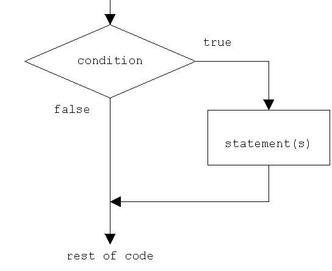

###### 7월 12일

# Python Day 2

## 제어문(Control Statement)

- 파이썬은 기본적으로 위에서부터 아래로 순차적으로 명령을 수행
- 특정 상황에 따라 코드를 선택적으로 실행(분기/조건)하거나 계속하여 실행(반복)하는 제어가 필요함
- 제어문은 순서도(flow chart)로 표현이 가능




## 조건문

- 조건문은 참/거짓을 판단할 수 있는 조건식과 함께 사용

### 기본 형식

- expression에는 참/거짓에 대한 조건식
  - 조건이 참인 경우 이후 들여쓰기 되어있는 코드 블럭을 실행
  - 이외의 경우 else 이후 들여쓰기 되어있는 코드 블럭을 실행
    - else는 선택적으로 활용 가능함

```python
if < expression >:
    # Run this Code block # True인 경우
else:
    # Run this Code block # False인 경우
```


- 예제


```python
# a가 양수일 때
a = 10
if a >= 0:
    print('양수')
else:
    print('음수')
print(a) # '양수'로 출력

# a가 음수일 때
a = -10
if a >= 0:
    print('양수')
else:
    print('음수')
print(a) # '음수'로 출력
```


- 실습 문제
  - 조건문을 통해 변수 num의 값의 홀수/짝수 여부를 출력하시오.
  - 이때 num은 input을 통해 사용자로부터 입력을 받으시오.

```python
# 1. num은 input으로 사용자에게 입력을 받으세요.
num = int(input())
# print(num) # 확인하는 절차

# 2. 조건문을 통해서 홀수/짝수 여부를 출력하세요.
# 숫자로서의 num!
if num % 2 == 1:
    print('홀수')
else:
    print('짝수')# Type 확인 절차
```


### 복수 조건문

- 복수의 조건식을 활용할 경우 elif를 활용하여 표현함
- 조건식을 동시에 검사하는 것이 아니라 순차적으로 비교함

```python
if <expression>:
    # Code block
elif <expression>:
    # Code block
elif <expression>:
    # Code block
else:
    # Code block
```


- 실습 문제
  - 다음은 미세먼지 농도에 따른 등급일 때, dust 값에 따라 등급을 출력하는 조건식을 작성하시오.


```python
dust = 80

# dust가 150보다 크면, 매우 나쁨
if dust > 150:
    print('매우 나쁨')
    
# 80보다 크면, 나쁨
elif dust > 80
    print('나쁨')
    
# 30보다 크면, 나쁨
elif dust > 30:
    print('보통')
    
# 좋음
# else는 위의 모든 조건에 해당하지 않는 나머지의 경우이기에 별도의 조건은 불가능 
# 조건문에서 else는 생략이 가능하다.
else :
    print('좋음')
```


### 중첩 조건문

- 조건문은 다른 조건문에 중첩되어 사용될 수 있음
  - 들여쓰기를 유의하여 작성할 것


- 실습 문제
  - 아래의 코드에서 중첩조건문을 활용하여 미세먼지 농도(dust 값)이 300이 넘는 경우 ‘실외 활동을 자제하세요.’를 추가적으로 출력하고 음수인 경우 ‘값이 잘못 되었습니다.’를 출력하시오.

```python
dust = -10

if dust > 150:
    print('매우 나쁨')
    if dust > 300:
        print('실외 활동을 자제하세요.')
elif dust > 80:
    print('나쁨')
elif dust > 30:
    print('보통')
else:
    if dust >= 0:
        print('좋음')
    else: 
        print('값이 잘못되었습니다.')
```


### 조건 표현식(Conditional Expression)

- 일반적으로 조건에 따라 값을 할당 할 때 활용


- 실습 문제
  - num이 정수일 때, 아래의 코드는 무엇을 위한 코드일까요?

```python
value = num if num >= 0 else -num
```


> 절대값을 저장하기 위한 코드

```python
num = -10

## 조건문 코드
# 1. 양수면 그대로
if num >= 0:
    value = num

# 2. 음수면 - 붙여서
else:
    value = -num
print(num, value)

## 조건 표현식 코드
value = num if num >= 0 else -num
```

- 실습 문제
  - 다음의 코드와 동일한 조건 표현식을 작성하시오.

```python
num = 2
if num % 2:
    result = '홀'
else:
    result = '짝'
print(result)

# 결과
num = 2
result = '홀' if num % 2 else '짝'
print(result)
```


## 반복문(Loop Statement)

- 특정 조건을 도달할 때까지, 계속 반복되는 일련의 문장


### 1. while 문

- 종료조건에 해당하는 코드를 통해 반복문을 종료시켜야 함

- 조건식이 참인 경우 반복적으로 코드를 실행

  - 조건이 참인 경우 들여쓰기 되어 있는 코드 블록이 실행됨
  - 코드 블록이 모두 실행되고, 다시 조건식을 검사하며 반복적으로 실행됨
  - while문은 무한 루프를 하지 않도록 종료조건이 반드시 필요

  ```python
  while <expression>:
      # Code block
  ```


> 📌 [Python Tutor](https://pythontutor.com/) : Code 진행을 visualizing하는 사이트


- 실습 문제

  - 1부터 사용자가 입력한 양의 정수까지의 총합을 구하는 코드를 작성하시오.

  ```python
  # 값 초기화 (처음 시작 값)
  n = 0
  # 0부터 더하기 위해서
  result = 0
  # user_input 값
  user_input = int(input())
  
  # 방법 1
  while n <= user_input:
      result += n
      n += 1
  print(result)
  
  # 방법 2
  while n < user_input:
      print(f'n: {n}, result: {result}') # 그때마다의 결과 적어 놓으면 디버깅 시 편리함
      n += 1
      result += n
  print(result)
  ```

  

### 2. for 문

- 반복가능한 객체를 모두 순회하면 종료 (별도의 종료조건이 필요 없음)
- 시퀀스(string, tuple, list, range)를 포함한 순회가능한 객체(iterable)요소를 모두 순회함

```python
for <변수명> in <iterable>:
    # Code block
```

- For문 일반 형식
  - Iterable
    - 순회할 수 있는 자료형(str,list, dict 등) 
    - 순회형 함수(range, enumerate)

1. **문자열 순회**

- 사용자가 입력한 문자를 한 글자씩 세로로 출력하시오.

  ```python
  chars = input()
  ```

  hi

  ```python
  for char in chars:
      print(char)
  ```

  h

  i

- 사용자가 입력한 문자를 range를 활용하여 한 글자씩 출력하시오.

  - 문자열(String) 순회

  ```python
  chars = input()
  ```

  hi

  ```python
  for idx in range(len(chars)):
      print(chars[idx])
  ```

  h

  i

  > index를 기준으로 순회를 한다.
  >
  > index 값도 같이 활용할 수 있는 장점

2. **enumerate 순회**
3. **딕셔너리 순회**

- 딕셔너리는 기본적으로 key를 순회하며, key를 통해 값을 활용

  ```python
  grades = {'john': 80, 'eric': 90}
  for name in grades:
      print(name)
  ```

  john

  eric

  ```python
  grades = {'john': 80, 'eric': 90}
  for name in grades:
      print(name, grades[name])
  ```

  john 80    # ('john', gades['john'])

  eric 90    # ('eric', gades['eric'])


### 반복문 제어

- **break**

  - 반복문을 종료

    ```python
    n = 0
    while True:
        if n == 3:
            break
        print(n)
        n += 1
    ```

    0

    1

    2

    ```python
    for i in range(10):
        if i > 1:
            print('0과 1만 필요해!')
            break
        print(i)
    ```

    0

    1

    0과 1만 필요해!

- **continue**

  - continue 이후의 코드 블록은 수행하지 않고, 다음 반복을 수행

    ```python
    for i in range(6):
        if i % 2 == 0:
            continue
    print(i)
    ```

    1

    3

    5

- **for-else**

  - 끝까지 반복문을 실행한 이후에 else문 실행

  - break를 통해 중간에 종료되는 경우 else문은 실행되지 않음

    ```python
    for char in 'apple':
        if char == 'b':
            print('b!')
            break
    else:
        print('b가 없습니다.')
    ```

    b가 없습니다.

    ```python
    for char in 'banana':
        if char == 'b':
            print('b!')
            break
    else:
        print('b가 없습니다.')
    ```

    b!


