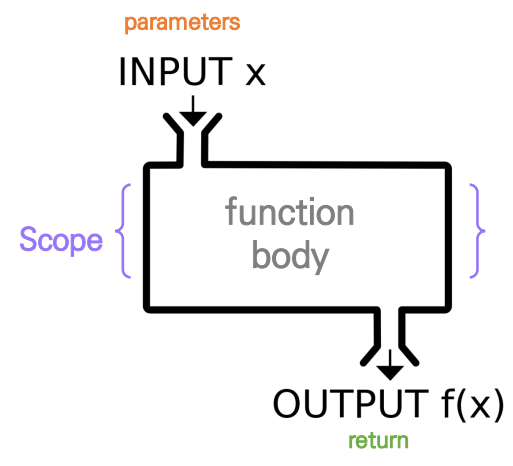

###### 7월 13일

# Python Day 3


## 함수 기초

### 함수의 정의

-  함수(Function)
  - 특정한 기능을 하는 코드의 조각(묶음)
  - 특정 명령을 수행하는 코드를 매번 다시 작성하지 않고, 필요 시에만 호출하여 간편히 사용

> [내장함수](https://docs.python.org/ko/3/library/functions.html)

- 사용자 함수(Custom Function)
  - 구현되어 있는 함수가 없는 경우, 사용자가 직접 함수를 작성 가능

```python
def function_name(parameter):
    # code block
    return returning_value
```


### 함수를 사용하는 이유

- Decomposition
  - 재사용 용이, 코드 중복 방지
- Abstraction

> [파이썬 자습서](https://docs.python.org/3/tutorial/index.html)
>
> [파이썬 표준 라이브러리](https://docs.python.org/3/library/index.html)


### 함수 기본 구조

- 선언과 호출(define & call)
- 입력(Input)
- 범위(Scope)
- 결과값(Output)



- 함수의 선언은 def 키워드를 활용함
- 들여쓰기를 통해 Function body(실행될 코드 블록)를 작성함
  - Docstring은 함수 body 앞에 선택적으로 작성 가능
    - 작성시에는 반드시 첫 번째 문장에 문자열 ''' '''
- 함수는 parameter를 넘겨줄 수 있음
- 함수는 동작 후에 return을 통해 결과값을 전달함

- 함수는 함수명()으로 호출
  - parameter가 있는 경우, 함수명(값1, 값2, …)로 호출

```python
def foo():
return True

foo()

def add(x, y):
return x + y

add (2, 3)
```

- 예시

```python
num1 = 0
num2 = 1

def func1(a, b):
    return a + b
def func2(a, b):
    return a - b
def func3(a, b):
    return func1(a, 5) + func2(5, b)

result = func3(num1, num2)
print(result)
# 9
```

> 함수는 호출되면 코드를 실행하고 return 값을 반환하며 종료된다.


## 함수의 결과값(Output)

- 함수는 반드시 값을 하나만 return한다.

  - 명시적인 return이 없는 경우에도 None을 반환한다.

- 함수는 return과 동시에 실행이 종료된다.

  ```python
  # 절대 실행되지 않는 두 번째 return
  def minus_and_product(x, y):
      return x - y
      return x * y
  
  minus_and_product(4, 5)
  # -1
  ```

- return문을 한번만 사용하면서 두 개 이상의 값을 반환하는 방법은?

  - 튜플 반환

  ```python
  def minus_and_product(x, y):
      return x - y, x * y
  
  minus_and_product(4, 5)
  # (-1, 20)
  ```

- return vs. print

  - return은 함수 안에서 값을 반환하기 위해 사용되는 키워드
  - print는 출력을 위해 사용되는 함수


## 함수의 입력(Input)

- parameter vs. argument
  - Parameter : 함수를 실행할 때, 함수 내부에서 사용되는 식별자
  - Argument : 함수를 호출 할 때, 넣어주는 값

```python
def function(ham): # parameter : ham
    return ham

function('spam') # argument: 'spam'
```


### argument

- Argument란?

- 함수 호출 시 함수의 parameter를 통해 전달되는 값

- Argument는 소괄호 안에 할당 func_name(argument)

  - 필수 Argument : 반드시 전달되어야 하는 argument
  - 선택 Argument : 값을 전달하지 않아도 되는 경우는 기본 값이 전달

  

#### positional arguments

- 기본적으로 함수 호출 시 Argument는 위치에 따라 함수 내에 전달됨

```python
def add(x, y):
    return x + y

add(2, 3)
```


#### keyword arguments

- 직접 변수의 이름으로 특정 Argument를 전달할 수 있음
- Keyword Argument 다음에 Positional Argument를 활용할 수 없음

```python
def add(x, y):
    return x + y

add(x=2, y=5)
add(2, y=5)
```


#### Default Arguments Values

- 기본값을 지정하여 함수 호출 시 argument 값을 설정하지 않도록 함
  - 정의된 것 보다 더 적은 개수의 argument들로 호출 될 수 있음

```python
def add(x, y=0):
    return x + y

add(2)
```


#### 정해지지 않은 개수의 arguments

- 여러 개의 Positional Argument를 하나의 필수 parameter로 받아서 사용
  - 몇 개의 Positional Argument를 받을지 모르는 함수를 정의할 때 유용
- Argument들은 튜플로 묶여 처리되며, parameter에 *를 붙여 표현

```python
def add(*args):
    for arg in args:
    print(arg)

add(2)
add(2, 3, 4, 5)
```


#### 정해지지 않은 개수의 keyword arguments

- • 함수가 임의의 개수 Argument를 Keyword Argument로 호출될 수 있도록 지정
- Argument들은 딕셔너리로 묶여 처리되며, parameter에 **를 붙여 표현

```python
def family(**kwargs):
    for key, value in kwargs:
        print(key, ":", value)
family(father='John', mother='Jane', me='John Jr.') 
```


## 함수의 범위(Scope)

- 함수는 코드 내부에 local scope를 생성하며, 그 외의 공간인 global scope로 구분
- **scope**
  - global scope : 코드 어디에서든 참조할 수 있는 공간
  - local scope : 함수가 만든 scope. 함수 내부에서만 참조 가능
- **variable**
  - global variable : global scope에 정의된 변수
  - local variable : local scope에 정의된 변수


### 객체 수명주기

- 객체는 각자의 수명주기(lifecycle)가 존재
  - built-in scope
    - 파이썬이 실행된 이후부터 영원히 유지
  - global scope
    - 모듈이 호출된 시점 이후 혹은 인터프리터가 끝날 때까지 유지
  - local scope
    - 함수가 호출될 때 생성되고, 함수가 종료될 때까지 유지

- 예시

```python
def func():
    a = 20
    print('local', a)

func()
print('global', a)

local 20
---------------------------------------------------------------------------
3 print('local', a)
5 func() ---->
6 print('global', a)
NameError: name 'a' is not defined
    
# a는 Local scope에서만 존재
```


### 이름 검색 규칙(Name Resolution)

- 파이썬에서 사용되는 이름(식별자)들은 이름공간(namespace)에 저장되어 있음
- 아래와 같은 순서로 이름을 찾아나가며, LEGB Rule이라고 부름 
  - Local scope : 함수
  - Enclosed scope : 특정 함수의 상위 함수
  - Global scope : 함수 밖의 변수, Import 모듈
  - Built-in scope : 파이썬 안에 내장되어 있는 함수 또는 속성
- 즉, 함수 내에서는 바깥 Scope의 변수에 접근 가능하나 수정은 할 수 없음


- 예시

```python
print(sum)
print(sum(range(2)))
sum = 5
print(sum)
print(sum(range(2)))

<built-in function sum>
1
5
---------------------------------------------------------------------------
TypeError Traceback (most recent call last)
3 sum = 5
4 print(sum) ---->
5 print(sum(range(2)))
TypeError: 'int' object is not callable
```


## 함수 응용

### 내장 함수 응용

- 파이썬 인터프리터에는 사용할 수 있는 많은 함수와 형(type)이 내장되어 있음

> [Python 내장함수](https://docs.python.org/ko/3/library/functions.html)


### map

- map (function, iterable)
- 순회 가능한 데이터구조(iterable)의 모든 요소에 함수(function)를 적용하고, 그 결과를 map object로 반환


-  알고리즘 문제 풀이시 input 값들을 숫자로 바로 활용하고 싶을 때

```python
n, m = map(int, input().split())
# 3 5
```

```python
print(n, m)
print(type(n), type(m))
# 3 5
# <class 'int'> <class 'int'>
```

