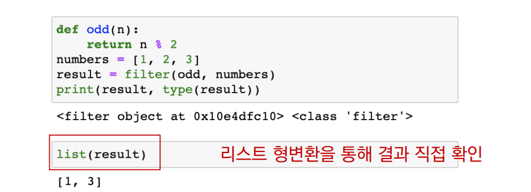

###### 7월 21일

# 파이썬 응용/심화


## 추가 문법

### List Comprehension

- 표현식과 제어문을 통해 특정한 값을 가진 리스트를 간결하게 생성하는 방법

> [<expression> for <변수> in <iterable>]
>
> [<expression> for <변수> in <iterable> if <조건식>]


- 1~3의 세제곱의 결과가 담긴 리스트를 만드시오.

  ```python
  cubic_list = []
  for number in range(1, 4):
      cubic_list.append(number**3)
  print(cubic_list)
  ```

  ```python
  [number**3 for number in range(1, 4)]
  ```

  > 특정한 원소(요소)로 구성된 리스트를 만들 경우


### Dictionary Comprehension

- 표현식과 제어문을 통해 특정한 값을 가진 딕셔너리를 간결하게 생성하는 방법

> {key: value for <변수> in <iterable>}
>
> {key: value for <변수> in <iterable> if <조건식>}


- 1~3의 세제곱의 결과가 담긴 딕셔너리를 만드시오.

  ```python
  cubic_dict = {}
  for number in range(1, 4):
      cubic_dic[number] = number ** 3
  print(cubic_dict)
  ```

  ```python
  {number: number**3 for number in range(1, 4)}
  ```

  

### lambda [parameter] : 표현식

- 람다함수
  - 표현식을 계산한 결과값을 반환하는 함수로, 이름이 없는 함수여서 익명함수라고도 불림
- 특징
  - return문을 가질 수 없음
  - 간편 조건문 외 조건문이나 반복문을 가질 수 없음
- 장점
  - 함수를 정의해서 사용하는 것보다 간결하게 사용 가능
  - def를 사용할 수 없는 곳에서도 사용가능


### filter

- filter(function, iterable)

- 순회 가능한 데이터구조(iterable)의 모든 요소에 함수(function)적용하고, 그 결과가 True인 것들을 filter object로 반환

  


> `map(function, <itreable>)`
>
> 모든 iterable에게 함수를 적용하고 그 결과를 map object


## 파이썬 버전별 업데이트

### 모듈 심화

#### 파이썬 표준 라이브러리

- [파이썬 표준 라이브러리](https://docs.python.org/ko/3/library/index.html) (Python Standard Library, PSL)
  - 파이썬에 기본적으로 설치된 모듈과 내장 함수
  - 예시: random.py


#### 파이썬 패키지 관리자(pip)

- PyPI(Python Package Index)에 저장된 외부 패키지들을 설치하도록 도와주는 패키지 관리 시스템

- 파이썬 패키지 관리자(pip) 명령어

  - 패키지 설치

    - 최신 버전 / 특정 버전 / 최소 버전을 명시하여 설치 할 수 있음

    - 이미 설치되어 있는 경우 이미 설치되어 있음을 알리고 아무것도 하지 않음

      > $ pip install SomePackage
      >
      > $ pip install SomePackage==1.0.5
      >
      > $ pip install SomePackage>=1.0.4'

    > 모두 bash, cmd 환경에서 사용되는 명령어

  - 패키지 삭제

    - pip는 패키지를 업그레이드 하는 경우 과거 버전을 자동으로 지워줌

      > $ pip uninstall SomePackage

  - 패키지 목록 및 특정 패키지 정보

    > $ pip list
    >
    > $ pip show SomePackage

  - 패키지 freeze

    - 설치된 패키지의 비슷한 목록을 만들지만, pip install에서 활용되는 형식으로 출력

    - 해당하는 목록을 requirements.txt(관습)으로 만들어 관리함

      > $ pip freeze

  - 패키지 관리하기

    - 아래의 명령어들을 통해 패키지 목록을 관리[1]하고 설치할 수 있음[2]

    - 일반적으로 패키지를 기록하는 파일의 이름은 requirements.txt로 정의함

      > $ pip freeze > requirements.txt
      >
      > $ pip install -r requirements.txt

    > requirements.txt를 바탕으로 설치

    - 다양한 파이썬 프로젝트에서 사용됨


### 가상 환경

- 파이썬 표준 라이브러리가 아닌 외부 패키지와 모듈을 사용하는 경우 모두 pip를 통해 설치를 해야함
- 복수의 프로젝트를 하는 경우 버전이 상이할 수 있음
  - 과거 외주 프로젝트 – django 버전 2.x
  - 신규 회사 프로젝트 – django 버전 3.x
- 이러한 경우 가상환경을 만들어 프로젝트별로 독립적인 패키지를 관리 할 수 있음


- **파이썬 실행에 대한 이해**
  - python은 특정 경로에 있는 프로그램을 실행시키는 것

- **venv**

  - 가상 환경을 만들고 관리하는데 사용되는 모듈 (Python 버전 3.5부터)

  - 특정 디렉토리에 가상 환경을 만들고, 고유한 파이썬 패키지 집합을 가질 수 있음
    - 특정 폴더에 가상 환경이(패키지 집합 폴더 등) 있고
    - 실행 환경(예 – bash)에서 가상환경을 활성화 시켜
    - 해당 폴더에 있는 패키지를 관리/사용함

- **가상환경 생성**

  - 가상환경을 생성하면, 해당 디렉토리에 별도의 파이썬 패키지가 설치됨

    > $ python -m venv <폴더명>
    >
    > $ python –m venv venv

- **가상환경 활용**

  - 아래의 명령어를 통해 가상환경을 활성화

    - <venv>는 가상환경을 포함하는 디렉토리의 이름

    | 플랫폼 | 셀              | 가상 환경을 활성화하는 명령          |
    | ------ | --------------- | ------------------------------------ |
    | POSIX  | bash/zsh        | $ source <venv> /bin/activate        |
    |        | fish            | $ source <venv> /bin/activate.fish   |
    |        | csh/tcsh        | $ source <venv> /bin/activate.csh    |
    |        | PowerShell Core | $ <venv> /bin/Activate.ps1           |
    | 윈도우 | cmd.exe         | C:\> <venv> \Script\activate.bat     |
    |        | PowerShell      | PS C:\\> <venv> \Script\Activate.ps1 |

  - 가상환경 비활성화는 $ deactivate 명령어를 사용

- **cmd와 bash 환경**

  - 가상환경 활성화/비활성화

    > $ source venv/Scripts/activate

- **동일 컴퓨터에서 별도의 가상환경**

  - 각 프로젝트별 가상환경(venv 폴더별로 고유한 프로젝트가 설치됨)


