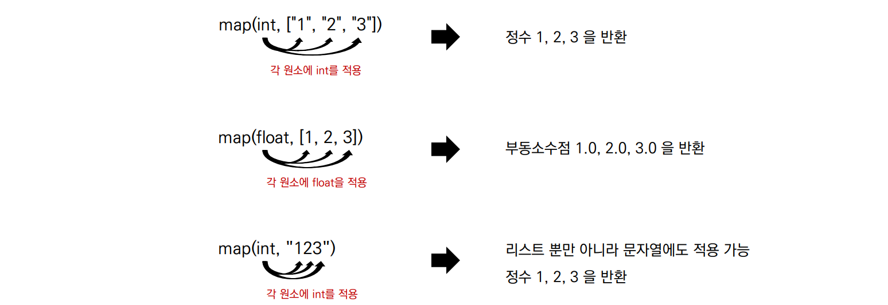

###### 7월 25일

# Python 입력 & 출력

## 1. 입력 활용 예시 (input)

- input( )은 사용자의 입력 한 줄을 문자열로 받는 함수

  ```python
  word = input()
  >>> happyhacking
  ```

- input( )과 map함수를 이용해 원하는 대로 입력 받기

  ```python
  # 문자열 입력 받기
  a = input()
  
  # 한 개 숫자 입력 받기
  b = int(input())
  c = float(input())
  
  # 여러 개 숫자 입력 받기
  d, e = map(int, input().split())
  f, g, h = map(float, input().split())
  ```

- 파이썬의 내장 함수 `map(function, iterable)`

  

  - map으로 입력 받는 과정 예시

  ```python
  a, b = map(int, input().split())
  >>> 1 2
  ```

  ```python
  a, b = map(int, "1 2".split())
  ```

  ```python
  a, b = map(int, ["1", "2"])
  ```

  ```python
  a, b = 1, 2
  # a -> 1
  # b -> 2
  ```

  

## 2. 출력 활용 예시 (print)

- print( )는 데이터를 출력할 수 있는 함수이며, 자동적으로 줄 바꿈 발생

  ```python
  print("happy")
  print("hacking")
  >>> happy
  >>> hacking
  ```

- 콤마(,)를 이용해 여러 인자를 넣으면 공백을 기준으로 출력

  ```python
  a = "happy"
  b = "hacking"
  
  print(a, b)
  >>> happy hacking
  ```

- end, sep 옵션을 사용하여 출력 조작하기

  ```python
  a = "happy"
  b = "hacking“
  
  print(a, end="@")
  print(b)
  >>> happy@hacking
  
  print(a, b, sep="\n")
  >>> happy
  >>> hacking
  ```

  