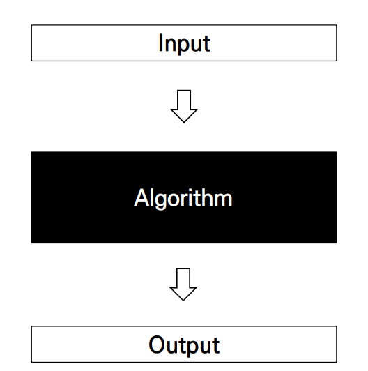
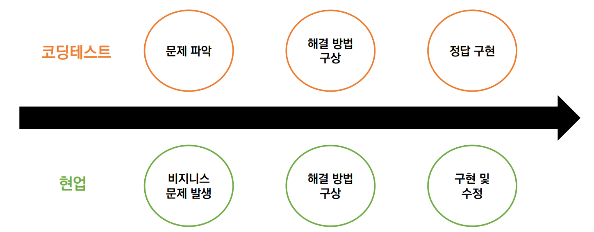
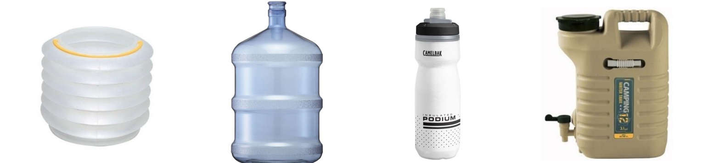
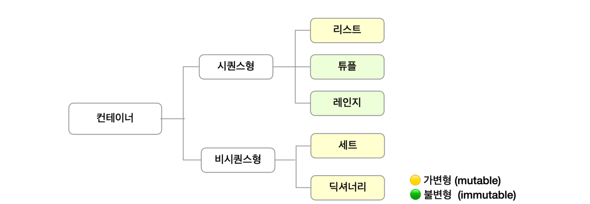
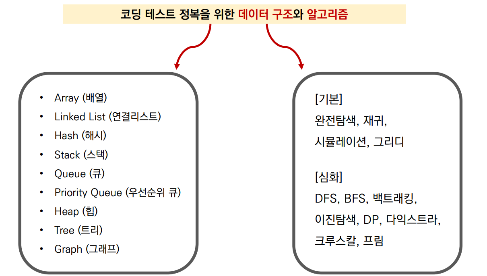
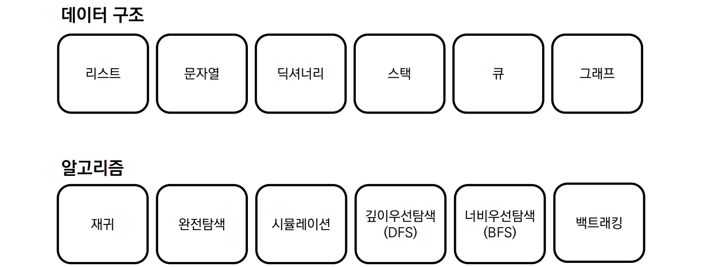

###### 7월 25일
# 알고리즘 INTRO

## 1. 알고리즘? 코딩테스트?

- What is Algorithm?
  - 어떤 문제를 해결하기 위해 정해진 일련의 절차나 행동
  - 문제라는 Input을 넣었을 때, 원하는 Output이 나오도록 하는 것

- What is Coding Test?
  - 기업에서 지원자를 대상으로 코딩을 통한 알고리즘 기반 문제 해결 능력을 테스트 하는 것

- 코딩테스트에서 평가하는 두 가지 사항

  - 문제 해결력
    - 문제 의도를 정확히 파악하고, 적절한 해결 방법을 적용할 수 있는가?
  - 구현력
    - 해결 방법을 프로그래밍을 통해 능숙하게 구현할 수 있는가?

- 코딩테스트가 현업 능력을 평가할 수 있을까?

  

  - 하지만 코딩테스트는 실제 현업 환경과 달리 객체 지향적으로 코드를 작성하지 않으므로 완벽하게 현업 능력을 평가할 수는 없지만 신입의 실력을 어느 정도 측정하는데 좋은 지표가 된다!

## 2. 코딩테스트 종류

1) **온라인**

   💡온라인 코딩테스트 Tip

   - 사전에 연습장과 필기도구 준비

   - 테스트 케이스 이외의 엣지 케이스도 확인

   - 인터넷, IDE, 알고리즘 노트 적극 활용

     [Python-Competitive-Programming-Team-Notes: Python Library for Programming Competition](https://github.com/ndb796/Python-Competitive-Programming-Team-Notes)

2. **오프라인**
   - 유형 1: 개발형 코딩테스트 (Rest API, json)
   - 유형 2 : 화이트보드 손코딩
     - 지원자가 어떤 방식으로 문제를 해결하는지 논리, 과정, 커뮤니케이션 스킬을 평가

3. **기업별**
   - 코딩 테스트는 선택이 아니라 필수 !
   - 기업별 분석 자료 만들기

## 3. 코딩테스트 준비하기

‼ 많이 풀기

- 대표 문제 풀이 사이트

| 문제 풀이 사이트           | 주소                                                         | 특징                                                         |
| -------------------------- | ------------------------------------------------------------ | ------------------------------------------------------------ |
| 백준 온라인 저지 (BOJ)     | [Baekjoon Online Judge (acmicpc.net)](https://www.acmicpc.net/) | 가장 많이 사용하는 플랫폼. 최다 문제 보유. 유형별, 단계별 문제 제공 |
| 프로그래머스 (Programmers) | [프로그래머스 (programmers.co.kr)](https://programmers.co.kr/) | 실제 코딩테스트 환경과 유사. 카카오 기출문제 제공            |
| 코드업 (CodeUp)            | [CodeUp](https://codeup.kr/)                                 | 기초 파이썬 100제                                            |
| SW Expert Academy (SWEA)   | [SW Expert Academy](https://swexpertacademy.com/main/main.do) | 삼성전자에서 제작한 플랫폼. 삼성 SW 역량 테스트 문제 다수 보유 |

- 깜짝 퀴즈!
  - 문제는 매번 풀 때마다 다른 유형을 푸는 것이 좋다?
    - ❌
    - 연습 때는 같은 유형 문제를 단기간에 여러 번 반복하는 것이 좋고
    - 코딩테스트 직전에는 모의고사처럼 시간 제한을 두고 여러 유형을 푸는 것이 좋다.
  - 오랜 시간 고민했는데 풀리지 않을 때, 끝까지 답을 보지 않는 것이 좋다?
    - ❌
    - 다만, 이후에 답을 보지 않고 반드시 한번 더 풀어서 내 것으로 만들어야 한다.
    - 최대한 타인의 답을 많이 보면서 여러 풀이를 습득하는 것이 좋다.
- 기타 꿀팁
  - 변수명 대충 짓지 않기 (ex. a, b, c, …)
  - 언어가 가지는 내장 함수, 라이브러리를 적극 활용 하기
  - 반복되는 코드는 함수화를 통해 가독성 있게 작성하기
  - 면접을 위해 풀이를 남에게 설명하는 연습 반드시 필요

## 4. 데이터 구조와 알고리즘

> **프로그램 = 데이터 구조 + 알고리즘**
>
> \- Niklaus Wirth

- Data Structure 데이터 구조

  - 데이터를 다양한 방식으로 저장하고 + 조회, 삽입, 변경, 삭제와 같은 조작 기능 제공한다.

- 왜 데이터 구조가 중요한가?

  - 그냥 아무데나, 아무렇게나 담으면 안될까?

    

  - 문제 상황에 따라 더 적합한 통이 필요하다!

    

  - 문제 상황에 따라 더 적합한 도구가 필요하다!

    

  - 물통 == 물 + 통
    - 물을 필요에 따라 저장하고 활용할 수 있으므로 문제를 더 효율적으로 풀기 위한 도구가 된다.

  - 데이터 구조 == 데이터 + 구조
    - 데이터를 필요에 따라 저장하고 활용할 수 있으므로 문제를 더 효율적으로 풀기 위한 도구가 된다.
  - 구조를 안다는 것
    - 어떻게 **저장**하고 & 어떻게 **활용**(조작)할 수 있는지를 아는 것

- 파이썬의 기본 데이터 구조

  

  - 도구의 특성을 알아야 제대로 활용을 할 수 있다 !

    

