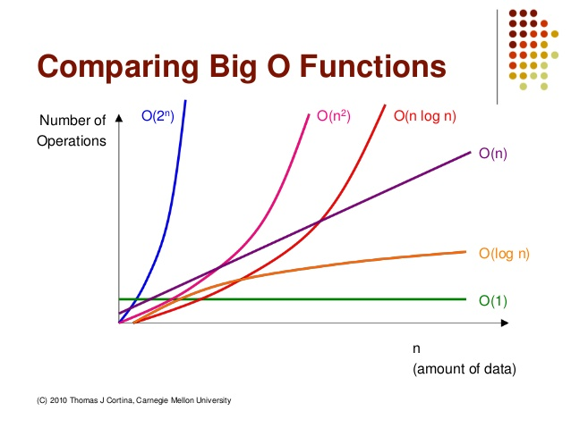

###### 7월 27일

# 시간 복잡도 & 빅오 표기법


## 1. 알고리즘의 시간 복잡도

좋은 알고리즘이란 무엇일까 ?

== 효율성이 좋은 알고리즘 ?

== 성능이 좋은 알고리즘 ?

== Input을 넣은 후 Output이 나오는 **시간**이 짧은 알고리즘 !

- 알고리즘의 소요 시간 측정하기 - 1
  - 개개인의 컴퓨팅 환경에 따라 같은 알고리즘이라도 측정 시간이 다르다.
  - 환경에 영향을 받지 않는 객관적인 기준이 필요하다 !

- 알고리즘의 소요 시간 측정하기 - 2
  - 객관적인 측정을 위해 알고리즘 내부에서 기본연산이 몇 번 일어나는지 살펴본다.
  - 기본연산 : 단위 시간 1이 소요되는 연산
    - ex) 할당, 산술, 비교, 반환 …
  - 기본연산의 총 횟수 == 알고리즘의 소요 시간
  - 기본연산의 횟수를 구하는 것은 환경에 영향을 받지 않는 객관적인 방법이지만, 입력의 개수에 따라 시간이 달라진다는 문제가 있다.
    - "appleapple" 이라면? "abcdefghijklmnopqrstuvwxyz" 이라면?
  - 따라서 성능을 측정할 때는 입력을 통일시킨다. 가장 기본연산이 많이 일어나는 최악의 입력 n개가 들어온다고 가정한다.
  - 입력 n개에 따른 소요 시간(==*시간 복잡도* *Time Complexity*)을 수식으로 세울 수 있다


### 시간 복잡도 (Time Complexity)

- 계산 복잡도 이론에서 시간 복잡도는 문제를 해결하는데 걸리는 시간과 입력의 함수 관계를 가리킨다.
- 단순하게 알고리즘의 수행 시간을 의미한다고 볼 수 있다.
  - 시간 복잡도가 높다 → 느린 알고리즘
  - 시간 복잡도가 낮다 → 빠른 알고리즘

- 시간 복잡도에 따라 알고리즘의 성능을 비교해보자

  

  - n이 무한대라면?
    - (1), (2)는 선형 증가
    - (3)은 제곱으로 증가


## 2. 빅오(Big-O) 표기법

- 빅오(Big-O) 표기법이란 무엇일까?
  - 입력 n이 무한대로 커진다고 가정하고 시간 복잡도를 간단하게 표시하는 것
  - 최고차항만 남기고 계수와 상수 제거
  - 매 입력에 따라 정확한 수식을 구하는 것은 불필요하다. 정확한 수치보다는 증가율에 초점을 맞춘다


- 다양한 시간 복잡도 종류 살펴보기

  

| Big-O 표기법 | 내용                                      | 예시                                                |
| ------------ | ----------------------------------------- | --------------------------------------------------- |
| O(1)         | 단순 산술 계산 (덧셈, 뺄셈, 곱셉, 나눗셈) | a + b, 100 * 200                                    |
| O(logN)      | 크기 N인 리스트를 반절씩 순회/탐색        | 이진탐색(Binary Search), 분할정복(Divide & Conquer) |
| O(N)         | 크기 N인 리스트를 순회                    | 리스트 순회, 1중 for 문                             |
| O(NlogN)     | 크기 N인 리스트를 반절씩 탐색 * 순회      | 높은 성능의 정렬(Merge/Quick/Heap Sort)             |
| O(N^2)       | 크기 M, N인 2중 리스트를 순회             | 2중 리스트 순회, 2중 for 문                         |
| O(N^3)       | 3중 리스트를 순회                         | 3중 리스트 순회, 3중 for 문                         |
| O(2^N)       | 크기 N 집합의 부분 집합                   | 크기가 N인 집합의 부분 집합                         |
| O(N!)        | 크기 N 리스트의 순열                      | 크기가 N인 순열                                     |


- 실제 문제에서 적용해보기

  - 실제 문제는 “초” 단위로 제한 시간이 주어지고 시간 복잡도도 정확하게 예측하기가 어렵다. 따라서 어림짐작을 하는 방법을 알아야한다.

  - 보통 1초에 1억 번 연산으로 계산을 한다. 입력의 개수에 따라 반복문을 몇 중으로 순회할 수 있는지 파악해야 한다.

  - 예시 문제

    

    - (일반적인 상황에서) 1초가 걸리는 입력의 크기

      - O(N): 1억 (기준)
      - O(NlogN): 500만
      - O(N^2): 1만
      - O(N^3): 500
      - O(2^N):20
      - O(N!): 10

    - 첫 번째 방법 – 1부터 n까지 일일히 더하기

      ```python
      def get_total(n):
          total = 0
          
          for i in range(1, n + 1):
              total += i
              
          return total
      
      print(get_total(10))
      >>> 55
      
      print(get_total(10000000000))
      >>> 제한 시간 1초 초과
      ```

      

    - 두 번째 방법 – 가우스의 합 공식

      ```python
      def get_total(n):
          return (n * (n + 1)) // 2
      
      print(get_total(10))
      >>> 55
      
      pritn(get_total(1000000000))
      >>> 500000000500000000
      ```

    - 같은 Output을 만드는 알고리즘이라도 시간 복잡도에 따라 성능이 달라질 수 있고 시험에서 정답 여부가 갈리는 포인트가 된다는 것이다.

- 내장 함수, 메서드의 시간 복잡도도 확인할 필요가 있다.
  - 가끔 for문을 1번만 썼는데 왜 시간초과가 날까요? 라고 질문하는 분들이 있다.
  - for문이 1번이라고 해서 무조건 O(n)인 것은 아니다. for문 안에 O(n)의 내장 함수를 사용했다면 사실상 이중 for문과 다를 것이 없기 때문이다.
- Big-O Cheatsheet


