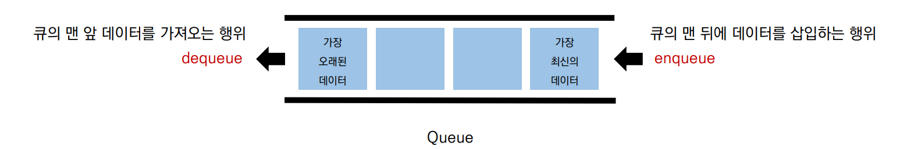

###### 8월 1일

# 스택, 큐 (Stack, Queue)

## 0. 데이터 구조 & 알고리즘

- 프로그램 = 데이터 구조 + 알고리즘 - Niklaus Wirth

- Data Structure 데이터 구조

  - 데이터를 다양한 방식으로 **저장**하고
  - 조회, 삽입, 변경, 삭제와 같은 **조작** 기능 제공한다.

- 왜 데이터 구조가 중요한가?

  - 그냥 아무데나, 아무렇게나 담으면 안될까?

  - 아무데나 담기 ~= 변수

    

  

  - 문제 상황에 따라 더 적합한 통이 필요하다!

    

  

  - 문제 상황에 따라 더 적합한 도구가 필요하다!

    

  

  - 물통 == 물 + 통
    - 물을 필요에 따라 저장하고 활용할 수 있으므로 문제를 더 효율적으로 풀기 위한 도구가 된다.
  - 데이터 구조 == 데이터 + 구조
    - 데이터를 필요에 따라 저장하고 활용할 수 있으므로 문제를 더 효율적으로 풀기 위한 도구가 된다.

  - 어떻게 저장하고 & 어떻게 활용(조작)할 수 있는지

    - 구조를 안다는 것

    

- 파이썬의 기본 데이터 구조

  

- 왜 써야하는지(why)
  - 데이터 구조를 배우는 이유: 왜 만들어졌고, 언제 써야하는지 알기 위해

## 1. 스택(Stack)

Stack은 쌓는다는 의미로써, 마치 접시를 쌓고 빼듯이 **데이터를 한쪽에서만 넣고 빼는 자료구조**

가장 마지막에 들어온 데이터가 가장 먼저 나가므로 **LIFO(Last-in First-out, 후입선출)** 방식

- 스택 자료구조의 대표 동작

  

- Stack의 특징

  - 후입선출: 들어온 순서와 반대로 나감

  

- 왜 Stack을 써야할까(why) ?

  - 데이터 구조를 배우는 이유: 왜 만들어졌고, 언제 써야하는지 알기 위해

  

  1. **뒤집기, 되돌리기, 되돌아가기**

  

  

  ​	

  

  

  

  

  

  - 브라우저 히스토리 (ctrl + z)
  - 단어 뒤집기

  

  2. **마무리 되지 않은 일을 임시 저장**

  - 괄호 매칭
  - 함수 호출
  - 백트래킹
  - DFS(깊이 우선 탐색)

- 파이썬은 **리스트(List)**로 스택을 간편하게 사용할 수 있다 !

## 2. 큐 (Queue)

Queue는 **한 쪽 끝에서 데이터를 넣고, 다른 한 쪽에서만 데이터를 뺄 수 있는 자료구조**

가장 먼저 들어온 데이터가 가장 먼저 나가므로 **FIFO(First-in First-out, 선입선출)** 방식

- 큐 자료구조도 파이썬 **리스트(List)**로 간편하게 사용할 수 있다 !

- 리스트를 이용한 큐 자료구조의 단점

  

  - 데이터를 뺄 때 큐 안에 있는 데이터가 많은 경우 비효율적이다.
  - 맨 앞 데이터가 빠지면서, 리스트의 인덱스가 하나씩 당겨 지기 때문이다 !

- 덱 (Deque, Double-Ended Queue) 자료구조

  == 양 방향으로 삽입과 삭제가 자유로운 큐

  

  - 덱은 양 방향 삽입, 추출이 모두 큐보다 훨씬 빠르다.

    

  - 따라서 데이터의 삽입, 추출이 많은 경우, 시간을 크게 단축 시킬 수 있다.

