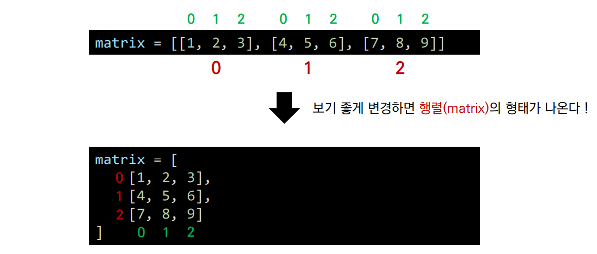
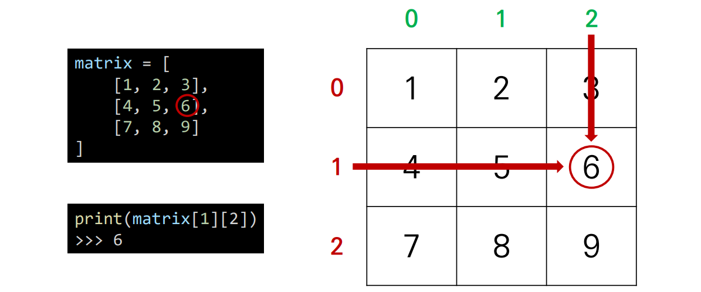
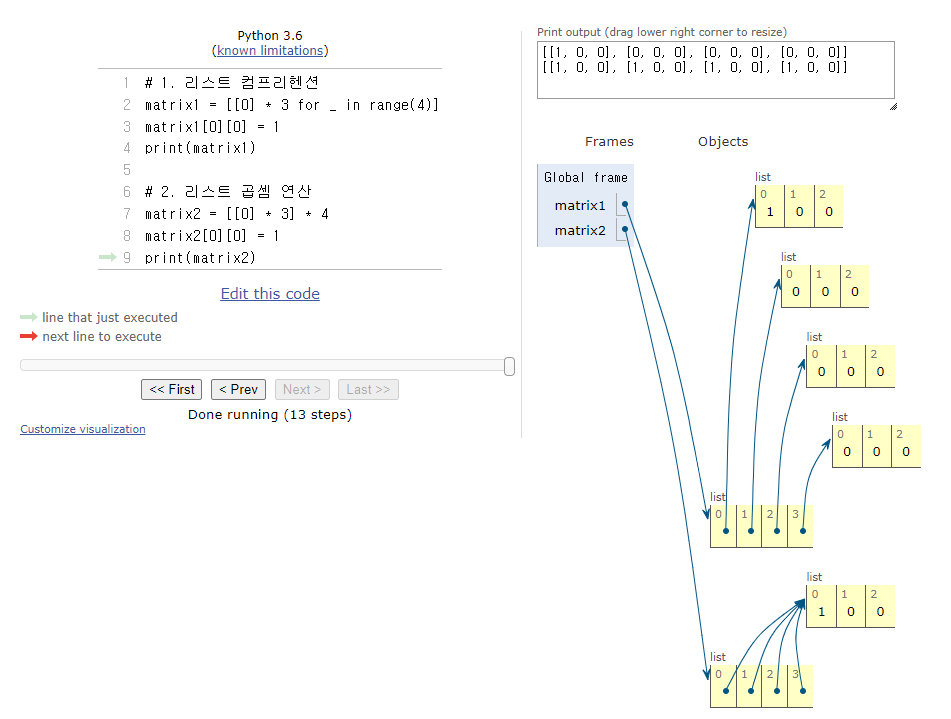

###### 8월 3일
# 이차원 리스트

## 1. 이차원 리스트

- 이차원 리스트는 **리스트를 원소로 가지는 리스트**이다.

```python
matrix = [[1, 2, 3], [4, 5, 6], [7, 8, 9]]

print(matrix[0])
>>> [1, 2, 3]
print(matrix[1])
>>> [4, 5, 6]
print(matrix[2])
>>> [7, 8, 9]

print(matrix[0][0])
>>> 1
print(matrix[1][2])
>>> 6
print(matrix[2][0])
>>> 7
```




- 이차원 리스트는 **행렬(matrix)**이다.




- 특정 값으로 초기화 된 이차원 리스트 만들기

1. 직접 작성 (4 x 3 행렬)

```python
matrix1 = [[0, 0, 0], [0, 0, 0], [0, 0, 0], [0, 0, 0]]

matrix2 = [
    [0, 0, 0],
    [0, 0, 0],
    [0, 0, 0],
    [0, 0, 0]
]
```

2. 반복문으로 작성

   - 100 x 100 행렬

   ```python
   matrix = []
   
   for _ in range(100): # 행
       matrix.append([0] * 100) # 열
   ```

   - n x m 행렬

   ```python
   n = 4 # 행
   m = 3 # 열
   matrix = []
   
   for _ in range(n):
       matrix.append([0] * m)
       
   print(matrix)
   >>> [[0, 0, 0], [0, 0, 0], [0, 0, 0], [0, 0, 0]]
   ```

   3. 리스트 컴프리헨션으로 작성 (n x m 행렬)

   ```python
   n = 4 # 행
   m = 3 # 열
   
   matrix = [[0] * m for _ in range(n)]
   
   print(matrix)
   >>> [[0, 0, 0], [0, 0, 0], [0, 0, 0], [0, 0, 0]]
   ```

   

   🔸 주의 :  리스트 컴프리헨션 vs 리스트 곱셈 연산

   ```python
   n = 4 # 행
   m = 3 # 열
   
   matrix1 = [[0] * m for _ in range(n)]
   matrix2 = [[0] * m] * n
   
   # 원소 값 변경
   matrix1[0][0] = 1
   matrix2[0][0] = 1
   
   print(matrix1)
   >>> [[1, 0, 0], [0, 0, 0], [0, 0, 0], [0, 0, 0]]
   print(matrix2)
   >>> [[1, 0, 0], [1, 0, 0], [1, 0, 0], [1, 0, 0]]
   ```

   > 다른 결과가 나온다!

   [파이썬튜터로 확인](https://pythontutor.com/visualize.html#mode=edit)

   


## 2. 입력 받기

1) 행렬의 크기가 미리 주어지는 경우 (8 x 8)

```python
matrix = []

for _ in ragne(8):
    line = list(input())
    matrix.append(line)

    
# 리스트 컴프리헨션
matrix = [list(input()) for _ in range(8)]
    
"""
matrix = [
['.', 'F', '.', 'F', '.', '.', '.', 'F'],
['F', '.', '.', '.', 'F', '.', 'F', '.'],
['.', '.', '.', 'F', '.', 'F', '.', 'F'],
['F', '.', 'F', '.', '.', '.', 'F', '.'],
['.', 'F', '.', '.', '.', 'F', '.', '.'],
['F', '.', '.', '.', 'F', '.', 'F', '.'],
['.', 'F', '.', 'F', '.', 'F', '.', 'F'],
['.', '.', 'F', 'F', '.', '.', 'F', '.']
]
"""
```

```python
"""
3 x 3 크기의 입력을 받아보자.
1 2 3
4 5 6
7 8 9
"""

matrix = []

for _ in range(3):
    line = list(map(int, input().split()))
    matrix.append(line)
    
    
# 리스트 컴프리헨션
matrix = [list(map(int, input().split())) for _ in range(3)]
```


2. 행렬의 크기가 입력으로 주어지는 경우 (n x m)

```python
n, m = map(int, input().split()) # 8 7
matrix = []

for _ in range(n):
    line = list(map(int, input().split()))
    matrix.append(line)
    
    
# 리스트 컴프리헨션
matrix = [list(map(int, input().split())) for _ in range(n)]

"""
matrix = [
[4, 3, 2, 2, 1, 0, 1],
[3, 3, 3, 2, 1, 0, 1],
[2, 2, 2, 2, 1, 0, 0],
[2, 1, 1, 1, 1, 0, 0],
[1, 1, 0, 0, 0, 1, 0],
[0, 0, 0, 1, 1, 1, 0],
[0, 1, 2, 2, 1, 1, 0],
[0, 1, 1, 1, 2, 1, 0]
]
"""
```

```python
"""
n x m 크기의 입력을 받아보자.
3 4
1 2 3 4
5 6 7 8
9 0 1 2
"""

n, m = map(int, input().split()) # 3 4
matrix = []

for _ in range(n):
    line = list(map(int, input().split()))
    matrix.append(line)
    
    
# 리스트 컴프리헨션
n, m = map(int, input().split()) # 3 4
matrix = [list(map(int, input().split())) for _ in range(n)]
```