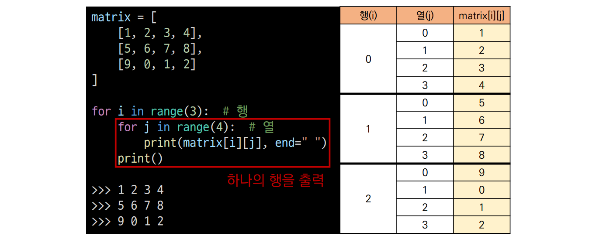
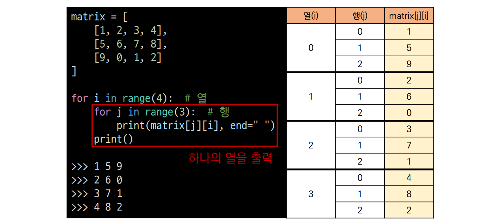
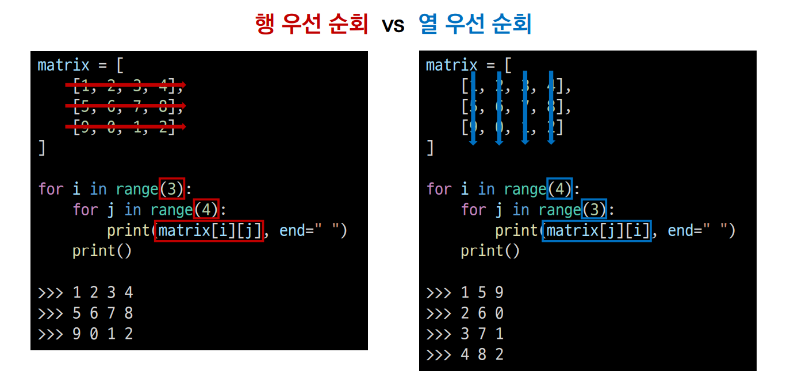
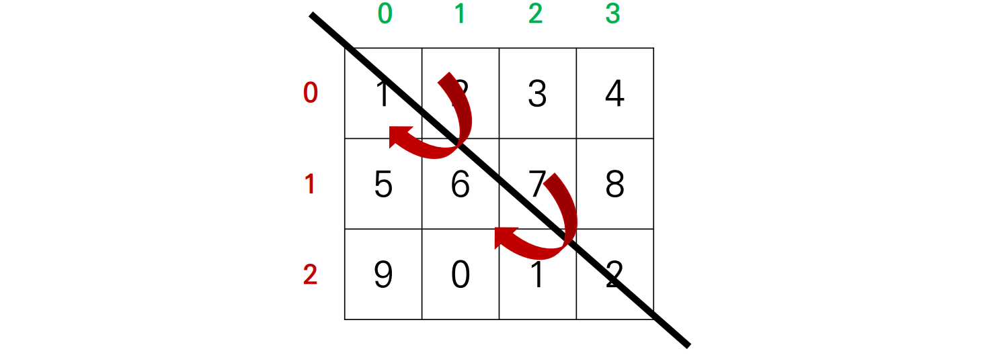
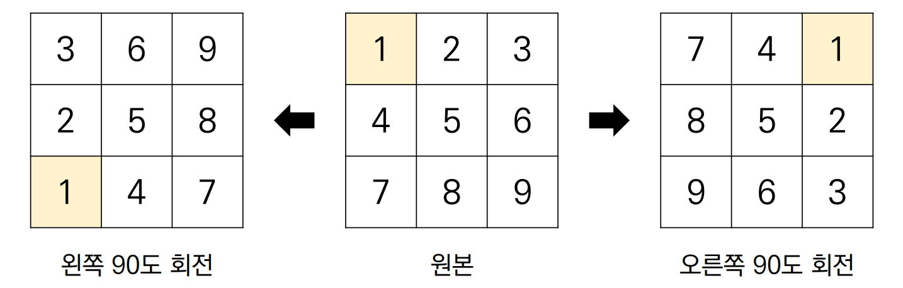

###### 8월 4일
# 이차원 리스트

## 3. 순회

이차원 리스트를 단순히 출력하면 아래와 같이 나온다.

```python
matrix = [
    [1, 2, 3, 4],
    [5, 6, 7, 8],
    [9, 0, 1, 2]
]

print(matrix)
>>> [[1, 2, 3, 4], [5, 6, 7, 8], [9, 0, 1, 2]]
```

이차원 리스트에 담긴 모든 원소를 아래와 같이 출력하고 싶다면 어떻게 할까?

```python
matrix = [
    [1, 2, 3, 4],
    [5, 6, 7, 8],
    [9, 0, 1, 2]
]

>>> 1 2 3 4
>>> 5 6 7 8
>>> 9 0 1 2
```

인덱스를 통해 각각 출력하면 가능하다 !

```python
matrix = [
    [1, 2, 3, 4],
    [5, 6, 7, 8],
    [9, 0, 1, 2]
]

print(matrix[0][0], matrix[0][1], matrix[0][2], matrix[0][3])
print(matrix[1][0], matrix[1][1], matrix[1][2], matrix[1][3])
print(matrix[2][0], matrix[2][1], matrix[2][2], matrix[2][3])

>>> 1 2 3 4
>>> 5 6 7 8
>>> 9 0 1 2
```

하지만 이차원 리스트의 크기가 100 x 100이라도 이렇게 출력할 수 있을까?

이중 반복문을 통해 순회하며 이차원 리스트를 출력한다.

### 1) 이중 for문을 이용한 **행 우선 순회**

```python
matrix = [
    [1, 2, 3, 4],
    [5, 6, 7, 8],
    [9, 0, 1, 2]
]

for i in range(3): # 행
    for j in range(4): # 열
        print(matrix[i][j], end=' ')
    print()
    
>>> 1 2 3 4
>>> 5 6 7 8
>>> 9 0 1 2
```



### 2) 이중 for문을 이용한 **열 우선 순회**

```python
matrix = [
    [1, 2, 3, 4],
    [5, 6, 7, 8],
    [9, 0, 1, 2]
]

for i in range(4): # 열
    for j in range(3): # 행
        print(matrix[j][i], end=' ')
    print()

>>> 1 5 9
>>> 2 6 0
>>> 3 7 1
>>> 4 8 2
```



- 행 우선 순회 vs 열 우선 순회




- 행 우선 순회를 이용해 이차원 리스트의 총합 구하기

  ```python
  matrix = [
      [1, 1, 1, 1],
      [1, 1, 1, 1],
      [1, 1, 1, 1]
  ]
  
  total = 0
  
  for i in range(3):
      for j in range(4):
          total += matrix[i][j]
          
  print(total)
  
  >>> 12
  ```

  - [참고] Pythonic한 방법으로 이차원 리스트의 총합 구하기

  ```python
  matrix = [
      [1, 1, 1, 1],
      [1, 1, 1, 1],
      [1, 1, 1, 1]
  ]
  
  total = sum(map(sum, matrix))
  
  print(total)
  
  >>> 12
  ```


- 행 우선 순회를 이용해 이차원 리스트의 최대값, 최소값 구하기

  ```python
  # 최댓값
  matrix = [
      [0, 5, 3, 1],
      [4, 6, 10, 8],
      [9, -1, 1, 5]
  ]
  
  max_value = 0
  
  for i in range(3):
      for j in range(4):
          if matrix[i][j] > max_value:
              max_value = matrix[i][j]
  
  print(max_value)
  
  >>> 10
  ```

  ```python
  # 최솟값
  
  matrix = [
      [0, 5, 3, 1],
      [4, 6, 10, 8],
      [9, -1, 1, 5]
  ]
  
  min_value = 99999999
  
  for i in range(3):
      for j in range(4):
          if matrix[i][j] < min_value:
              min_value = matrix[i][j]
              
  print(min_value)
  
  >>> -1
  ```

  - [참고] Pythonic한 방법으로 이차원 리스트의 최대값, 최소값 구하기

  ```python
  matrix = [
      [0, 5, 3, 1],
      [4, 6, 10, 8],
      [9, -1, 1, 5]
  ]
  
  max_value = max(map(max, matrix))
  min_value = min(map(min, matrix))
  
  print(max_value)
  >>> 10
  print(min_value)
  >>> -1
  ```

  

## 4. 전치

**전치(transpose)**란 행렬의 행과 열을 서로 맞바꾸는 것을 의미한다.





```python
matrix = [
    [1, 2, 3, 4],
    [5, 6, 7, 8],
    [9, 0, 1, 2]
]

# 전치 행렬을 담을 이차원 리스트 초기화 (행과 열의 크기가 반대)
transposed_matrix = [[0] * 3 for _ in range(4)]

for i in range(4):
    for j in range(3):
        transposed_matrix[i][j] = matrix[j][i] # 행, 열 맞바꾸기
        
'''
transposed_matrix = [
    [1, 5, 9],
    [2, 6, 0],
    [3, 7, 1],
    [4, 8, 2]
]
'''
```


## 5. 회전




1. 왼쪽으로 90도 회전하기

   ```python
   matrix = [
       [1, 2, 3],
       [4, 5, 6],
       [7, 8, 9]
   ]
   
   n = 3
   rotated_matrix = [[0] * n for _ in range(n)]
   
   for i in range(n):
       for j in range(n):
           rotated_matrix[i][j] = matrix[j][n-i-1]
   
   '''
   rotated_matrix = [
      [3, 6, 9],
      [2, 5, 8],
      [1, 4, 7]
   ]
   '''
   ```

2. 오른쪽으로 90도 회전하기

   ```python
   matrix = [
       [1, 2, 3],
       [4, 5, 6],
       [7, 8, 9]
   ]
   
   n = 3
   rotated_matrix = [[0] * n for _ in range(n)]
   
   for i in range(n):
       for j in range(n):
           rotated_matrix[i][j] = matrix[n-j-1][i]
   
   '''
   rotated_matrix = [
      [7, 4, 1],
      [8, 5, 2],
      [9, 6, 3]
   ]
   '''
   ```

   