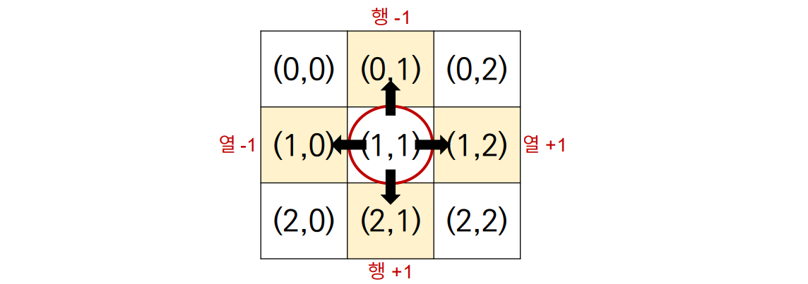
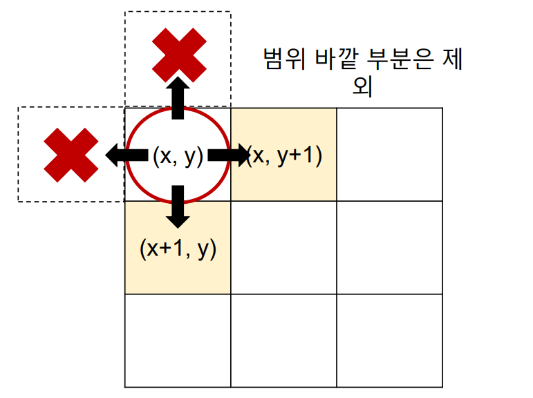

###### 8월 8일

# 완전탐색I (Exhaustive Search)

## 1. 무식하게 풀기 (Bruteforce)

Brute-force는 **모든 경우의 수**를 탐색하여 문제를 해결하는 방식이다.

- **브루트포스(Brute-force)**라고도 하며, 무식하게 밀어붙인다는 뜻이다.
- 가장 단순한 풀이 기법이며, 단순 조건문과 반복문을 이용해서 풀 수 있다.
-  복잡한 알고리즘 보다는, 아이디어를 어떻게 코드로 구현할 것인지가 중요하다.

- 예시 문제: [블랙잭](https://www.acmicpc.net/problem/2798)


## 2. 델타 탐색 (Delta Search)

(0, 0)에서부터 이차원 리스트의 모든 원소를 순회하며 (완전탐색) **각 지점에서 상하좌우에 위치한 다른 지점을 조회하거나 이동**하는 방식이다


이차원 리스트의 인덱스(좌표)의 조작을 통해서 상하좌우 탐색을 한다.

이때 행과 열의 변량인 -1, +1을 **델타(delta)값**이라 한다.




- 델타(delta)값을 이용해 상하좌우로 이동하기

  ```python
  # 1) 행을 x, 열을 y로 표현
  dx = [-1, 1, 0, 0]
  dy = [0, 0, -1, 1]
  
  # 2) 행을 r, 열을 c로 표현
  dr = [-1, 1, 0, 0]
  dc = [0, 0, -1, 1]
  ```

  

  ```python
  # 상(x-1, y)
  nx = x + dx[0]
  ny = y + dy[0]
  
  # 하(x+1, y)
  nx = x + dx[1]
  ny = y + dy[1]
  
  # 좌(x, y-1)
  nx = x + dx[2]
  ny = y + dy[2]
  
  # 우(x, y+1)
  nx = x + dx[3]
  ny = y + dy[3]
  ```

  - for 문을 이용해서 상하좌우 이동을 간단히 표현할 수 있다.

  ```python
  # 상하좌우
  for i in range(4):
      nx = x + dx[i]
      ny = y + dy[i]
  ```

  

- 상하좌우로 이동 후 범위를 벗어나지 않는지 확인 및 갱신하기

  ```python
  # 1. 델타값을 이용해 상하좌우 이동
  for i in range(4):
      nx = x + dx[i]
      ny = y + dy[i]
      
      # 2. 범위를 벗어나지 않으면 갱신
      if 0 <= nx < 3 and 0 <= ny < 3:
          x = nx
          y = ny
  ```

  


- 이차원 리스트의 상하좌우 탐색 정리

  ```python
  # 1. 델타값 정의(상하좌우)
  dx = [-1, 1, 0, 0]
  dy = [0, 0, -1, 1]
  
  # 2. 이차원 리스트 순회
  for x in range(n): # 행
      for y in range(m): # 열
          
          # 3. 델타값을 이용해 상하좌우 이동
          for i in range(4):
              nx = x + dx[i]
              ny = y + dy[i]
              
              # 4. 범위를 벗어나지 않으면 갱신
              if 0 <= nx < n and 0 <= ny < m:
                  x = nx
                  y = ny
  ```


- [참고] 상하좌우 + 대각선의 8방향 델타값

  ```python
  # 상, 하, 좌, 우, 좌상, 좌하, 우상, 우하
  dx = [-1, 1, 0, 0, -1, 1, -1, 1]
  dy = [0, 0, -1, 1, -1, -1, 1, 1]
  ```

  

