###### 8월 31일

# 🌞 CSS Day 3

## 👾 CSS Position

- 문서 상에서 요소의 위치를 지정

- **static** : 모든 태그의 기본 값(기준 위치)

  - 일반적인 요소의 배치 순서에 따름(좌측 상단)
  - 부모 요소 내에서 배치될 때는 부모 요소의 위치를 기준으로 배치 됨

  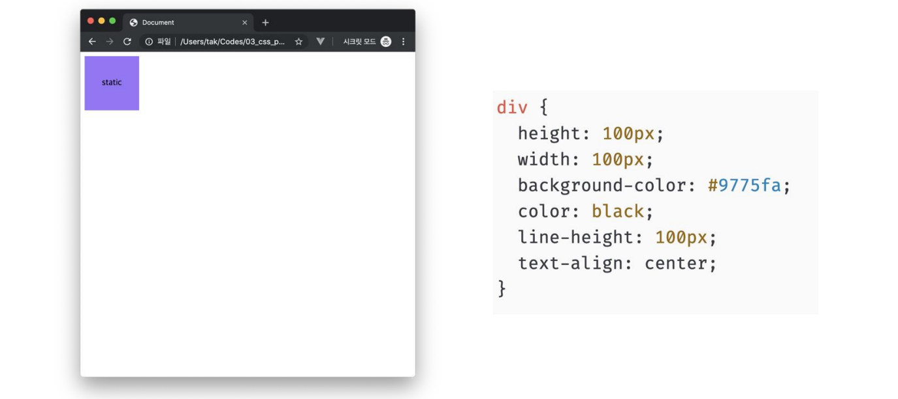

- 아래는 좌표 프로퍼티(top, bottom, left, right)를 사용하여 이동 가능

  1. relative
  2. absolute
  3. fixed
  4. sticky


### 1️⃣ relative

- **상대 위치**

- 자기 자신의 static 위치를 기준으로 이동 (normal flow 유지)
- 레이아웃에서 요소가 차지하는 공간은 static일 때와 같음 (normal position 대비 offset)

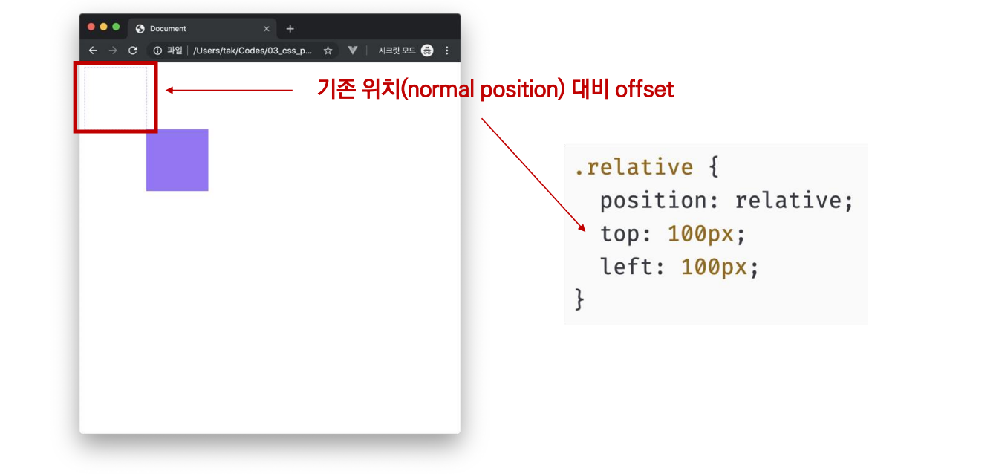

### 2️⃣ absolute

- **절대 위치**

- 요소를 일반적인 문서 흐름에서 제거 후 레이아웃에 공간을 차지하지 않음 (normal flow에서 벗어남)
- static이 아닌 가장 가까이 있는 부모/조상 요소를 기준으로 이동 (없는 경우 브라우저 화면 기준으로 이동)

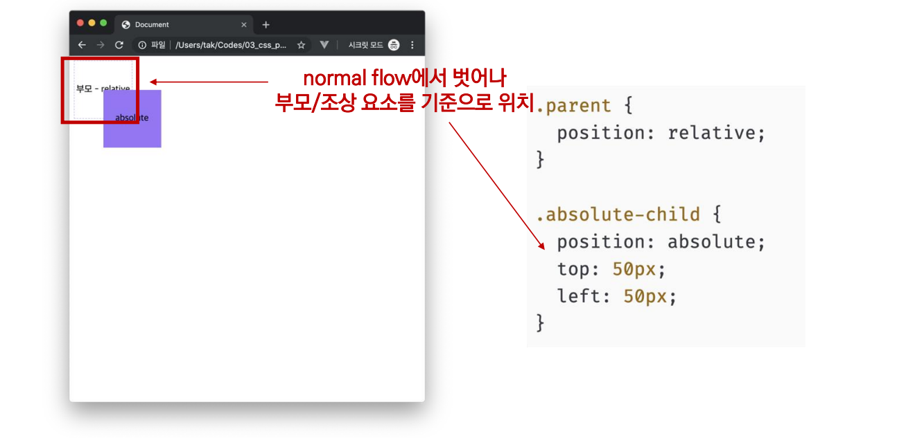

- **absolute** vs. **relative**

  - 형에게 top: 100px;을 적용했을 때 absolute와 relative의 차이를 알아보자

  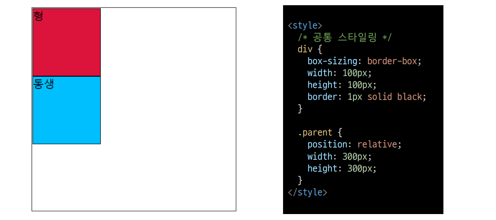

  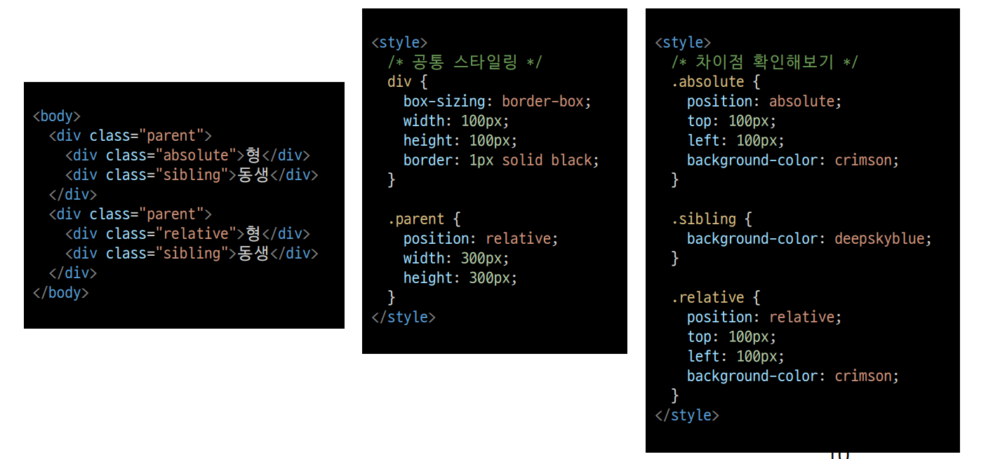

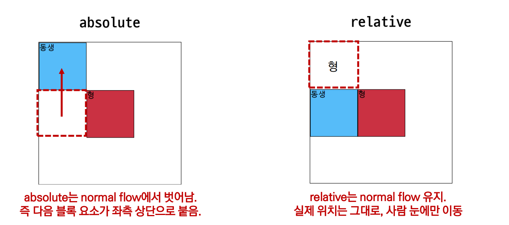


- absolute는 언제 쓸까?

  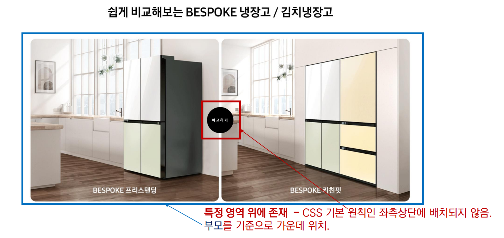


### 3️⃣ fixed

- **고정 위치**

- 요소를 일반적인 문서 흐름에서 제거 후 레이아웃에 공간을 차지하지 않음 (normal flow에서 벗어남)
- 부모 요소와 관계없이 viewport를 기준으로 이동
  - 스크롤 시에도 항상 같은 곳에 위치함

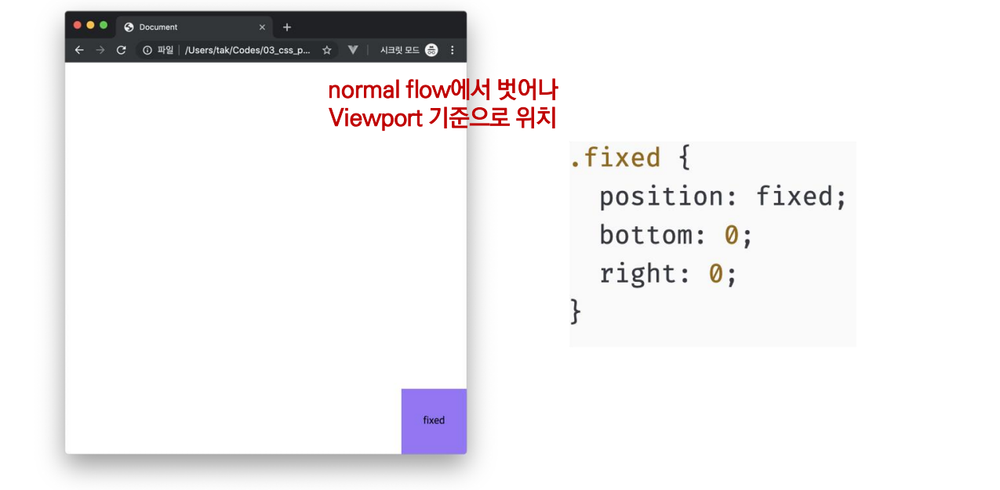

- fixed는 언제 쓸까?

  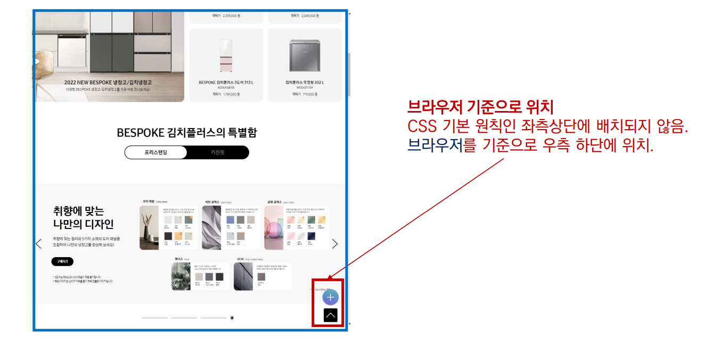


### 4️⃣ sticky

- **스크롤에 따라 static -> fixed로 변경**
- 속성을 적용한 박스는 평소에 문서 안에서 `position: static` 상태와 같이 일반적인 흐름에 따르지만 스크롤 위치가 임계점에 이르면 `position: fixed`와 같이 박스를 화면에 고정할 수 있는 속성
- 일반적으로 Navigation Bar에서 사용됨


### CSS 원칙

- CSS 원칙 I, II : Normal flow

  - 모든 요소는 네모(박스모델), 좌측상단에 배치
  - display에 따라 크기와 배치가 달라짐

  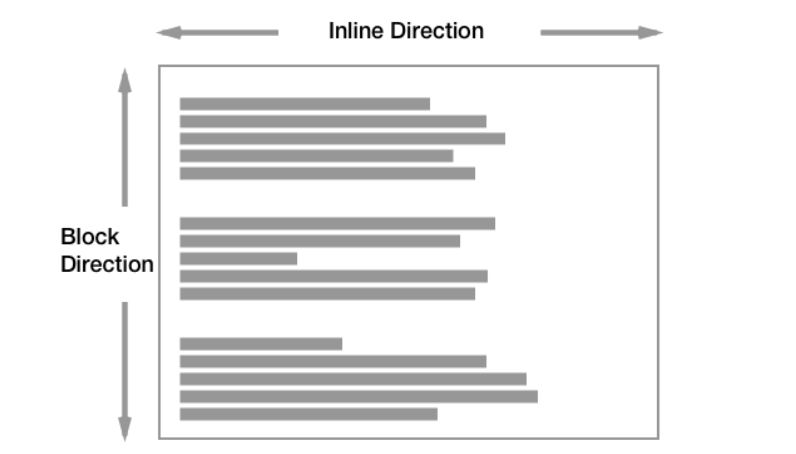

- CSS 원칙 III

  - **position으로 위치의 기준을 변경**
    - relative : 본인의 원래 위치
    - absolute : 특정 부모의 위치
    - fixed : 화면의 위치
    - sticky: 기본적으로 static이나 스크롤 이동에 따라 fixed로 변경


## 🍱 CSS Layout

- CSS layout techniques
  - Display
  - Position
  - Float (CSS1, 1996)
  - Flexbox (2012)
  - Grid (2017)
  - 기타
    - Responsive Web Design(2010), Media Queries (2012)


### 🚢 Float

- 박스를 왼쪽 혹은 오른쪽으로 이동시켜 텍스트를 포함 인라인요소들이 주변을 wrapping 하도록 함

- 요소가 Normal flow를 벗어나도록 함

  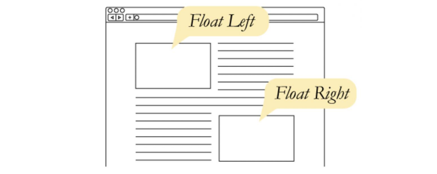

- Float 예시 I

  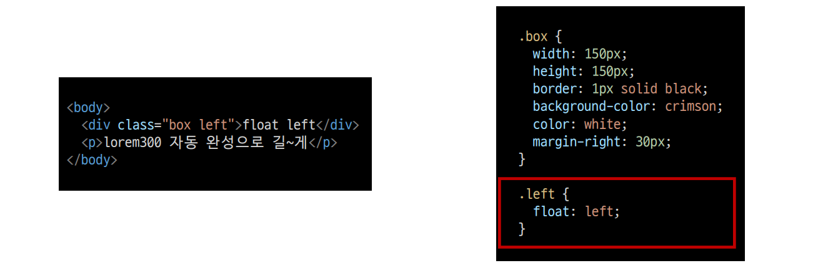

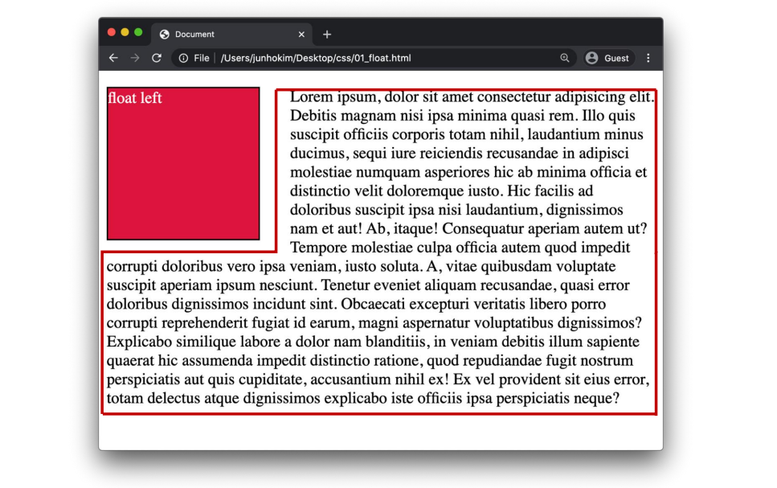

- Float 활용 사례

  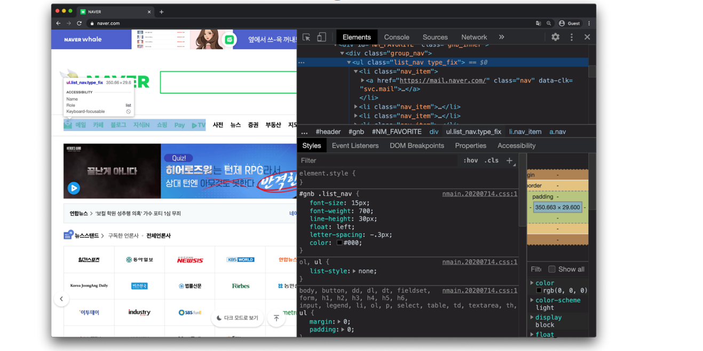


### 💸 Flexbox

#### CSS Flexible Box Layout

- 행과 열 형태로 아이템들을 배치하는 1차원 레이아웃 모델

- 축

  - main axis (메인 축)
  - cross axis (교차 축)

- 구성 요소

  - Flex Container (부모 요소)
  - Flex Item (자식 요소)

  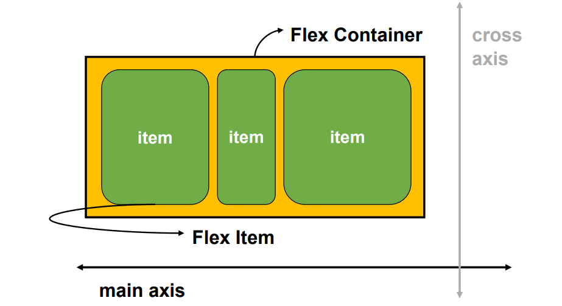


- Flexbox 축

  - flex-direction : row

  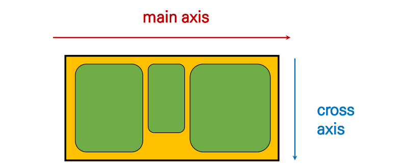


##### Flexbox 구성요소

- Flex Container (부모 요소)
  - flexbox 레이아웃을 형성하는 가장 기본적인 모델
  - Flex Item들이 놓여있는 영역
  - display 속성을 `flex` 혹은 `inline-flex`로 지정
- Flex Item (자식 요소)
  - 컨테이너에 속해 있는 컨텐츠(박스)


##### 왜 Flexbox를 사용해야 할까?

- 이전까지 Normal Flow를 벗어나는 수단은 `Float` 혹은 `Position`
  - 한계 : (수동 값 부여 없이)
    1. 수직 정렬
    2. 아이템의 너비와 높이 혹은 간격을 동일하게 배치


##### Flexbox 시작

```css
.flex-container {
    display: flex;
}
```

부모 요소에 `display: flex` 혹은 `inline-flex`


#### Flex 속성

- 배치 설정
  - flex-direction
  - flex-wrap
- 공간 나누기
  - justify-content (main axis)
  - align-content (cross axis)
- 정렬
  - align-items (모든 아이템을 cross axis 기준으로)
  - align-self (개별 아이템)


##### 🔹 flex-direction

- Main axis 기준 방향 설정
- 역방향의 경우 HTML 태그 선언 순서와 시각적으로 다르니 유의 (웹 접근성에 영향)\


##### 🔹 flex-wrap

- 아이템이 컨테이너를 벗어나는 경우 해당 영역 내에 배치되도록 설정
- 즉, 기본적으로 컨테이너 영역을 벗어나지 않도록 함

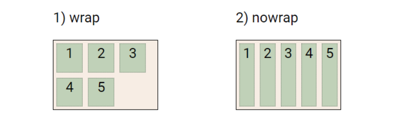


##### 🔹 flex-direction & flex-wrap

- flex-direction : Main axis의 방향을 설정
- flex-wrap : 요소들이 강제로 한 줄에 배치 되게 할 것인지 여부 설정
  - nowrap (기본 값) : 한 줄에 배치
  - wrap : 넘치면 그 다음 줄로 배치
- flex-flow
  - flex-direction 과 flex-wrap 의 shorthand
  - flex-direction과 flex-wrap에 대한 설정 값을 차례로 작성
  - 예시) flex-flow: row nowrap;


##### 🔹 justify-content

- Main axis를 기준으로 공간 배분

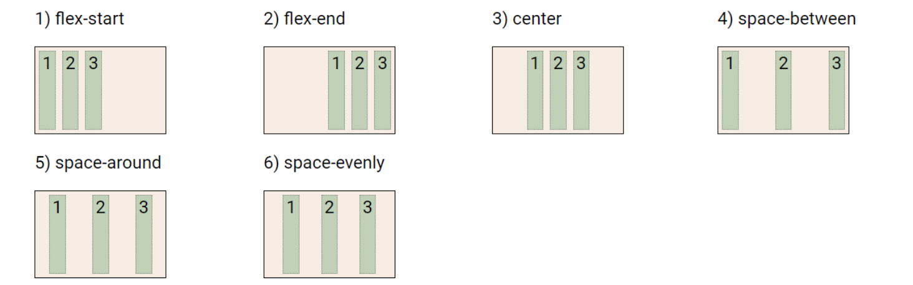


##### 🔹 align-content

- Cross axis를 기준으로 공간 배분 (아이템이 한 줄로 배치되는 경우 확인할 수 없음)


##### 🔹 justify-content & align-content

- 공간 배분
  - flex-start (기본 값) : 아이템들을 axis 시작점으로
  - flex-end : 아이템들을 axis 끝 쪽으로
  - center : 아이템들을 axis 중앙으로
  - space-between : 아이템 사이의 간격을 균일하게 분배
  - space-around : 아이템을 둘러싼 영역을 균일하게 분배 (가질 수 있는 영역을 반으로 나눠서 양쪽에)
  - space-evenly : 전체 영역에서 아이템 간 간격을 균일하게 분배


##### 🔹 align-items

- 모든 아이템을 Cross axis를 기준으로 정렬


##### 🔹 align-self

- 개별 아이템을 Cross axis 기준으로 정렬
  - ❗주의❗ 해당 속성은 컨테이너에 적용하는 것이 아니라 개별 아이템에 적용

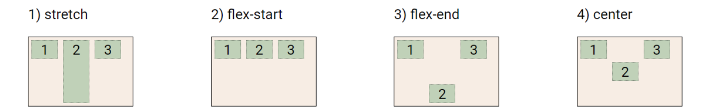


##### 🔹 align-items & align-self

- Cross axis를 중심으로
  - stretch (기본 값) : 컨테이너를 가득 채움
  - flex-start : 위
  - flex-end : 아래
  - center : 가운데
  - baseline : 텍스트 baseline에 기준선을 맞춤


##### 🔹 기타 속성

- flex-grow : 남은 영역을 아이템에 분배
- order : 배치 순서

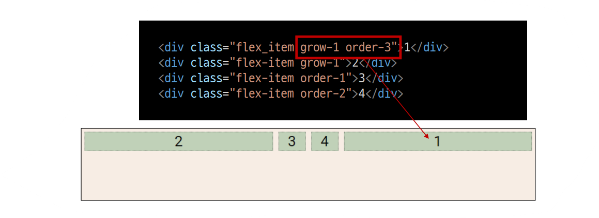


##### 활용 레이아웃

- 수직 수평 가운데 정렬

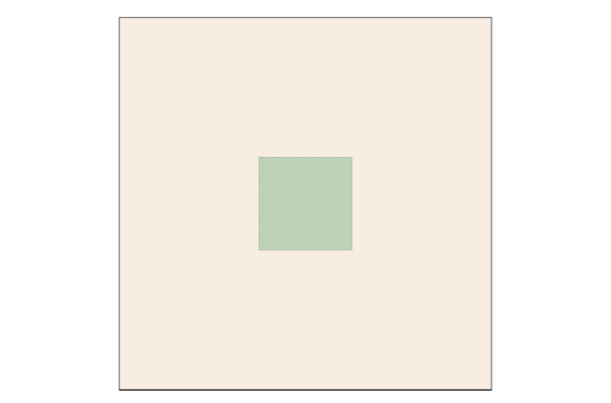

```css
/* 방법 1
컨테이너 설정
*/

.container {
    display: flex;
    justify-content: center;
    align-items: center;
}

/* 방법 2
아이템 설정
*/

.container {
    display: flex;
}
.item {
    margin: auto;
}
```


- 카드 배치

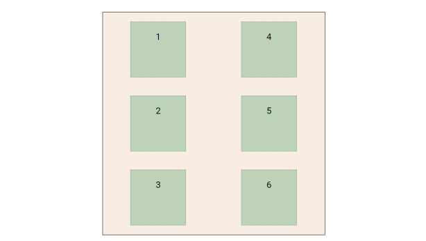

```css
#layout_03 {
    display: flex;
    flex-direction: column;
    flex-wrap: wrap;
    justify-content: space-around;
    align-content: space-around;
}
```


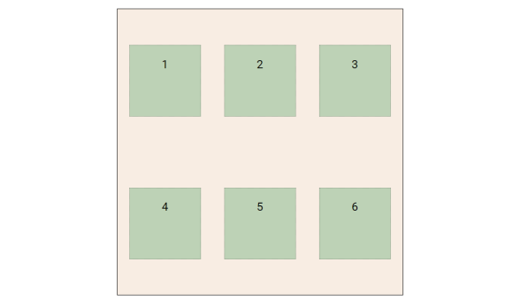

```css
#layout_03 {
    display: flex;
    flex-direction: row;
    flex-wrap: wrap;
    justify-content: space-around;
    align-content: space-around;
}
```

