###### 9월 5일
# 📄 HTML

## HTML 문서 구조화

- table의 각 영역을 명시하기 위해 `<thead>` `<tbody>` `<tfoot>`요소를 활용

  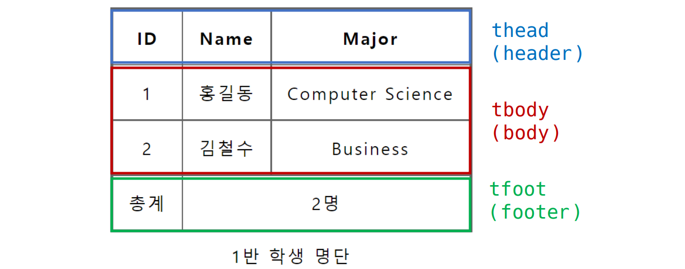

- `<tr>`으로 가로 줄을 구성하고 내부에는 `<th>` 혹은 `<td>`로 셀을 구성

  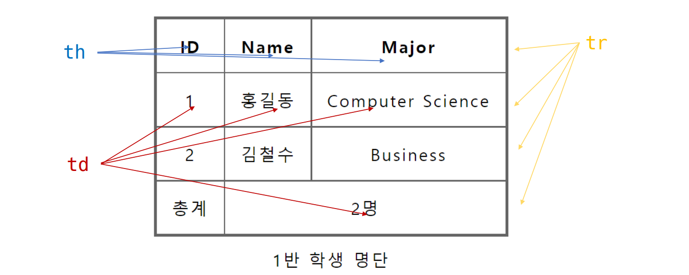

- `colspan` `rowspan` 속성을 활용하여 셀 병합

  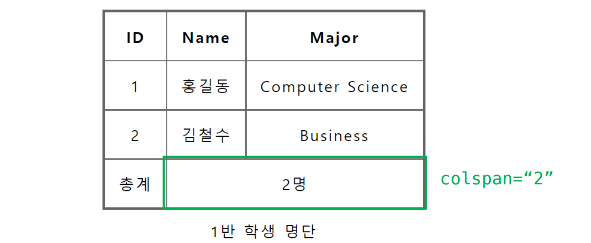

- `<caption>`을 통해 표 설명 또는 제목을 나타냄

  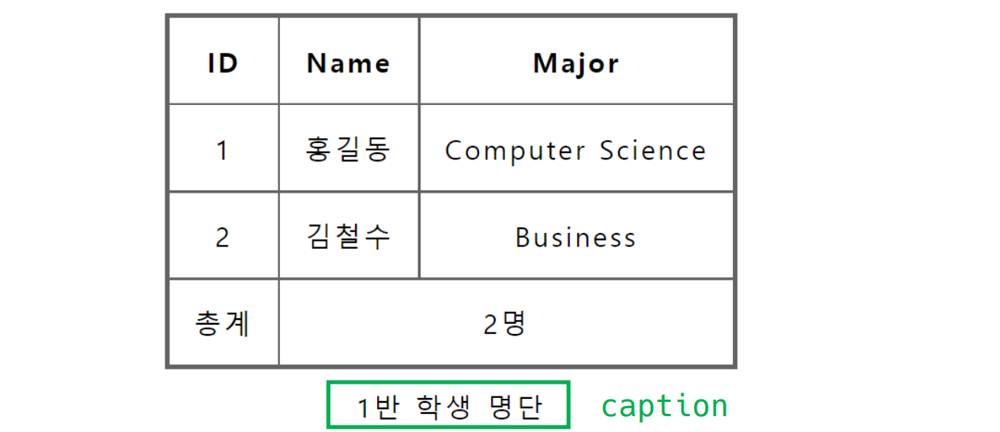

- table 태그 기본 구성

  - thead
    - tr > th
  - tbody
    - tr > td
  - tfoot
    - tr > td
  - caption

  ```html
  <body>
      <table>
          <thead>
              <tr>
                  <th>ID</th>
                  <th>Name</th>
                  <th>Major</th>
              </tr>
          </thead>
          <tbody>
              <tr>
                  <td>1</td>
                  <td>홍길동</td>
                  <td>Computer Science</td>
              </tr>
              <tr>
                  <td>2</td>
                  <td>김철수</td>
                  <td>Business</td>
              </tr>
          </tbody>
          <tfoot>
              <tr>
                  <td>총계</td>
                  <td colspan="2">2명</td>
              </tr>
          </tfoot>
          <caption>1반 학생 명단</caption>
      </table>
  </body>
  ```


## 🔍 form 태그

### form

- `<form>`은 정보(데이터)를 서버에 제출하기 위해 사용하는 태그

- `<form>`기본 속성

  - `action` : form을 처리할 서버의 URL(데이터를 보낼 곳)
  - `method` : form을 제출할 때 사용할 HTTP 메서드 (GET 혹은 POST)
  - `enctype` : method가 post인 경우 데이터의 유형
    - application/x-www-form-urlencoded : 기본값
    - multipart/form-data : 파일 전송시 (input type이 file인 경우)
    - text/plain : HTML5 디버깅 용 (잘 사용되지 않음)

  ```html
  <form action="/search" method="GET">
      
  </form>
  ```

  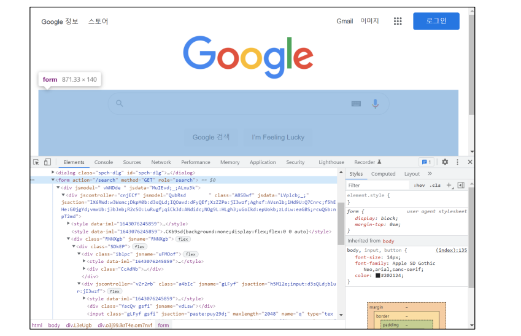


### input

- 다양한 타입을 가지는 입력 데이터 유형과 위젯이 제공됨

- `<input>` 대표적인 속성

  - name : form control에 적용되는 이름 (이름/값 페어로 전송됨)
  - value : form control에 적용되는 값 (이름/값 페어로 전송됨)
  - required, readonly, autofocus, autocomplete, disabled 등

  ```html
  <form action="/search" method="GET">
      <input type="text" name="q">
  </form>
  ```

  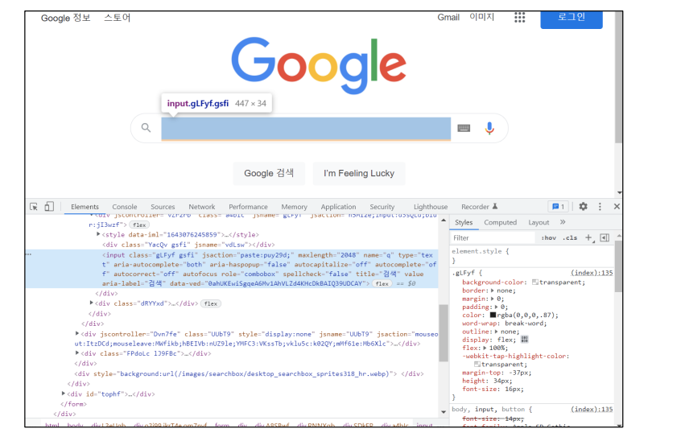

- http:s//www.google.com/search?q=HTML

  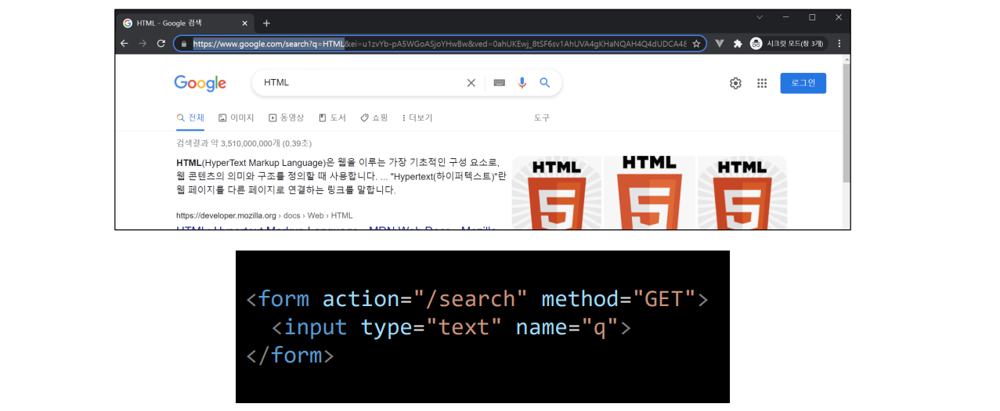


#### input label

- label을 클릭하여 input 자체의 초점을 맞추거나 활성화 시킬 수 있음

  - 사용자는 선택할 수 있는 영역이 늘어나 웹 / 모바일(터치) 환경에서 편하게 사용할 수 있음
  - label과 input 입력의 관계가 시각적 뿐만 아니라 화면리더기에서도 label을 읽어 쉽게 내용을 확인 할 수 있도록 함

- `<input>`에 id 속성을, `<label>`에는 for 속성을 활용하여 상호 연관을 시킴

  ```html
  <label for="agreement">개인정보 수집에 동의합니다.</label>
  <input type="checkbox" name="agreement" id="agreement">
  ```

  

#### input 유형

##### 일반

- 일반적으로 입력을 받기 위하여 제공되며 타입별로 HTML기본 검증 혹은 추가 속성을 활용할 수 있음

  - `text` : 일반 텍스트 입력
  - `password` : 입력 시 값이 보이지 않고 문자를 특수기호(*)로 표현
  - `email` : 이메일 형식이 아닌 경우 form 제출 불가
  - `number` : min, max, step 속성을 활용하여 숫자 범위 설정 가능
  - `file` : accept 속성을 활용하여 파일 타입 지정 가능

  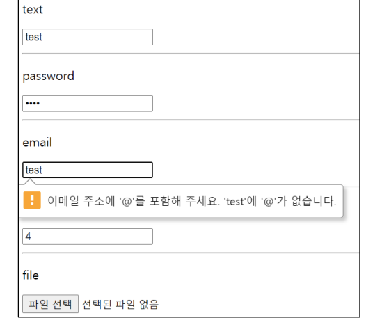


##### 항목 중 선택

- 일반적으로 label 태그와 함께 사용하여 선택 항목을 작성함

- 동일 항목에 대하여는 name을 지정하고 선택된 항목에 대한 value를 지정해야 함

  - checkbox : 다중 선택
  - radio : 단일 선택

  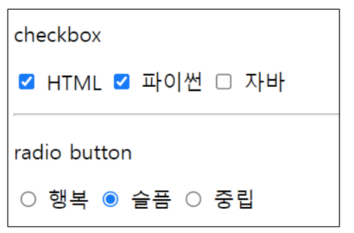


##### 기타

- 다양한 종류의 input을 위한 picker를 제공

  - color : color picker
  - date : date picker

- hidden input을 활용하여 사용자 입력을 받지 않고 서버에 전송되어야 하는 값을 설정

  - hidden : 사용자에게 보이지 않는 input

  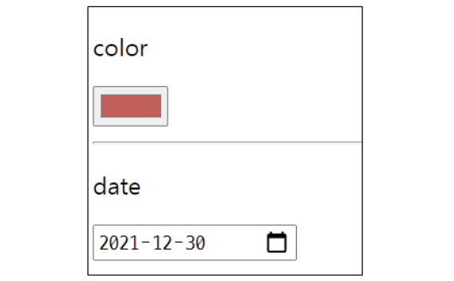


# 🥾 Bootstrap


> Build fast, responsive sites with Bootstrap.
>
> Quickly design and customize responsive mobile-first sites with Bootstrap, the world’s most popular front-end open source toolkit, featuring Sass variables and mixins, responsive grid system, extensive prebuilt components, and powerful JavaScript plugins.


- 비교

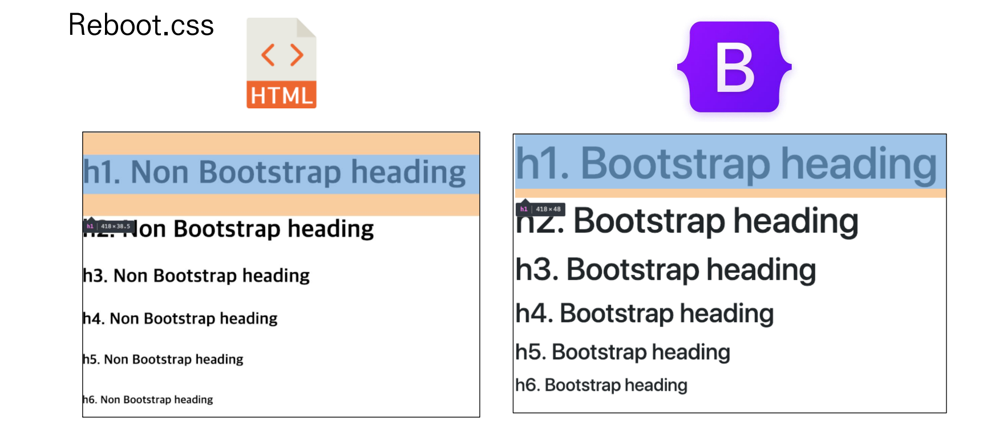

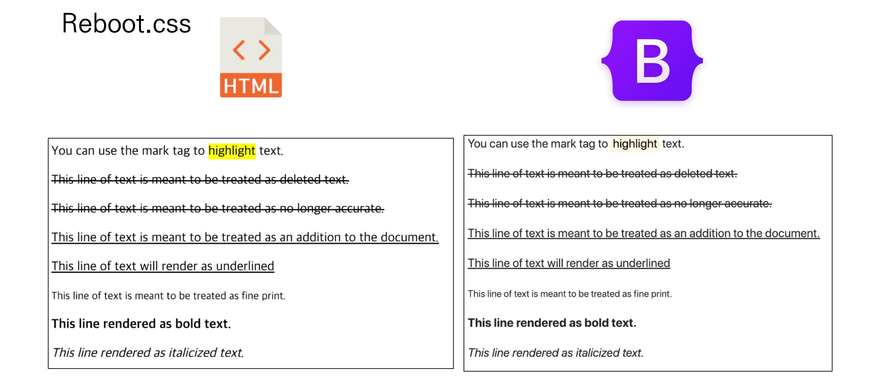


- CDN
  - Content Delivery(Distribution) Network
  - 컨텐츠(CSS, JS, Image, Text 등)을 효율적으로 전달하기 위해 여러 노드에 가진 네트워크에 데이터를 제공하는 시스템
  - 개별 end-user의 가까운 서버를 통해 빠르게 전달 가능(지리적 이점) 외부 서버를 활용함으로써 본인 서버의 부하가 적어짐


## 📐 Spacing (Margin and padding)


```html
<div class="mt-3 ms-5">bootstrap-spacing</div>
```

- Where *property* is one of:
  - `m` - for classes that set `margin`
  - `p` - for classes that set `padding`

- Where *sides* is one of:

  - `t` - for classes that set `margin-top` or `padding-top`
  - `b` - for classes that set `margin-bottom` or `padding-bottom`
  - `s` - (start) for classes that set `margin-left` or `padding-left` in LTR, `margin-right` or `padding-right` in RTL
  - `e` - (end) for classes that set `margin-right` or `padding-right` in LTR, `margin-left` or `padding-left` in RTL
  - `x` - for classes that set both `*-left` and `*-right`
  - `y` - for classes that set both `*-top` and `*-bottom`
  - blank - for classes that set a margin or padding on all 4 sides of the element

- Where `size` is one of:

  - `0` - for classes that eliminate the `margin` or `padding` by setting it to `0`

  - `1` - (by default) for classes that set the `margin` or `padding` to `$spacer * .25`

  - `2` - (by default) for classes that set the `margin` or `padding` to `$spacer * .5`

  - `3` - (by default) for classes that set the `margin` or `padding` to `$spacer`

  - `4` - (by default) for classes that set the `margin` or `padding` to `$spacer * 1.5`

  - `5` - (by default) for classes that set the `margin` or `padding` to `$spacer * 3`

  - `auto` - for classes that set the `margin` to auto

    

  ```css
  .mt-1 {
    margin-top: 0.25rem !important;
  }
  ```

  > 16 * 0.25 = 4px
  >
  > 브라우저 <html>의 root 글꼴 크기는 16px

  

  | class name | rem  | px   |
  | ---------- | ---- | ---- |
  | m-1        | 0.25 | 4    |
  | m-2        | 0.5  | 8    |
  | m-3        | 1    | 16   |
  | m-4        | 1.5  | 24   |
  | m-5        | 3    | 48   |

  

  - 예시

    - mx-0

    ```css
    .mx-0 {
      margin-right: 0 !important;
      margin-left: 0 !important;  
    }
    ```

    > 가로(왼쪽, 오른쪽) margin이 0

    - .mx-auto

    ```css
    .mx-auto {
      margin-right: auto !important;
      margin-left: auto !important;
    }
    ```

    > 블록 요소
    >
    > 수평 중앙 정렬
    >
    > 가로 가운데 정렬!

    - .py-0

    ```css
    .py-0 {
        padding-top: 0 !important;
        padding-bottom: 0 !important;
    }
    ```

    > 위 아래 padding이 0


- spacing 종합

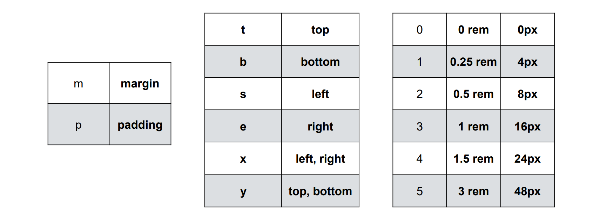


## 🎨 Color

```css
:root {
    --primary: #007bff;
    --secondary: #6c757d;
    --success: #28a745;
    --info: #17a2b8;
    --wraning: #ffc107;
    --danger: #dc3545;
    --light: #f8f9fa;
    --dark: #343a40;        
}
```

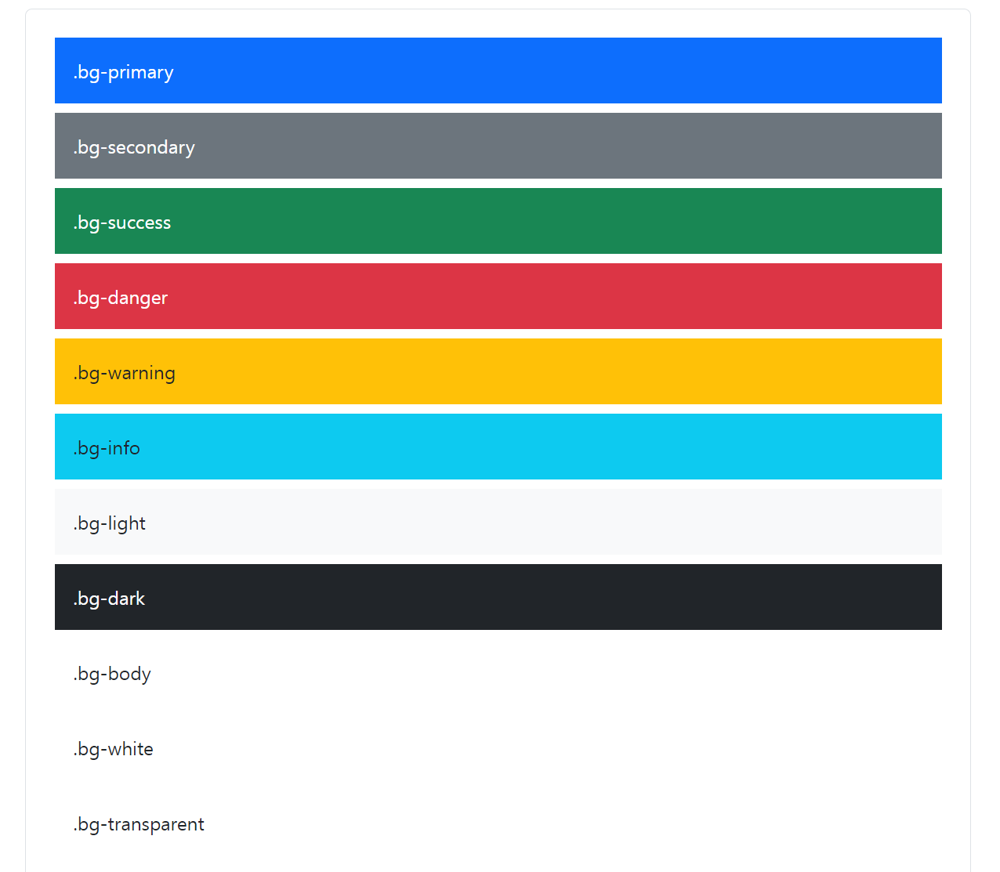


```html
<h2>Color</h2>
<div class="bg-primary">이건 파랑</div>
<div class="bg-secondary">이건 회색</div>
<div class="bg-danger">이건 빨강</div>
<p class="text-success">이건 초록색 글씨</p>
<p class="text-warning">이건 노란색 글씨</p>
```


## 🔤 Text

```css
<h2>Text</h2>
<p class="text-start">margin-top 3</p>
<p class="text-center">margin 4</p>
<p class="text-end">mx-auto, 가운데 정렬</p>
<a href="#" class="text-decoration-none">Non-underlined link</a>
<p class="fw-bold">Bold text.</p>
<p class="fw-normal">Normal weight text.</p>
<p class="fw-light">Light weight text.</p>
<p class="fst-italic">Italic text.</p>
```

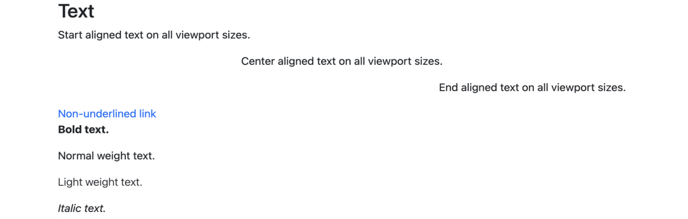


## 📱 Display


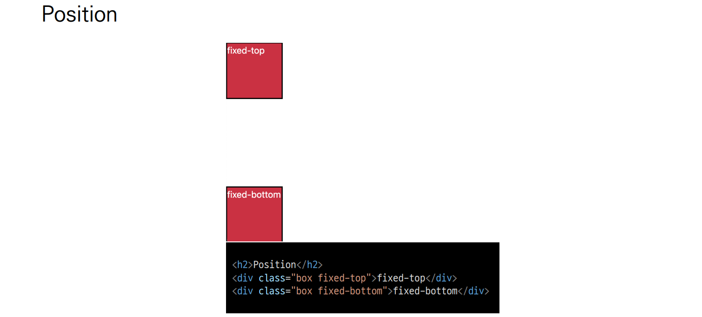


