###### 9월 6일

# 👢 Bootstrap Components

- Bootstrap의 다양한 UI 요소를 활용할 수 있음
- 아래 Components 탭 및 검색으로 원하는 UI 요소를 찾을 수 있음
- 기본 제공된 Components를 변환해서 활용

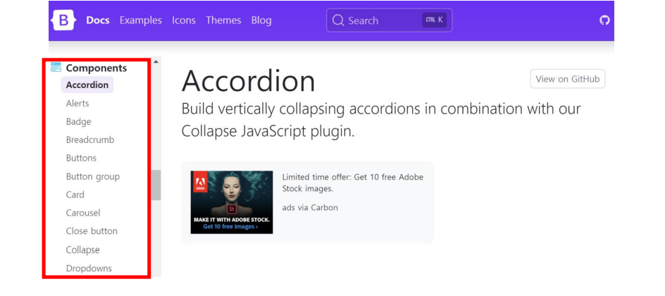

각 Bootstrap Components의 예시와 Docs로 이어지는 링크입니다.

## 🎹 [Accordion](https://getbootstrap.com/docs/5.2/components/accordion/)

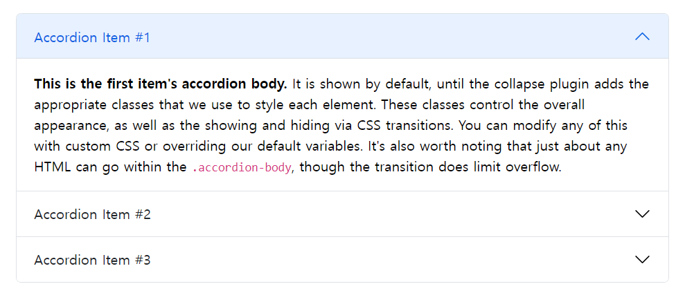

## ⚠ [Alerts](https://getbootstrap.com/docs/5.2/components/alerts/)

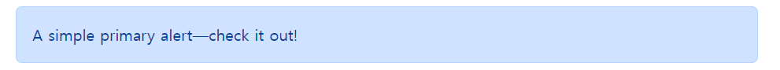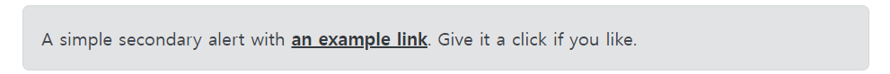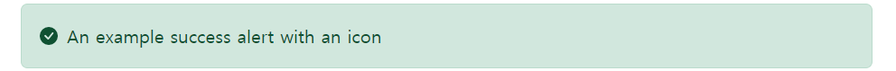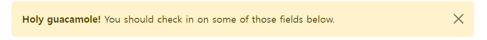

## 📛 [Badges](https://getbootstrap.com/docs/5.2/components/badge/)

## 🥐 [Breadcrumb](https://getbootstrap.com/docs/5.2/components/breadcrumb/)

## 🔘 [Buttons](https://getbootstrap.com/docs/5.2/components/buttons/)

- 클릭 했을 때 어떤 동작이 일어나도록 하는 요소

### 🔘🔘 [Button Group](https://getbootstrap.com/docs/5.2/components/button-group/)

## 🎴 [Cards](https://getbootstrap.com/docs/5.2/components/card/)

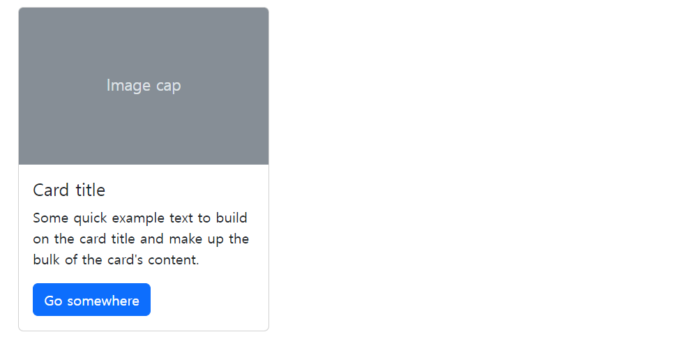

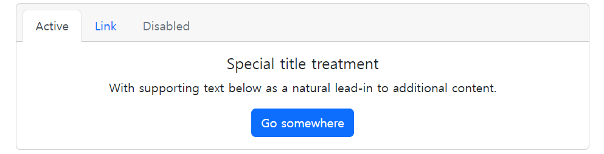

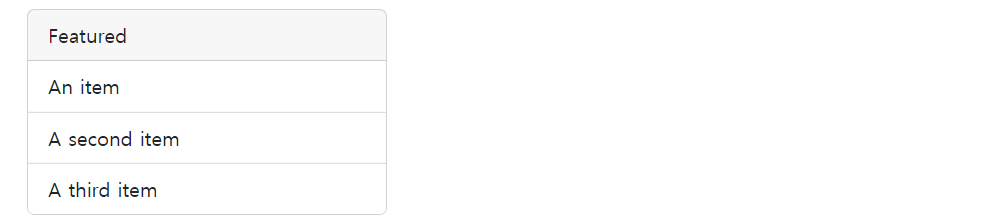

## 🎠 [Carousel](https://getbootstrap.com/docs/5.2/components/carousel/)

- 콘텐츠(사진)을 순환시키기 위한 슬라이드쇼

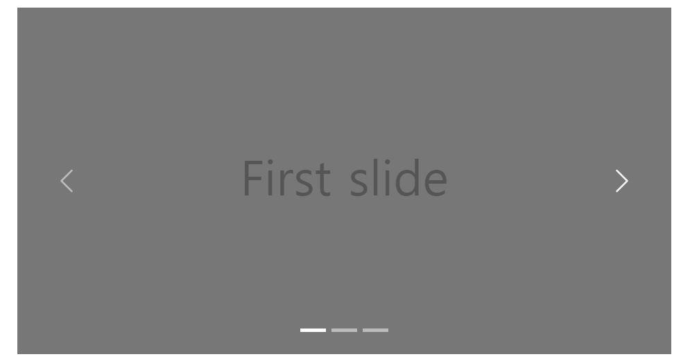

## ❌ [Close Button](https://getbootstrap.com/docs/5.2/components/close-button/)

## 📉 [Collapse](https://getbootstrap.com/docs/5.2/components/collapse/)

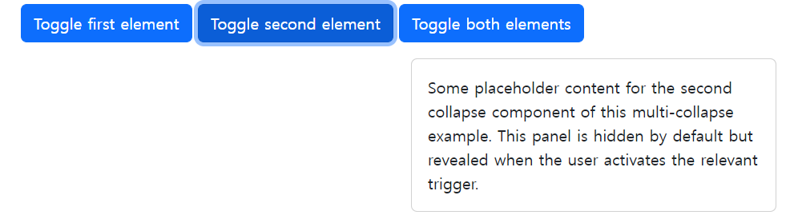

## 🔽 [Dropdowns](https://getbootstrap.com/docs/5.2/components/dropdowns/)

- dropdown, dropdown-menu, dropdown-item 클래스를 활용해 옵션 메뉴를 만들 수 있습니다.

## ✅ [List Group](https://getbootstrap.com/docs/5.2/components/list-group/)

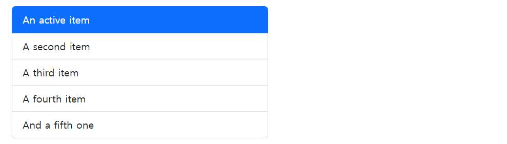

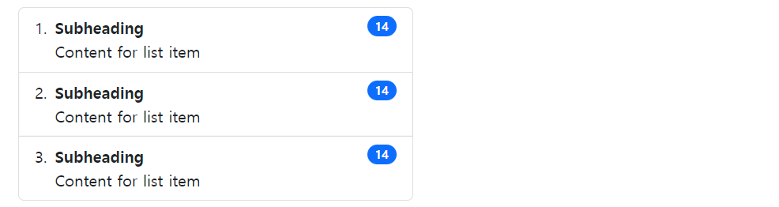

## 🔳 [Modal](https://getbootstrap.com/docs/5.2/components/modal/)

- 사용자와 상호작용 하기 위해서 사용하며, 긴급 상황을 알리는 데 주로 사용
- 현재 열려 있는 페이지 위에 또 다른 레이어를 띄움
- 페이지를 이동하면 자연스럽게 사라짐(제거를 하지 않고도 배경 클릭시 사라짐 – 옵션에 따라 다름)
- Modal은 자바스크립트를 활용하며, 반드시 target과 id가 일치되어야 함.=

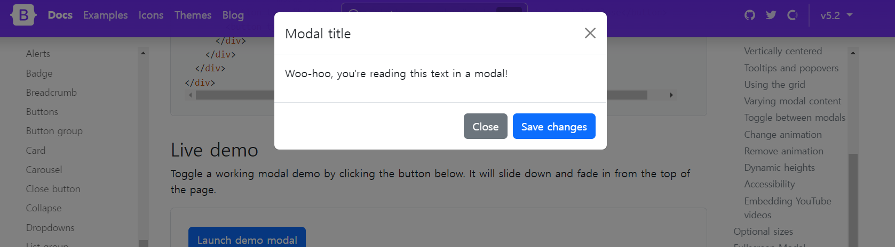

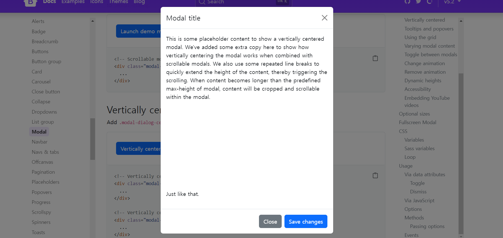

## 🗺️ [Navbar](https://getbootstrap.com/docs/5.2/components/navbar/)

- navbar 클래스를 활용하면 네비게이션 바를 제작할 수 있습니다.

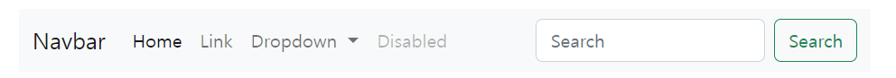

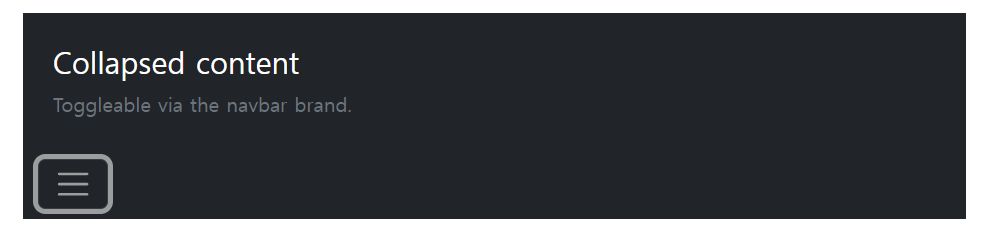

## 🧭 [Navs & Tabs](https://getbootstrap.com/docs/5.2/components/navs-tabs/)

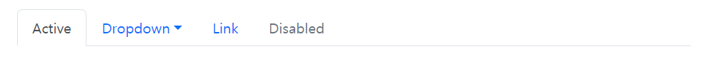

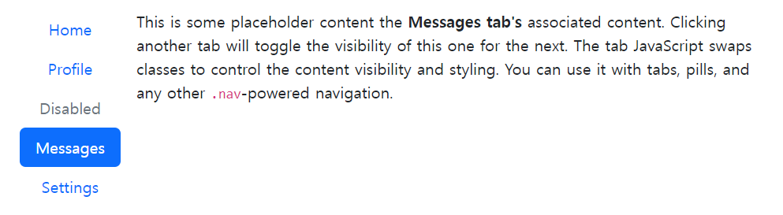

## 🖼 [Offcanvas](https://getbootstrap.com/docs/5.2/components/offcanvas/)

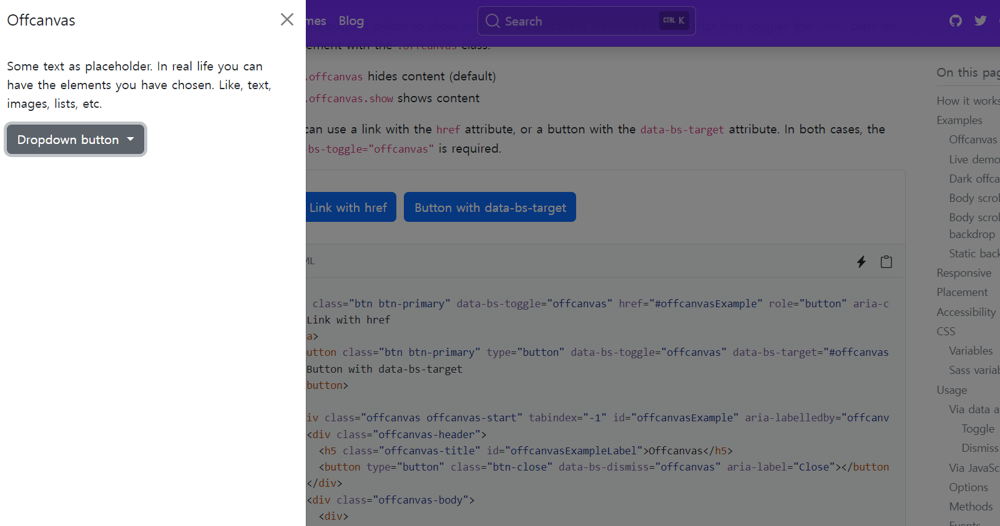

## 📃 [Pagination](https://getbootstrap.com/docs/5.2/components/pagination/)

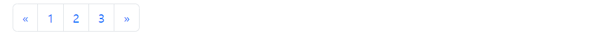

## 🗃 [Placeholders](https://getbootstrap.com/docs/5.2/components/placeholders/)

## 🍾 [Popovers](https://getbootstrap.com/docs/5.2/components/popovers/)

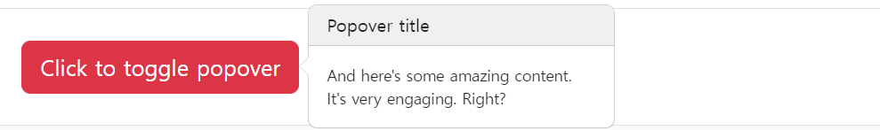

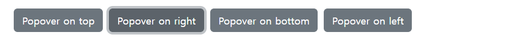

## 🚧 [Progress](https://getbootstrap.com/docs/5.2/components/progress/)

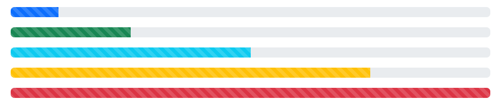

## 🖱 [Scrollspy](https://getbootstrap.com/docs/5.2/components/scrollspy/)

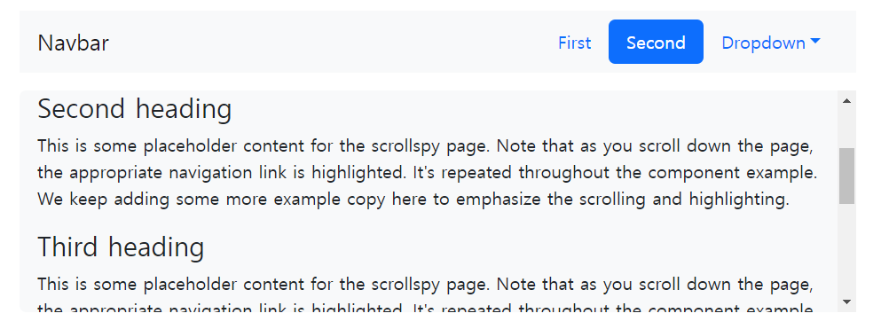

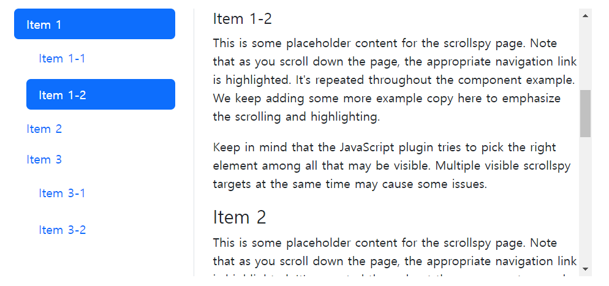

## 🔄 [Spinners](https://getbootstrap.com/docs/5.2/components/spinners/)

## 🍞 [Toasts](https://getbootstrap.com/docs/5.2/components/toasts/)

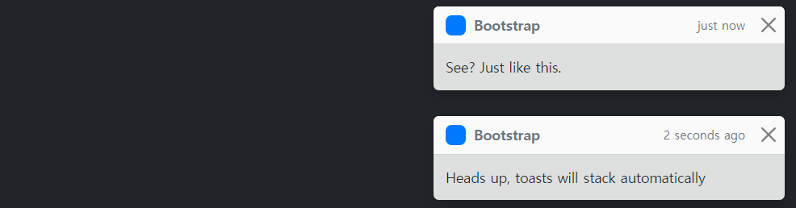

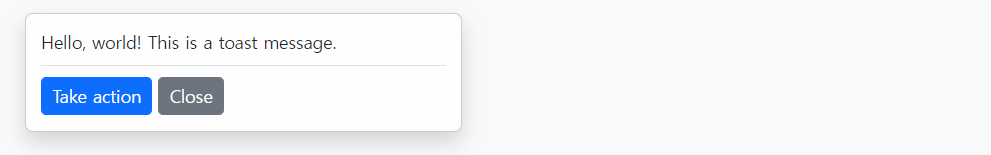

## 🛠 [Tooltips](https://getbootstrap.com/docs/5.2/components/tooltips/)

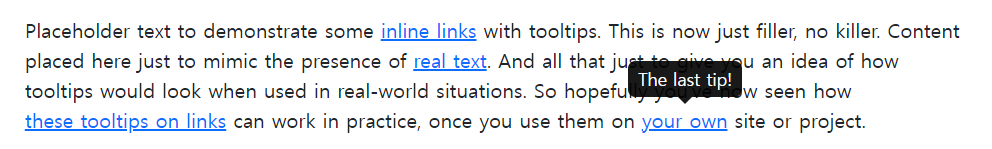

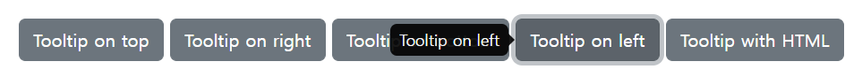