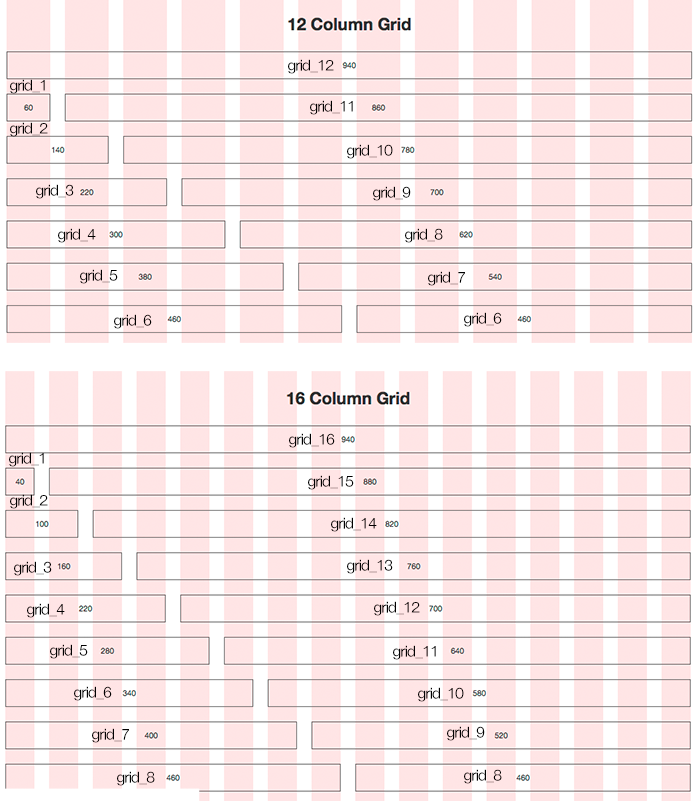
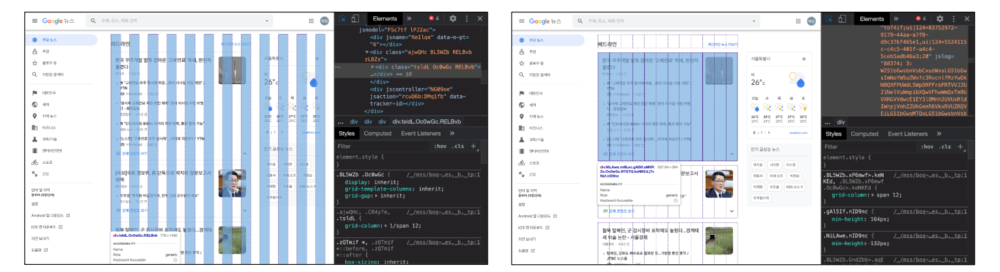
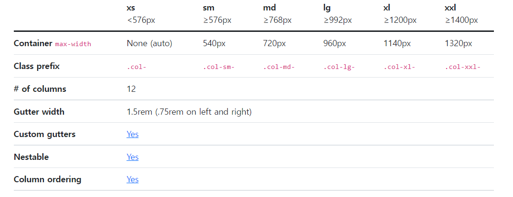

###### 9월 7일

# 🏁 Bootstrap Grid System

## 💻 Grid System (Web Design)

- 요소들의 디자인과 배치에 도움을 주는 시스템
- 기본 요소
  - `Column` : 실제 컨텐츠를 포함하는 부분
  - `Gutter` : 칼럼과 칼럼 사이의 공간 (사이 간격)
  - `Container` : Column들을 담고 있는 공간




## 🥾 Bootstrap Grid System

- Bootstrap Grid System은 flexbox로 제작됨
- container, rows, column으로 컨텐츠를 배치하고 정렬
- 반드시 기억해야 할 2가지 !
  1. `12개`의 `column`
  2. `6개`의 `grid breakpoints`


### Grid System

```html
<div class="container">
    <div class="row">
        <div class="col"></div>
        <div class="col"></div>
        <div class="col"></div>
    </div>
</div>
```




### [Grid System Breakpoints](https://getbootstrap.com/docs/5.2/layout/grid/)

Bootstrap’s grid system can adapt across all six default breakpoints, and any breakpoints you customize. The six default grid tiers are as follows:

- **Extra small (xs)**
- **Small (sm)**
- **Medium (md)**
- **Large (lg)**
- **Extra large (xl)**
- **Extra extra large (xxl)**

As noted above, each of these breakpoints have their own container, unique class prefix, and modifiers. Here’s how the grid changes across these breakpoints:



