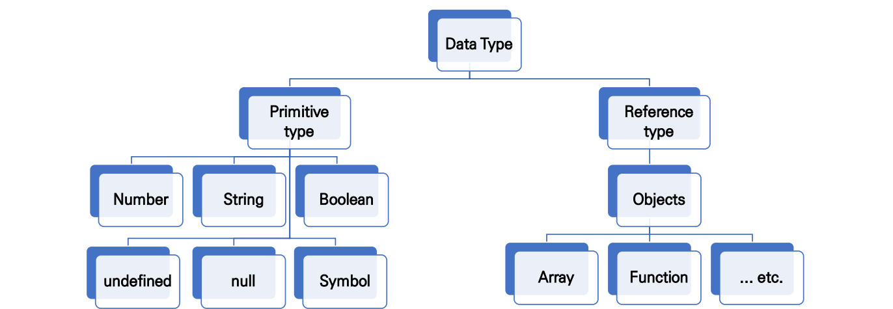
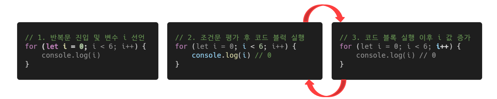
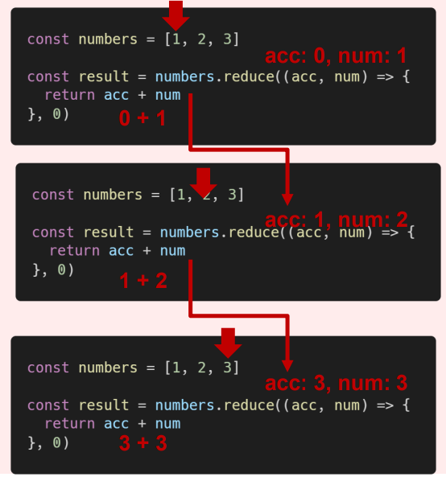

###### 9월 16일

# ECMA Script

- 코딩 스타일 가이드
  - 코딩 스타일의 핵심은 합의된 원칙과 일관성
    - 절대적인 하나의 정답은 없으며, 상황에 맞게 원칙을 정하고 일관성 있게 사용하는 것이 중요
  - 코딩 스타일은 코드의 품질에 직결되는 중요한 요소
    - 코드의 가독성, 유지보수 또는 팀원과의 커뮤니케이션 등 개발 과정 전체에 영향을 끼침
  - (참고) 다양한 자바스크립트 코딩 스타일 가이드
    - [Airbnb Javascript Style Guide](https://github.com/airbnb/javascript)
    - [Google Javascript Style Guide](https://google.github.io/styleguide/jsguide.html)
    - [standardjs](https://standardjs.com/#javascript-style-guide-linter-and-formatter)


## ✨ 변수와 식별자

- 식별자(identifier) : 변수를 구분할 수 있는 변수명
- 식별자는 반드시 문자, 달러($) 또는 밑줄(_)로 시작
- 대소문자를 구분하며, 클래스명 외에는 모두 소문자로 시작
  - 예약어* 사용 불가능예약어 예시: for, if, function 등


- (참고) 선언, 할당, 초기화
  - 선언 (Declaration)
    - 변수를 생성하는 행위 또는 시점
  - 할당 (Assignment)
    - 선언된 변수에 값을 저장하는 행위 또는 시점
  - 초기화 (Initialization)
    - 선언된 변수에 처음으로 값을 저장하는 행위 또는 시점

```javascript
let foo          // 선언
console.log(foo) // undefined

foo = 11         // 할당
console.log(foo) // 11

let bar = 0      // 선언 + 할당
console.log(bar) // 0
```


### 🏁 let

- 재할당 가능

  ```javascript
  let number = 10     // 1. 선언 및 초기값 할당
  number = 10         // 2. 재할당
  
  console.log(number) // 10
  ```

- 재선언 불가능

  ```javascript
  let number = 10    // 1. 선언 및 초기값 할당
  let nuumber = 50   // 2. 재선언 불가능
  
  => Uncaught SyntaxError
     : Identifier 'number' has already been declared
  ```


### 🏁 const

- 재할당 불가능

  ```javascript
  const number = 10  // 1. 선언 및 초기값 할당
  number = 10        // 2. 재할당 불가능
  
  => Uncaught TypeError
     : Assignment to constant variable.
  ```

- 재선언 불가능

  ```javascript
  const number = 10   // 1. 선언 및 초기값 할당
  const number = 50   // 2. 재선언 불가능
  
  => Uncaught SyntaxError
     : Identifier 'number' has already been declared
  ```


#### 🏴 블록 스코프 (block scope)

- if, for, 함수 등의 중괄호 내부를 가리킴
- 블록 스코프를 가지는 변수는 블록 바깥에서 접근 불가능

```javascript
let x = 1
if (x === 1) {
    let x = 2
    console.log(x)  // 2
}

console.log(x)      // 1
```


### 🏁 var

- var로 선언한 변수는 **재선언 및 재할당 모두 가능**

  ```javascript
  var number = 10 // 1. 선언 및 초기값 할당
  var number = 50 // 2. 재할당
  
  console.log(number) // 50
  ```

  

- ES6 이전에 변수를 선언할 때 사용되던 키워드

- `호이스팅`되는 특성으로 인해 예기치 못한 문제 발생 가능

  - 따라서 ES6 이후부터는 var 대신 const와 let을 사용하는 것을 권장

- 함수 스코프


#### 🏴 함수 스코프 (function scope)

- 함수의 중괄호 내부를 가리킴
- 함수 스코프를 가지는 변수는 함수 바깥에서 접근 불가능

```javascript
function foo() {
    var x = 5
    console.log(x)   // 5
}

console.log(x)
// ReferenceError: x is not defined
```


#### 🏴 호이스팅 (hoisting)

- 변수를 선언 이전에 참조할 수 있는 현상
- 변수 선언 이전의 위치에서 접근 시 undefined를 반환
- 자바스크립트는 모든 선언을 호이스팅한다.
- 즉, var, let, const 모두 호이스팅이 발생하지만, var는 선언과 초기화가 동시에 발생 하여 일시적 사각지대가 존재하지 않는다.

```javascript
console.log(username) // undefined
var username = '홍길동'

console.log(email)    // Uncaught ReferenceError
let email = 'gildong@gmail.com'

console.log(age)      // Uncaught ReferenceError
const age = 50
```


### 🏁 let, const, var 비교

| 키워드    | 재선언 | 재할당 | 스코프      | 비고         |
| --------- | ------ | ------ | ----------- | ------------ |
| **let**   | X      | O      | 블록 스코프 | ES6부터 도입 |
| **const** | X      | X      | 블록 스코프 | ES6부터 도입 |
| **var**   | O      | O      | 함수 스코프 | 사용 X       |


## ✨ 데이터 타입

- 자바스크립트의 모든 값은 특정한 데이터 타입을 가짐
- 크게 원시 타입(Primitive type)과 참조 타입(Reference type)으로 분류됨




### 🏁 원시 타입 (Primitive type)

- 객체 (object)가 아닌 기본 타입
- 변수에 해당 타입의 값이 담김
- 다른 변수에 복사할 때 실제 값이 복사됨

```javascript
let message = '안녕하세요!'  // 1. message 선언 및 할당

let greeting = message     // 2. greeting에 message 복사
console.log(greeting)      // 3. '안녕하세요!' 출력

message = 'Hello, worold!' // 4. message 재할당
console.log(greeting)      // 5. '안녕하세요!' 출력

// => 즉, 원시 타입은 실제 해당 타입의 값을 변수에 저장한다.
```


#### 🏴 숫자 (Number) 타입

- 정수, 실수 구분 없는 하나의 숫자 타입
- 부동소수점 형식을 따름
- (참고) NaN (Not-A-Number)
  - 계산 불가능한 경우 반환되는 값
    - ex) 'Angel' / 1004 => NaN

```javascript
const a = 13        // 양의 정수
const b = -5        // 음의 정수
const c = 3.14      // 실수
const d = 2.998e8   // 거듭제곱
const e = Infinity  // 양의 무한대
const f = -Infinity // 음의 무한대
const g = NaN       // 산술 연산 불가
```


#### 🏴 문자열 (String) 타입

- 텍스트 데이터를 나타내는 타입
- 16비트 유니코드 문자의 집합
- 작은따옴표 또는 큰따옴표 모두 가능
- 템플릿 리터럴 (Template Literal)
  - ES6부터 지원
  - 따옴표 대신 `backtick(``)`으로 표현
  - `${ expression }` 형태로 표현식 삽입 가능

```javascript
const firstName = 'Brandon'
const lastName = 'Eich'
const fullName = `${firstName} ${lastName}`

console.log(fullName) // Brandan Eich
```


#### 🏴 undefined

- 변수의 값이 없음을 나타내는 데이터 타입
- 변수 선언 이후 직접 값을 할당하지 않으면, 자동으로 undefined가 할당됨

```javascript
let firstName
console.log(firstName) // undefined
```


#### 🏴 null

- 변수의 값이 없음을 의도적으로 표현할 때 사용하는 데이터 타입
- (참고) null 타입과 typeof 연산자
  - typeof 연산자 : 자료형 평가를 위한 연산자
  - null 타입은 ECMA 명세의 원시 타입의 정의에 따라 원시 타입에 속하지만, typeof 연산자의 결과는 객체(object)로 표현됨 ([참고 자료](https://2ality.com/2013/10/typeof-null.html))


#### 🏴 Boolean 타입

- 논리적 참 또는 거짓을 나타내는 타입
- true 또는 false로 표현
- 조건문 또는 반복문에서 유용하게 사용
  - (참고) 조건문 또는 반복문에서 boolean이 아닌 데이터 타입은 [자동 형변환 규칙](https://tc39.es/ecma262/#sec-type-conversion)에 따라 true 또는 false로 변환됨

```javascript
let isAdmin = true
console.log(isAdmin) // true

isAdmin = false
console.log(isAdmin) // false
```

- (참고) [ToBoolean Conversions (자동 형변환)](https://tc39.es/ecma262/#sec-toboolean) 정리

  | 데이터 타입   | 거짓       | 참               |
  | ------------- | ---------- | ---------------- |
  | **Undefined** | 항상 거짓  | X                |
  | **Null**      | 항상 거짓  | X                |
  | **Number**    | 0, -0, NaN | 나머지 모든 경우 |
  | **String**    | 빈 문자열  | 나머지 모든 경우 |
  | **Object**    | X          | 항상 참          |


### 🏁 참조 타입 (Reference type)

- 객체 (object) 타입의 자료형
- 변수에 해당 객체의 참조 값이 담김
- 다른 변수에 복사할 때 참조 값이 복사됨

```javascript
const message = ['안녕하세요'] // 1. message 선언 및 할당

const greeting = message     // 2. greeting에 message 복사
console.log(greeting)        // 3. ['안녕하세요'] 출력

message[0] = 'Hello, world!' // 4. message 재할당
console.log(greeting)        // 5. ['Hello, world!'] 출력

// => 즉, 참조 타입은 해당 객체를 참조할 수 있는 참조 값을 저장한다.
```


## ✨ 연산자

### 🏁 할당 연산자

- 오른쪽에 있는 피연산자의 평가 결과를 왼쪽 피연산자에 할당하는 연산자
- 다양한 연산에 대한 단축 연산자 지원
- (참고) Increment 및 Decrement 연산자
  - Increment(`++`) : 피연산자의 값을 1 증가시키는 연산자
  - Decrement(`--`) : 피연산자의 값을 1 감소시키는 연산자
  - [Airbnb Style Guide](https://github.com/airbnb/javascript#variables--unary-increment-decrement)에서는 `+=` 또는 `-=`와 같이 더 분명한 표현으로 적을 것을 권장

```javascript
let x = 0

x += 10
console.log(x) // 10

x -= 3
console.log(x) // 7

x *= 10
console.log(x) // 70

x /= 10
console.log(x) // 7

x++            // += 연산자와 동일
console.log(x) // 8

x--            // -= 연산자와 동일
console.log(x) // 7
```


### 🏁 비교 연산자

- 피연산자를 비교하고 결과값을 `boolean`으로 반환하는 연산자
- 문자열은 유니코드 값을 사용하며 표준 사전 순서를 기반으로 비교
  - ex) 알파벳끼리 비교할 경우
    - 알파벳 순서상 후순위가 더 크다
    - 소문자가 대문자보다 더 크다

```javascript
const numOne = 1
const numTwo = 100
console.log(numOne < numTwo)   // true

const charOne = 'a'
const charTwo = 'z'
console.log(charOne > charTwo) // false
```


### 🏁 동등 비교 연산자 (==)

- 두 피연산자가 같은 값으로 평가되는지 비교 후 `boolean` 값을 반환
- 비교할 때 [암묵적 타입 변환](https://262.ecma-international.org/5.1/#sec-11.9.3)을 통해 타입을 일치시킨 후 같은 값인지 비교
- 두 피연산자가 모두 객체일 경우 메모리의 같은 객체를 바라보는지 판별
- 예상치 못한 결과가 발생할 수 있으므로 [특별한 경우](https://google.github.io/styleguide/jsguide.html#features-equality-checks-exceptions)를 제외하고 사용하지 않음

```javascript
const a = 1004
const b = '1004'
console.log(a == b) // true

const c = 1
const d = true
console.log(c == d) // true

// 자동 타입 변환 예시
console.log(a + b) // 10041004
console.log(c + d) // 2
```


### 🏁 일치 비교 연산자 (===)

- 두 피연산자가 같은 값으로 평가되는지 비교 후 boolean 값을 반환
- [엄격한 비교](https://262.ecma-international.org/5.1/#sec-11.9.6)*가 이뤄지며 암묵적 타입 변환이 발생하지 않음
  - 엄격한 비교 : 두 비교 대상의 타입과 값 모두 같은지 비교

```javascript
const a = 1004
const b = '1004'
console.log(a === b) // false

const c = 1
const d = true
console.log(c === d) // false
```


### 🏁 논리 연산자

- 세 가지 논리 연산자로 구성
  - and 연산은 `&&` 연산자를 이용
  - or 연산은 `||` 연산자를 이용
  - not 연산은 `!` 연산자를 이용
- 단축 평가 지원
  - ex) false && true => false
  - ex) true || false => true

```javascript
/*
  and 연산
*/
console.log(true && false) // false
console.log(true && true)  // true
console.log(1 && 0)        // 0
console.log(4 && 7)        // 7
console.log('' && 5)       // ''

/*
  or 연산
*/
console.log(true || false)  // true
console.log(false || false) // false
console.log(1 || 0)         // 1
console.log(4 || 7)         // 4
console.log('' || 5)        // 5

/*
  not 연산
*/
console.log(!ture)           // false
console.log(!'Bonjour!')     // false
```


### 🏁 삼항 연산자 (Ternary Operator)

- 세 개의 피연산자를 사용하여 조건에 따라 값을 반환하는 연산자
- 가장 왼쪽의 조건식이 참이면 콜론(:) 앞의 값을 사용하고 그렇지 않으면 콜론(:) 뒤의 값을 사용
- 삼항 연산자의 결과 값이기 때문에 변수에 할당 가능
- (참고) [한 줄에 표기하는 것을 권장](https://github.com/airbnb/javascript#comparison--nested-ternaries)

```javascript
console.log(true ? 1 : 2)  // 1
console.log(false ? 1 : 2) // 2

const result = Math.PI > 4 ? 'Yes' : 'No'
console.log(result)  // No
```


## ✨ 조건문

### 🏁 조건문의 종류와 특징

#### 🏴 'if' statement

- 조건 표현식의 결과값을 Boolean 타입으로 변환 후 참/거짓을 판단

- if, else if, else
  - 조건은 소괄호(condition) 안에 작성
  - 실행할 코드는 중괄호{} 안에 작성
  - 블록 스코프 생성

```javascript
if (condition) {
    // do something
} else if (condition) {
    // do something
} else {
    // do something
}
```

```javascript
const nation = 'Korea'

if (nation === 'Korea') {
    console.log('안녕하세요!')
} else if (nation === 'France') {
    console.log('Bonjour!')
} else {
    console.log('Hello!')
}
```


#### 🏴 'switch' statement

- 조건 표현식의 결과값이 어느 값(case)에 해당하는지 판별
- (참고) 주로 특정 변수의 값에 따라 조건을 분기할 때 활용
  - 조건이 많아질 경우 if문보다 가독성이 나을 수 있음
- 표현식(expression)의 결과값을 이용한 조건문
- 표현식의 결과값과 case문의 오른쪽 값을 비교
- break 및 default문은 [선택적]으로 사용 가능
- break문을 만나거나 default문을 실행할 때까지 다음 조건문 실행

```javascript
switch(expression) {
  case 'first value' : {
    // do something
    [break]
  }
  case 'second value' : {
    // do something
    [break]
  }
  [default: {
     // do something
   }]
}
```

```javascript
const nation = 'Korea'

switch(nation) {
  case 'Korea': {
    console.log('안녕하세요!')
  }
  case 'France': {
    console.log('Bonjour!')
  }
  default: {
    console.log('Hello!')
  }
}
```

> Fall-through
>
> 이 경우에는 세 가지 모두 출력 : 중간에 [break]가 없기 때문


- `if statement` vs. `switch statement`

```javascript
const numOne = 5
const numTwo = 10
let operator = '+'

if (operator === '+') {
  console.log(numOne + numTwo)
} else if (operator === '-') {
  console.log(numOne - numTwo)
} else if (operator === '*') {
  console.log(numOne * numTwo)
} else if (operator === '/') {
  console.log(numOne / numTwo)
} else {
  console.log('유효하지 않은 연산자입니다.')
}
```

```javascript
const numOne = 5
const numTwo =10
let operator = '+'

switch(operator) {
  case '+': {
    console.log(numOne + numTwo)
    break
  }
  case '-': {
    console.log(numOne - numTwo)
    break
  }
  case '*': {
    console.log(numOne * numTwo)
    break
  }
  case '/': {
    console.log(numOne / numTwo)
    break
  }
    default: {
      console.log('유효하지 않은 연산자입니다.')
  }
}
```


## ✨ 반복문

### 🏁 반복문의 종류와 특징

#### 🏴 while

- 조건문이 참(true)인 동안 반복 시행
- 조건은 소괄호 안에 작성
- 실행할 코드는 중괄호 안에 작성
- 블록 스코프 생성

```javascript
while (condition) {
  // do something
}
```

```javascript
let i = 0

while (i < 6) {
  console.log(i) // 0, 1, 2, 3, 4, 5
  i += 1
}
```


#### 🏴 for

- 세미콜론(;)으로 구분되는 세 부분 으로 구성
- initialization
  - 최초 반복문 진입 시 1회만 실행되는 부분
- condition
  - 매 반복 시행 전 평가되는 부분
- expression
  - 매 반복 시행 이후 평가되는 부분
- 블록 스코프 생성

```javascript
for (initialization; condition; expression) {
    // do something
}
```

```javascript
for (let i = 0; i < 6; i++) {
    console.log(i)
}
```




#### 🏴 for ... in

- 주로 객체(object)의 속성(key)들을 순회할 때 사용
- 배열도 순회 가능하지만 인덱스 순으로 순회한다는 보장이 없으므로 권장하지 않음
- 실행할 코드는 중괄호 안에 작성
- 블록 스코프 생성

```javascript
for (variable in object) {
    // do something
}
```

```javascript
// object(객체) => key-value로 이루어진 자료구조 (객체 챕터에서 학습 예정)
const capitals = {
  korea: 'seoul',
  france: 'paris',
  USA: 'washington D.C.'
}

for (let capital in capitals) {
  console.log(capital) // korea, franc, USA
}
```


#### 🏴 for ... of

- 반복 가능한(iterable) 객체를 순회하며 값을 꺼낼 때 사용
  - 반복 가능한(iterable) 객체의 종류: Array, Map, Set, String 등
- 실행할 코드는 중괄호 안에 작성
- 블록 스코프 생성

```javascript
for (variable of iterables) {
    // do something
}
```

```javascript
const fruits = ['딸기', '바나나', '메론']

for (let fruit of fruits) {
    fruit = fruits + '!'
    console.log(fruit)
}
```


- `for ... in` vs. `for ... of`

  - for ... in (객체 순회 적합)

  ```javascript
  // array
  const fruits = ['딸기', '바나나', '메론']
  
  for (let fruit in fruits) {
      console.log(fruit) // 0, 1, 2
  }
  
  // object
  const capitals = {
    Korea: '서울',
    France: '파리',
    USA: '워싱턴 D.C.'
  }
  
  for (let capital in capitals) {
    console.log(capital) // Korea, France, USA
  }
  ```

  - for ... of (배열 순회 적합)

  ```javascript
  // array
  const fruits = ['딸기', '바나나', '메론']
  
  for (let fruit of fruits) {
      console.log(fruit) // 딸기, 바나나, 메론
  }
  
  // object
  const capitals = {
    Korea: '서울',
    France: '파리',
    USA: '워싱턴 D.C.'
  }
  
  for (let capital of capitals) {
    console.log(capital)
    // Uncaught TypeError: capitals is not iterable
  }
  ```


## ✨ 함수

- 함수 in JavaScript
  - 참조 타입 중 하나로써 function 타입에 속함
  - JavaScript에서 함수를 정의하는 방법은 주로 2가지로 구분
    - 함수 선언식 (function declaration)
    - 함수 표현식 (function expression)
  - (참고) JavaScript의 함수는 [일급 객체(First-class citizen)](https://developer.mozilla.org/ko/docs/Glossary/First-class_Function)에 해당
    - 일급 객체 : 다음의 조건들을 만족하는 객체를 의미함 
      - 변수에 할당 가능
      - 함수의 매개변수로 전달 가능
      - 함수의 반환 값으로 사용 가능


### 🏁 함수의 정의

- 함수의 이름과 함께 정의하는 방식
- 3가지 부분으로 구성
  - 함수의 이름 (name)
  - 매개변수 (args)
  - 함수 body (중괄호 내부)

```javascript
function name(args) {
  // do something
}
```

```javascript
function add(num1, num2) {
  return num1 + num2
}

add(1, 2)
```


### 🏁 함수 표현식(function expression)

- 함수를 표현식 내에서 정의하는 방식
  - (참고) 표현식 : 어떤 하나의 값으로 결정되는 코드의 단위
- 함수의 이름을 생략하고 익명 함수로 정의 가능
  - 익명 함수(anonymous function) : 이름이 없는 함수
  - 익명 함수는 함수 표현식에서만 가능
- 3가지 부분으로 구성
  - 함수의 이름 (생략 가능)
  - 매개변수 (args)
  - 몸통 (중괄호 내부)

```javascript
const nume = function (args) {
  // do something
}
```

```javascript
const add = function (num1, num2) {
  return num1 + num2
}

add(1, 2)
```


#### 🏴 기본 인자(default arguments)

- 인자 작성 시 `=` 문자 뒤 기본 인자 선언 가능

```javascript
const greeting = function (name = 'Anonymous') {
  return `Hi ${name}`
}

greeting() // Hi Anonymous
```


#### 🏴 매개변수와 인자의 개수 불일치 허용

- 매개변수보다 인자의 개수가 많을 경우,

```javascript
const noArgs = function () {
  return 0
}

noArgs(1, 2, 3) // 0

const twoArgs = function (arg1, arg2) {
  return [arg1, arg2]
}

twoArgs(1, 2, 3) // [1, 2]
```


- 매개변수보다 인자의 개수가 적을 경우,

```javascript
const threeArgs = function (arg1, arg2, arg3) {
  return [arg1, arg2, arg3]
}

threeArgs()     // [undefined, undefined, undefined]
threeArgs(1)    // [1, undefined, undefined]
threeArgs(1, 2) // [1, 2, undefined]
```


#### 🏴 Rest Parameter

- rest parameter(…)를 사용하면 함수가 정해지지 않은 수의 매개변수를 배열로 받음 (python 의 `args` 와 유사)
  - 만약 rest parameter로 처리한 매개변수에 인자가 넘어오지 않을 경우에는, 빈 배열로 처리

```javascript
const restOpr = function (arg1, arg2, ...restArgs) {
  return [arg1, arg2, restArgs]
}

restArgs(1, 2, 3, 4, 5) // [1, 2, [3, 4, 5]]
restARgs(1, 2) // [1, 2, []]
```


#### 🏴 Spread operator

- spread operator(…)를 사용하면 배열 인자를 전개하여 전달 가능

```javascript
const spreadOpr = function (arg1, arg2, arg3) {
  return arg1 + arg2 + arg3
}

const numbers = [1, 2, 3]
spreadOpr(...numbers) // 6
```


### 🏁 함수 선언식과 표현식 비교 정리

|            | 함수 선언식 (declaration)                          | 함수 표현식 (expression)                                     |
| ---------- | -------------------------------------------------- | ------------------------------------------------------------ |
| **공통점** | 데이터 타입, 함수 구성 요소 (이름, 매개변수, 몸통) |                                                              |
| **차이점** | 익명 함수 불가능. 호이스팅 O                       | 익명 함수 가능. 호이스팅 X                                   |
| **비고**   |                                                    | [Airbnb Style Guide 권장 방식](https://github.com/airbnb/javascript#functions--declarations) |


### 🏁 함수의 타입

- 선언식 함수와 표현식 함수 모두 타입은 function으로 동일

```javascript
// 함수 표현식
const add = function (args) { }

// 함수 선언식
function sub(args) { }

console.log(typeof add) // function
console.log(typeof sub) // function
```


### 🏁 호이스팅(hoisting)

#### 🏴 호이스팅(hoisting) - 함수 선언식 

- 함수 선언식으로 선언한 함수는 var로 정의한 변수처럼 hoisting 발생
- 함수 호출 이후에 선언 해도 동작

```javascript
add(2, 7) // 9

function add (num1, num2) {
    return num1 + num2
}
```


#### 🏴 호이스팅(hoisting) - 함수 표현식

- 반면 함수 표현식으로 선언한 함수는 함수 정의 전에 호출 시 에러 발생
- 함수 표현식으로 정의된 함수는 변수로 평가되어 변수의 scope 규칙을 따름

```javascript
sub(7, 2) // Uncaught ReferenceError: Cannot access 'sub' before initialization

const sub = function (num1, num2) {
    return num1 - num2
}
```

- (참고) 함수 표현식을 var 키워드로 작성한 경우, 변수가 선언 전 undefined 로 초기화 되어 다른 에러가 발생

```javascript
console.log(sub) // undefined
sub(7, 2) // Uncaught TypeError: sub is not a funciton

var sub = function (num1, num2) {
    return num1 - num2
}
```


## ✨ Arrow Function

- 화살표 함수 (Arrow Function)
  - 함수를 비교적 간결하게 정의할 수 있는 문법
  - function 키워드 생략 가능
  - 함수의 매개변수가 단 하나 뿐이라면, ‘( )’ 도 생략 가능
  - 함수 몸통이 표현식 하나라면 ‘{ }’과 return도 생략 가능
  - 기존 function 키워드 사용 방식과의 차이점은 후반부 this 키워드를 학습하고 다시 설명할 예정!

```javascript
const arrow1 = function (name) {
  return `hello, ${name}`
}

// 1. function 키워드 삭제
const arrow2 = (name) => { return `hello, ${name}` }

// 2. 매개변수가 1개일 경우에만 ( ) 생략 가능
const arrow3 = name => {return `hello, ${name}` }

// 3. 함수 바디가 return을 포함한 표현식 1개일 경우에 { } & return 삭제 가능
const arrow4 = name => `hello, ${name}`
```


## ✨ 문자열 (String)

### 🏁 문자열 관련 주요 메서드 목록

| 메서드       | 설명                                      | 비고                                         |
| ------------ | ----------------------------------------- | -------------------------------------------- |
| **includes** | 특정 문자열의 존재여부를 참/거짓으로 반환 |                                              |
| **split**    | 문자열을 토큰 기준으로 나눈 배열 반환     | 인자가 없으면 기존 문자열을 배열에 담아 반환 |
| **replace**  | 해당 문자열을 대상 문자열로 교체하여 반환 | replaceAll                                   |
| **trim**     | 문자열의 좌우 공백 제거하여 반환          | trimStart, trimEnd                           |

- 추가적인 문자열 관련 메서드 정보는 아래 링크에서 참고
  - [MDN](https://developer.mozilla.org/en-US/docs/Web/JavaScript/Reference/Global_Objects/String#instance_methods), [ECMA262](https://tc39.es/ecma262/#sec-string-objects)


#### 🏴 includes

- `string.includes(value)`
  - 문자열에 value가 존재하는지 판별 후 참 또는 거짓 반환

```javascript
const str = 'a santa at nasa'

str.includes('santa') // true
str.includes('asan')  // false
```


#### 🏴 split

- `string.split(value)`
  - value가 없을 경우, 기존 문자열을 배열에 담아 반환
  - value가 빈 문자열일 경우 각 문자로 나눈 배열을 반환
  - value가 기타 문자열일 경우, 해당 문자열로 나눈 배열을 반환

```javascript
const str = 'a cup'

str.split()    // ['a cup']
str.split('')  // ['a', ' ', 'c', 'u', 'p']
str.split(' ') // ['a', 'cup']
```


#### 🏴 replace

- `string.replace(from, to)`
  - 문자열에 from 값이 존재할 경우, 1개만 to 값으로 교체하여 반환
- `string.replaceAll(from, to)`
  - 문자열에 from 값이 존재할 경우, 모두 to 값으로 교체하여 반환

```javascript
const str = 'a b c d'

str.replace(' ', '-')    // 'a-b c d'
str.replaceAll(' ', '-') // 'a-b-c-d'
```


#### 🏴 trim

- `string.trim()`
  - 문자열 시작과 끝의 모든 공백문자(스페이스, 탭, 엔터 등)를 제거한 문자열 반환
- `string.trimStart()`
  - 문자열 시작의 공백문자(스페이스, 탭, 엔터 등)를 제거한 문자열 반환
- `string.trimEnd()`
  - 문자열 끝의 공백문자(스페이스, 탭, 엔터 등)를 제거한 문자열 반환

```javascript
const str = '     hello     '

str.trim()      // 'hello'
str.trimStart() // 'hello     '
str.trimEnd()   // '     hello'
```


## ✨ 배열(Arrays)

### 🏁 배열의 정의와 특징

- 키와 속성들을 담고 있는 참조 타입의 객체(object)
- 순서를 보장하는 특징이 있음
- 주로 대괄호를 이용하여 생성하고, 0을 포함한 양의 정수 인덱스로 특정 값에 접근 가능
- 배열의 길이는 array.length 형태로 접근 가능
  - (참고) 배열의 마지막 원소는 `array.length – 1`로 접근

```javascript
const numbers = [1, 2, 3, 4, 5]

console.log(numbers[0])     // 1
console.log(numbers[-1])    // undefined
console.log(numbers.length) // 5
```

```javascript
const numbers = [1, 2, 3, 4, 5]

console.log(numbers[numbers.length - 1]) // 5
console.log(numbers[numbers.length - 2]) // 4
console.log(numbers[numbers.length - 3]) // 3
console.log(numbers[numbers.length - 4]) // 2
console.log(numbers[numbers.length - 5]) // 1
```


### 🏁 배열 관련 주요 메서드 목록 (1) – 기본편 (기본 배열 조작)

| 메서드              | 설명                                             | 비고                     |
| ------------------- | ------------------------------------------------ | ------------------------ |
| **reverse**         | 원본 배열의 요소들의 순서를 반대로 정렬          |                          |
| **push & pop**      | 배열의 가장 뒤에 요소를 추가 또는 제거           |                          |
| **unshift & shift** | 배열의 가장 앞에 요소를 추가 또는 제거           |                          |
| **includes**        | 배열에 특정 값이 존재하는지 판별 후 참/거짓 반환 |                          |
| **indexOf**         | 배열에 특정 값이 존재하는지 판별 후 인덱스 반환  | 요소가 없을 경우 -1 반환 |
| **join**            | 배열의 모든 요소를 구분자를 이용하여 연결        | 구분자 생략 시 쉼표 기준 |

- 추가적인 배열 관련 메서드 정보는 아래 링크에서 참고
  - [MDN](https://developer.mozilla.org/ko/docs/Web/JavaScript/Reference/Global_Objects/Array#%EC%9D%B8%EC%8A%A4%ED%84%B4%EC%8A%A4_%EB%A9%94%EC%84%9C%EB%93%9C), [ECMA262](https://tc39.es/ecma262/#sec-properties-of-the-array-constructor)


#### 🏴 reverse

- `array.reverse()`
  - 원본 배열의 요소들의 순서를 반대로 정렬

```javascript
const numbers = [1, 2, 3, 4, 5]
numbers.reverse()
console.log(numbers) // [5, 4, 3, 2, 1]
```


#### 🏴 push & pop

- `array.push()`
  - 배열의 가장 뒤에 요소 추가
- `array.pop()`
  - 배열의 마지막 요소 제거

```javascript
const numbers = [1, 2, 3, 4, 5]

numbers.push(100)
console.log(numbers) // [1, 2, 3, 4, 5, 100]

numbers.pop()
console.log(numbers) // [1, 2, 3, 4, 5]
```


#### 🏴 unshift & shift

- `array.unshift()`
  - 배열의 가장 앞에 요소 추가
- `array.shift()`
  - 배열의 첫번째 요소 제거

```javascript
const numbers = [1, 2, 3, 4, 5]

numbers.unshift(100)
console.log(numbers) // [100, 1, 2, 3, 4, 5]

numbers.shift()
console.log(numbers) // [1, 2, 3, 4, 5]
```


#### 🏴 includes

- `array.includes(value)`
  - 배열에 특정 값이 존재하는지 판별 후 참 또는 거짓 반환

```javascript
const numbers = [1, 2, 3, 4, 5]

console.log(numbers.includes(1))   // true
console.log(numbers.includes(100)) // false
```


#### 🏴 indexOf

- `array.indexOf(value)`
  - 배열에 특정 값이 존재하는지 확인 후 가장 첫 번째로 찾은 요소의 인덱스 반환
  - 만약 해당 값이 없을 경우 -1 반환

```javascript
const numbers = [1, 2, 3, 4, 5]
let result

result = numbers.indexOf(3)   // 2
console.log(result)

result = numbers.indexOf(100) // -1
console.log(result)
```


#### 🏴 join

- `array.join([separator])`
  - 배열의 모든 요소를 연결하여 반환
  - separator(구분자)는 선택적으로 지정 가능하며, 생략 시 쉼표를 기본 값으로 사용

```javascript
const numbers = [1, 2, 3, 4, 5]
let result

result = numbers.join()    // 1,2,3,4,5
console.log(result)

result = numbers.join('')  // 12345
console.log(result)

result = numbers.join(' ') // 1 2 3 4 5
console.log(result)

result = numbers.join('-') // 1-2-3-4-5
console.log(result)
```


#### 🏴  Spread operator

- spread operator(…)를 사용하면 배열 내부에서 배열 전개 가능
  - ES5까지는 `Array.concat()` 메서드를 사용
- 얕은 복사에 활용 가능

```javascript
const array = [1, 2, 3]
const newArray = [0, ...array, 4]

console.log(newArray) // [0, 1, 2, 3, 4]
```


### 🏁 배열 관련 주요 메서드 목록 (2) – 심화편 (Array Helper Methods) 

- 배열을 순회하며 특정 로직을 수행하는 메서드
- 메서드 호출 시 인자로 callback 함수를 받는 것이 특징

| 메서드      | 설명                                                         | 비고         |
| ----------- | ------------------------------------------------------------ | ------------ |
| **forEach** | 배열의 각 요소에 대해 콜백 함수를 한 번씩 실행               | 반환 값 없음 |
| **map**     | 콜백 함수의 반환 값을 요소로 하는 새로운 배열 반환           |              |
| **filter**  | 콜백 함수의 반환 값이 참인 요소들만 모아서 새로운 배열을 반환 |              |
| **reduce**  | 콜백 함수의 반환 값들을 하나의 값(acc)에 누적 후 반환        |              |
| **find**    | 콜백 함수의 반환 값이 참이면 해당 요소를 반환                |              |
| **some**    | 배열의 요소 중 하나라도 판별 함수를 통과하면 참을 반환       |              |
| **every**   | 배열의 모든 요소가 판별 함수를 통과하면 참을 반환            |              |


#### 🏴 forEach

- `array.forEach(callback(element[, index[,array]]))`
  - 배열의 각 요소에 대해 콜백 함수를 한 번씩 실행
  - 콜백 함수는 3가지 매개변수로 구성
    - `element` : 배열의 요소
    - `index` : 배열 요소의 인덱스
    - `array` : 배열 자체
  - 반환 값(return)이 없는 메서드

```javascript
array.forEach((element, index, array) => {
  // do something
})
```

```javascript
const fruits = ['딸기', '수박', '사과', '체리']

fruits.forEach((fruit, index) => {
  console.log(fruit, index)
  // 딸기 0
  // 수박 1
  // 사과 2
  // 체리 3
})
```


#### 🏴 map

- `array.map(callback(element[, index[, array]]))`
  - 배열의 각 요소에 대해 콜백 함수를 한 번씩 실행
  - 콜백 함수의 반환 값을 요소로 하는 새로운 배열 반환
  - 기존 배열 전체를 다른 형태로 바꿀 때 유용

```javascript
array.map((element, index, array) => {
  // do something
})
```

```javascript
const numbers = [1, 2, 3, 4, 5]

const doubleNums = numbers.map((num) => {
  return num * 2
})

console.log(doubleNums) // [2, 4, 6, 8, 10]
```


#### 🏴 filter

- `array.filter(callback(element[, index[, array]]))`
  - 배열의 각 요소에 대해 콜백 함수를 한 번씩 실행
  - 콜백 함수의 반환 값이 참인 요소들만 모아서 새로운 배열을 반환
  - 기존 배열의 요소들을 필터링할 때 유용

```javascript
array.filter((element, index, array) => {
  // do something
})
```

```javascript
const numbers = [1, 2, 3, 4, 5]

const oddNums = numbers.filter((num, index) => {
  return num % 2
})

console.log(oddNums) // 1, 3, 5
```


#### 🏴 reduce

- `array.reduce(callback(acc, element, [index[, array]])[, initialValue])`
  - 배열의 각 요소에 대해 콜백 함수를 한 번씩 실행
  - 콜백 함수의 반환 값들을 하나의 값(acc)에 누적 후 반환
  - reduce 메서드의 주요 매개변수
    - `acc`
      - 이전 callback 함수의 반환 값이 누적되는 변수
    - `initialValue`(optional) 
      - 최초 callback 함수 호출 시 acc에 할당되는 값, default 값은 배열의 첫 번째 값
  - (참고) 빈 배열의 경우 initialValue를 제공하지 않으면 에러 발생

```javascript
array.reduce((acc, element, index, array) => {
    // do something
}, initialValue)
```

```javascript
const numbers = [1, 2, 3]

const result = numbers.reduce((acc, num) => {
  return acc + num
}, 0)

console.log(result) // 6
```




#### 🏴 find

- `array.find(callback(element[, index[, array]]))`
  - 배열의 각 요소에 대해 콜백 함수를 한 번씩 실행
  - 콜백 함수의 반환 값이 참이면, 조건을 만족하는 첫번째 요소를 반환
  - 찾는 값이 배열에 없으면 undefined 반환

```javascript
array.find((element, index, array) {
  // do something
})
```

```javascript
const avengers = [
  { name: 'Tony Stark', age: 45 },
  { name: 'Steve Rogers', age: 32 },
  { name: 'Thor', age: 40 },
]

const result = avengers.find(avenger) => {
  return avenger.name === 'Tony Stark'
})

console.log(result) // {name: "Tony Stark", age: 45}
```


#### 🏴 some

- `array.some(callback(element[, index[, array]]))`
  - 배열의 요소 중 하나라도 주어진 판별 함수를 통과하면 참을 반환 
  - 모든 요소가 통과하지 못하면 거짓 반환
  - (참고) 빈 배열은 항상 거짓 반환

```javascript
array.some((element, index, array) => {
  // do something
})
```

```javascript
const numbers = [1, 3, 5, 7, 9]

const hasEvenNumber = numbers.some((num) => {
  return num % 2 === 0
})
console.log(hasEvenNumber) // false

const hasOddNumber = numbers.some((num) => {
  return num % 2
})
console.log(hasOddNumber) // true
```


#### 🏴 every

- `array.every(callback(element[, index[, array]]))`
  - 배열의 모든 요소가 주어진 판별 함수를 통과하면 참을 반환
  - 하나의 요소라도 통과하지 못하면 거짓 반환
  - (참고) 빈 배열은 항상 참 반환

```javascript
array.every((element, index, array) => {
  // do something
})
```

```javascript
const numbers = [2, 4, 6, 8, 10]

const isEveryNumberEven = numbers.every((num) => {
    return num % 2 === 0
})
conosole.log(isEveryNumberEven) // true

const isEveryNumberOdd = numbers.every((num) => {
    return num % 2
})
console.log(isEveryNumberOdd) // false
```


## ✨ 객체 (Objects)

### 🏁 객체 정의와 특징

- 객체는 속성(property)의 집합이며, 중괄호 내부에 `key와 value의 쌍`으로 표현
- key는 문자열 타입만 가능
  - (참고) key 이름에 띄어쓰기 등의 구분자가 있으면 따옴표로 묶어서 표현
- value는 모든 타입(함수포함) 가능
- 객체 요소 접근은 점 또는 대괄호로 가능
  - (참고) key 이름에 띄어쓰기 같은 구분자가 있으면 대괄호 접근만 가능

```javascript
const me = {
  name: 'jack'
  phoneNumber: '01012345678',
  'samsung products': {
    buds: 'Galaxy Buds pro'
    galaxy: 'Galaxy s20'
  },
}

console.log(me.name)
console.log(me.phoneNumber)
console.log(me.['samsung products'])
console.log(me.['samsung products'].buds)
```


- 메서드는 객체의 속성이 참조하는 함수
- `객체.메서드명()`으로 호출 가능
- 메서드 내부에서는 this 키워드가 객체를 의미함

```javascript
const me = {
  firstName: 'John',
  lastName: 'Doe',
  getFullName: function () {
    return this.firstName + this.lastName
  }
}
```


### 🏁 객체 관련 ES6 문법 익히기

- ES6에 새로 도입된 문법들로 객체 생성 및 조작에 유용하게 사용 가능
  - 속성명 축약
  - 메서드명 축약
  - 계산된 속성명 사용하기
  - 구조 분해 할당
    - (참고) 구조 분해 할당은 [배열도 가능함](https://developer.mozilla.org/ko/docs/Web/JavaScript/Reference/Operators/Destructuring_assignment#%EB%B0%B0%EC%97%B4_%EA%B5%AC%EC%A1%B0_%EB%B6%84%ED%95%B4)
  - 객체 전개 구문(Spread Operator)


### 🏁 [JSON (JavaScript Object Notation)](https://www.ecma-international.org/publications-and-standards/standards/ecma-404/)

- key-value쌍의 형태로 데이터를 표기하는 언어 독립적 표준 포맷
- 자바스크립트의 객체와 유사하게 생겼으나 실제로는 문자열 타입
  - 따라서 JS의 객체로써 조작하기 위해서는 구문 분석(parsing)이 필수
- 자바스크립트에서는 JSON을 조작하기 위한 두 가지 내장 메서드를 제공
  - `JSON.parse()`
    - JSON => 자바스크립트 객체
  - `JSON.stringify()`
    - 자바스크립트 객체 => JSON

